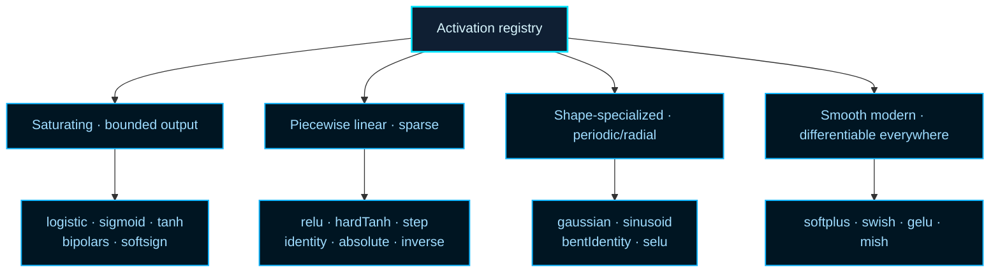

# methods/activation

Runtime registry of built-in and custom activation functions.

## Why Activation Functions Matter

Without a non-linear activation at each neuron, a network of any depth
collapses to a single affine transformation — it could be replaced by one
layer. Activation functions are the source of _representational power_: they
let stacked layers compose non-linear features that no linear model can
capture.

The theoretical guarantee behind this is the **Universal Approximation
Theorem**, which establishes that a network with at least one hidden layer
using a non-polynomial activation function can approximate any continuous
function on a compact domain to arbitrary precision, given enough hidden
units. See Wikipedia contributors,
[Universal approximation theorem](https://en.wikipedia.org/wiki/Universal_approximation_theorem),
for the formal statement and its practical implications.

## The Function Interface

Every activation in this registry shares the same calling convention:

```
f(x)          → forward pass value
f(x, true)    → local derivative  f'(x)
```

The derivative mode supports gradient-based training (backpropagation).
In NEAT evolutionary runs, the derivative is not required for the forward
activation pass, but it is necessary when the network is trained with
gradient descent rather than evolved.

## Function Families

The built-in functions cluster into four families:

- **Saturating classics** — `logistic`, `sigmoid`, `tanh`: outputs bounded,
  easy to reason about; historically dominant but prone to vanishing
  gradients in deep networks,
- **Piecewise linear** — `relu`, `hardTanh`, `step`: cheap to evaluate,
  sparse activations, strong gating behavior; `relu` is the default hidden-
  layer choice for most modern work,
- **Shape-specialized** — `gaussian`, `sinusoid`, `bentIdentity`: useful
  when periodic, radial, or near-linear responses are beneficial,
- **Smooth modern** — `softplus`, `swish`, `gelu`, `mish`: differentiable
  everywhere and empirically strong across many architectures.

See Wikipedia contributors,
[Activation function](https://en.wikipedia.org/wiki/Activation_function),
for a broader survey of the design space and historical progression.

## methods/activation/activation.ts

### Activation

Runtime registry of built-in and custom activation functions.

The chosen activation function determines what each neuron in the network
can _represent_ — whether it can learn smooth boundaries, sparse features,
periodic patterns, or gated on/off signals. In NEAT, the evolutionary
controller can assign different activations to different nodes, so this
registry is the complete vocabulary of expressible neuron behaviors.

## Key Formulas

A few formulas are worth memorizing because they define the most-used choices:

```
logistic(x)  = 1 / (1 + e^-x)           range: (0, 1)
tanh(x)      = (e^x - e^-x) / (e^x + e^-x)  range: (-1, 1)
relu(x)      = max(0, x)                 range: [0, ∞)
softplus(x)  = ln(1 + e^x)              smooth ReLU approximation
swish(x)     = x · logistic(x)           self-gated, non-monotone
gelu(x)      ≈ x · Φ(x)                 Gaussian CDF gating
```

The derivative of each activation function determines how gradient
information flows backward through the network during training. Saturating
functions (`logistic`, `tanh`) have vanishingly small derivatives far from
the origin — this is the _vanishing gradient problem_ that motivated
ReLU-family activations. See Wikipedia contributors,
[Vanishing gradient problem](https://en.wikipedia.org/wiki/Vanishing_gradient_problem),
for the historical context.

## Function Map



Every activation shares the same calling convention: pass the input value
and optionally `true` for the local derivative.

Minimal workflow:

```ts
const hiddenValue = Activation.relu(weightedSum);
const outputSlope = Activation.logistic(weightedSum, true); // derivative

registerCustomActivation(
  'cube',
  (inputValue, shouldComputeDerivative = false) =>
    shouldComputeDerivative ? 3 * inputValue * inputValue : inputValue ** 3,
);

const customValue = Activation.cube(0.5);
```

Practical first-experiment chooser:

- `relu` — simplest sparse hidden-layer default; fast and effective.
- `tanh` — zero-centered bounded alternative; useful for recurrent setups.
- `softplus`, `swish`, `gelu`, or `mish` — smoother ReLU alternatives.
- `logistic` / `sigmoid` — bounded probability-like outputs.
- `registerCustomActivation()` — when the built-ins don't fit the transfer
  curve your experiment needs.

### registerCustomActivation

```ts
registerCustomActivation(
  activationName: string,
  activationFunction: ActivationFunction,
): void
```

Register a custom activation function at runtime.

Use this escape hatch when the built-in shelf is close to what you need but
a specific experiment wants a different transfer curve. Registration mutates
the shared {@link Activation} registry, so later lookups can call the custom
function through the same surface as the built-ins.

```ts
registerCustomActivation(
  'leakySquare',
  (inputValue, shouldComputeDerivative = false) => {
    if (shouldComputeDerivative) {
      return inputValue >= 0 ? 2 * inputValue : 0.1;
    }

    return inputValue >= 0 ? inputValue ** 2 : 0.1 * inputValue;
  },
);
```

Returns: Does not return a value; it mutates the shared activation registry.

## methods/activation/activation.utils.ts

Shared contract for activation implementations used by the runtime registry.

This utility layer is where the math-facing side of the activation chapter
lives. Each exported function keeps the same two-mode signature so the
higher-level {@link Activation} registry can switch between forward
evaluation and derivative lookup without wrapping every implementation in a
different adapter.

Read the implementations in four practical groups:

- bounded classics such as {@link logisticActivation},
  {@link sigmoidActivation}, and {@link tanhActivation},
- sparse or piecewise-linear gates such as {@link reluActivation},
  {@link stepActivation}, and {@link hardTanhActivation},
- shape-specialized functions such as {@link gaussianActivation},
  {@link sinusoidActivation}, and {@link bentIdentityActivation},
- smoother modern hidden-layer candidates such as {@link softplusActivation},
  {@link swishActivation}, {@link geluActivation}, and
  {@link mishActivation}.

A useful reading order is:

1. compare {@link logisticActivation}, {@link tanhActivation}, and
   {@link reluActivation} to anchor the classic bounded-versus-sparse trade,
2. scan {@link softplusActivation}, {@link swishActivation},
   {@link geluActivation}, and {@link mishActivation} when you want smoother
   hidden-layer behavior,
3. finish with the shape-specialized helpers when your experiment needs a
   periodic, radial, or sign-like response rather than a general default.

Keep the derivative flag in mind while reading: every helper answers both the
forward-value question and the local-slope question, which is why the file is
organized around reusable transfer-curve families instead of separate forward
and derivative tables.

### absoluteActivation

```ts
absoluteActivation(
  inputValue: number,
  shouldComputeDerivative: boolean,
): number
```

Absolute activation implementation.

Absolute value discards sign and keeps only magnitude. It is unusual as a
default hidden-layer choice, but it can be useful in experiments where the
intensity of a signal matters more than whether it was positive or negative.

Parameters:

- `inputValue` - Input to evaluate.
- `shouldComputeDerivative` - Whether to compute the derivative.

Returns: Absolute output or derivative.

### ActivationFunction

```ts
ActivationFunction(
  inputValue: number,
  shouldComputeDerivative: boolean | undefined,
): number
```

Shared contract for activation implementations used by the runtime registry.

This utility layer is where the math-facing side of the activation chapter
lives. Each exported function keeps the same two-mode signature so the
higher-level {@link Activation} registry can switch between forward
evaluation and derivative lookup without wrapping every implementation in a
different adapter.

Read the implementations in four practical groups:

- bounded classics such as {@link logisticActivation},
  {@link sigmoidActivation}, and {@link tanhActivation},
- sparse or piecewise-linear gates such as {@link reluActivation},
  {@link stepActivation}, and {@link hardTanhActivation},
- shape-specialized functions such as {@link gaussianActivation},
  {@link sinusoidActivation}, and {@link bentIdentityActivation},
- smoother modern hidden-layer candidates such as {@link softplusActivation},
  {@link swishActivation}, {@link geluActivation}, and
  {@link mishActivation}.

A useful reading order is:

1. compare {@link logisticActivation}, {@link tanhActivation}, and
   {@link reluActivation} to anchor the classic bounded-versus-sparse trade,
2. scan {@link softplusActivation}, {@link swishActivation},
   {@link geluActivation}, and {@link mishActivation} when you want smoother
   hidden-layer behavior,
3. finish with the shape-specialized helpers when your experiment needs a
   periodic, radial, or sign-like response rather than a general default.

Keep the derivative flag in mind while reading: every helper answers both the
forward-value question and the local-slope question, which is why the file is
organized around reusable transfer-curve families instead of separate forward
and derivative tables.

Parameters:

- `inputValue` - Input to the activation function.
- `shouldComputeDerivative` - Whether to compute the derivative instead of the value.

Returns: Activation output or derivative at the input.

### bentIdentityActivation

```ts
bentIdentityActivation(
  inputValue: number,
  shouldComputeDerivative: boolean,
): number
```

Bent identity activation implementation.

Bent identity stays close to a linear pass-through while adding a gentle
non-linearity near the origin. It is useful when pure identity feels too weak
but a strongly saturating activation would distort the signal too early.

Parameters:

- `inputValue` - Input to evaluate.
- `shouldComputeDerivative` - Whether to compute the derivative.

Returns: Bent identity output or derivative.

### bipolarActivation

```ts
bipolarActivation(
  inputValue: number,
  shouldComputeDerivative: boolean,
): number
```

Bipolar activation implementation.

This is the sign-function version of a hard classifier: values collapse to
`-1` or `1` with no middle ground. It is mostly useful as a historical or
diagnostic contrast against smoother bounded activations.

Parameters:

- `inputValue` - Input to evaluate.
- `shouldComputeDerivative` - Whether to compute the derivative.

Returns: Bipolar output or derivative.

### bipolarSigmoidActivation

```ts
bipolarSigmoidActivation(
  inputValue: number,
  shouldComputeDerivative: boolean,
): number
```

Bipolar sigmoid activation implementation.

This is the `[-1, 1]` counterpart to {@link logisticActivation}. In practice
it is another route to a tanh-like curve, but the explicit bipolar naming is
helpful when comparing older NEAT-era literature or porting legacy settings.

Parameters:

- `inputValue` - Input to evaluate.
- `shouldComputeDerivative` - Whether to compute the derivative.

Returns: Bipolar sigmoid output or derivative.

### gaussianActivation

```ts
gaussianActivation(
  inputValue: number,
  shouldComputeDerivative: boolean,
): number
```

Gaussian activation implementation.

Gaussian responses peak at the origin and shrink toward zero on both sides,
which makes them useful when you want a node to behave more like a localized
detector than a broad monotonic amplifier.

Parameters:

- `inputValue` - Input to evaluate.
- `shouldComputeDerivative` - Whether to compute the derivative.

Returns: Gaussian output or derivative.

### geluActivation

```ts
geluActivation(
  inputValue: number,
  shouldComputeDerivative: boolean,
): number
```

Gaussian Error Linear Unit (GELU) activation implementation.

GELU keeps the soft gating idea of Swish but uses a Gaussian-CDF-shaped
weighting curve. This implementation uses the common tanh-based
approximation, which is fast enough for ordinary training code while staying
close to the exact GELU shape used in many transformer-era models.

Parameters:

- `inputValue` - Input to evaluate.
- `shouldComputeDerivative` - Whether to compute the derivative.

Returns: GELU output or derivative.

### hardTanhActivation

```ts
hardTanhActivation(
  inputValue: number,
  shouldComputeDerivative: boolean,
): number
```

Hard tanh activation implementation.

Hard tanh keeps tanh's familiar `[-1, 1]` output range while replacing the
curved middle section with a cheap piecewise-linear clamp. That makes it a
practical compromise when you want bounded outputs without paying for a full
smooth tanh evaluation.

Parameters:

- `inputValue` - Input to evaluate.
- `shouldComputeDerivative` - Whether to compute the derivative.

Returns: Hard tanh output or derivative.

### identityActivation

```ts
identityActivation(
  inputValue: number,
  shouldComputeDerivative: boolean,
): number
```

Identity activation implementation.

Use this when you explicitly want a linear pass-through unit. It is most
common in regression-style output layers or in experiments where the upstream
topology already provides the non-linearity and you only need a value relay.

Parameters:

- `inputValue` - Input to evaluate.
- `shouldComputeDerivative` - Whether to compute the derivative.

Returns: Identity output or derivative.

### inverseActivation

```ts
inverseActivation(
  inputValue: number,
  shouldComputeDerivative: boolean,
): number
```

Inverse activation implementation.

This helper mirrors a value around `1`, which makes it more of a niche
transformation than a general-purpose hidden activation. It is best read as
part of the method vocabulary's legacy and experimentation shelf rather than
as a recommended first-choice default.

Parameters:

- `inputValue` - Input to evaluate.
- `shouldComputeDerivative` - Whether to compute the derivative.

Returns: Inverse output or derivative.

### logisticActivation

```ts
logisticActivation(
  inputValue: number,
  shouldComputeDerivative: boolean,
): number
```

Logistic (sigmoid) activation implementation.

This is the bounded baseline most readers already know: useful when a node
should behave like a probability-like squashing unit, but also the easiest
activation to saturate if pre-activation values become too large in
magnitude.

Parameters:

- `inputValue` - Input to evaluate.
- `shouldComputeDerivative` - Whether to compute the derivative.

Returns: Logistic output or derivative.

### mishActivation

```ts
mishActivation(
  inputValue: number,
  shouldComputeDerivative: boolean,
): number
```

Mish activation implementation.

Mish is another smooth self-gated option, built from `x * tanh(softplus(x))`.
It keeps more negative-side nuance than ReLU while still rewarding large
positive evidence. The implementation reuses the same softplus stability
strategy so the helper behaves sensibly in the far positive and negative
tails.

Parameters:

- `inputValue` - Input to evaluate.
- `shouldComputeDerivative` - Whether to compute the derivative.

Returns: Mish output or derivative.

### reluActivation

```ts
reluActivation(
  inputValue: number,
  shouldComputeDerivative: boolean,
): number
```

Rectified Linear Unit (ReLU) activation implementation.

ReLU is the practical default for many hidden layers because it is cheap,
sparse, and easy to optimize. This implementation follows the common library
convention of returning `0` for the derivative at exactly `0`, even though
the mathematical derivative is not uniquely defined there.

Parameters:

- `inputValue` - Input to evaluate.
- `shouldComputeDerivative` - Whether to compute the derivative.

Returns: ReLU output or derivative.

### seluActivation

```ts
seluActivation(
  inputValue: number,
  shouldComputeDerivative: boolean,
): number
```

Scaled Exponential Linear Unit (SELU) activation implementation.

SELU couples its nonlinearity with fixed scale constants so layers tend to
drift back toward a stable mean and variance under the assumptions of the
self-normalizing network paper. In practice, it is most useful when the
whole hidden stack is designed around SELU rather than mixed casually with
unrelated activation families.

Parameters:

- `inputValue` - Input to evaluate.
- `shouldComputeDerivative` - Whether to compute the derivative.

Returns: SELU output or derivative.

### sigmoidActivation

```ts
sigmoidActivation(
  inputValue: number,
  shouldComputeDerivative: boolean,
): number
```

Sigmoid alias activation implementation.

This intentionally delegates to {@link logisticActivation} so callers can use
either the mathematically explicit `logistic` name or the more common
deep-learning alias `sigmoid` without creating two separate implementations.

Parameters:

- `inputValue` - Input to evaluate.
- `shouldComputeDerivative` - Whether to compute the derivative.

Returns: Sigmoid output or derivative.

### sinusoidActivation

```ts
sinusoidActivation(
  inputValue: number,
  shouldComputeDerivative: boolean,
): number
```

Sinusoid activation implementation.

Reach for this when periodic structure matters more than monotonicity. A
sinusoidal response can encode cycles and phase relationships that ordinary
squashing activations tend to smooth away.

Parameters:

- `inputValue` - Input to evaluate.
- `shouldComputeDerivative` - Whether to compute the derivative.

Returns: Sinusoid output or derivative.

### softplusActivation

```ts
softplusActivation(
  inputValue: number,
  shouldComputeDerivative: boolean,
): number
```

Softplus activation implementation with stability guards.

Softplus is the smooth sibling of {@link reluActivation}: for large positive
values it behaves almost linearly, for large negative values it fades toward
zero, and around the origin it avoids the hard corner that makes ReLU
piecewise. The threshold checks keep the implementation numerically stable in
the extreme tails.

Parameters:

- `inputValue` - Input to evaluate.
- `shouldComputeDerivative` - Whether to compute the derivative.

Returns: Softplus output or derivative.

### softsignActivation

```ts
softsignActivation(
  inputValue: number,
  shouldComputeDerivative: boolean,
): number
```

Softsign activation implementation.

Softsign behaves like a gentler, cheaper-to-reason-about cousin of tanh. It
still compresses values into a bounded range, but the tails decay more
gradually, which can make it a useful comparison point when tanh feels too
eager to saturate.

Parameters:

- `inputValue` - Input to evaluate.
- `shouldComputeDerivative` - Whether to compute the derivative.

Returns: Softsign output or derivative.

### stepActivation

```ts
stepActivation(
  inputValue: number,
  shouldComputeDerivative: boolean,
): number
```

Step activation implementation.

This is the hard-threshold ancestor of smoother gates: it cleanly separates
negative from positive evidence, but its zero derivative almost everywhere
makes it a poor default for gradient-based training.

Parameters:

- `inputValue` - Input to evaluate.
- `shouldComputeDerivative` - Whether to compute the derivative.

Returns: Step output or derivative.

### swishActivation

```ts
swishActivation(
  inputValue: number,
  shouldComputeDerivative: boolean,
): number
```

Swish activation implementation.

Swish multiplies the input by a sigmoid gate, so the unit can dampen itself
smoothly instead of snapping to zero as ReLU does. That makes it a useful
comparison point when experimenting with smoother hidden-layer behavior.

Parameters:

- `inputValue` - Input to evaluate.
- `shouldComputeDerivative` - Whether to compute the derivative.

Returns: Swish output or derivative.

### tanhActivation

```ts
tanhActivation(
  inputValue: number,
  shouldComputeDerivative: boolean,
): number
```

Hyperbolic tangent activation implementation.

Compared with {@link logisticActivation}, tanh stays bounded while remaining
zero-centered, which often makes hidden activations easier to interpret when
positive and negative evidence should balance around zero.

Parameters:

- `inputValue` - Input to evaluate.
- `shouldComputeDerivative` - Whether to compute the derivative.

Returns: Tanh output or derivative.
