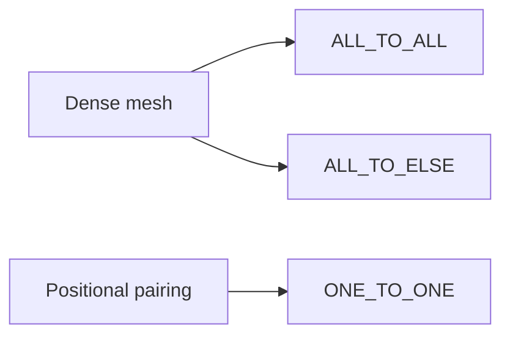

# methods/connection

Defines the small wiring-policy shelf for connecting one node group to another.

Read this file as a topology chooser rather than a bag of connection names.
These policies do not decide weights, learning, or mutation pressure; they
answer a narrower structural question first: what edge pattern should exist
between the source group and the target group before later optimization
details matter?

The three built-ins answer three different wiring intents:

- `ALL_TO_ALL` asks for the densest possible bridge between the groups,
- `ALL_TO_ELSE` keeps that dense bridge but avoids trivial self-links when
  the source and target are the same group,
- `ONE_TO_ONE` preserves positional pairing instead of creating a dense mesh.

Those choices matter because they create very different starting biases. A
dense bridge maximizes routing freedom, a dense-without-self-links bridge is
often the cleanest way to describe intra-group recurrence, and one-to-one
wiring preserves explicit alignment instead of encouraging cross-talk.

A practical chooser for first experiments:

- start with `ALL_TO_ALL` when every source feature should be allowed to
  influence every target unit,
- use `ALL_TO_ELSE` when you want dense recurrent-style reuse inside one
  group without creating direct self-connections,
- choose `ONE_TO_ONE` when index alignment matters and each source unit
  should feed exactly one partner.



Minimal workflow:

```ts
const wiringShelf = {
  denseBridge: groupConnection.ALL_TO_ALL,
  denseWithoutSelfLoops: groupConnection.ALL_TO_ELSE,
  alignedBridge: groupConnection.ONE_TO_ONE,
};
```

## methods/connection/connection.ts

### groupConnection

Defines the small wiring-policy shelf for connecting one node group to another.

Read this file as a topology chooser rather than a bag of connection names.
These policies do not decide weights, learning, or mutation pressure; they
answer a narrower structural question first: what edge pattern should exist
between the source group and the target group before later optimization
details matter?

The three built-ins answer three different wiring intents:

- `ALL_TO_ALL` asks for the densest possible bridge between the groups,
- `ALL_TO_ELSE` keeps that dense bridge but avoids trivial self-links when
  the source and target are the same group,
- `ONE_TO_ONE` preserves positional pairing instead of creating a dense mesh.

Those choices matter because they create very different starting biases. A
dense bridge maximizes routing freedom, a dense-without-self-links bridge is
often the cleanest way to describe intra-group recurrence, and one-to-one
wiring preserves explicit alignment instead of encouraging cross-talk.

A practical chooser for first experiments:

- start with `ALL_TO_ALL` when every source feature should be allowed to
  influence every target unit,
- use `ALL_TO_ELSE` when you want dense recurrent-style reuse inside one
  group without creating direct self-connections,
- choose `ONE_TO_ONE` when index alignment matters and each source unit
  should feed exactly one partner.


Minimal workflow:

```ts
const wiringShelf = {
  denseBridge: groupConnection.ALL_TO_ALL,
  denseWithoutSelfLoops: groupConnection.ALL_TO_ELSE,
  alignedBridge: groupConnection.ONE_TO_ONE,
};
```
