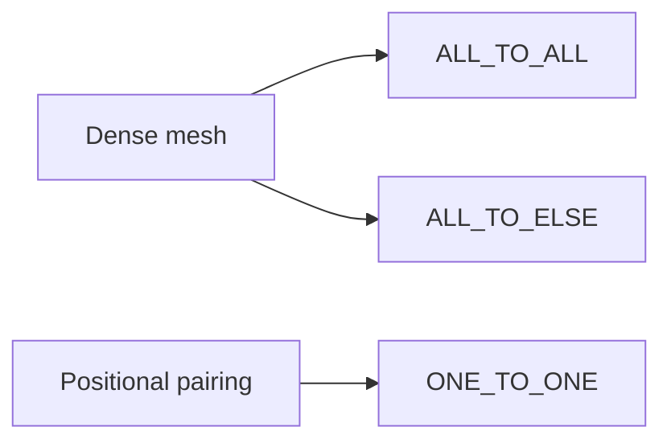

# methods/connection

Shared wiring patterns for connecting one node group to another.

Read this file as a small topology vocabulary. These policies do not decide
weights, learning, or mutation pressure; they decide the shape of the edge
pattern before those later concerns matter.

The three built-ins answer three different structural questions:

- `ALL_TO_ALL` asks for the densest possible bridge between the groups,
- `ALL_TO_ELSE` keeps that dense bridge but avoids trivial self-links when
  the source and target are the same group,
- `ONE_TO_ONE` preserves positional pairing instead of creating a dense mesh.

A practical chooser for first experiments:

- start with `ALL_TO_ALL` when every source feature should be allowed to
  influence every target unit,
- use `ALL_TO_ELSE` when you want dense recurrent-style reuse inside one
  group without creating direct self-connections,
- choose `ONE_TO_ONE` when index alignment matters and each source unit
  should feed exactly one partner.



Minimal workflow:

```ts
const denseBridge = groupConnection.ALL_TO_ALL;
const denseWithoutSelfLoops = groupConnection.ALL_TO_ELSE;
const alignedBridge = groupConnection.ONE_TO_ONE;
```

## methods/connection/connection.ts

### groupConnection

Shared wiring patterns for connecting one node group to another.

Read this file as a small topology vocabulary. These policies do not decide
weights, learning, or mutation pressure; they decide the shape of the edge
pattern before those later concerns matter.

The three built-ins answer three different structural questions:

- `ALL_TO_ALL` asks for the densest possible bridge between the groups,
- `ALL_TO_ELSE` keeps that dense bridge but avoids trivial self-links when
  the source and target are the same group,
- `ONE_TO_ONE` preserves positional pairing instead of creating a dense mesh.

A practical chooser for first experiments:

- start with `ALL_TO_ALL` when every source feature should be allowed to
  influence every target unit,
- use `ALL_TO_ELSE` when you want dense recurrent-style reuse inside one
  group without creating direct self-connections,
- choose `ONE_TO_ONE` when index alignment matters and each source unit
  should feed exactly one partner.


Minimal workflow:

```ts
const denseBridge = groupConnection.ALL_TO_ALL;
const denseWithoutSelfLoops = groupConnection.ALL_TO_ELSE;
const alignedBridge = groupConnection.ONE_TO_ONE;
```
