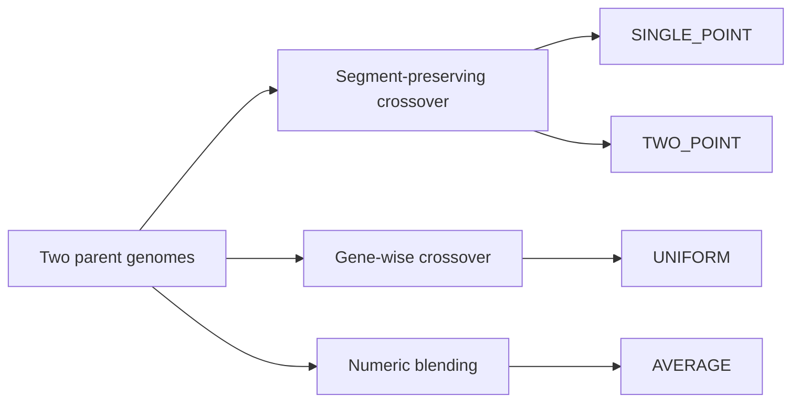

# methods/crossover

Crossover methods for genetic algorithms.

These methods implement the crossover strategies described in the Instinct algorithm,
enabling the creation of offspring with unique combinations of parent traits.

Read this file as an inheritance-policy shelf: each method answers a
different question about how aggressively two parents should be mixed.

- `SINGLE_POINT` preserves one contiguous prefix from one parent and the
  remaining suffix from the other,
- `TWO_POINT` preserves a middle segment boundary instead of only one split,
- `UNIFORM` treats each gene as an independent coin flip,
- `AVERAGE` blends compatible numeric genes instead of copying segments.

A practical chooser for first experiments:

- start with `UNIFORM` when you want broad mixing and do not need contiguous
  blocks of structure to stay together,
- use `SINGLE_POINT` or `TWO_POINT` when adjacency matters and you want to
  preserve larger parent segments,
- choose `AVERAGE` when the genome is meaningfully numeric and interpolation
  is more useful than hard parent switching.

Minimal workflow:

```ts
const broadMixing = crossover.UNIFORM;

const oneCut = crossover.SINGLE_POINT;

const twoCut = {
  ...crossover.TWO_POINT,
  config: [0.25, 0.75],
};

const blendedOffspring = crossover.AVERAGE;
```



## methods/crossover/crossover.ts
