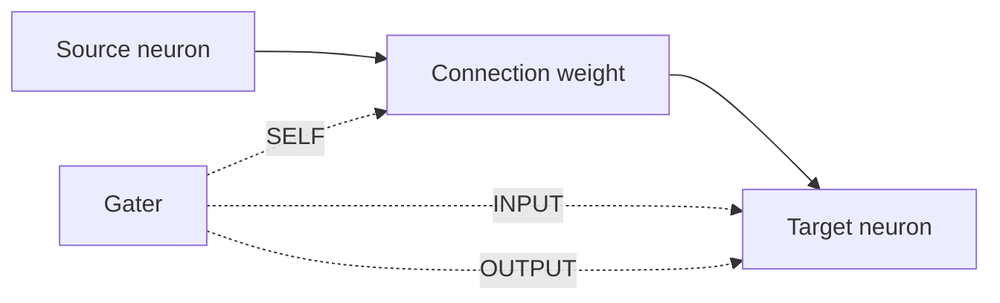

# methods/gating

Defines the small routing shelf that decides where a gater applies control.

Gating is one of the lightest structural policies in the library: the graph
stays the same, but another neuron or group gets to modulate how strongly a
connection participates in the current computation. That makes gating useful
when a network needs context-sensitive routing, soft memory behavior, or a
way to expose only part of an otherwise valid intermediate result.

Read this file as an answer to one placement question: which part of the
connection should the gater influence?

- `INPUT` modulates the signal as it enters the target,
- `OUTPUT` modulates what the target passes onward,
- `SELF` modulates the connection strength itself.

Those choices matter because they create different control surfaces. Some
experiments need a gate that behaves like an evidence filter, some need a
gate that behaves like an output valve, and some need the weight itself to
become state-dependent instead of fixed.

A practical chooser for first experiments:

- start with `INPUT` when the main question is how much incoming evidence
  should reach the target at all,
- use `OUTPUT` when the target should still integrate normally but reveal
  only part of its result to the next layer,
- choose `SELF` when the connection should act more like a dynamic coupling
  whose strength changes with context.



Minimal workflow:

```ts
const routingShelf = {
  incomingGate: gating.INPUT,
  outgoingGate: gating.OUTPUT,
  adaptiveWeightGate: gating.SELF,
};
```

## methods/gating/gating.ts
