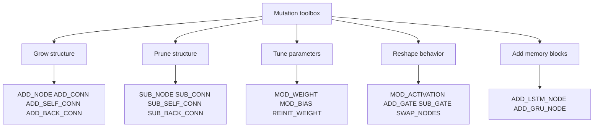

# methods/mutation

## methods/mutation/mutation.ts

### mutation

Defines various mutation methods used in neuroevolution algorithms.

Mutation introduces genetic diversity into the population by randomly
altering parts of an individual's genome (the neural network structure or parameters).
This is crucial for exploring the search space and escaping local optima.

Common mutation strategies include adding or removing nodes and connections,
modifying connection weights and node biases, and changing node activation functions.
These operations allow the network topology and parameters to adapt over generations.

The methods listed here are inspired by techniques used in algorithms like NEAT
and particularly the Instinct algorithm, providing a comprehensive set of tools
for evolving network architectures.

Read this file as a mutation toolbox organized by what kind of change you
want evolution to make:

- topology-growth operators such as `ADD_NODE`, `ADD_CONN`,
  `ADD_SELF_CONN`, and `ADD_BACK_CONN` make the graph more expressive,
- topology-pruning operators such as `SUB_NODE`, `SUB_CONN`,
  `SUB_SELF_CONN`, and `SUB_BACK_CONN` remove structure and can simplify an
  overgrown search,
- parameter-tuning operators such as `MOD_WEIGHT`, `MOD_BIAS`, and
  `REINIT_WEIGHT` change numeric behavior without rewriting the graph,
- behavior-shaping operators such as `MOD_ACTIVATION`, `ADD_GATE`,
  `SUB_GATE`, and `SWAP_NODES` change how existing structure computes,
- architecture-expansion operators such as `ADD_LSTM_NODE` and
  `ADD_GRU_NODE` introduce memory-oriented building blocks.

A practical reading order is:

1. start with `MOD_WEIGHT` and `MOD_BIAS` to understand the gentlest search
   moves,
2. then compare `ADD_CONN` and `ADD_NODE` to see how structure starts to
   grow,
3. then read the recurrent and gating operators when you want temporal
   behavior or context-sensitive routing,
4. finish with `ALL` and `FFW`, which summarize which operators belong in a
   broad search versus a strictly feedforward one.

A practical chooser for first experiments:

- begin with weight and bias mutations when the topology is already plausible
  and you mainly want numeric refinement,
- allow `ADD_CONN` and `ADD_NODE` when the current architecture feels too
  rigid or too shallow,
- enable gating or back-connections only when temporal memory or dynamic
  routing is actually part of the task,
- prefer `FFW` as the safe shelf when a run must remain strictly
  feedforward.



Minimal workflow:

```ts
const safeFeedforwardShelf = mutation.FFW;

const structuralSearchShelf = [
  mutation.ADD_CONN,
  mutation.ADD_NODE,
  mutation.MOD_WEIGHT,
  mutation.MOD_BIAS,
];

const recurrentSearchShelf = [
  ...structuralSearchShelf,
  mutation.ADD_GATE,
  mutation.ADD_BACK_CONN,
];
```

Supported mutation families:

- `ADD_NODE`: Adds a new node by splitting an existing connection.
- `SUB_NODE`: Removes a hidden node and its connections.
- `ADD_CONN`: Adds a new connection between two unconnected nodes.
- `SUB_CONN`: Removes an existing connection.
- `MOD_WEIGHT`: Modifies the weight of an existing connection.
- `MOD_BIAS`: Modifies the bias of a node.
- `MOD_ACTIVATION`: Changes the activation function of a node.
- `ADD_SELF_CONN`: Adds a self-connection (recurrent loop) to a node.
- `SUB_SELF_CONN`: Removes a self-connection from a node.
- `ADD_GATE`: Adds a gating mechanism to a connection.
- `SUB_GATE`: Removes a gating mechanism from a connection.
- `ADD_BACK_CONN`: Adds a recurrent (backward) connection between nodes.
- `SUB_BACK_CONN`: Removes a recurrent (backward) connection.
- `SWAP_NODES`: Swaps the roles (bias and activation) of two nodes.
- `REINIT_WEIGHT`: Reinitializes all weights for a node.
- `BATCH_NORM`: Marks a node for batch normalization (stub).
- `ADD_LSTM_NODE`: Adds a new LSTM node (memory cell with gates).
- `ADD_GRU_NODE`: Adds a new GRU node (gated recurrent unit).

Summary shelves:
- `ALL`: all mutation methods, including recurrent and memory-oriented ones.
- `FFW`: the feedforward-safe subset that avoids recurrence and gating.

### MutationConfig

Configuration shape for one mutation operator.

Each mutation method carries a small policy object describing what kind of
structural or parametric change it performs and the narrow knobs that shape
that change. Read the fields as metadata for the evolutionary controller,
not as a full runtime implementation.
