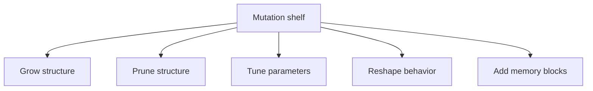

# methods/mutation

Mutation policy shelf for neuroevolution runs.

This chapter belongs in `methods/` rather than `architecture/network/mutate/`
because it does not execute one mutation against one concrete graph. It
defines the reusable operator vocabulary that higher-level controllers pick
from before any specific network is touched. The network chapter later uses
that vocabulary to dispatch real edits.

Read the shelf in five families. Growth operators add structure. Pruning
operators remove it. Parameter operators retune weights and biases without
rewriting topology. Behavior operators change activation or gating policy.
Memory operators add recurrent building blocks when the search should be
allowed to invent stateful behavior.

Those families matter because mutation is where an evolutionary run decides
whether it is mostly refining a plausible graph or still exploring new
architectures. A shelf dominated by `MOD_WEIGHT` and `MOD_BIAS` behaves like
local numeric search. A shelf that also allows `ADD_NODE`, `ADD_CONN`, and
gating or recurrent operators gives the run permission to change what the
network can represent at all.

`ALL` and `FFW` are the two convenience summaries at the bottom of the
chapter. `ALL` keeps the widest search surface, including recurrence and
memory additions. `FFW` keeps the feedforward-safe subset for runs that must
remain acyclic.



For compact background on why mutation pressure matters in evolutionary
search, see Wikipedia contributors,
[Mutation (genetic algorithm)](<https://en.wikipedia.org/wiki/Mutation_(genetic_algorithm)>).

Example: keep a feedforward-safe shelf for searches that must remain simple
and acyclic.

```ts
const feedforwardOnly = mutation.FFW;
```

Example: widen the shelf when structural exploration is part of the goal.

```ts
const structuralExploration = [
  mutation.ADD_CONN,
  mutation.ADD_NODE,
  mutation.MOD_WEIGHT,
  mutation.ADD_GATE,
];
```

## methods/mutation/mutation.ts

### MutationConfig

Configuration shape for one mutation operator.

Each mutation method carries a small policy object describing what kind of
structural or parametric change it performs and the narrow knobs that shape
that change. Read the fields as metadata for the evolutionary controller,
not as a full runtime implementation.
