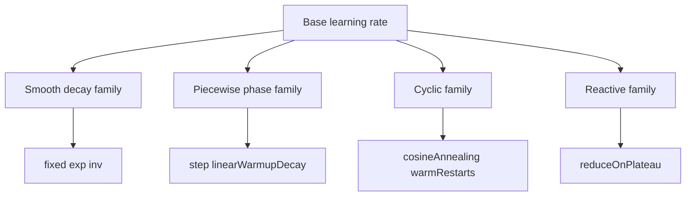

# methods/rate

Provides various methods for implementing learning rate schedules.

Learning rate schedules dynamically adjust the learning rate during the training
process of machine learning models, particularly neural networks. Adjusting the
learning rate can significantly impact training speed and performance. A high
rate might lead to overshooting the optimal solution, while a very low rate
can result in slow convergence or getting stuck in local minima. These methods
offer different strategies to balance exploration and exploitation during training.

Read this chapter as a tempo-control guide for training. The base learning
rate says how large a step feels reasonable at the start; the schedule says
how that step should change once the run has momentum, noise, or stagnation.

The schedules fall into four practical families:

- fixed and smooth decay schedules (`fixed()`, `exp()`, `inv()`) for simple
  long-run tempo control,
- piecewise schedules (`step()`, `linearWarmupDecay()`) for explicit phase
  changes,
- cyclic schedules (`cosineAnnealing()`, `cosineAnnealingWarmRestarts()`) for
  repeated exploration and settling,
- reactive schedules (`reduceOnPlateau()`) for runs that should respond to a
  monitored error signal.

## methods/rate/rate.ts

### Rate

Provides various methods for implementing learning rate schedules.

Learning rate schedules dynamically adjust the learning rate during the training
process of machine learning models, particularly neural networks. Adjusting the
learning rate can significantly impact training speed and performance. A high
rate might lead to overshooting the optimal solution, while a very low rate
can result in slow convergence or getting stuck in local minima. These methods
offer different strategies to balance exploration and exploitation during training.

Read this chapter as a tempo-control guide for training. The base learning
rate says how large a step feels reasonable at the start; the schedule says
how that step should change once the run has momentum, noise, or stagnation.

The schedules fall into four practical families:

- fixed and smooth decay schedules (`fixed()`, `exp()`, `inv()`) for simple
  long-run tempo control,
- piecewise schedules (`step()`, `linearWarmupDecay()`) for explicit phase
  changes,
- cyclic schedules (`cosineAnnealing()`, `cosineAnnealingWarmRestarts()`) for
  repeated exploration and settling,
- reactive schedules (`reduceOnPlateau()`) for runs that should respond to a
  monitored error signal.

Read the chapter in that same order: smooth baselines first, planned phase
changes next, cyclic schedules after that, and stateful reactive control
last.



### default

#### cosineAnnealing

```ts
cosineAnnealing(
  period: number,
  minimumRate: number,
): (baseRate: number, iteration: number) => number
```

Implements a Cosine Annealing learning rate schedule.

This schedule varies the learning rate cyclically according to a cosine function.
It starts at the `baseRate` and smoothly anneals down to `minimumRate` over a
specified `period` of iterations, then potentially repeats. This can help
the model escape local minima and explore the loss landscape more effectively.
Often used with "warm restarts" where the cycle repeats. The mental model is
deliberate breathing: ramp down to settle, then restart high enough to
explore again.

Formula: `learning_rate = minimumRate + 0.5 * (baseRate - minimumRate) * (1 + cos(pi * current_cycle_iteration / period))`

Parameters:
- `period` - The number of iterations over which the learning rate anneals from `baseRate` to `minimumRate` in one cycle. Defaults to 1000.
- `minimumRate` - The minimum learning rate value at the end of a cycle. Defaults to 0.
- `baseRate` - The initial (maximum) learning rate for the cycle.
- `iteration` - The current training iteration.

Returns: A function that calculates the learning rate for a given iteration based on the cosine annealing schedule.

#### cosineAnnealingWarmRestarts

```ts
cosineAnnealingWarmRestarts(
  initialPeriod: number,
  minimumRate: number,
  periodGrowthMultiplier: number,
): (baseRate: number, iteration: number) => number
```

Cosine Annealing with Warm Restarts (SGDR style) where the cycle length can grow by a multiplier after each restart.

This variant keeps the exploratory reset behavior of cosine annealing while
allowing later cycles to last longer. That makes it useful when early
exploration should be frequent but later training should settle for longer
stretches between restarts.

Parameters:
- `initialPeriod` - Length of the first cycle in iterations.
- `minimumRate` - Minimum learning rate at valley.
- `periodGrowthMultiplier` - Factor to multiply the period after each restart (>=1).

Returns: A function that replays cosine cycles whose length can grow after each restart.

#### exp

```ts
exp(
  decayFactor: number,
): (baseRate: number, iteration: number) => number
```

Implements an exponential decay learning rate schedule.

The learning rate decreases exponentially after each iteration, multiplying
by the decay factor `decayFactor`. This provides a smooth, continuous reduction
in the learning rate over time. Compared with step decay, the policy is less
about distinct phases and more about a steady fade in aggressiveness.

Formula: `learning_rate = baseRate * decayFactor ^ iteration`

Parameters:
- `decayFactor` - The decay factor applied at each iteration. Should be less than 1. Defaults to 0.999.
- `baseRate` - The initial learning rate.
- `iteration` - The current training iteration.

Returns: A function that calculates the exponentially decayed learning rate for a given iteration.

#### fixed

```ts
fixed(): (baseRate: number, iteration: number) => number
```

Implements a fixed learning rate schedule.

The learning rate remains constant throughout the entire training process.
This is the simplest schedule and serves as a baseline, but may not be
optimal for complex problems. Use it when you want the rest of the system,
not the schedule, to carry the full burden of training stability.

Parameters:
- `baseRate` - The initial learning rate, which will remain constant.
- `iteration` - The current training iteration (unused in this method, but included for consistency).

Returns: A function that takes the base learning rate and the current iteration number, and always returns the base learning rate.

#### inv

```ts
inv(
  decayFactor: number,
  decayPower: number,
): (baseRate: number, iteration: number) => number
```

Implements an inverse decay learning rate schedule.

The learning rate decreases as the inverse of the iteration number,
controlled by the decay factor `decayFactor` and exponent `decayPower`. The rate
decreases more slowly over time compared to exponential decay. Use it when
you want long training runs to keep some learning energy instead of cooling
too quickly.

Formula: `learning_rate = baseRate / (1 + decayFactor * iteration ** decayPower)`

Parameters:
- `decayFactor` - Controls the rate of decay. Higher values lead to faster decay. Defaults to 0.001.
- `decayPower` - The exponent controlling the shape of the decay curve. Defaults to 2.
- `baseRate` - The initial learning rate.
- `iteration` - The current training iteration.

Returns: A function that calculates the inversely decayed learning rate for a given iteration.

#### linearWarmupDecay

```ts
linearWarmupDecay(
  totalStepCount: number,
  warmupStepCount: number | undefined,
  endRate: number,
): (baseRate: number, iteration: number) => number
```

Linear Warmup followed by Linear Decay to an end rate.
Warmup linearly increases LR from near 0 up to baseRate over warmupStepCount, then linearly decays to endRate at totalStepCount.
Iterations beyond totalStepCount clamp to endRate.

This schedule is common when the earliest steps are the most unstable: start
gentle, reach full speed, then taper predictably.

Parameters:
- `totalStepCount` - Total steps for full schedule (must be > 0).
- `warmupStepCount` - Steps for warmup (< totalStepCount). Defaults to 10% of totalStepCount.
- `endRate` - Final rate at totalStepCount.

Returns: A function that warms the learning rate up, then decays it toward a fixed floor.

#### reduceOnPlateau

```ts
reduceOnPlateau(
  options: { factor?: number | undefined; patience?: number | undefined; minDelta?: number | undefined; cooldown?: number | undefined; minRate?: number | undefined; verbose?: boolean | undefined; } | undefined,
): (baseRate: number, iteration: number, lastError?: number | undefined) => number
```

ReduceLROnPlateau style scheduler (stateful closure) that monitors error signal (third argument if provided)
and reduces rate by 'factor' if no improvement beyond 'minDelta' for 'patience' iterations.
Cooldown prevents immediate successive reductions.
NOTE: Requires the training loop to call with signature (baseRate, iteration, lastError).

This is the chapter's reactive option. Instead of following a pre-planned
calendar, the schedule listens for stalled improvement and responds only when
the run appears to flatten out.

Parameters:
- `options` - Optional reactive-control settings such as patience, cooldown, and minimum rate floor.

Returns: A stateful schedule function that may lower the learning rate when the monitored error stops improving.

#### step

```ts
step(
  decayFactor: number,
  decayStepSize: number,
): (baseRate: number, iteration: number) => number
```

Implements a step decay learning rate schedule.

The learning rate is reduced by a multiplicative factor (`decayFactor`)
at predefined intervals (`decayStepSize` iterations). This allows for
faster initial learning, followed by finer adjustments as training progresses.
It is a good fit when you want training to move through a few deliberate
phases rather than one perfectly smooth curve.

Formula: `learning_rate = baseRate * decayFactor ^ floor(iteration / decayStepSize)`

Parameters:
- `decayFactor` - The factor by which the learning rate is multiplied at each step. Should be less than 1. Defaults to 0.9.
- `decayStepSize` - The number of iterations after which the learning rate decays. Defaults to 100.
- `baseRate` - The initial learning rate.
- `iteration` - The current training iteration.

Returns: A function that calculates the decayed learning rate for a given iteration.

## methods/rate/rate.utils.ts

### createCosineAnnealingRateSchedule

```ts
createCosineAnnealingRateSchedule(
  period: number,
  minimumRate: number,
): RateSchedule
```

Return a cosine-annealing learning-rate schedule that oscillates between base and minimum rates within each period to encourage periodic exploratory updates.

Parameters:
- `period` - Length of a full cosine cycle.
- `minimumRate` - Minimum rate reached at the end of a cycle.

Returns: A learning rate schedule implementing cosine annealing.

### createCosineAnnealingWarmRestartsSchedule

```ts
createCosineAnnealingWarmRestartsSchedule(
  initialPeriod: number,
  minimumRate: number,
  periodGrowthMultiplier: number,
): RateSchedule
```

Return a cosine-annealing schedule with warm restarts and optional period growth so each cycle can reset aggressiveness while gradually lengthening exploration windows.

Parameters:
- `initialPeriod` - Length of the initial cycle.
- `minimumRate` - Minimum learning rate reached at the end of each cycle.
- `periodGrowthMultiplier` - Multiplier applied to the period after each restart.

Returns: A learning rate schedule implementing SGDR-style warm restarts.

### createExponentialRateSchedule

```ts
createExponentialRateSchedule(
  decayFactor: number,
): RateSchedule
```

Return an exponential-decay learning-rate schedule that scales the base rate every iteration, producing smooth monotonic annealing across long training runs.

Parameters:
- `decayFactor` - Multiplicative decay applied every iteration.

Returns: A learning rate schedule implementing exponential decay.

### createFixedRateSchedule

```ts
createFixedRateSchedule(): RateSchedule
```

Return a schedule that always yields the base learning rate so callers can disable dynamic decay while still using the shared scheduler pipeline.

Returns: A learning rate schedule that ignores iteration and returns baseRate.

### createInverseRateSchedule

```ts
createInverseRateSchedule(
  decayFactor: number,
  decayPower: number,
): RateSchedule
```

Return an inverse-decay learning-rate schedule whose denominator grows with iteration so decay slows over time while remaining continuous and stable.

Parameters:
- `decayFactor` - Decay factor controlling the decay rate.
- `decayPower` - Exponent that shapes the decay curve.

Returns: A learning rate schedule implementing inverse decay.

### createLinearWarmupDecaySchedule

```ts
createLinearWarmupDecaySchedule(
  totalStepCount: number,
  warmupStepCount: number | undefined,
  endRate: number,
): RateSchedule
```

Return a linear warmup followed by linear decay schedule so optimization ramps safely from small initial steps before annealing toward a configurable terminal rate.

Parameters:
- `totalStepCount` - Total number of steps in the schedule (must be positive).
- `warmupStepCount` - Optional number of warmup steps; defaults to 10% of total steps.
- `endRate` - Final rate once decay completes.

Returns: A learning rate schedule implementing warmup then decay.

### createReduceOnPlateauSchedule

```ts
createReduceOnPlateauSchedule(
  options: { factor?: number | undefined; patience?: number | undefined; minDelta?: number | undefined; cooldown?: number | undefined; minRate?: number | undefined; verbose?: boolean | undefined; } | undefined,
): ReduceOnPlateauSchedule
```

Return a ReduceLROnPlateau-style schedule that lowers the rate when monitored error stops improving, with explicit patience, cooldown, and minimum-rate guardrails for stable adaptive decay.

Parameters:
- `options` - Optional configuration for factor, patience, minDelta, cooldown, and minimum rate.

Returns: A stateful schedule that reacts to lack of improvement.

### createStepRateSchedule

```ts
createStepRateSchedule(
  decayFactor: number,
  decayStepSize: number,
): RateSchedule
```

Return a step-decay learning-rate schedule that applies multiplicative drops at fixed iteration intervals for predictable staircase-style annealing behavior in long-running optimization loops.

Parameters:
- `decayFactor` - Multiplicative decay applied at each decay step.
- `decayStepSize` - Number of iterations before applying another decay step.

Returns: A learning rate schedule implementing step decay.

### DEFAULT_COSINE_PERIOD

Length of one full cosine annealing cycle in training iterations before the schedule wraps or restarts.

### DEFAULT_DECAY_STEP_SIZE

Step decay interval in training iterations; increasing this value spaces decay events further apart and keeps the learning rate elevated for longer periods.

### DEFAULT_EXPONENTIAL_DECAY_FACTOR

Per-iteration exponential decay multiplier; values just below 1 create gentle geometric decay over many training steps.

### DEFAULT_INITIAL_PERIOD

Initial period length in iterations for cosine schedules with warm restarts before the period growth multiplier is applied.

### DEFAULT_INVERSE_DECAY_FACTOR

Inverse decay multiplier; higher values push the denominator up faster and shrink the rate sooner.

### DEFAULT_INVERSE_POWER

Inverse decay exponent; 1 makes decay linear in iteration, 2 makes it quadratic.

### DEFAULT_LINEAR_END_RATE

Target learning rate at the end of the warmup-decay schedule; typically zero or a small positive floor value.

### DEFAULT_MINIMUM_RATE

Floor learning rate for cosine schedules; keeps the rate from reaching zero.

### DEFAULT_PERIOD_GROWTH_MULTIPLIER

Multiplier applied to the cosine cycle length after each restart (>= 1).

### DEFAULT_REDUCE_ON_PLATEAU_COOLDOWN

Number of iterations the reduce-on-plateau scheduler stays inactive after a reduction to prevent rapid consecutive rate cuts.

### DEFAULT_REDUCE_ON_PLATEAU_FACTOR

Reduce-on-plateau multiplicative shrink factor; a value of 0.5 halves the rate on each plateau trigger event.

### DEFAULT_REDUCE_ON_PLATEAU_MIN_DELTA

Minimum absolute loss improvement required per iteration to count as genuine progress for the plateau detector.

### DEFAULT_REDUCE_ON_PLATEAU_MIN_RATE

Absolute minimum learning rate enforced during reduce-on-plateau adjustments so the rate never drops to zero permanently.

### DEFAULT_REDUCE_ON_PLATEAU_PATIENCE

Number of consecutive non-improving iterations the scheduler waits before triggering a rate reduction on plateau.

### DEFAULT_STEP_DECAY_FACTOR

Step decay multiplier applied every `DEFAULT_DECAY_STEP_SIZE` iterations; values close to 1 produce slow decay while smaller values produce steeper rate reduction.

### DEFAULT_WARMUP_RATIO

Default warmup share of the schedule; 0.1 means 10% of total steps.

### RateSchedule

```ts
RateSchedule(
  baseRate: number,
  iteration: number,
): number
```

Learning rate schedule signature that maps a base rate and iteration index to a rate value.
Useful for each stateless schedule strategy.

### ReduceOnPlateauSchedule

```ts
ReduceOnPlateauSchedule(
  baseRate: number,
  iteration: number,
  lastError: number | undefined,
): number
```

Stateful ReduceLROnPlateau schedule signature that can react to a loss signal.
The third argument is optional and only needed when monitoring validation error.

## methods/rate/rate.errors.ts

Raised when a linear warmup-decay schedule receives a non-positive step count.

### RateLinearWarmupTotalStepsError

Raised when a linear warmup-decay schedule receives a non-positive step count.
