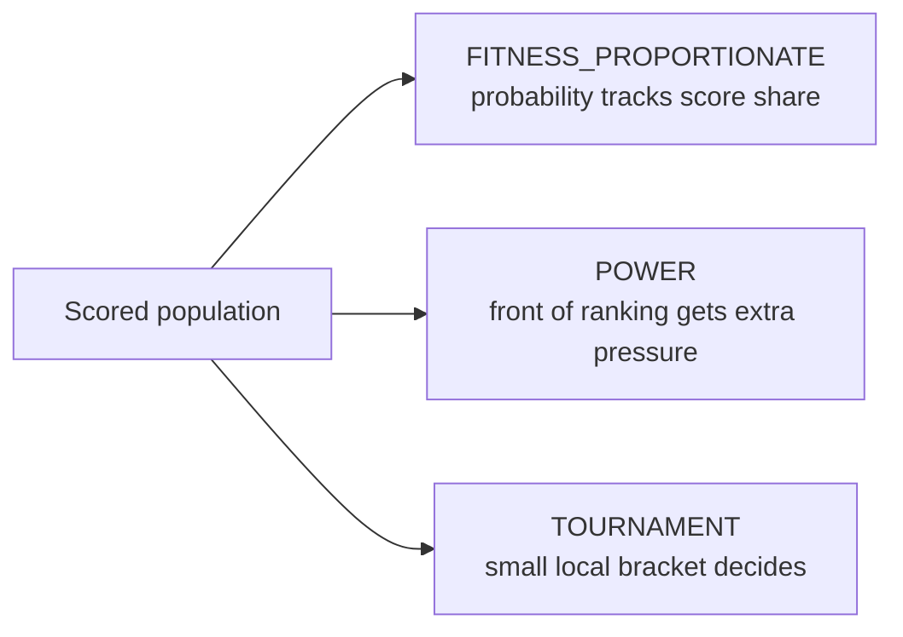

# methods/selection

Defines various selection methods used in genetic algorithms to choose individuals
for reproduction based on their fitness scores.

Selection is a crucial step that determines which genetic traits are passed on
to the next generation. Different methods offer varying balances between
exploration (maintaining diversity) and exploitation (favoring high-fitness individuals).
The choice of selection method significantly impacts the algorithm's convergence
speed and the diversity of the population. High selection pressure (strongly
favoring the fittest) can lead to faster convergence but may result in premature
stagnation at suboptimal solutions. Conversely, lower pressure maintains diversity
but can slow down the search process.

Read this file as a compact pressure ladder:

- `FITNESS_PROPORTIONATE` says selection chance should scale with score,
- `POWER` says front-runners should be favored more aggressively than raw
  proportional scores would imply,
- `TOURNAMENT` says selection pressure should come from repeated local
  competitions instead of one global roulette view.

Those strategies are not only different implementations. They encode
different ideas about what "deserves another child" means in an evolutionary
run.

A practical chooser for first experiments:

- start with `FITNESS_PROPORTIONATE` when you want the simplest global
  interpretation of score share,
- move to `POWER` when the best genomes are emerging but plain roulette
  pressure is still too gentle,
- prefer `TOURNAMENT` when score scale is noisy, unstable, or hard to compare
  across the whole population.

Minimal workflow:

```ts
const conservativeSelection = selection.FITNESS_PROPORTIONATE;

const aggressiveSelection = {
  ...selection.POWER,
  power: 6,
};

const bracketSelection = {
  ...selection.TOURNAMENT,
  size: 7,
  probability: 0.75,
};
```



## methods/selection/selection.ts
