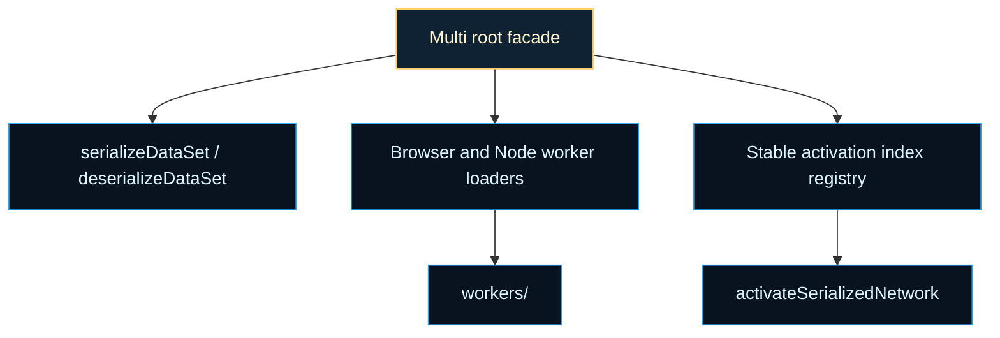

# multithreading

Worker-oriented evaluation helpers and serialization compatibility shelf.

This chapter exists for a practical scaling problem: evolutionary evaluation
is usually embarrassingly parallel, but live `Network` instances, activation
closures, and environment-specific worker APIs do not cross thread boundaries
cleanly. The multithreading root turns that mismatch into a teachable
contract: flatten the network and dataset into portable numeric arrays, keep
activation functions in a stable index order, and let browser or Node workers
evaluate the same payload shape without needing the whole runtime object
graph.

The most important idea here is not "threads are faster." It is boundary
control. A worker can only do useful NEAT work if the training host and the
worker agree on three things: how a network is serialized, how activations
are decoded, and how the result comes back as a scalar score. This root file
keeps that contract explicit so the rest of the library can talk about
parallel evaluation without hand-waving away the serialization boundary.

The chapter is intentionally narrow. It does not implement a generic
scheduler or a broad actor framework. It exposes a small compatibility shelf
around two tasks that matter for evaluation: ship datasets and networks
across a worker boundary, and run the same ordered activation logic on the
other side. That makes the boundary useful both for actual worker-backed
evaluation and for teaching how data-parallel neural evaluation is shaped.

Read the root in three passes:

1. `serializeDataSet()` and `deserializeDataSet()` for the portable sample
   format.
2. `activations` and `activateSerializedNetwork()` for the flat execution
   contract.
3. `getBrowserTestWorker()` and `getNodeTestWorker()` for the runtime-
   specific loader boundary.

`browser/` and `node/` own the environment-specific worker wrappers, while
`multi.utils.ts` owns the flat-array execution mechanics. The root stays
orchestration-first for the same reason as the rest of the repo: readers
should see the contract before they see the inner loops.

The background idea here is close to what distributed-systems and HPC writing
often call an embarrassingly parallel workload: each genome can be evaluated
independently once its inputs and scoring context are serialized. See
Wikipedia contributors,
[Embarrassingly parallel](https://en.wikipedia.org/wiki/Embarrassingly_parallel),
for compact background on why evolutionary evaluation is such a natural fit
for worker-style execution.




Example: serialize one dataset once and evaluate a network in a Node worker.

```ts
const serializedSet = Multi.serializeDataSet([
  { input: [0, 0], output: [0] },
  { input: [1, 1], output: [1] },
]);

const NodeWorker = await Multi.getNodeTestWorker();
const worker = new NodeWorker(serializedSet, { name: 'mse' });
const score = await worker.evaluate(network);
worker.terminate();
```

Example: run the worker-compatible flat activation path locally.

```ts
const [activationValues, stateValues, serializedNetwork] = network.serialize();
const outputValues = Multi.activateSerializedNetwork(
  [0, 1],
  activationValues.slice(),
  stateValues.slice(),
  serializedNetwork,
  Multi.activations,
);
```

## multithreading/multi.ts

### Multi

Stable compatibility facade for worker-oriented evaluation helpers.

Read `Multi` as the small public shelf around three related contracts:
portable dataset serialization, flat-array network activation, and runtime-
specific worker loading. The heavier mechanics live in `multi.utils.ts` and
`workers/`, but the class keeps the outside-facing API compact and familiar.

### default

#### absolute

```ts
absolute(
  inputValue: number,
): number
```

Absolute activation function.

Returns: The activated value.

#### activateSerializedNetwork

```ts
activateSerializedNetwork(
  inputValues: number[],
  activationValues: number[],
  stateValues: number[],
  serializedNetwork: number[],
  activationFunctions: ActivationFn[],
): number[]
```

Activates a serialized network.

Returns: The output values.

#### activations

A list of compiled activation functions in a specific order.

#### bentIdentity

```ts
bentIdentity(
  inputValue: number,
): number
```

Bent Identity activation function.

Returns: The activated value.

#### bipolar

```ts
bipolar(
  inputValue: number,
): number
```

Bipolar activation function.

Returns: The activated value.

#### bipolarSigmoid

```ts
bipolarSigmoid(
  inputValue: number,
): number
```

Bipolar Sigmoid activation function.

Returns: The activated value.

#### deserializeDataSet

```ts
deserializeDataSet(
  serializedSet: number[],
): SerializedSample[]
```

Deserializes a dataset from a flat array.

Returns: The deserialized dataset as an array of input-output pairs.

#### gaussian

```ts
gaussian(
  inputValue: number,
): number
```

Gaussian activation function.

Returns: The activated value.

#### getBrowserTestWorker

```ts
getBrowserTestWorker(): Promise<TestWorkerConstructor>
```

Gets the browser test worker.

Returns: The browser test worker.

#### getNodeTestWorker

```ts
getNodeTestWorker(): Promise<TestWorkerConstructor>
```

Gets the node test worker.

Returns: The node test worker.

#### hardTanh

```ts
hardTanh(
  inputValue: number,
): number
```

Hard Tanh activation function.

Returns: The activated value.

#### identity

```ts
identity(
  inputValue: number,
): number
```

Identity activation function.

Returns: The activated value.

#### inverse

```ts
inverse(
  inputValue: number,
): number
```

Inverse activation function.

Returns: The activated value.

#### logistic

```ts
logistic(
  inputValue: number,
): number
```

Logistic activation function.

Returns: The activated value.

#### relu

```ts
relu(
  inputValue: number,
): number
```

Rectified Linear Unit (ReLU) activation function.

Returns: The activated value.

#### selu

```ts
selu(
  inputValue: number,
): number
```

Scaled Exponential Linear Unit (SELU) activation function.

Returns: The activated value.

#### serializeDataSet

```ts
serializeDataSet(
  dataSet: { input: number[]; output: number[]; }[],
): number[]
```

Serializes a dataset into a flat array.

Returns: The serialized dataset.

#### sinusoid

```ts
sinusoid(
  inputValue: number,
): number
```

Sinusoid activation function.

Returns: The activated value.

#### softplus

```ts
softplus(
  inputValue: number,
): number
```

Softplus activation function. - Added

Returns: The activated value.

#### softsign

```ts
softsign(
  inputValue: number,
): number
```

Softsign activation function.

Returns: The activated value.

#### step

```ts
step(
  inputValue: number,
): number
```

Step activation function.

Returns: The activated value.

#### tanh

```ts
tanh(
  inputValue: number,
): number
```

Hyperbolic tangent activation function.

Returns: The activated value.

#### testSerializedSet

```ts
testSerializedSet(
  serializedSampleSet: SerializedSample[],
  cost: (expected: number[], actual: number[]) => number,
  activationValues: number[],
  stateValues: number[],
  serializedNetwork: number[],
  activationFunctions: ActivationFn[],
): number
```

Tests a serialized dataset using a cost function.

Returns: The average error.

#### workers

Workers for multi-threading

## multithreading/types.ts

Shared contracts for the multithreading boundary.

These types keep the worker-facing evaluation surface small: ordered
activation functions, serialized input/output samples, a serializable network
shape, and the worker constructor protocol used by the browser and Node test
worker wrappers.

### ActivationFn

```ts
ActivationFn(
  x: number,
): number
```

Shared contracts for the multithreading boundary.

These types keep the worker-facing evaluation surface small: ordered
activation functions, serialized input/output samples, a serializable network
shape, and the worker constructor protocol used by the browser and Node test
worker wrappers.

### SerializableNetwork

### SerializedSample

### TestWorkerConstructor

### TestWorkerInstance

## multithreading/multi.utils.ts

### absoluteActivation

```ts
absoluteActivation(
  value: number,
): number
```

Parameters:
- `value` - - Input value.

Returns: Absolute activation.

### activateSerializedNetwork

```ts
activateSerializedNetwork(
  inputValues: number[],
  activationValues: number[],
  stateValues: number[],
  serializedNetwork: number[],
  activationFunctions: ActivationFn[],
): number[]
```

Activates a serialized network and produces outputs.

Parameters:
- `inputValues` - - Inputs to feed into the network.
- `activationValues` - - Mutable activation register shared across runs.
- `stateValues` - - Mutable state register shared across runs.
- `serializedNetwork` - - Flat encoded network data.
- `activationFunctions` - - Ordered activation functions.

Returns: Activated outputs.

### ACTIVATION_FUNCTIONS

Returns: Activation functions ordered for serialization compatibility.

### bentIdentityActivation

```ts
bentIdentityActivation(
  value: number,
): number
```

Parameters:
- `value` - - Input value.

Returns: Bent identity activation.

### bipolarActivation

```ts
bipolarActivation(
  value: number,
): number
```

Parameters:
- `value` - - Input value.

Returns: Bipolar activation.

### bipolarSigmoidActivation

```ts
bipolarSigmoidActivation(
  value: number,
): number
```

Parameters:
- `value` - - Input value.

Returns: Bipolar sigmoid activation.

### deserializeDataSet

```ts
deserializeDataSet(
  serializedSet: number[],
): SerializedSample[]
```

Deserializes a dataset from its flat representation.

Parameters:
- `serializedSet` - - Flat serialized dataset array.

Returns: Array of input/output sample pairs.

### gaussianActivation

```ts
gaussianActivation(
  value: number,
): number
```

Parameters:
- `value` - - Input value.

Returns: Gaussian activation.

### hardTanhActivation

```ts
hardTanhActivation(
  value: number,
): number
```

Parameters:
- `value` - - Input value.

Returns: Hard tanh activation.

### identityActivation

```ts
identityActivation(
  value: number,
): number
```

Parameters:
- `value` - - Input value.

Returns: Identity activation.

### inverseActivation

```ts
inverseActivation(
  value: number,
): number
```

Parameters:
- `value` - - Input value.

Returns: Inverse activation.

### logisticActivation

```ts
logisticActivation(
  value: number,
): number
```

Parameters:
- `value` - - Input value.

Returns: Logistic activation.

### reluActivation

```ts
reluActivation(
  value: number,
): number
```

Parameters:
- `value` - - Input value.

Returns: ReLU activation.

### seluActivation

```ts
seluActivation(
  value: number,
): number
```

Parameters:
- `value` - - Input value.

Returns: SELU activation.

### serializeDataSet

```ts
serializeDataSet(
  dataSet: { input: number[]; output: number[]; }[],
): number[]
```

Serializes a dataset into a flat numeric array.

Parameters:
- `dataSet` - - Collection of samples with input and output arrays.

Returns: Flat serialized representation [inputCount, outputCount, ...samples].

### sinusoidActivation

```ts
sinusoidActivation(
  value: number,
): number
```

Parameters:
- `value` - - Input value.

Returns: Sinusoid activation.

### softplusActivation

```ts
softplusActivation(
  value: number,
): number
```

Parameters:
- `value` - - Input value.

Returns: Softplus activation.

### softsignActivation

```ts
softsignActivation(
  value: number,
): number
```

Parameters:
- `value` - - Input value.

Returns: Softsign activation.

### stepActivation

```ts
stepActivation(
  value: number,
): number
```

Parameters:
- `value` - - Input value.

Returns: Step activation.

### tanhActivation

```ts
tanhActivation(
  value: number,
): number
```

Parameters:
- `value` - - Input value.

Returns: Hyperbolic tangent activation.

### testSerializedSet

```ts
testSerializedSet(
  serializedSampleSet: SerializedSample[],
  costFunction: (expected: number[], actual: number[]) => number,
  activationValues: number[],
  stateValues: number[],
  serializedNetwork: number[],
  activationFunctions: ActivationFn[],
): number
```

Tests a serialized dataset using a cost function.

Parameters:
- `serializedSampleSet` - - Serialized dataset samples.
- `costFunction` - - Cost function comparing expected and actual outputs.
- `activationValues` - - Mutable activation register.
- `stateValues` - - Mutable state register.
- `serializedNetwork` - - Serialized network data.
- `activationFunctions` - - Activation functions to apply.

Returns: Average cost or NaN when invalid input.
