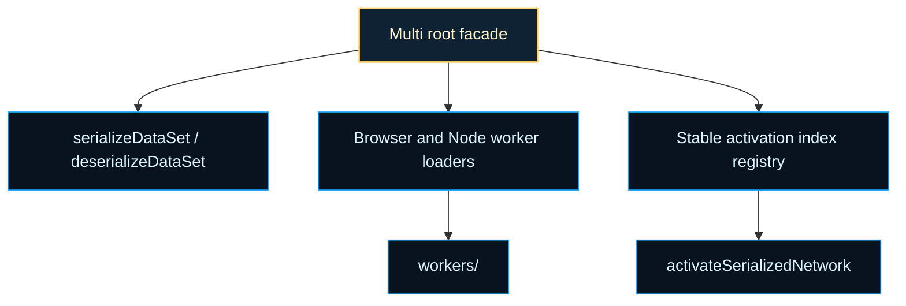

# multithreading

Worker-oriented evaluation helpers and serialization compatibility shelf.

This chapter exists for a practical scaling problem: evolutionary evaluation
is usually embarrassingly parallel, but live `Network` instances, activation
closures, and environment-specific worker APIs do not cross thread boundaries
cleanly. The multithreading root turns that mismatch into a teachable
contract: flatten the network and dataset into portable numeric arrays, keep
activation functions in a stable index order, and let browser or Node workers
evaluate the same payload shape without needing the whole runtime object
graph.

The most important idea here is not "threads are faster." It is boundary
control. A worker can only do useful NEAT work if the training host and the
worker agree on three things: how a network is serialized, how activations
are decoded, and how the result comes back as a scalar score. This root file
keeps that contract explicit so the rest of the library can talk about
parallel evaluation without hand-waving away the serialization boundary.

The chapter is intentionally narrow. It does not implement a generic
scheduler or a broad actor framework. It exposes a small compatibility shelf
around two tasks that matter for evaluation: ship datasets and networks
across a worker boundary, and run the same ordered activation logic on the
other side. That makes the boundary useful both for actual worker-backed
evaluation and for teaching how data-parallel neural evaluation is shaped.

Read the root in three passes:

1. `serializeDataSet()` and `deserializeDataSet()` for the portable sample
   format.
2. `activations` and `activateSerializedNetwork()` for the flat execution
   contract.
3. `getBrowserTestWorker()` and `getNodeTestWorker()` for the runtime-
   specific loader boundary.

`browser/` and `node/` own the environment-specific worker wrappers, while
`multi.utils.ts` owns the flat-array execution mechanics. The root stays
orchestration-first for the same reason as the rest of the repo: readers
should see the contract before they see the inner loops.

The background idea here is close to what distributed-systems and HPC writing
often call an embarrassingly parallel workload: each genome can be evaluated
independently once its inputs and scoring context are serialized. See
Wikipedia contributors,
[Embarrassingly parallel](https://en.wikipedia.org/wiki/Embarrassingly_parallel),
for compact background on why evolutionary evaluation is such a natural fit
for worker-style execution.




Example: serialize one dataset once and evaluate a network in a Node worker.

```ts
const serializedSet = Multi.serializeDataSet([
  { input: [0, 0], output: [0] },
  { input: [1, 1], output: [1] },
]);

const NodeWorker = await Multi.getNodeTestWorker();
const worker = new NodeWorker(serializedSet, { name: 'mse' });
const score = await worker.evaluate(network);
worker.terminate();
```

Example: run the worker-compatible flat activation path locally.

```ts
const [activationValues, stateValues, serializedNetwork] = network.serialize();
const outputValues = Multi.activateSerializedNetwork(
  [0, 1],
  activationValues.slice(),
  stateValues.slice(),
  serializedNetwork,
  Multi.activations,
);
```

## multithreading/multi.ts

### Multi

Stable compatibility facade for worker-oriented evaluation helpers.

Read `Multi` as the small public shelf around three related contracts:
portable dataset serialization, flat-array network activation, and runtime-
specific worker loading. The heavier mechanics live in `multi.utils.ts` and
`workers/`, but the class keeps the outside-facing API compact and familiar.

### default

#### absolute

```ts
absolute(
  inputValue: number,
): number
```

Absolute activation function.

Returns: The activated value.

#### activateSerializedNetwork

```ts
activateSerializedNetwork(
  inputValues: number[],
  activationValues: number[],
  stateValues: number[],
  serializedNetwork: number[],
  activationFunctions: ActivationFn[],
): number[]
```

Activates a serialized network.

Returns: The output values.

#### activations

A list of compiled activation functions in a specific order.

#### bentIdentity

```ts
bentIdentity(
  inputValue: number,
): number
```

Bent Identity activation function.

Returns: The activated value.

#### bipolar

```ts
bipolar(
  inputValue: number,
): number
```

Bipolar activation function.

Returns: The activated value.

#### bipolarSigmoid

```ts
bipolarSigmoid(
  inputValue: number,
): number
```

Bipolar Sigmoid activation function.

Returns: The activated value.

#### deserializeDataSet

```ts
deserializeDataSet(
  serializedSet: number[],
): SerializedSample[]
```

Deserializes a dataset from a flat array.

Returns: The deserialized dataset as an array of input-output pairs.

#### gaussian

```ts
gaussian(
  inputValue: number,
): number
```

Gaussian activation function.

Returns: The activated value.

#### getBrowserTestWorker

```ts
getBrowserTestWorker(): Promise<TestWorkerConstructor>
```

Gets the browser test worker.

Returns: The browser test worker.

#### getNodeTestWorker

```ts
getNodeTestWorker(): Promise<TestWorkerConstructor>
```

Gets the node test worker.

Returns: The node test worker.

#### hardTanh

```ts
hardTanh(
  inputValue: number,
): number
```

Hard Tanh activation function.

Returns: The activated value.

#### identity

```ts
identity(
  inputValue: number,
): number
```

Identity activation function.

Returns: The activated value.

#### inverse

```ts
inverse(
  inputValue: number,
): number
```

Inverse activation function.

Returns: The activated value.

#### logistic

```ts
logistic(
  inputValue: number,
): number
```

Logistic activation function.

Returns: The activated value.

#### relu

```ts
relu(
  inputValue: number,
): number
```

Rectified Linear Unit (ReLU) activation function.

Returns: The activated value.

#### selu

```ts
selu(
  inputValue: number,
): number
```

Scaled Exponential Linear Unit (SELU) activation function.

Returns: The activated value.

#### serializeDataSet

```ts
serializeDataSet(
  dataSet: { input: number[]; output: number[]; }[],
): number[]
```

Serializes a dataset into a flat array.

Returns: The serialized dataset.

#### sinusoid

```ts
sinusoid(
  inputValue: number,
): number
```

Sinusoid activation function.

Returns: The activated value.

#### softplus

```ts
softplus(
  inputValue: number,
): number
```

Softplus activation function. - Added

Returns: The activated value.

#### softsign

```ts
softsign(
  inputValue: number,
): number
```

Softsign activation function.

Returns: The activated value.

#### step

```ts
step(
  inputValue: number,
): number
```

Step activation function.

Returns: The activated value.

#### tanh

```ts
tanh(
  inputValue: number,
): number
```

Hyperbolic tangent activation function.

Returns: The activated value.

#### testSerializedSet

```ts
testSerializedSet(
  serializedSampleSet: SerializedSample[],
  cost: (expected: number[], actual: number[]) => number,
  activationValues: number[],
  stateValues: number[],
  serializedNetwork: number[],
  activationFunctions: ActivationFn[],
): number
```

Tests a serialized dataset using a cost function.

Returns: The average error.

#### workers

Workers for multi-threading

## multithreading/types.ts

Shared contracts for the multithreading boundary.

These types keep the worker-facing evaluation surface small: ordered
activation functions, serialized input/output samples, a serializable network
shape, and the worker constructor protocol used by the browser and Node test
worker wrappers.

### ActivationFn

```ts
ActivationFn(
  x: number,
): number
```

Shared contracts for the multithreading boundary.

These types keep the worker-facing evaluation surface small: ordered
activation functions, serialized input/output samples, a serializable network
shape, and the worker constructor protocol used by the browser and Node test
worker wrappers.

### SerializableNetwork

Minimal interface required of a network to participate in worker evaluation.

Only `serialize()` is needed: workers receive the flat numeric triple
produced by this method and reconstruct activation state locally without
holding a reference to the full `Network` object graph.

### SerializedSample

A single input/output training sample for worker-based batch evaluation.

Both arrays must have lengths consistent with the network's input and
output dimensions. The serialized dataset format encodes these lengths
once in a shared header so worker threads can decode samples without
out-of-band metadata.

### TestWorkerConstructor

Constructor signature for worker classes used in parallel genome evaluation.

Implementations receive the flat-serialized dataset and the cost function
descriptor at construction time so the worker can score genomes without
receiving per-call dataset transfers.

### TestWorkerInstance

Contract for a running worker instance used in parallel genome evaluation.

`evaluate` scores a single genome and returns a fitness value. `terminate`
shuts the worker down cleanly. The optional `test` hook exists for
diagnostic harnesses that need to probe internal worker state.

## multithreading/multi.utils.ts

### absoluteActivation

```ts
absoluteActivation(
  value: number,
): number
```

Absolute value activation — maps the input to its non-negative magnitude.

Introduces a V-shaped nonlinearity: zero gradient for positive inputs,
negated gradient for negative inputs. Useful where magnitude matters but
sign does not.

Parameters:
- `value` - Pre-activation input value.

Returns: |value|.

### activateSerializedNetwork

```ts
activateSerializedNetwork(
  inputValues: number[],
  activationValues: number[],
  stateValues: number[],
  serializedNetwork: number[],
  activationFunctions: ActivationFn[],
): number[]
```

Activates a serialized network and produces outputs.
This interpreter executes the compact numeric encoding used by worker threads, including self-gated recurrent state updates and per-edge gating, so predictions can run without rehydrating full object graphs.

Parameters:
- `inputValues` - Inputs to feed into the network.
- `activationValues` - Mutable activation register shared across runs.
- `stateValues` - Mutable state register shared across runs.
- `serializedNetwork` - Flat encoded network data.
- `activationFunctions` - Ordered activation functions.

Returns: Activated outputs.

### ACTIVATION_FUNCTIONS

Ordered registry of all built-in activation functions for serialization compatibility.

Worker threads decode the compact network format using the numeric activation
index stored per node. The index is a direct position into this array, so
**order must never change**. New activations must be appended at the end to
preserve backward compatibility with previously serialized networks.

### bentIdentityActivation

```ts
bentIdentityActivation(
  value: number,
): number
```

Bent identity activation — smooth, near-linear with gentle curvature.

Outputs approximately x for large |x| but introduces a small nonlinear
bend near zero. Formula: (sqrt(x² + 1) − 1) / 2 + x.

Parameters:
- `value` - Pre-activation input value.

Returns: Bent identity output.

### bipolarActivation

```ts
bipolarActivation(
  value: number,
): number
```

Bipolar step activation — outputs +1 for positive inputs, −1 otherwise.

A hard threshold centered at zero. Useful as a binary decision unit where
outputs must be exactly ±1 rather than 0/1.

Parameters:
- `value` - Pre-activation input value.

Returns: 1 if value > 0, otherwise −1.

### bipolarSigmoidActivation

```ts
bipolarSigmoidActivation(
  value: number,
): number
```

Bipolar sigmoid activation — a logistic function rescaled to the range (−1, 1).

Formula: 2 / (1 + exp(−x)) − 1. Equivalent to tanh in range but computed
differently; retains the zero-crossing property of bipolar functions.

Parameters:
- `value` - Pre-activation input value.

Returns: Activation output in the range (−1, 1).

### deserializeDataSet

```ts
deserializeDataSet(
  serializedSet: number[],
): SerializedSample[]
```

Deserializes a dataset from its flat representation.
The deserializer reverses `serializeDataSet` by reconstructing fixed-width sample rows from the shared header, preserving deterministic sample order for batch evaluation.

Parameters:
- `serializedSet` - Flat serialized dataset array.

Returns: Array of input/output sample pairs.

### gaussianActivation

```ts
gaussianActivation(
  value: number,
): number
```

Gaussian activation — bell-curve response centered at zero.

Outputs the normal probability density shape exp(−x²), which peaks at 1
when x = 0 and decays to 0 for large |x|. Useful in radial basis function
style networks.

Parameters:
- `value` - Pre-activation input value.

Returns: exp(−value²).

### geluActivation

```ts
geluActivation(
  value: number,
): number
```

Gaussian Error Linear Unit (GELU) activation — smooth stochastic regularizer.

Formula: x · Φ(x), where Φ is the Gaussian CDF approximated via tanh.
GELU weighs inputs by their probability under a standard normal, producing
smooth, non-monotonic behavior. Widely used in transformer architectures.
See Hendrycks and Gimpel, 2016.

Parameters:
- `value` - Pre-activation input value.

Returns: GELU-activated output.

### hardTanhActivation

```ts
hardTanhActivation(
  value: number,
): number
```

Hard tanh activation — clamps the input to the range [−1, 1].

A piecewise linear approximation of tanh that is free of exponential
operations. Output is exactly −1, identity, or +1 depending on the input.

Parameters:
- `value` - Pre-activation input value.

Returns: Clamped value in [−1, 1].

### identityActivation

```ts
identityActivation(
  value: number,
): number
```

Identity (linear) activation — passes the input through unchanged.

Useful for output nodes in regression networks where no squashing is desired.

Parameters:
- `value` - Pre-activation input value.

Returns: The same value, unmodified.

### inverseActivation

```ts
inverseActivation(
  value: number,
): number
```

Inverse (complement) activation — reflects the input around 0.5.

Formula: 1 − x. Useful when a node's output should represent the
complementary probability or the negated contribution of its input.

Parameters:
- `value` - Pre-activation input value.

Returns: 1 − value.

### logisticActivation

```ts
logisticActivation(
  value: number,
): number
```

Logistic (sigmoid) activation — maps any real input to the open interval (0, 1).

Commonly used in output layers for binary classification or as a smooth
squashing function. See Wikipedia contributors,
[Sigmoid function](https://en.wikipedia.org/wiki/Sigmoid_function).

Parameters:
- `value` - Pre-activation input value.

Returns: Activation output in the range (0, 1).

### mishActivation

```ts
mishActivation(
  value: number,
): number
```

Mish smooth non-monotonic activation function.

Computes `x * tanh(softplus(x))` where `softplus(x) = ln(1 + e^x)`.
Mish avoids hard zero-saturation and provides better gradient flow than ReLU
in many deep architectures. See Misra, 2019, "Mish: A Self Regularized Non-Monotonic Activation Function".

Parameters:
- `value` - Pre-activation input value.

Returns: Mish-activated output.

### reluActivation

```ts
reluActivation(
  value: number,
): number
```

Rectified Linear Unit (ReLU) activation — passes positive values, zeros negatives.

The most widely used hidden-layer activation in deep learning due to its
computational simplicity and resistance to vanishing gradients. See Wikipedia
contributors, [Rectifier](https://en.wikipedia.org/wiki/Rectifier_(neural_networks)).

Parameters:
- `value` - Pre-activation input value.

Returns: value if value > 0, otherwise 0.

### seluActivation

```ts
seluActivation(
  value: number,
): number
```

Scaled Exponential Linear Unit (SELU) activation — self-normalizing variant of ELU.

Designed to push activations toward zero mean and unit variance when used
throughout a fully connected network, without explicit batch normalization.
Constants α and λ from Klambauer et al., 2017. See Wikipedia contributors,
[SELU](https://en.wikipedia.org/wiki/Activation_function#Scaled_exponential_linear_unit).

Parameters:
- `value` - Pre-activation input value.

Returns: Scaled activation output.

### serializeDataSet

```ts
serializeDataSet(
  dataSet: { input: number[]; output: number[]; }[],
): number[]
```

Serializes a dataset into a flat numeric array.
The flattened layout minimizes worker message overhead by encoding one header followed by contiguous input and output rows for each sample.

Parameters:
- `dataSet` - Collection of samples with input and output arrays.

Returns: Flat serialized representation [inputCount, outputCount, ...samples].

### sinusoidActivation

```ts
sinusoidActivation(
  value: number,
): number
```

Sinusoidal activation — applies the sine function to the pre-activation value.

Produces periodic, bounded output in [−1, 1]. Useful for networks that
need to learn cyclic or frequency-based patterns.

Parameters:
- `value` - Pre-activation input value.

Returns: sin(value).

### softplusActivation

```ts
softplusActivation(
  value: number,
): number
```

Softplus activation — a smooth approximation of ReLU.

Formula: log(1 + exp(x)). Always positive; approaches x for large x and 0
for large negative x. Uses numerical approximations at the tails to avoid
overflow.

Parameters:
- `value` - Pre-activation input value.

Returns: log(1 + exp(value)), with tail approximations for stability.

### softsignActivation

```ts
softsignActivation(
  value: number,
): number
```

Softsign activation — a smooth, non-saturating alternative to tanh.

Outputs range in (−1, 1) but with gentler saturation than tanh, preserving
gradient flow further from zero. Formula: x / (1 + |x|).

Parameters:
- `value` - Pre-activation input value.

Returns: Activation output in the range (−1, 1).

### stepActivation

```ts
stepActivation(
  value: number,
): number
```

Step (Heaviside) activation — outputs 1 for positive inputs, 0 otherwise.

A hard threshold function with zero gradient almost everywhere. Rarely used
in gradient-based training but useful for binary thresholding in evaluation.

Parameters:
- `value` - Pre-activation input value.

Returns: 1 if value > 0, otherwise 0.

### swishActivation

```ts
swishActivation(
  value: number,
): number
```

Swish activation — gated variant of the identity function.

Formula: x · σ(x), where σ is the logistic sigmoid. Self-gated,
non-monotonic, and smooth. Empirically outperforms ReLU on deeper
architectures. Proposed by Ramachandran et al., 2017.

Parameters:
- `value` - Pre-activation input value.

Returns: value · sigmoid(value).

### tanhActivation

```ts
tanhActivation(
  value: number,
): number
```

Hyperbolic tangent activation — maps any real input to the open interval (−1, 1).

Zero-centered and saturating; a common choice for hidden layers. See Wikipedia
contributors, [Hyperbolic functions](https://en.wikipedia.org/wiki/Hyperbolic_functions).

Parameters:
- `value` - Pre-activation input value.

Returns: Activation output in the range (−1, 1).

### testSerializedSet

```ts
testSerializedSet(
  serializedSampleSet: SerializedSample[],
  costFunction: (expected: number[], actual: number[]) => number,
  activationValues: number[],
  stateValues: number[],
  serializedNetwork: number[],
  activationFunctions: ActivationFn[],
): number
```

Tests a serialized dataset using a cost function.
Each sample is evaluated through the serialized-network interpreter and accumulated into an average finite cost, returning `NaN` when any sample or score violates numeric validity.

Parameters:
- `serializedSampleSet` - Serialized dataset samples.
- `costFunction` - Cost function comparing expected and actual outputs.
- `activationValues` - Mutable activation register.
- `stateValues` - Mutable state register.
- `serializedNetwork` - Serialized network data.
- `activationFunctions` - Activation functions to apply.

Returns: Average cost or NaN when invalid input.
