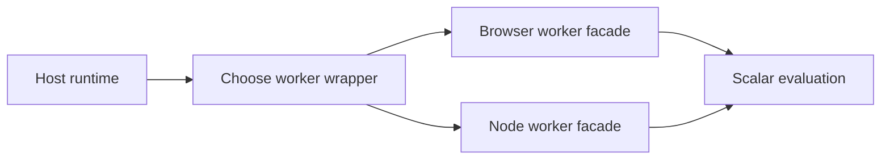

# multithreading/workers

Runtime loader shelf for browser and Node evaluation workers.

The multithreading root explains the serialization contract. This file
answers a narrower question: once a dataset and a network have already been
flattened into portable arrays, which runtime-specific worker wrapper should
own the evaluation run?

Keeping that choice behind one tiny loader shelf has two benefits. The host
runtime can defer importing browser-only or Node-only code until it actually
needs it, and the rest of the library can talk about one worker boundary
without pretending that Web Workers and forked Node helpers expose the same
constructor surface.

`getBrowserTestWorker()` loads the wrapper that creates a blob-backed worker
in the browser. `getNodeTestWorker()` loads the wrapper that forks a helper
process in Node. Both wrappers consume the same serialized payload shape and
return the same scalar evaluation contract.



Example: choose the runtime-specific worker facade without importing both
implementations up front.

```ts
const WorkerClass =
  typeof window === 'undefined'
    ? await Workers.getNodeTestWorker()
    : await Workers.getBrowserTestWorker();
```

## multithreading/workers/workers.ts

### Workers

Runtime loader shelf for browser and Node evaluation workers.

The multithreading root explains the serialization contract. This file
answers a narrower question: once a dataset and a network have already been
flattened into portable arrays, which runtime-specific worker wrapper should
own the evaluation run?

Keeping that choice behind one tiny loader shelf has two benefits. The host
runtime can defer importing browser-only or Node-only code until it actually
needs it, and the rest of the library can talk about one worker boundary
without pretending that Web Workers and forked Node helpers expose the same
constructor surface.

`getBrowserTestWorker()` loads the wrapper that creates a blob-backed worker
in the browser. `getNodeTestWorker()` loads the wrapper that forks a helper
process in Node. Both wrappers consume the same serialized payload shape and
return the same scalar evaluation contract.


Example: choose the runtime-specific worker facade without importing both
implementations up front.

```ts
const WorkerClass =
  typeof window === 'undefined'
    ? await Workers.getNodeTestWorker()
    : await Workers.getBrowserTestWorker();
```

#### getBrowserTestWorker

```ts
getBrowserTestWorker(): Promise<typeof TestWorker>
```

Loads the browser test worker dynamically.

Returns: A promise that resolves to the browser TestWorker class.

#### getNodeTestWorker

```ts
getNodeTestWorker(): Promise<typeof TestWorker>
```

Loads the Node.js test worker dynamically.

Returns: A promise that resolves to the Node.js TestWorker class.
