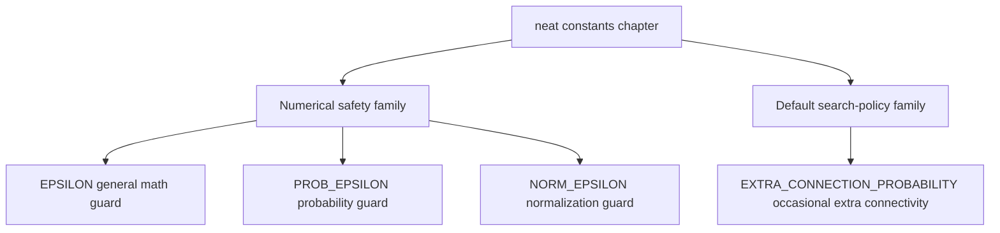

# neat

Shared numerical and heuristic constants reused across the NEAT controller.

This file intentionally stays flat at the `src/neat` root even after the
controller folderization work. Unlike the chaptered controller helpers, these
values are consumed both by NEAT internals and by non-NEAT architecture code,
so keeping one dependency-free constants surface avoids inventing a fake
chapter boundary just to move a few numbers around.

That decision matters pedagogically as well as architecturally. These values
are the small numeric assumptions that quietly shape the controller's tone:
how cautious it is around unstable math, and how willing it is to spend a
little extra effort on structural growth. Pulling them into one compact root
chapter makes that personality readable in one place instead of scattering it
across unrelated helpers.

Read this file in two passes:

- start with the epsilon constants when you want to understand how the
  controller protects division, logarithm, and normalization math,
- end with the mutation heuristic when you want to understand one small but
  user-visible piece of the default search policy.

The goal is not to expose every tunable number in NEAT. The goal is to keep
a tiny shared shelf of values that multiple chapters can reuse without
re-defining their own local approximations of "close to zero" or
"occasionally try one more structural mutation".

In practice, the constants split into two families:

- numerical safety constants that prevent unstable math at very small scales,
- policy constants that communicate a default controller preference.



The important reading move is to treat these as defaults, not as universal
truths. Each constant is a small claim about what the controller should do
when math approaches an unstable scale or when mutation has a chance to grow
structure one step further.

Example:

```ts
import { EPSILON, EXTRA_CONNECTION_PROBABILITY } from './neat/neat.constants';

const safeRatio = value / (total + EPSILON);
const shouldTryExtraConnection = rng() < EXTRA_CONNECTION_PROBABILITY;
```

## neat/neat.constants.ts

### EPSILON

Baseline numerical safety constant for general NEAT math.

Use this when a denominator or logarithm input can drift toward zero during
fitness shaping, telemetry aggregation, or other controller math where you
want protection without switching to a more specialized epsilon.

This is the "default" safety offset in the family. If a calculation is not
specifically probability-oriented or variance-oriented, this is usually the
right stabilizer to reach for first.

Read it as the controller's everyday guard rail: small enough to stay out of
the way of ordinary calculations, but present anywhere a divide-by-zero or a
log-of-zero edge could quietly poison downstream training or telemetry.

### PROB_EPSILON

Probability-scale safety constant for very small ratios and logarithms.

This is intentionally smaller than {@link EPSILON} because probability terms
often need protection without materially changing the magnitude of already
tiny values.

Reach for this when the math is closer to "protect a probability-like term"
than to "stabilize a general denominator". The smaller offset helps keep
loss-style or entropy-style quantities numerically safe while staying closer
to the original scale.

In practice this constant teaches a useful distinction: not every safety fix
should be equally large. Probability-like quantities often need a gentler
nudge than general controller arithmetic.

### NORM_EPSILON

Normalization-scale safety constant for variance and spread calculations.

The value matches the larger scale commonly used in normalization math where
the goal is stable variance handling rather than near-exact probability work.

Compared with {@link EPSILON} and {@link PROB_EPSILON}, this epsilon is the
deliberately larger member of the family. It is meant for "keep the
normalization step well-behaved" scenarios, not for preserving extremely
tiny probability magnitudes.

This is the chapter's reminder that stability is scale-dependent. Variance,
spread, and normalization math often benefit from a visibly larger floor than
probability math, because the goal is smooth controller behavior rather than
near-exact preservation of microscopic values.

### EXTRA_CONNECTION_PROBABILITY

Default heuristic for one opportunistic extra add-connection attempt.

This is a heuristic rather than a numerical safety constant. It slightly
increases the chance that a genome gains new connectivity during mutation
without making extra-connection attempts mandatory on every pass.

Treat this as a small statement about controller personality: the default
search policy is willing to occasionally spend extra effort on connectivity
growth, but it does not force that gamble on every mutation cycle.

That makes this constant the policy counterpart to the epsilon family. The
epsilons say how carefully the controller protects its math; this value says
how adventurous the default mutation policy is willing to be when a little
extra connectivity might unlock better search.
