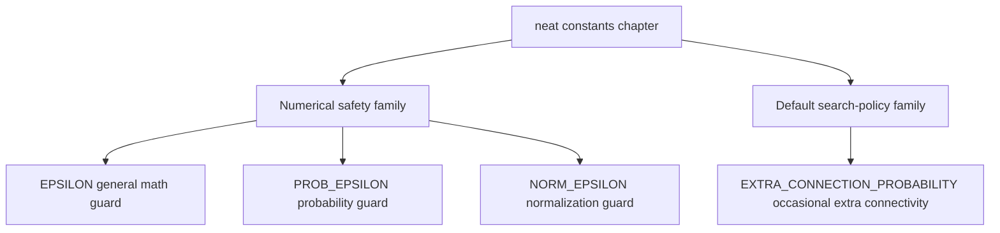

# neat

Root compatibility types for the public `Neat` controller boundary.

The chapter exists to keep `src/neat.ts` orchestration-first while still
giving the root surface one explicit place to document its compatibility
contracts. These are not the deepest or strongest types in the controller.
They are the adapter types the stable public entrypoint needs while the
chaptered implementation keeps narrowing local contracts underneath.

Read the file in three passes:

- start with `NeatOptions` to understand the root option bag,
- continue to `NeatFitnessFunction` when you need the public scoring seam,
- finish with the restore and mutation aliases when you are tracing how the
  root facade forwards work into the `init/`, `rng/`, and `export/` chapters.

## neat/neat.types.ts

### NeatOptions

Public configuration bag accepted by the root `Neat` constructor.

This alias stays intentionally permissive because the public boundary still
absorbs legacy experiment bags, partially migrated option families, and a
few chapter-local knobs that do not yet deserve a tighter shared contract.

That looseness is a boundary choice rather than a shared-type ideal. The
root facade accepts the broad option surface so the deeper helper chapters
can keep narrowing their own local slices instead of reintroducing one wide
compatibility bag in multiple places.

### NeatFitnessResult

Opaque result shape returned by root-level fitness callbacks.

The top-level `Neat` entrypoint has to tolerate both single-genome and
population-wide fitness styles, including delegates that perform async work
or side effects before downstream evaluation helpers interpret the result.
The root contract therefore stays wide on purpose.

### NeatFitnessFunction

```ts
NeatFitnessFunction(
  args: never[],
): unknown
```

Root compatibility shape for fitness callbacks accepted by `Neat`.

Read this as a facade contract rather than a claim that the root file owns
every legal scoring protocol. The constructor only promises that a scoring
delegate can be stored and forwarded safely; the stronger semantics live in
the evaluation and evolve chapters that actually consume the callback.

### NeatMutationSelectionResult

Awaited return shape for the public mutation-method selection wrapper.

The mutation chapter already owns the concrete union. This alias keeps the
root class synchronized with that source of truth without repeating a legacy
compatibility union inline.

### NeatRngStateSnapshot

Replay token accepted by the public RNG restore and import methods.

Deriving the token from the RNG facade keeps the root entrypoint aligned with
the replay chapter instead of maintaining a second hand-written copy of the
same restore contract.

### NeatExportFitnessFunction

```ts
NeatExportFitnessFunction(
  network: GenomeWithSerialization,
): number | Promise<number>
```

Fitness callback shape expected by the export/import restore helpers.

The persistence chapter reconstructs a controller from serialized state and
then reattaches a scoring delegate. The root surface derives that callback
type from the export chapter so the static restore helpers stay in lockstep
with the real persistence contract.

## neat/neat.constants.ts

Shared numerical and heuristic constants reused across the NEAT controller.

This file intentionally stays flat at the `src/neat` root even after the
controller folderization work. Unlike the chaptered controller helpers, these
values are consumed both by NEAT internals and by non-NEAT architecture code,
so keeping one dependency-free constants surface avoids inventing a fake
chapter boundary just to move a few numbers around.

That decision matters pedagogically as well as architecturally. These values
are the small numeric assumptions that quietly shape the controller's tone:
how cautious it is around unstable math, and how willing it is to spend a
little extra effort on structural growth. Pulling them into one compact root
chapter makes that personality readable in one place instead of scattering it
across unrelated helpers.

Read this file in two passes:

- start with the epsilon constants when you want to understand how the
  controller protects division, logarithm, and normalization math,
- end with the mutation heuristic when you want to understand one small but
  user-visible piece of the default search policy.

The goal is not to expose every tunable number in NEAT. The goal is to keep
a tiny shared shelf of values that multiple chapters can reuse without
re-defining their own local approximations of "close to zero" or
"occasionally try one more structural mutation".

In practice, the constants split into two families:

- numerical safety constants that prevent unstable math at very small scales,
- policy constants that communicate a default controller preference.



The important reading move is to treat these as defaults, not as universal
truths. Each constant is a small claim about what the controller should do
when math approaches an unstable scale or when mutation has a chance to grow
structure one step further.

Example:

```ts
import { EPSILON, EXTRA_CONNECTION_PROBABILITY } from './neat/neat.constants';

const safeRatio = value / (total + EPSILON);
const shouldTryExtraConnection = rng() < EXTRA_CONNECTION_PROBABILITY;
```

### EPSILON

Baseline numerical safety constant for general NEAT math.

Use this when a denominator or logarithm input can drift toward zero during
fitness shaping, telemetry aggregation, or other controller math where you
want protection without switching to a more specialized epsilon.

This is the "default" safety offset in the family. If a calculation is not
specifically probability-oriented or variance-oriented, this is usually the
right stabilizer to reach for first.

Read it as the controller's everyday guard rail: small enough to stay out of
the way of ordinary calculations, but present anywhere a divide-by-zero or a
log-of-zero edge could quietly poison downstream training or telemetry.

### PROB_EPSILON

Probability-scale safety constant for very small ratios and logarithms.

This is intentionally smaller than {@link EPSILON} because probability terms
often need protection without materially changing the magnitude of already
tiny values.

Reach for this when the math is closer to "protect a probability-like term"
than to "stabilize a general denominator". The smaller offset helps keep
loss-style or entropy-style quantities numerically safe while staying closer
to the original scale.

In practice this constant teaches a useful distinction: not every safety fix
should be equally large. Probability-like quantities often need a gentler
nudge than general controller arithmetic.

### NORM_EPSILON

Normalization-scale safety constant for variance and spread calculations.

The value matches the larger scale commonly used in normalization math where
the goal is stable variance handling rather than near-exact probability work.

Compared with {@link EPSILON} and {@link PROB_EPSILON}, this epsilon is the
deliberately larger member of the family. It is meant for "keep the
normalization step well-behaved" scenarios, not for preserving extremely
tiny probability magnitudes.

This is the chapter's reminder that stability is scale-dependent. Variance,
spread, and normalization math often benefit from a visibly larger floor than
probability math, because the goal is smooth controller behavior rather than
near-exact preservation of microscopic values.

### EXTRA_CONNECTION_PROBABILITY

Default heuristic for one opportunistic extra add-connection attempt.

This is a heuristic rather than a numerical safety constant. It slightly
increases the chance that a genome gains new connectivity during mutation
without making extra-connection attempts mandatory on every pass.

Treat this as a small statement about controller personality: the default
search policy is willing to occasionally spend extra effort on connectivity
growth, but it does not force that gamble on every mutation cycle.

That makes this constant the policy counterpart to the epsilon family. The
epsilons say how carefully the controller protects its math; this value says
how adventurous the default mutation policy is willing to be when a little
extra connectivity might unlock better search.

## neat/neat.defaults.constants.ts

Public default knobs for the root `Neat` controller.

These constants describe the controller personality a caller gets before a
custom option bag starts bending the run toward a different search style.
Keeping them in their own root chapter lets `src/neat.ts` stay focused on
orchestration while the `init/` chapter consumes one shared defaults packet.

The constants fall into four small families:

- search volume and tempo,
- speciation pressure,
- structural ceilings,
- observability sampling.

Read them as the public defaults shelf, not as hidden implementation trivia.
These values are the baseline promises the root controller makes when a user
says, "give me an ordinary NEAT run," without specifying every knob.

### DEFAULT_POPULATION_SIZE

Default population size when caller does not specify `popsize`.

This opens the root defaults shelf's search-volume family. It controls how
many genomes compete in each generation before elitism, provenance, or
mutation pressure begin to reshape the population.

### DEFAULT_ELITISM

Default elitism count applied when unspecified.

Read this beside {@link DEFAULT_POPULATION_SIZE} and
{@link DEFAULT_PROVENANCE}: the trio defines how much of each generation is
reserved for carry-over, how much is freshly injected, and how much capacity
remains for ordinary offspring.

### DEFAULT_PROVENANCE

Default provenance count applied when unspecified.

Provenance is the root controller's small "fresh seed" policy. A value of
`0` means the default run does not spend population budget on extra
generation-zero style injections unless the caller asks for them.

### DEFAULT_MUTATION_RATE

Default mutation rate used by the root controller when no explicit rate is supplied.

This belongs to the same search-tempo family as
{@link DEFAULT_MUTATION_AMOUNT}. Together they define how often mutation is
attempted and how many mutation steps a genome can receive once mutation is
active.

### DEFAULT_MUTATION_AMOUNT

Default number of mutation operations applied per genome.

The default keeps the baseline search policy conservative: most runs mutate
often enough to keep topology moving, but each genome usually pays for only
one structural or parametric change per mutation pass.

### DEFAULT_COMPATIBILITY_THRESHOLD

Default compatibility threshold controlling speciation distance.

This starts the speciation-pressure family of defaults. It is the neutral
boundary the controller uses before adaptive tuning or custom settings make
species splits stricter or more permissive.

### DEFAULT_MAX_NODES

Default maximum allowed nodes where `Infinity` means unbounded growth.

Read the three `DEFAULT_MAX_*` exports as one structural-ceiling family.
Leaving them unbounded by default tells the root controller to rely on
mutation policy, pruning, and adaptive limits instead of an immediate hard
cap.

### DEFAULT_MAX_CONNS

Default maximum allowed connections where `Infinity` means unbounded growth.

This preserves the same baseline policy as {@link DEFAULT_MAX_NODES}: the
controller does not impose a fixed connection ceiling unless the caller wants
one.

### DEFAULT_MAX_GATES

Default maximum allowed gates where `Infinity` means unbounded growth.

Gate limits stay in the same family as node and connection limits so the
whole structural-cap story remains consistent at the root surface.

### DEFAULT_EXCESS_COEFF

Default excess coefficient for NEAT compatibility distance.

This begins the root compatibility-weight family. These coefficients explain
which kinds of genome disagreement matter most when the controller decides
whether two genomes still belong in the same species neighborhood.

### DEFAULT_DISJOINT_COEFF

Default disjoint coefficient for NEAT compatibility distance.

Matching the excess coefficient by default gives the root controller a
balanced structural view: excess and disjoint innovation gaps both count as
first-class evidence during compatibility comparisons.

### DEFAULT_WEIGHT_DIFF_COEFF

Default average weight difference coefficient for compatibility distance.

This keeps parameter drift relevant without letting weight deltas dominate
the whole speciation read. In the default family, topology disagreement still
carries more weight than modest edge-weight differences.

### DEFAULT_DIVERSITY_PAIR_SAMPLE

Default pair-sample size used by diversity metrics in fast mode.

This starts the observability-sampling family. The root controller uses a
bounded sample instead of exhaustive pair checks so diversity reads stay
cheap enough for ordinary runs.

### DEFAULT_DIVERSITY_GRAPHLET_SAMPLE

Default graphlet sample size used by diversity metrics in fast mode.

Read this beside {@link DEFAULT_DIVERSITY_PAIR_SAMPLE}: pair samples give the
controller quick distance evidence, while graphlet samples provide a small
structural texture read without forcing whole-population analysis.

### DEFAULT_NOVELTY_K

Default neighbor count for novelty search when `k` is unspecified.

This closes the root observability-and-exploration shelf. It controls how
many nearby behaviors contribute to novelty before the caller tunes novelty
search more explicitly.

### DEFAULT_NEAT_CONSTRUCTOR_DEFAULTS

Shared defaults packet consumed by the constructor bootstrap chapter.

The root public surface still exports the individual constants for callers
and docs, but the constructor now hands one named packet to `init/` instead
of rebuilding the same object inline inside `src/neat.ts`.
