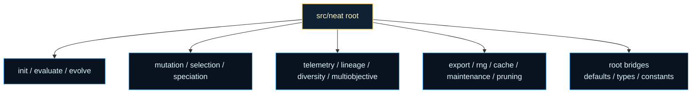
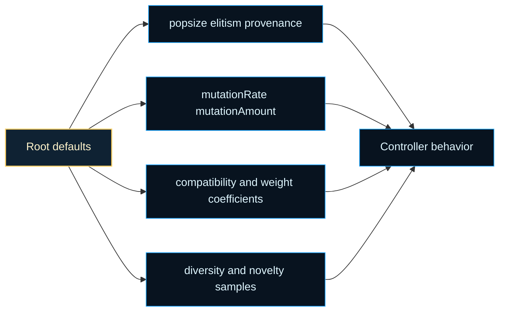
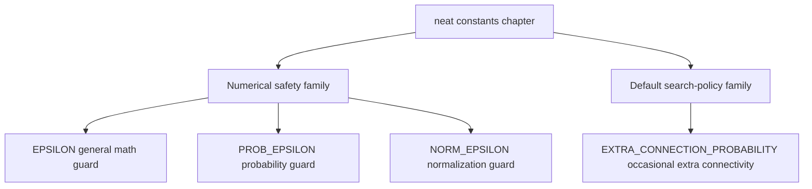
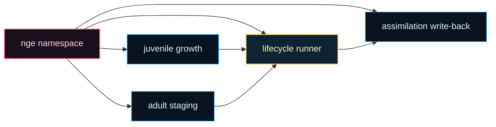
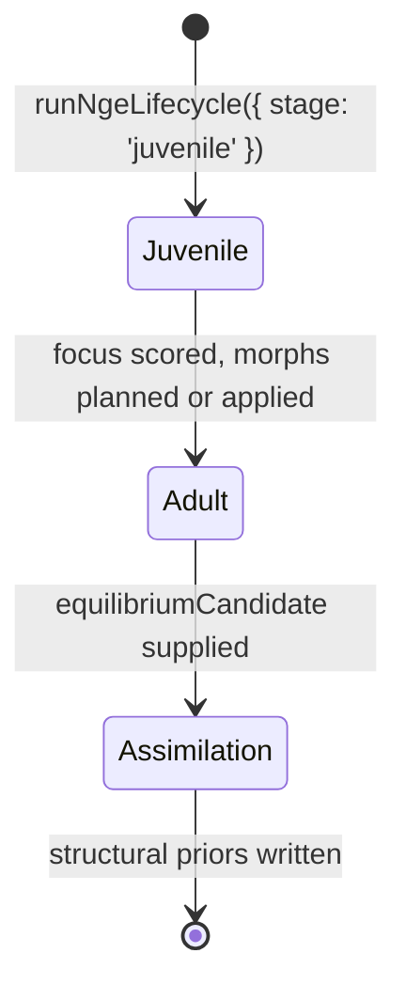

# neat

Root chapter map and public default knobs for the internal `src/neat` controller surface.

`src/neat.ts` is the public control desk. `src/neat/` is the machine room
behind it. This folder owns the controller chapters that make a run real:
initialization, evaluation, evolution, mutation, speciation, telemetry,
persistence, and the shared bookkeeping that keeps experiments deterministic
instead of magical. Promoting the defaults file to the chapter opening is
intentional because default knobs are the quickest way to make the
controller's personality legible before a reader dives into implementation
detail.

The most helpful reading move is to split the folder into four working
lanes. `init/`, `evaluate/`, and `evolve/` explain how a population is
created, scored, and replaced. `mutation/`, `selection/`, and `speciation/`
explain how search pressure and diversity are managed. `telemetry/`,
`lineage/`, `diversity/`, and `multiobjective/` explain how the run becomes
inspectable. `export/`, `rng/`, `cache/`, `maintenance/`, and `pruning/`
explain how the controller stays reproducible and tractable as experiments
get larger.

The flat root files are small bridges rather than the whole story.
`neat.defaults.constants.ts` and `neat.types.ts` keep the public constructor
and option bag readable. `neat.lineage.ts` and `neat.constants.ts` keep
small shared logic close to the root when multiple chapters need it. The
deeper folders own the heavier policy and runtime details.

These defaults matter because they are the baseline promises the controller
makes when a caller says "give me an ordinary NEAT run." Population size,
mutation tempo, compatibility pressure, structural ceilings, and
observability sampling are not random numbers. They are the quiet assumptions
that decide whether the controller behaves like a conservative search, an
exploratory search, or an unstable one.

That design follows the original NEAT intuition: protect structural
innovation long enough for it to compete, rather than forcing every new
topology to beat established species immediately. See Stanley and
Miikkulainen,
[Evolving Neural Networks through Augmenting Topologies](https://nn.cs.utexas.edu/?stanley:ec02),
for the background behind the compatibility and growth vocabulary that keeps
surfacing across this folder.

Canonical NEAT vs extensions vs experiments:

- Canonical NEAT (default mental model): historical markings (innovation ids),
  speciation pressure, and crossover alignment by innovation number. This is the
  core contract that makes “different topologies can still mate” work.
- Repo-specific extensions (opt-in features): additional controller lanes such as
  recurrent/gated allowances, multiobjective policy, novelty tracking, pruning,
  or richer telemetry. These should preserve the canonical identity rules even
  when they add new operators or metrics.
- Experimental research features: best-effort lanes that are intentionally marked
  as experimental (for example ONNX heuristics or experimental layer builders).
  Treat these as evolving prototypes: useful for exploration, but not guaranteed
  to match the strict replay or correctness bar of the canonical core.

Read this root chapter in three passes. Start with this defaults file and
`neat.types.ts` for the public knobs and broad contracts. Continue into
`evaluate/`, `evolve/`, and `speciation/` for the live search loop. Finish
with `telemetry/`, `lineage/`, `multiobjective/`, `export/`, and `rng/` when
you want to inspect, replay, or compare runs rather than only advance them.





Example: build one explicit baseline options bag from the documented root
defaults.

```ts
const baselineOptions = {
  popsize: DEFAULT_POPULATION_SIZE,
  mutationRate: DEFAULT_MUTATION_RATE,
  compatibilityThreshold: DEFAULT_COMPATIBILITY_THRESHOLD,
};
```

Example: keep the observability defaults visible when teaching or
benchmarking runs.

```ts
const observabilityDefaults = {
  diversityPairSample: DEFAULT_DIVERSITY_PAIR_SAMPLE,
  diversityGraphletSample: DEFAULT_DIVERSITY_GRAPHLET_SAMPLE,
  noveltyK: DEFAULT_NOVELTY_K,
};
```

## neat/neat.defaults.constants.ts

### DEFAULT_COMPATIBILITY_THRESHOLD

Default compatibility threshold controlling speciation distance.

This starts the speciation-pressure family of defaults. It is the neutral
boundary the controller uses before adaptive tuning or custom settings make
species splits stricter or more permissive.

### DEFAULT_DISJOINT_COEFF

Default disjoint coefficient for NEAT compatibility distance.

Matching the excess coefficient by default gives the root controller a
balanced structural view: excess and disjoint innovation gaps both count as
first-class evidence during compatibility comparisons.

### DEFAULT_DIVERSITY_GRAPHLET_SAMPLE

Default graphlet sample size used by diversity metrics in fast mode.

Read this beside {@link DEFAULT_DIVERSITY_PAIR_SAMPLE}: pair samples give the
controller quick distance evidence, while graphlet samples provide a small
structural texture read without forcing whole-population analysis.

### DEFAULT_DIVERSITY_PAIR_SAMPLE

Default pair-sample size used by diversity metrics in fast mode.

This starts the observability-sampling family. The root controller uses a
bounded sample instead of exhaustive pair checks so diversity reads stay
cheap enough for ordinary runs.

### DEFAULT_ELITISM

Default elitism count applied when unspecified.

Read this beside {@link DEFAULT_POPULATION_SIZE} and
{@link DEFAULT_PROVENANCE}: the trio defines how much of each generation is
reserved for carry-over, how much is freshly injected, and how much capacity
remains for ordinary offspring.

### DEFAULT_EXCESS_COEFF

Default excess coefficient for NEAT compatibility distance.

This begins the root compatibility-weight family. These coefficients explain
which kinds of genome disagreement matter most when the controller decides
whether two genomes still belong in the same species neighborhood.

### DEFAULT_MAX_CONNS

Default maximum allowed connections where `Infinity` means unbounded growth.

This preserves the same baseline policy as {@link DEFAULT_MAX_NODES}: the
controller does not impose a fixed connection ceiling unless the caller wants
one.

### DEFAULT_MAX_GATES

Default maximum allowed gates where `Infinity` means unbounded growth.

Gate limits stay in the same family as node and connection limits so the
whole structural-cap story remains consistent at the root surface.

### DEFAULT_MAX_NODES

Default maximum allowed nodes where `Infinity` means unbounded growth.

Read the three `DEFAULT_MAX_*` exports as one structural-ceiling family.
Leaving them unbounded by default tells the root controller to rely on
mutation policy, pruning, and adaptive limits instead of an immediate hard
cap.

### DEFAULT_MUTATION_AMOUNT

Default number of mutation operations applied per genome.

The default keeps the baseline search policy conservative: most runs mutate
often enough to keep topology moving, but each genome usually pays for only
one structural or parametric change per mutation pass.

### DEFAULT_MUTATION_RATE

Default mutation rate used by the root controller when no explicit rate is supplied.

This belongs to the same search-tempo family as
{@link DEFAULT_MUTATION_AMOUNT}. Together they define how often mutation is
attempted and how many mutation steps a genome can receive once mutation is
active.

### DEFAULT_NEAT_CONSTRUCTOR_DEFAULTS

Shared defaults packet consumed by the constructor bootstrap chapter.

The root public surface still exports the individual constants for callers
and docs, but the constructor now hands one named packet to `init/` instead
of rebuilding the same object inline inside `src/neat.ts`.

### DEFAULT_NOVELTY_K

Default neighbor count for novelty search when `k` is unspecified.

This closes the root observability-and-exploration shelf. It controls how
many nearby behaviors contribute to novelty before the caller tunes novelty
search more explicitly.

### DEFAULT_POPULATION_SIZE

Default population size when caller does not specify `popsize`.

This opens the root defaults shelf's search-volume family. It controls how
many genomes compete in each generation before elitism, provenance, or
mutation pressure begin to reshape the population.

### DEFAULT_PROVENANCE

Default provenance count applied when unspecified.

Provenance is the root controller's small "fresh seed" policy. A value of
`0` means the default run does not spend population budget on extra
generation-zero style injections unless the caller asks for them.

### DEFAULT_WEIGHT_DIFF_COEFF

Default average weight difference coefficient for compatibility distance.

This keeps parameter drift relevant without letting weight deltas dominate
the whole speciation read. In the default family, topology disagreement still
carries more weight than modest edge-weight differences.

## neat/neat.types.ts

Root compatibility types for the public `Neat` controller boundary.

The chapter exists to keep `src/neat.ts` orchestration-first while still
giving the root surface one explicit place to document its compatibility
contracts. These are not the deepest or strongest types in the controller.
They are the adapter types the stable public entrypoint needs while the
chaptered implementation keeps narrowing local contracts underneath.

Read the file in three passes:

- start with `NeatOptions` to understand the root option bag,
- continue to `NeatFitnessFunction` when you need the public scoring seam,
- finish with the restore and mutation aliases when you are tracing how the
  root facade forwards work into the `init/`, `rng/`, and `export/` chapters.

### NeatExportFitnessFunction

```ts
NeatExportFitnessFunction(
  network: GenomeWithSerialization,
): number | Promise<number>
```

Fitness callback shape expected by the export/import restore helpers.

The persistence chapter reconstructs a controller from serialized state and
then reattaches a scoring delegate. The root surface derives that callback
type from the export chapter so the static restore helpers stay in lockstep
with the real persistence contract.

### NeatFitnessFunction

```ts
NeatFitnessFunction(
  args: never[],
): unknown
```

Root compatibility shape for fitness callbacks accepted by `Neat`.

Read this as a facade contract rather than a claim that the root file owns
every legal scoring protocol. The constructor only promises that a scoring
delegate can be stored and forwarded safely; the stronger semantics live in
the evaluation and evolve chapters that actually consume the callback.

### NeatFitnessResult

Opaque result shape returned by root-level fitness callbacks.

The top-level `Neat` entrypoint has to tolerate both single-genome and
population-wide fitness styles, including delegates that perform async work
or side effects before downstream evaluation helpers interpret the result.
The root contract therefore stays wide on purpose.

### NeatMutationSelectionResult

Awaited return shape for the public mutation-method selection wrapper.

The mutation chapter already owns the concrete union. This alias keeps the
root class synchronized with that source of truth without repeating a legacy
compatibility union inline.

### NeatOptions

Public configuration bag accepted by the root `Neat` constructor.

This alias stays intentionally permissive because the public boundary still
absorbs legacy experiment bags, partially migrated option families, and a
few chapter-local knobs that do not yet deserve a tighter shared contract.

That looseness is a boundary choice rather than a shared-type ideal. The
root facade accepts the broad option surface so the deeper helper chapters
can keep narrowing their own local slices instead of reintroducing one wide
compatibility bag in multiple places.

### NeatRngStateSnapshot

Replay token accepted by the public RNG restore and import methods.

Deriving the token from the RNG facade keeps the root entrypoint aligned with
the replay chapter instead of maintaining a second hand-written copy of the
same restore contract.

## neat/neat.lineage.ts

### buildAnc

```ts
buildAnc(
  genome: GenomeLike,
): Set<number>
```

Build the shallow ancestor ID set for a genome using breadth-first traversal.

"Shallow" means this helper intentionally stops after a small ancestry
window instead of walking the entire historical tree. That keeps the result
useful for runtime telemetry: it captures the recent family neighborhood that
most directly explains current convergence or branching without turning every
read into an unbounded genealogy crawl.

Use this when you need the raw ancestry evidence behind later population
summaries. The returned set is most helpful for pairwise overlap checks,
debugging parent tracking, or validating that speciation and reproduction are
still producing multiple recent family branches.

Parameters:

- `this` - NEAT lineage context providing the current population.
- `genome` - Genome whose shallow ancestor set should be computed.

Returns: Set of ancestor IDs within the configured depth window.

Example:

```ts
const ancestorIds = neat.buildAnc(neat.population[0]);

console.log(ancestorIds.has(42));
```

### computeAncestorUniqueness

```ts
computeAncestorUniqueness(): number
```

Compute the ancestor uniqueness metric for the current population.

This is the controller-facing lineage summary. It samples genome pairs,
builds a shallow ancestor set for each genome in the pair, then measures how
different those ancestor sets are using Jaccard distance.

Interpret the returned value as a bounded trend signal:

- lower values mean many genomes still share recent ancestors,
- higher values mean recent ancestry is spread across more distinct family
  branches.

The helper is intentionally sampled rather than exhaustive so telemetry and
adaptive controllers can reuse it during a run without paying the full cost
of comparing every genome pair. It complements the diversity chapter by
focusing on ancestry overlap rather than structural size or compatibility
distance.

Parameters:

- `this` - NEAT lineage context exposing the population and RNG provider.

Returns: Mean sampled Jaccard distance across shallow ancestor sets.

Example:

```ts
const ancestorUniqueness = neat.computeAncestorUniqueness();

if (ancestorUniqueness < 0.2) {
  console.log('Recent ancestry is collapsing into a narrow family band.');
}
```

### GenomeLike

Minimal genome shape used by lineage helpers.

Lineage analysis only needs two structural facts from each genome: a stable
identifier and the identifiers of its recorded parents. Everything else is
intentionally left open-ended so ancestry helpers can run against richer
runtime objects without importing or depending on all of their fields.

In practice this interface is the bridge between reproduction-time lineage
bookkeeping and read-side lineage metrics. If those ids are present and
stable, the rest of the ancestry pipeline can stay decoupled from mutation,
evaluation, telemetry, and speciation internals.

### NeatLineageContext

Minimal NEAT context required by lineage helpers.

The lineage boundary only needs the current population and the RNG provider
used for sampled ancestor uniqueness. That small host contract makes the
ownership model explicit: lineage reporting is a read-side controller
concern, not a stateful subsystem with its own storage or mutation rules.

The population supplies the ancestry graph to inspect. The RNG provider keeps
sampled uniqueness deterministic so the same run can replay the same sampled
comparisons during tests or exported-state debugging.

## neat/neat.constants.ts

Shared numerical and heuristic constants reused across the NEAT controller.

This file intentionally stays flat at the `src/neat` root even after the
controller folderization work. Unlike the chaptered controller helpers, these
values are consumed both by NEAT internals and by non-NEAT architecture code,
so keeping one dependency-free constants surface avoids inventing a fake
chapter boundary just to move a few numbers around.

That decision matters pedagogically as well as architecturally. These values
are the small numeric assumptions that quietly shape the controller's tone:
how cautious it is around unstable math, and how willing it is to spend a
little extra effort on structural growth. Pulling them into one compact root
chapter makes that personality readable in one place instead of scattering it
across unrelated helpers.

Read this file in two passes:

- start with the epsilon constants when you want to understand how the
  controller protects division, logarithm, and normalization math,
- end with the mutation heuristic when you want to understand one small but
  user-visible piece of the default search policy.

The goal is not to expose every tunable number in NEAT. The goal is to keep
a tiny shared shelf of values that multiple chapters can reuse without
re-defining their own local approximations of "close to zero" or
"occasionally try one more structural mutation".

In practice, the constants split into two families:

- numerical safety constants that prevent unstable math at very small scales,
- policy constants that communicate a default controller preference.



The important reading move is to treat these as defaults, not as universal
truths. Each constant is a small claim about what the controller should do
when math approaches an unstable scale or when mutation has a chance to grow
structure one step further.

Example:

```ts
import { EPSILON, EXTRA_CONNECTION_PROBABILITY } from './neat/neat.constants';

const safeRatio = value / (total + EPSILON);
const shouldTryExtraConnection = rng() < EXTRA_CONNECTION_PROBABILITY;
```

### EPSILON

Baseline numerical safety constant for general NEAT math.

Use this when a denominator or logarithm input can drift toward zero during
fitness shaping, telemetry aggregation, or other controller math where you
want protection without switching to a more specialized epsilon.

This is the "default" safety offset in the family. If a calculation is not
specifically probability-oriented or variance-oriented, this is usually the
right stabilizer to reach for first.

Read it as the controller's everyday guard rail: small enough to stay out of
the way of ordinary calculations, but present anywhere a divide-by-zero or a
log-of-zero edge could quietly poison downstream training or telemetry.

### EXTRA_CONNECTION_PROBABILITY

Default heuristic for one opportunistic extra add-connection attempt.

This is a heuristic rather than a numerical safety constant. It slightly
increases the chance that a genome gains new connectivity during mutation
without making extra-connection attempts mandatory on every pass.

Treat this as a small statement about controller personality: the default
search policy is willing to occasionally spend extra effort on connectivity
growth, but it does not force that gamble on every mutation cycle.

That makes this constant the policy counterpart to the epsilon family. The
epsilons say how carefully the controller protects its math; this value says
how adventurous the default mutation policy is willing to be when a little
extra connectivity might unlock better search.

### NORM_EPSILON

Normalization-scale safety constant for variance and spread calculations.

The value matches the larger scale commonly used in normalization math where
the goal is stable variance handling rather than near-exact probability work.

Compared with {@link EPSILON} and {@link PROB_EPSILON}, this epsilon is the
deliberately larger member of the family. It is meant for "keep the
normalization step well-behaved" scenarios, not for preserving extremely
tiny probability magnitudes.

This is the chapter's reminder that stability is scale-dependent. Variance,
spread, and normalization math often benefit from a visibly larger floor than
probability math, because the goal is smooth controller behavior rather than
near-exact preservation of microscopic values.

### PROB_EPSILON

Probability-scale safety constant for very small ratios and logarithms.

This is intentionally smaller than {@link EPSILON} because probability terms
often need protection without materially changing the magnitude of already
tiny values.

Reach for this when the math is closer to "protect a probability-like term"
than to "stabilize a general denominator". The smaller offset helps keep
loss-style or entropy-style quantities numerically safe while staying closer
to the original scale.

In practice this constant teaches a useful distinction: not every safety fix
should be equally large. Probability-like quantities often need a gentler
nudge than general controller arithmetic.

## neat/neat.diversity.ts

### buildEmptyDiversityStats

```ts
buildEmptyDiversityStats(
  populationSize: number,
): DiversityStats
```

Build a zeroed diversity snapshot when no sampled metrics exist yet.

This helper gives controller facades and diagnostics a safe fallback object
whose shape matches ordinary diversity output without pretending that real
real sampling work has happened yet.

Parameters:

- `populationSize` - Population size to echo into the empty snapshot.

Returns: Diversity stats object with zeroed aggregates.

### computeDiversityStats

```ts
computeDiversityStats(
  population: GenomeWithMetrics[],
  compatibilityComputer: CompatComputer,
): DiversityStats | undefined
```

Compute sampled diversity statistics for a NEAT population.

This is the controller-facing population read: it blends four evidence
families into one compact summary that is cheap enough to reuse during
telemetry capture and post-run diagnostics.

- lineage metrics estimate how far ancestry depth has spread or collapsed,
- structural size metrics summarize topology growth and unevenness,
- compatibility sampling estimates genetic separation across the population,
- entropy adds a topology-shape signal that raw size counts cannot express.

The helper intentionally samples pairwise lineage and compatibility work so
large populations can still produce diversity telemetry without quadratic
blowups. Interpret the returned object as a bounded trend report: it is best
for comparing generations, spotting collapse, or validating that speciation
and mutation pressure are still producing variety.

Parameters:

- `population` - Population genomes exposing nodes, connections, and optional lineage depth.
- `compatibilityComputer` - Compatibility-distance provider used for pair sampling.

Returns: Aggregate diversity statistics or `undefined` when the population is empty.

Example:

```ts
const diversity = computeDiversityStats(neat.population, neat);

if (diversity) {
  console.log(diversity.meanCompat, diversity.graphletEntropy);
}
```

### DiversityStats

Diversity statistics returned by sampled population analysis.

Treat this as a compact population-health report rather than as a single
scalar "diversity score." The fields are grouped deliberately:

- lineage fields show whether ancestry depth is spreading or collapsing,
- node and connection fields show average structural size and unevenness,
- compatibility sampling estimates how genetically separated sampled peers
  remain,
- entropy adds a shape signal that raw size counts cannot capture.

In practice, telemetry consumers compare this object across generations to
see whether mutation, speciation, and pruning are still producing meaningful
variation without paying for exhaustive all-pairs analysis.

### MAX_COMPATIBILITY_SAMPLE

Maximum population sample size for compatibility comparisons.

Compatibility distance is the most obviously quadratic part of the diversity
report. Sampling lets the controller estimate genetic separation cheaply
enough to keep diversity reporting on the hot path for telemetry.

### MAX_LINEAGE_PAIR_SAMPLE

Maximum lineage sample size for pairwise depth comparisons.

Lineage spread is useful for telemetry, but full all-pairs ancestry distance
becomes expensive quickly. This cap keeps the lineage side of the report
bounded while still surfacing whether ancestry depth is bunching up or
staying distributed.

### structuralEntropy

```ts
structuralEntropy(
  graph: default,
): number
```

Compute the Shannon-style entropy of a network's out-degree distribution.

Structural entropy here is a lightweight topology fingerprint: it measures
how evenly outgoing connections are distributed across nodes. It does not
inspect weights or recurrent dynamics, so it works well as a cheap structural
diversity signal.

Use this when you want to compare the shape of individual networks or add one
more structural signal beside raw node and connection counts. Higher values
generally mean connectivity is spread across more nodes instead of being
concentrated into a few hubs.

Parameters:

- `graph` - Network to summarize structurally.

Returns: Shannon-style entropy of the out-degree distribution.

## neat/nge-experimental.ts

Experimental Genesis EvoDevo (NGE) public namespace.

This barrel exposes a narrow, unstable preview of NGE lifecycle primitives
for early integration and benchmarking. The sub-namespaces are not covered
by the stable public API contract and may change or be removed without a
major version bump.

The four re-exported sub-surfaces are:

- `adult` — adult-stage lifecycle staging and equilibrium transitions.
- `juvenile` — juvenile growth and development before equilibrium.
- `lifecycle` — the runner that sequences juvenile growth, adult staging,
  and assimilation write-back.
- `assimilation` — deterministic write-back of an equilibrium candidate
  into a realized phenotype.

Genesis EvoDevo (NGE) takes its shape from evolutionary developmental
biology: form emerges from regulated developmental programs rather than a
fixed parts list. See Wikipedia contributors,
[Evolutionary developmental biology](https://en.wikipedia.org/wiki/Evolutionary_developmental_biology),
for background on the evo-devo ideas that inform the lifecycle framing.



Example:

```ts
import { nge } from 'neataptic';

// Access the lifecycle runner and adult helper from the experimental namespace.
// This surface is unstable and intended for early benchmarking only.
const { runNgeLifecycle } = nge.lifecycle;
const { advanceAdultState } = nge.adult;
console.log(typeof runNgeLifecycle, typeof advanceAdultState);
```

## neat/neat.nge-lifecycle.ts

NGE lifecycle staging runner.

This module sequences one window of the Neuro-evolutionary Genesis Engine
(NGE) lifecycle. The `juvenile` stage scores module focus, plans dry-run
growth morphs, and optionally applies them to a live network. The `adult`
stage takes an equilibrium candidate and writes it back as structural priors
through the assimilation boundary.

The runner is deliberately narrow: it expects the caller to supply metrics,
budgets, hysteresis, and an optional network. No `examples/` or demo
scaffolding is required; a headless test can drive the same growth engine
that a racing curriculum or ant hive would use at runtime.



## Determinism note

When a `seed` is supplied with a live network, the runner seeds the network
RNG and pins the global connection innovation counter to the network's
current maximum innovation before any morph is applied. That makes the same
DNA + seed + experience stream reproducible at the level of topology and
innovation IDs. Omitting the seed leaves the engine non-deterministic but
does not affect classic NEAT when NGE is disabled.

### extractCommittedGrowthKind

```ts
extractCommittedGrowthKind(
  outcomes: readonly MorphApplyOutcome[],
): NgeGrowthMorphKind | undefined
```

Find the first applied growth morph kind from apply outcomes.

Used to determine whether `commitGrowth` should be called and which morph
kind to report. Prune-only or all-skipped outcome sets return `undefined`.

Parameters:

- `outcomes` - Apply outcomes produced by `applyMorphDeltas`.

Returns: The first applied growth morph kind, or `undefined` when none applied.

### NgeAdultLifecycleInput

Inputs for the adult stage of the NGE lifecycle runner, including an equilibrium
candidate and the assimilation envelope needed to write back structural priors.

### NgeJuvenileLifecycleInput

Inputs for the juvenile stage of the NGE lifecycle runner.

### NgeLifecycleResult

Result emitted by one call to the NGE lifecycle staging runner.

### runNgeLifecycle

```ts
runNgeLifecycle(
  input: NgeJuvenileLifecycleInput | NgeAdultLifecycleInput,
): NgeLifecycleResult
```

Run one NGE lifecycle staging step, sequencing juvenile growth, equilibrium
assimilation, and adult cooling as the provided stage requires.

- `juvenile` recomputes the focus vector and growth morph plan for the supplied
  module, then transitions to the adult stage.
- `adult` runs the assimilation pass for the supplied equilibrium candidate and
  policy, producing a structural-prior delta while remaining in the adult stage.

Parameters:

- `input` - Runtime inputs for the selected lifecycle stage.

Returns: The lifecycle result naming the reached stage and any stage-specific outputs.

Example:

```ts
const result = runNgeLifecycle({
  stage: 'juvenile',
  moduleId: 'module:alpha',
  metrics,
  budget,
  config,
  hysteresis,
  network,
  pruneBudget,
});
console.log(result.stage); // 'adult'
console.log(result.applyOutcomes?.length); // number of applied morphs
```

### syncInnovationCounterToNetwork

```ts
syncInnovationCounterToNetwork(
  network: default,
): void
```

Pin the global connection innovation counter to a deterministic value for the
current network state.

The NEAT connection allocator assigns monotonic innovation IDs from a shared
static counter. That counter is not reset per `Network` construction, so two
identical seeded networks built in the same process receive different absolute
innovation IDs. Before applying NGE morphs, we reset the counter to
`max(network connection innovation) + 1`, which is deterministic for a fixed
network state, so the same seed + experience stream yields bitwise-identical
innovation assignments for newly grown edges.

Parameters:

- `network` - Live network whose current connection innovations define the
  deterministic starting point.

Returns: Nothing.
