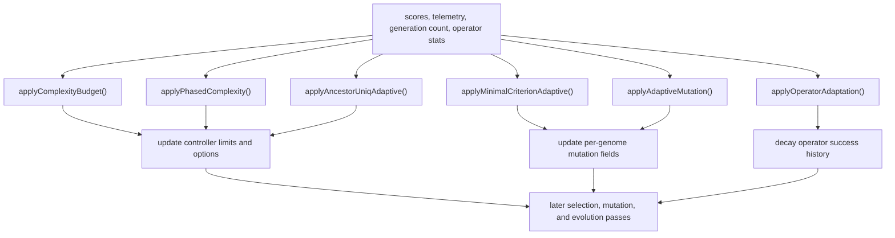
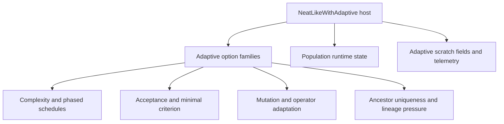

# neat/adaptive

Adaptive NEAT controllers for complexity, acceptance, lineage diversity,
and mutation-rate tuning.

Adaptive control is the NEAT controller's "change the rules while the run is
in flight" chapter. These helpers do not mutate one genome directly for the
sake of a single operator. Instead they watch population behavior over time
and adjust thresholds, budgets, or rates that later generations inherit.

Ownership boundary: these helpers are controller-owned policy overlays
layered on top of the evaluated population. Complexity budgets and lineage
tuning rewrite future controller options, while acceptance may rewrite the
current generation's score view for selection. None of these helpers change
canonical genome identity, compatibility distance, or replay semantics by
themselves.

The root chapter answers five practical controller questions:

- when should network complexity budgets grow, shrink, or flip phase?
- how should mutation intensity adapt as genomes succeed or stall?
- when should the acceptance bar move so weak genomes stop consuming budget?
- when should lineage-diversity telemetry feed back into controller options?
- how should operator success history decay so recent outcomes matter more?

The helper folders own the narrower heuristics:

- `complexity/` manages node and connection budget scheduling plus phased growth.
- `mutation/` manages per-genome mutation-rate tuning and operator-stat decay.
- `acceptance/` owns the adaptive minimal-criterion threshold logic.
- `lineage/` turns telemetry ancestry signals into diversity-pressure adjustments.
- `core/` keeps the shared adaptive host contract small enough to reuse.

Read this root chapter when you want the controller map of adaptive behavior:
which adaptive loops exist, what long-lived state they keep, and which later
stages of evolution they are meant to influence.



## neat/adaptive/adaptive.ts

### applyAdaptiveMutation

```ts
applyAdaptiveMutation(): void
```

Self-adaptive per-genome mutation tuning.

This function implements several strategies to adjust each genome's
internal mutation rate (`g._mutRate`) and optionally its mutation
amount (`g._mutAmount`) over time. Strategies include:
- `twoTier`: push top and bottom halves in opposite directions to
  create exploration/exploitation balance.
- `exploreLow`: preferentially increase mutation for lower-scoring
  genomes to promote exploration.
- `anneal`: gradually reduce mutation deltas over time.

The method reads `this.options.adaptiveMutation` for configuration
and mutates genomes in-place.

This is the adaptive controller that feeds most directly into the root
mutation chapter. Rather than choosing one operator itself, it adjusts each
genome's readiness for later mutation so the next structural-edit pass can be
more exploratory or more conservative depending on recent success.

Returns: Updates per-genome mutation-rate state in place when the current generation satisfies the adaptation cadence.

Example:

// configuration example:
// options.adaptiveMutation = { enabled: true, initialRate: 0.5, adaptEvery: 1, strategy: 'twoTier', minRate: 0.01, maxRate: 1 }
engine.applyAdaptiveMutation();

### applyAncestorUniqAdaptive

```ts
applyAncestorUniqAdaptive(): void
```

Adaptive adjustments based on ancestor uniqueness telemetry.

This helper inspects the most recent telemetry lineage block (if
available) for an `ancestorUniq` metric indicating how unique
ancestry is across the population. If ancestry uniqueness drifts
outside configured thresholds, the method will adjust either the
multi-objective dominance epsilon (if `mode === 'epsilon'`) or the
lineage pressure strength (if `mode === 'lineagePressure'`).

This makes the lineage controller the feedback bridge between telemetry and
future search policy. It does not rewrite the current population directly;
instead it nudges the options that govern how later multi-objective or
lineage-pressure decisions behave.

Typical usage: keep population lineage diversity within a healthy
band. Low ancestor uniqueness means too many genomes share ancestors
(risking premature convergence); high uniqueness might indicate
excessive divergence.

Returns: May update lineage-related controller options and record the most recent adjustment generation.

Example:

// Adjusts `options.multiObjective.dominanceEpsilon` when configured
engine.applyAncestorUniqAdaptive();

### applyComplexityBudget

```ts
applyComplexityBudget(): void
```

Apply complexity budget scheduling to the evolving population.

Use this controller when topology growth should be managed as a moving budget
instead of a fixed hard cap. The adaptive loop observes recent run progress
and rewrites the controller's complexity limits so later mutation and evolve
passes know how much structural growth they should allow.

This routine updates `this.options.maxNodes` (and optionally
`this.options.maxConns`) according to a configured complexity budget
strategy. Two modes are supported:

- `adaptive`: reacts to recent population improvement (or stagnation)
  by increasing or decreasing the current complexity cap using
  heuristics such as slope (linear trend) of recent best scores,
  novelty, and configured increase/stagnation factors.
- `linear` (default behaviour when not `adaptive`): linearly ramps
  the budget from `maxNodesStart` to `maxNodesEnd` over a horizon.

Internal state used/maintained on the `this` object:
- `_cbHistory`: rolling window of best scores used to compute trends.
- `_cbMaxNodes`: current complexity budget for nodes.
- `_cbMaxConns`: current complexity budget for connections (optional).

The important distinction is that this helper does not mutate genomes
directly. It mutates controller policy, so its effect is feed-forward into
later structural decisions rather than an immediate topology rewrite.

Returns: Updates `this.options.maxNodes` and possibly
`this.options.maxConns` in-place; no value is returned.

Example:

// inside a training loop where `engine` is your Neat instance:
engine.applyComplexityBudget();
// engine.options.maxNodes now holds the adjusted complexity cap

### applyMinimalCriterionAdaptive

```ts
applyMinimalCriterionAdaptive(): void
```

Apply adaptive minimal criterion (MC) acceptance.

This method maintains an MC threshold used to decide whether an
individual genome is considered acceptable. It adapts the threshold
based on the proportion of the population that meets the current
threshold, trying to converge to a target acceptance rate.

Use this controller when you want the population to earn the right to stay in
play. Unlike the complexity and lineage controllers, this one writes back to
the controller-visible score overlay on the current population immediately by
zeroing scores below the accepted bar. It therefore changes the selection
landscape for the same generation without redefining canonical fitness.

Behavior summary:
- Initializes `_mcThreshold` from configuration if undefined.
- Computes the proportion of genomes with score >= threshold.
- Adjusts threshold multiplicatively by `adjustRate` to move the
  observed proportion towards `targetAcceptance`.
- Sets `g.score = 0` as the controller-visible rejection overlay for genomes
  that fall below the final threshold — effectively rejecting them from
  selection.

Returns: Updates `_mcThreshold` over time and may zero out scores for currently rejected genomes.

Example:

// Example config snippet used by the engine
// options.minimalCriterionAdaptive = { enabled: true, initialThreshold: 0.1, targetAcceptance: 0.5, adjustRate: 0.1 }
engine.applyMinimalCriterionAdaptive();

### applyOperatorAdaptation

```ts
applyOperatorAdaptation(): void
```

Decay operator adaptation statistics (success/attempt counters).

Many adaptive operator-selection schemes keep running tallies of how
successful each operator has been. This helper applies an exponential
moving-average style decay to those counters so older outcomes
progressively matter less.

Use this controller when operator adaptation is enabled and you want the
mutation selector to favor recent evidence over stale wins from much earlier
generations. It is a policy-maintenance helper, not an operator chooser by
itself.

The `_operatorStats` map on `this` is expected to contain values of
the shape `{ success: number, attempts: number }` keyed by operator
id/name.

Returns: Decays `_operatorStats` in place so later mutation-method selection reflects more recent operator performance.

Example:

engine.applyOperatorAdaptation();

### applyPhasedComplexity

```ts
applyPhasedComplexity(): void
```

Toggle phased complexity mode between 'complexify' and 'simplify'.

Phased complexity supports alternating periods where the algorithm
is encouraged to grow (complexify) or shrink (simplify) network
structures. This can help escape local minima or reduce bloat.

Use this controller when one static mutation policy is not enough. Instead of
adjusting caps continuously like `applyComplexityBudget()`, this helper flips
the controller into a new structural mood and records when that phase began.

The current phase and its start generation are stored on `this` as
`_phase` and `_phaseStartGeneration` so the state persists across
generations.

Returns: Mutates `this._phase` and `this._phaseStartGeneration` so later mutation-selection code knows whether to favor growth or simplification.

Example:

// Called once per generation to update the phase state
engine.applyPhasedComplexity();

### NeatLikeWithAdaptive

Contract map for the adaptive helper boundary.

The adaptive subtree works because each policy chapter can stay focused on a
single feedback loop while still sharing one precise agreement about what it
may read, what it may rewrite, and which option family owns each tuning
decision. This file is that agreement.

Read the contracts in three passes:

- start with `NeatLikeWithAdaptive` to see the runtime host surface and the
  scratch fields adaptive controllers are allowed to maintain,
- continue with the exported `*Config` aliases to see how complexity,
  acceptance, mutation, operator adaptation, and lineage feedback each slice
  the broader options object,
- finish with `Genome`, `MutationSettings`, `MutationPartitions`, and
  `MutationOutcome` when you want the normalized working shapes used inside
  adaptive mutation helpers.

The matching defaults and mode labels live in `adaptive.core.constants.ts`.
This file stays focused on contracts so the generated chapter reads as a
bounded vocabulary map rather than a second controller implementation.


