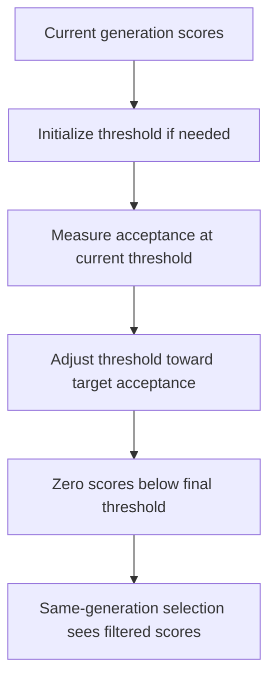

# neat/adaptive/acceptance

Acceptance-gating heuristics for adaptive NEAT.

This category focuses on the minimal-criterion threshold that decides when a
genome is good enough to stay in play, making it easier to study selection
pressure separately from topology growth or mutation schedules.

The acceptance controller answers a narrower question than the rest of the
adaptive subtree: not how much structure to allow or how strongly to mutate,
but how selective the current generation should be before selection starts
rewarding it.

Read this chapter when you want to understand:

- why adaptive acceptance rewrites the current generation instead of only
  adjusting future controller policy,
- how threshold initialization, acceptance measurement, threshold tuning, and
  rejection fit into one same-generation flow,
- where the public controller-facing entrypoint stops and the smaller
  minimal-criterion bookkeeping helpers begin.

The reading order is easiest to retain as one feedback loop:

1. seed the threshold if the run has not used acceptance pressure before,
2. snapshot the current generation's scores,
3. compare observed acceptance against the configured target band,
4. update the threshold and reject genomes that still fall short.



## neat/adaptive/acceptance/adaptive.acceptance.ts

### applyMinimalCriterionAdaptive

```ts
applyMinimalCriterionAdaptive(): void
```

Apply adaptive minimal criterion (MC) acceptance.

This method maintains an MC threshold used to decide whether an
individual genome is considered acceptable. It adapts the threshold
based on the proportion of the population that meets the current
threshold, trying to converge to a target acceptance rate.

Use this controller when you want the population to earn the right to stay in
play. Unlike the complexity and lineage controllers, this one writes back to
the current population immediately by zeroing scores below the accepted bar,
so it directly changes the selection landscape for the same generation.

Behavior summary:
- Initializes `_mcThreshold` from configuration if undefined.
- Computes the proportion of genomes with score >= threshold.
- Adjusts threshold multiplicatively by `adjustRate` to move the
  observed proportion towards `targetAcceptance`.
- Sets `g.score = 0` for genomes that fall below the final threshold
  — effectively rejecting them from selection.

Returns: Updates `_mcThreshold` over time and may zero out scores for currently rejected genomes.

Example:

// Example config snippet used by the engine
// options.minimalCriterionAdaptive = { enabled: true, initialThreshold: 0.1, targetAcceptance: 0.5, adjustRate: 0.1 }
engine.applyMinimalCriterionAdaptive();

### applyRejection

```ts
applyRejection(
  engine: NeatLikeWithAdaptive,
  threshold: number,
): void
```

Zero scores below the final threshold.

Rejection is the acceptance chapter's most direct intervention. Instead of
queuing a future policy change, it rewrites the current generation's scores so
the same selection pass immediately treats low-performing genomes as filtered
out.

Example:

```ts
const scores = collectScores(engine);
const acceptance = computeAcceptance(scores, engine._mcThreshold ?? 0);
updateThreshold(engine, acceptance, resolveTargetSettings(config));
applyRejection(engine, engine._mcThreshold ?? 0);
```

Parameters:
- `engine` - - NEAT engine instance.
- `threshold` - - Final MC threshold.

Returns: Nothing.

### collectScores

```ts
collectScores(
  engine: NeatLikeWithAdaptive,
): number[]
```

Collect population scores into a snapshot array.

The acceptance controller works from one stable view of the current
generation rather than mixing threshold updates with in-place rejection while
it is still counting. Missing scores are treated as zero so unevaluated or
explicitly rejected genomes remain part of the acceptance picture.

Parameters:
- `engine` - - NEAT engine instance.

Returns: Array of scores (missing scores treated as 0).

### computeAcceptance

```ts
computeAcceptance(
  scores: number[],
  threshold: number,
): number
```

Compute acceptance metrics for the current threshold.

Acceptance is deliberately reduced to one proportion: how much of the current
generation still clears the bar. That single number is enough for the caller
to decide whether the threshold is too lenient, too strict, or already close
enough to the configured target band.

Parameters:
- `scores` - - Population score snapshot.
- `threshold` - - Current MC threshold.

Returns: Acceptance proportion.

### initializeThreshold

```ts
initializeThreshold(
  engine: NeatLikeWithAdaptive,
  config: { enabled?: boolean | undefined; initialThreshold?: number | undefined; targetAcceptance?: number | undefined; adjustRate?: number | undefined; },
): void
```

Initialize MC threshold if missing.

Threshold initialization is lazy because many runs never enable adaptive
acceptance at all. The first invocation seeds the long-lived threshold, and
later generations reuse the updated value rather than restarting from the
original configuration each time.

Parameters:
- `engine` - - NEAT engine instance.
- `config` - - Minimal-criterion adaptive configuration.

Returns: Nothing.

### resolveTargetSettings

```ts
resolveTargetSettings(
  config: { enabled?: boolean | undefined; initialThreshold?: number | undefined; targetAcceptance?: number | undefined; adjustRate?: number | undefined; },
): { targetAcceptance: number; adjustRate: number; }
```

Resolve target acceptance and adjust rate settings.

This helper centralizes the defaulting rules so later threshold-updating code
can focus on policy instead of configuration fallback noise.

Parameters:
- `config` - - Minimal-criterion adaptive configuration.

Returns: Target settings.

### updateThreshold

```ts
updateThreshold(
  engine: NeatLikeWithAdaptive,
  acceptance: number,
  tuning: { targetAcceptance: number; adjustRate: number; },
): void
```

Update the MC threshold based on acceptance proportion.

The threshold only moves when observed acceptance drifts outside the target
band. Staying inside the band is treated as success, so the current threshold
persists and the controller avoids oscillating every generation.

Parameters:
- `engine` - - NEAT engine instance.
- `acceptance` - - Observed acceptance proportion.
- `tuning` - - Target acceptance and adjustment settings.

Returns: Nothing.

## neat/adaptive/acceptance/adaptive.minimal-criterion.utils.ts

Minimal-criterion helpers for adaptive acceptance.

This file owns the small evidence-to-threshold loop behind adaptive
acceptance. It stays separate from the root adaptive controller entrypoint so
the generated chapter can explain acceptance pressure as a readable pipeline
instead of burying the mechanics inside one long method.

The helper flow is intentionally compact:

1. ensure there is a starting threshold,
2. snapshot current scores,
3. measure how much of the population clears the bar,
4. retune the threshold and reject genomes that still miss it.

### initializeThreshold

```ts
initializeThreshold(
  engine: NeatLikeWithAdaptive,
  config: { enabled?: boolean | undefined; initialThreshold?: number | undefined; targetAcceptance?: number | undefined; adjustRate?: number | undefined; },
): void
```

Initialize MC threshold if missing.

Threshold initialization is lazy because many runs never enable adaptive
acceptance at all. The first invocation seeds the long-lived threshold, and
later generations reuse the updated value rather than restarting from the
original configuration each time.

Parameters:
- `engine` - - NEAT engine instance.
- `config` - - Minimal-criterion adaptive configuration.

Returns: Nothing.

### collectScores

```ts
collectScores(
  engine: NeatLikeWithAdaptive,
): number[]
```

Collect population scores into a snapshot array.

The acceptance controller works from one stable view of the current
generation rather than mixing threshold updates with in-place rejection while
it is still counting. Missing scores are treated as zero so unevaluated or
explicitly rejected genomes remain part of the acceptance picture.

Parameters:
- `engine` - - NEAT engine instance.

Returns: Array of scores (missing scores treated as 0).

### computeAcceptance

```ts
computeAcceptance(
  scores: number[],
  threshold: number,
): number
```

Compute acceptance metrics for the current threshold.

Acceptance is deliberately reduced to one proportion: how much of the current
generation still clears the bar. That single number is enough for the caller
to decide whether the threshold is too lenient, too strict, or already close
enough to the configured target band.

Parameters:
- `scores` - - Population score snapshot.
- `threshold` - - Current MC threshold.

Returns: Acceptance proportion.

### resolveTargetSettings

```ts
resolveTargetSettings(
  config: { enabled?: boolean | undefined; initialThreshold?: number | undefined; targetAcceptance?: number | undefined; adjustRate?: number | undefined; },
): { targetAcceptance: number; adjustRate: number; }
```

Resolve target acceptance and adjust rate settings.

This helper centralizes the defaulting rules so later threshold-updating code
can focus on policy instead of configuration fallback noise.

Parameters:
- `config` - - Minimal-criterion adaptive configuration.

Returns: Target settings.

### updateThreshold

```ts
updateThreshold(
  engine: NeatLikeWithAdaptive,
  acceptance: number,
  tuning: { targetAcceptance: number; adjustRate: number; },
): void
```

Update the MC threshold based on acceptance proportion.

The threshold only moves when observed acceptance drifts outside the target
band. Staying inside the band is treated as success, so the current threshold
persists and the controller avoids oscillating every generation.

Parameters:
- `engine` - - NEAT engine instance.
- `acceptance` - - Observed acceptance proportion.
- `tuning` - - Target acceptance and adjustment settings.

Returns: Nothing.

### applyRejection

```ts
applyRejection(
  engine: NeatLikeWithAdaptive,
  threshold: number,
): void
```

Zero scores below the final threshold.

Rejection is the acceptance chapter's most direct intervention. Instead of
queuing a future policy change, it rewrites the current generation's scores so
the same selection pass immediately treats low-performing genomes as filtered
out.

Example:

```ts
const scores = collectScores(engine);
const acceptance = computeAcceptance(scores, engine._mcThreshold ?? 0);
updateThreshold(engine, acceptance, resolveTargetSettings(config));
applyRejection(engine, engine._mcThreshold ?? 0);
```

Parameters:
- `engine` - - NEAT engine instance.
- `threshold` - - Final MC threshold.

Returns: Nothing.
