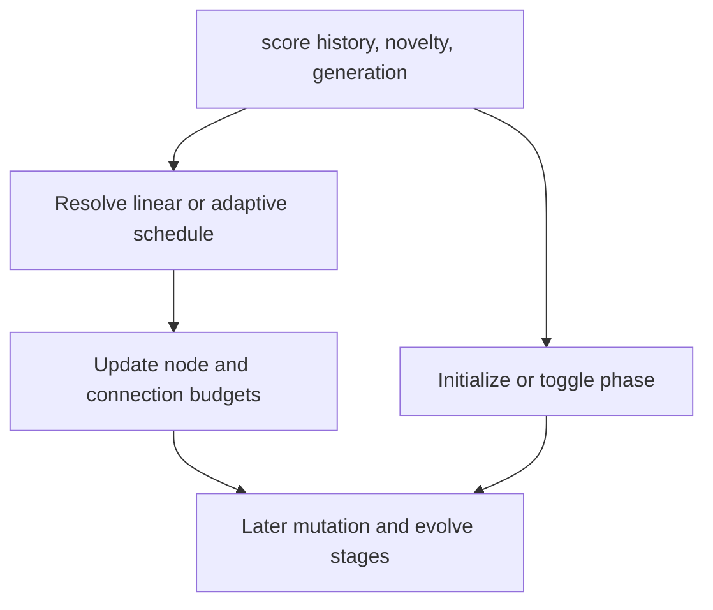

# neat/adaptive/complexity

Complexity-control heuristics for adaptive NEAT.

This category explains how the engine decides when to grow, pause, or shrink
network structure so learners can study budget scheduling separately from
mutation or lineage pressure.

The folder combines two related but distinct ideas:

- budget schedules answer how large the allowed topology should be,
- phase toggles answer whether the current mood favors growth or simplification.

Read this chapter when you want to understand:

- why adaptive complexity keeps a separate structural-budget vocabulary,
- how linear and trend-driven schedules differ,
- when novelty and score trends are allowed to expand the budget,
- how phase flips stay smaller than the broader schedule logic.

The reading order is easiest to retain in two steps:

1. start with `adaptive.complexity.utils.ts` for budget growth and shrink rules,
2. then read `adaptive.phases.utils.ts` for phase-state initialization and flips.



## neat/adaptive/complexity/adaptive.complexity.ts

### applyAdaptiveSchedule

```ts
applyAdaptiveSchedule(
  engine: NeatLikeWithAdaptive,
  config: { enabled?: boolean | undefined; mode?: string | undefined; improvementWindow?: number | undefined; increaseFactor?: number | undefined; stagnationFactor?: number | undefined; maxNodesStart?: number | undefined; maxNodesEnd?: number | undefined; minNodes?: number | undefined; maxConnsStart?: number | undefined; maxConnsEnd?: number | undefined; horizon?: number | undefined; },
): void
```

Apply adaptive complexity budget scheduling.

The adaptive schedule is the evidence-driven branch. It watches recent best
scores, slope, and novelty pressure, then expands or contracts structural
budgets so later mutation passes can respond to genuine search progress
rather than following a fixed calendar.

Parameters:
- `engine` - - NEAT engine instance with adaptive state.
- `config` - - Complexity budget configuration.

Returns: Nothing.

### applyComplexityBudgetSchedule

```ts
applyComplexityBudgetSchedule(
  engine: NeatLikeWithAdaptive,
  config: { enabled?: boolean | undefined; mode?: string | undefined; improvementWindow?: number | undefined; increaseFactor?: number | undefined; stagnationFactor?: number | undefined; maxNodesStart?: number | undefined; maxNodesEnd?: number | undefined; minNodes?: number | undefined; maxConnsStart?: number | undefined; maxConnsEnd?: number | undefined; horizon?: number | undefined; },
): void
```

Apply the complexity budget schedule for the configured mode.

This is the main dispatcher for the complexity subtree. It keeps the public
entrypoint easy to scan by delegating immediately into either the adaptive
schedule or the linear schedule, depending on the configured policy.

Parameters:
- `engine` - - NEAT engine instance.
- `config` - - Complexity budget configuration.

Returns: Nothing.

### applyLinearSchedule

```ts
applyLinearSchedule(
  engine: NeatLikeWithAdaptive,
  config: { enabled?: boolean | undefined; mode?: string | undefined; improvementWindow?: number | undefined; increaseFactor?: number | undefined; stagnationFactor?: number | undefined; maxNodesStart?: number | undefined; maxNodesEnd?: number | undefined; minNodes?: number | undefined; maxConnsStart?: number | undefined; maxConnsEnd?: number | undefined; horizon?: number | undefined; },
): void
```

Apply linear complexity budget scheduling.

The linear schedule is the deterministic counterpart to the adaptive mode.
It ignores run-time improvement signals and simply interpolates between a
start and end budget across a configured horizon.

Parameters:
- `engine` - - NEAT engine instance.
- `config` - - Complexity budget configuration.

Returns: Nothing.

### initializePhaseState

```ts
initializePhaseState(
  engine: NeatLikeWithAdaptive,
  config: { enabled?: boolean | undefined; phases?: { generation: number; maxNodes?: number | undefined; maxConns?: number | undefined; }[] | undefined; phaseLength?: number | undefined; initialPhase?: string | undefined; },
): void
```

Ensure phase state is initialized.

Phase initialization is intentionally lazy so controllers that never enable
phased complexity do not pay for extra runtime state. Once seeded, the phase
and its start generation persist across later evolve calls.

Parameters:
- `engine` - - NEAT engine instance.
- `config` - - Phased complexity configuration.

Returns: Nothing.

### togglePhaseIfNeeded

```ts
togglePhaseIfNeeded(
  engine: NeatLikeWithAdaptive,
  config: { enabled?: boolean | undefined; phases?: { generation: number; maxNodes?: number | undefined; maxConns?: number | undefined; }[] | undefined; phaseLength?: number | undefined; initialPhase?: string | undefined; },
): void
```

Toggle phase if the current phase has exceeded its length.

The phase helper only flips when the configured duration has actually elapsed.
That keeps the structural mood stable long enough for later mutation and
pruning passes to express it for several generations before the controller
switches direction.

Parameters:
- `engine` - - NEAT engine instance.
- `config` - - Phased complexity configuration.

Returns: Nothing.

## neat/adaptive/complexity/adaptive.phases.utils.ts

Phase helpers for adaptive complexity mode.

These helpers keep the phase story intentionally small: initialize the first
structural mood, watch elapsed generations, then flip between complexify and
simplify when the configured window expires.

### initializePhaseState

```ts
initializePhaseState(
  engine: NeatLikeWithAdaptive,
  config: { enabled?: boolean | undefined; phases?: { generation: number; maxNodes?: number | undefined; maxConns?: number | undefined; }[] | undefined; phaseLength?: number | undefined; initialPhase?: string | undefined; },
): void
```

Ensure phase state is initialized.

Phase initialization is intentionally lazy so controllers that never enable
phased complexity do not pay for extra runtime state. Once seeded, the phase
and its start generation persist across later evolve calls.

Parameters:
- `engine` - - NEAT engine instance.
- `config` - - Phased complexity configuration.

Returns: Nothing.

### resolveNextPhase

```ts
resolveNextPhase(
  currentPhase: string,
): string
```

Resolve next phase name.

The phase cycle is intentionally binary so the controller can alternate
between growth and simplification without inventing additional intermediate
moods here.

Parameters:
- `currentPhase` - - Current phase label.

Returns: Next phase label.

### togglePhaseIfNeeded

```ts
togglePhaseIfNeeded(
  engine: NeatLikeWithAdaptive,
  config: { enabled?: boolean | undefined; phases?: { generation: number; maxNodes?: number | undefined; maxConns?: number | undefined; }[] | undefined; phaseLength?: number | undefined; initialPhase?: string | undefined; },
): void
```

Toggle phase if the current phase has exceeded its length.

The phase helper only flips when the configured duration has actually elapsed.
That keeps the structural mood stable long enough for later mutation and
pruning passes to express it for several generations before the controller
switches direction.

Parameters:
- `engine` - - NEAT engine instance.
- `config` - - Phased complexity configuration.

Returns: Nothing.

## neat/adaptive/complexity/adaptive.complexity.utils.ts

Schedule helpers for adaptive complexity budgets.

This file owns the trend-driven and linear rules that convert recent run
evidence into controller-level node and connection caps. It stays separate
from the phase helpers because schedule logic answers "how large may the
topology grow?" while phase logic answers "which structural mood is active?"

The schedule pipeline is intentionally compact:

1. record recent best-score history,
2. derive trend and novelty signals,
3. resolve adaptive or linear budget updates,
4. clamp the result back onto controller state.

### adjustConnectionBudget

```ts
adjustConnectionBudget(
  engine: NeatLikeWithAdaptive,
  config: { enabled?: boolean | undefined; mode?: string | undefined; improvementWindow?: number | undefined; increaseFactor?: number | undefined; stagnationFactor?: number | undefined; maxNodesStart?: number | undefined; maxNodesEnd?: number | undefined; minNodes?: number | undefined; maxConnsStart?: number | undefined; maxConnsEnd?: number | undefined; horizon?: number | undefined; },
  trends: { improvement: number; slope: number; },
  factors: { increaseFactor: number; stagnationFactor: number; },
  noveltyFactor: number,
  history: number[],
): void
```

Adjust connection budget based on trends and factors.

Connection-budget adjustment mirrors the node-budget path so both structural
ceilings respond coherently to the same improvement and stagnation signals.

Parameters:
- `engine` - - NEAT engine instance.
- `config` - - Complexity budget configuration.
- `trends` - - Improvement and slope metrics.
- `factors` - - Adjustment factors.
- `noveltyFactor` - - Novelty multiplier.
- `history` - - Rolling history for window checks.

Returns: Nothing.

### adjustNodeBudget

```ts
adjustNodeBudget(
  engine: NeatLikeWithAdaptive,
  config: { enabled?: boolean | undefined; mode?: string | undefined; improvementWindow?: number | undefined; increaseFactor?: number | undefined; stagnationFactor?: number | undefined; maxNodesStart?: number | undefined; maxNodesEnd?: number | undefined; minNodes?: number | undefined; maxConnsStart?: number | undefined; maxConnsEnd?: number | undefined; horizon?: number | undefined; },
  trends: { improvement: number; slope: number; },
  factors: { increaseFactor: number; stagnationFactor: number; },
  noveltyFactor: number,
  history: number[],
): void
```

Adjust node budget based on trends and factors.

Node-budget adjustment is where the adaptive policy becomes concrete. When
improvement or positive slope is present, the helper expands the budget up to
the configured ceiling; when the observation window is full and the search is
flat, it contracts back toward the configured minimum.

Parameters:
- `engine` - - NEAT engine instance.
- `config` - - Complexity budget configuration.
- `trends` - - Improvement and slope metrics.
- `factors` - - Adjustment factors.
- `noveltyFactor` - - Novelty multiplier.
- `history` - - Rolling history for window checks.

### applyAdaptiveSchedule

```ts
applyAdaptiveSchedule(
  engine: NeatLikeWithAdaptive,
  config: { enabled?: boolean | undefined; mode?: string | undefined; improvementWindow?: number | undefined; increaseFactor?: number | undefined; stagnationFactor?: number | undefined; maxNodesStart?: number | undefined; maxNodesEnd?: number | undefined; minNodes?: number | undefined; maxConnsStart?: number | undefined; maxConnsEnd?: number | undefined; horizon?: number | undefined; },
): void
```

Apply adaptive complexity budget scheduling.

The adaptive schedule is the evidence-driven branch. It watches recent best
scores, slope, and novelty pressure, then expands or contracts structural
budgets so later mutation passes can respond to genuine search progress
rather than following a fixed calendar.

Parameters:
- `engine` - - NEAT engine instance with adaptive state.
- `config` - - Complexity budget configuration.

Returns: Nothing.

### applyComplexityBudgetSchedule

```ts
applyComplexityBudgetSchedule(
  engine: NeatLikeWithAdaptive,
  config: { enabled?: boolean | undefined; mode?: string | undefined; improvementWindow?: number | undefined; increaseFactor?: number | undefined; stagnationFactor?: number | undefined; maxNodesStart?: number | undefined; maxNodesEnd?: number | undefined; minNodes?: number | undefined; maxConnsStart?: number | undefined; maxConnsEnd?: number | undefined; horizon?: number | undefined; },
): void
```

Apply the complexity budget schedule for the configured mode.

This is the main dispatcher for the complexity subtree. It keeps the public
entrypoint easy to scan by delegating immediately into either the adaptive
schedule or the linear schedule, depending on the configured policy.

Parameters:
- `engine` - - NEAT engine instance.
- `config` - - Complexity budget configuration.

Returns: Nothing.

### applyLinearSchedule

```ts
applyLinearSchedule(
  engine: NeatLikeWithAdaptive,
  config: { enabled?: boolean | undefined; mode?: string | undefined; improvementWindow?: number | undefined; increaseFactor?: number | undefined; stagnationFactor?: number | undefined; maxNodesStart?: number | undefined; maxNodesEnd?: number | undefined; minNodes?: number | undefined; maxConnsStart?: number | undefined; maxConnsEnd?: number | undefined; horizon?: number | undefined; },
): void
```

Apply linear complexity budget scheduling.

The linear schedule is the deterministic counterpart to the adaptive mode.
It ignores run-time improvement signals and simply interpolates between a
start and end budget across a configured horizon.

Parameters:
- `engine` - - NEAT engine instance.
- `config` - - Complexity budget configuration.

Returns: Nothing.

### clampNodeBudget

```ts
clampNodeBudget(
  engine: NeatLikeWithAdaptive,
  config: { enabled?: boolean | undefined; mode?: string | undefined; improvementWindow?: number | undefined; increaseFactor?: number | undefined; stagnationFactor?: number | undefined; maxNodesStart?: number | undefined; maxNodesEnd?: number | undefined; minNodes?: number | undefined; maxConnsStart?: number | undefined; maxConnsEnd?: number | undefined; horizon?: number | undefined; },
): void
```

Clamp node budget to configured minimum.

This final guard keeps the adaptive loop from shrinking below the smallest
topology the controller can reasonably support.

Parameters:
- `engine` - - NEAT engine instance.
- `config` - - Complexity budget configuration.

Returns: Nothing.

### computeAdjustmentFactors

```ts
computeAdjustmentFactors(
  config: { enabled?: boolean | undefined; mode?: string | undefined; improvementWindow?: number | undefined; increaseFactor?: number | undefined; stagnationFactor?: number | undefined; maxNodesStart?: number | undefined; maxNodesEnd?: number | undefined; minNodes?: number | undefined; maxConnsStart?: number | undefined; maxConnsEnd?: number | undefined; horizon?: number | undefined; },
  trends: { improvement: number; slope: number; },
  history: number[],
): { increaseFactor: number; stagnationFactor: number; }
```

Compute adjustment factors for budget growth and decay.

These factors translate raw trend signals into multiplicative budget updates.
Positive normalized slope boosts growth pressure, while negative slope makes
stagnation shrinkage more aggressive.

Parameters:
- `config` - - Complexity budget configuration.
- `trends` - - Improvement and slope metrics.
- `history` - - Rolling history of best scores.

Returns: Adjustment factors (increase and stagnation multipliers).

### computeNoveltyFactor

```ts
computeNoveltyFactor(
  engine: NeatLikeWithAdaptive,
): number
```

Compute novelty factor based on archive size.

Novelty acts as a small confidence signal for structural growth. A larger
novelty archive implies the search is still exploring enough distinct
behavior to justify the default growth multiplier.

Parameters:
- `engine` - - NEAT engine instance.

Returns: Novelty multiplier (0.9 if archive small, 1.0 otherwise).

### computeSlope

```ts
computeSlope(
  history: number[],
): number
```

Compute linear regression slope using ordinary least squares.

Parameters:
- `history` - - Rolling history of best scores.

Returns: OLS slope estimate.

### computeTrends

```ts
computeTrends(
  history: number[],
): { improvement: number; slope: number; }
```

Compute improvement and slope trends from score history.

Improvement answers whether the window ended above where it started; slope
answers how strongly the trajectory points upward or downward across the
window as a whole. The adaptive scheduler uses both so it can distinguish a
noisy plateau from sustained progress.

Parameters:
- `history` - - Rolling history of best scores.

Returns: Trend metrics (improvement and slope).

### initializeConnectionBudget

```ts
initializeConnectionBudget(
  engine: NeatLikeWithAdaptive,
  config: { enabled?: boolean | undefined; mode?: string | undefined; improvementWindow?: number | undefined; increaseFactor?: number | undefined; stagnationFactor?: number | undefined; maxNodesStart?: number | undefined; maxNodesEnd?: number | undefined; minNodes?: number | undefined; maxConnsStart?: number | undefined; maxConnsEnd?: number | undefined; horizon?: number | undefined; },
): void
```

Initialize connection budget if undefined.

Connection budgets are optional, so the helper only seeds this state when the
configuration explicitly opts into a connection-cap schedule.

Parameters:
- `engine` - - NEAT engine instance.
- `config` - - Complexity budget configuration.

Returns: Nothing.

### initializeNodeBudget

```ts
initializeNodeBudget(
  engine: NeatLikeWithAdaptive,
  config: { enabled?: boolean | undefined; mode?: string | undefined; improvementWindow?: number | undefined; increaseFactor?: number | undefined; stagnationFactor?: number | undefined; maxNodesStart?: number | undefined; maxNodesEnd?: number | undefined; minNodes?: number | undefined; maxConnsStart?: number | undefined; maxConnsEnd?: number | undefined; horizon?: number | undefined; },
): void
```

Initialize node budget if undefined.

Parameters:
- `engine` - - NEAT engine instance.
- `config` - - Complexity budget configuration.

### normalizeSlope

```ts
normalizeSlope(
  slope: number,
  initialScore: number,
): number
```

Normalize slope magnitude relative to initial score.

Parameters:
- `slope` - - Raw OLS slope.
- `initialScore` - - First score in history window.

Returns: Normalized slope clamped to [-2, 2].

### updateScoreHistory

```ts
updateScoreHistory(
  engine: NeatLikeWithAdaptive,
  config: { enabled?: boolean | undefined; mode?: string | undefined; improvementWindow?: number | undefined; increaseFactor?: number | undefined; stagnationFactor?: number | undefined; maxNodesStart?: number | undefined; maxNodesEnd?: number | undefined; minNodes?: number | undefined; maxConnsStart?: number | undefined; maxConnsEnd?: number | undefined; horizon?: number | undefined; },
): number[]
```

Update rolling score history with current best score.

Score history is the minimum evidence the adaptive scheduler needs in order
to talk about improvement or stagnation. The helper keeps that history bounded
to the configured window so later slope and delta calculations stay local to
recent generations.

Parameters:
- `engine` - - NEAT engine instance.
- `config` - - Complexity budget configuration.

Returns: Rolling history array after update.
