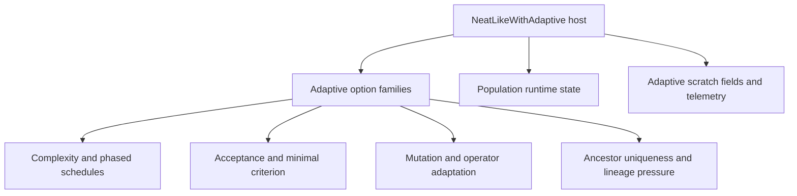

# neat/adaptive/core

Contract map for the adaptive helper boundary.

The adaptive subtree works because each policy chapter can stay focused on a
single feedback loop while still sharing one precise agreement about what it
may read, what it may rewrite, and which option family owns each tuning
decision. This file is that agreement.

Read the contracts in three passes:

- start with `NeatLikeWithAdaptive` to see the runtime host surface and the
  scratch fields adaptive controllers are allowed to maintain,
- continue with the exported `*Config` aliases to see how complexity,
  acceptance, mutation, operator adaptation, and lineage feedback each slice
  the broader options object,
- finish with `Genome`, `MutationSettings`, `MutationPartitions`, and
  `MutationOutcome` when you want the normalized working shapes used inside
  adaptive mutation helpers.

The matching defaults and mode labels live in `adaptive.core.constants.ts`.
This file stays focused on contracts so the generated chapter reads as a
bounded vocabulary map rather than a second controller implementation.

## neat/adaptive/core/adaptive.core.types.ts

### NeatLikeWithAdaptive

Contract map for the adaptive helper boundary.

The adaptive subtree works because each policy chapter can stay focused on a
single feedback loop while still sharing one precise agreement about what it
may read, what it may rewrite, and which option family owns each tuning
decision. This file is that agreement.

Read the contracts in three passes:

- start with `NeatLikeWithAdaptive` to see the runtime host surface and the
  scratch fields adaptive controllers are allowed to maintain,
- continue with the exported `*Config` aliases to see how complexity,
  acceptance, mutation, operator adaptation, and lineage feedback each slice
  the broader options object,
- finish with `Genome`, `MutationSettings`, `MutationPartitions`, and
  `MutationOutcome` when you want the normalized working shapes used inside
  adaptive mutation helpers.

The matching defaults and mode labels live in `adaptive.core.constants.ts`.
This file stays focused on contracts so the generated chapter reads as a
bounded vocabulary map rather than a second controller implementation.

### ComplexityBudgetConfig

Shared config view for complexity-budget helpers.

Use this alias when a helper only cares about node and connection caps,
schedule shape, and improvement-window tuning for the adaptive budget loop.
It is the smallest view needed for the controller that grows or shrinks the
allowed topology budget over time.

### PhasedComplexityConfig

Shared config view for phased-complexity helpers.

This isolates the alternating complexify/simplify schedule from the broader
adaptive options object so phase-oriented helpers can stay narrow and think
in terms of mode transitions instead of the entire adaptive policy surface.

### MinimalCriterionAdaptiveConfig

Shared config view for adaptive minimal-criterion helpers.

Helpers use this slice when they are only adjusting the acceptance
threshold, not inspecting the rest of the controller policy surface. This is
the acceptance-side tuning vocabulary, not a whole-population runtime view.

### AncestorUniqAdaptiveConfig

Shared config view for ancestor-uniqueness feedback helpers.

This captures the thresholds, cooldowns, and mode switches used when the
controller nudges diversity pressure in response to lineage concentration.
Read it as the lineage-feedback slice of the broader adaptive options object.

### AdaptiveMutationConfig

Shared config view for per-genome adaptive mutation helpers.

The mutation adaptation loop reads this slice to clamp rates, normalize
perturbation scales, and decide how often genome-local parameters are
refreshed. It is the mutation-side policy vocabulary before defaults are
resolved into `MutationSettings`.

### OperatorAdaptationConfig

Shared config view for operator-stat adaptation helpers.

This is the policy surface for helpers that bias mutation-operator choice
using historical success and attempt statistics. It stays separate from the
broader adaptive mutation config because operator-choice decay is a different
feedback loop from per-genome rate tuning.

### MutationSettings

Normalized adaptive-mutation settings after config fallback resolution.

This is the working form used after helpers merge user options with shared
defaults, so downstream logic does not need to repeatedly re-interpret
optional config fields. Read it as the mutation chapter's resolved call
frame: one object with every clamp, sigma, strategy, and baseline already in
concrete form.

### MutationOutcome

Outcome flags used to detect whether mutation pressure stayed balanced.

Mutation adaptation uses this tiny result object to summarize whether recent
adjustments produced both upward and downward movement rather than collapsing
into one-sided pressure.

### MutationPartitions

Score-ranked population halves used by two-tier and explore-low strategies.

This keeps the mutation strategies' working partitions explicit so helpers
can talk about "top half" and "bottom half" without recomputing or loosely
describing that split.

### Genome

Shared genome view used by the adaptive helpers.

This is intentionally opaque beyond the adaptive scratch fields already
exposed through `NeatLikeWithAdaptive['population']`. The adaptive core cares
about per-genome scores and adaptive overrides, not full network structure.

## neat/adaptive/core/adaptive.core.ts

Index and reading map for the adaptive shared-vocabulary chapter.

This file is intentionally thin. It does not define one more adaptive
control loop; it points the rest of the subtree at the shared language that
complexity, acceptance, mutation, and lineage helpers all reuse.

Read this chapter when you want the shortest route into `adaptive/core/`:

1. start with `adaptive.core.types.ts` to see the host contract, option
   slices, and normalized working shapes,
2. use the re-exported aliases in this file as the public index into that
   contract map,
3. finish with `adaptive.core.constants.ts` for the defaults, labels, and
   guard rails that keep those adaptive loops speaking one vocabulary.

Think of this file as the chapter's table of contents. The deeper semantics
live in the types and constants files; this surface exists so downstream
helpers can import one stable adaptive vocabulary from a single place.

### AdaptiveMutationConfig

Shared config view for per-genome adaptive mutation helpers.

The mutation adaptation loop reads this slice to clamp rates, normalize
perturbation scales, and decide how often genome-local parameters are
refreshed. It is the mutation-side policy vocabulary before defaults are
resolved into `MutationSettings`.

### AncestorUniqAdaptiveConfig

Shared config view for ancestor-uniqueness feedback helpers.

This captures the thresholds, cooldowns, and mode switches used when the
controller nudges diversity pressure in response to lineage concentration.
Read it as the lineage-feedback slice of the broader adaptive options object.

### ComplexityBudgetConfig

Shared config view for complexity-budget helpers.

Use this alias when a helper only cares about node and connection caps,
schedule shape, and improvement-window tuning for the adaptive budget loop.
It is the smallest view needed for the controller that grows or shrinks the
allowed topology budget over time.

### Genome

Shared genome view used by the adaptive helpers.

This is intentionally opaque beyond the adaptive scratch fields already
exposed through `NeatLikeWithAdaptive['population']`. The adaptive core cares
about per-genome scores and adaptive overrides, not full network structure.

### MinimalCriterionAdaptiveConfig

Shared config view for adaptive minimal-criterion helpers.

Helpers use this slice when they are only adjusting the acceptance
threshold, not inspecting the rest of the controller policy surface. This is
the acceptance-side tuning vocabulary, not a whole-population runtime view.

### MutationOutcome

Outcome flags used to detect whether mutation pressure stayed balanced.

Mutation adaptation uses this tiny result object to summarize whether recent
adjustments produced both upward and downward movement rather than collapsing
into one-sided pressure.

### MutationPartitions

Score-ranked population halves used by two-tier and explore-low strategies.

This keeps the mutation strategies' working partitions explicit so helpers
can talk about "top half" and "bottom half" without recomputing or loosely
describing that split.

### MutationSettings

Normalized adaptive-mutation settings after config fallback resolution.

This is the working form used after helpers merge user options with shared
defaults, so downstream logic does not need to repeatedly re-interpret
optional config fields. Read it as the mutation chapter's resolved call
frame: one object with every clamp, sigma, strategy, and baseline already in
concrete form.

### NeatLikeWithAdaptive

Contract map for the adaptive helper boundary.

The adaptive subtree works because each policy chapter can stay focused on a
single feedback loop while still sharing one precise agreement about what it
may read, what it may rewrite, and which option family owns each tuning
decision. This file is that agreement.

Read the contracts in three passes:

- start with `NeatLikeWithAdaptive` to see the runtime host surface and the
  scratch fields adaptive controllers are allowed to maintain,
- continue with the exported `*Config` aliases to see how complexity,
  acceptance, mutation, operator adaptation, and lineage feedback each slice
  the broader options object,
- finish with `Genome`, `MutationSettings`, `MutationPartitions`, and
  `MutationOutcome` when you want the normalized working shapes used inside
  adaptive mutation helpers.

The matching defaults and mode labels live in `adaptive.core.constants.ts`.
This file stays focused on contracts so the generated chapter reads as a
bounded vocabulary map rather than a second controller implementation.

### OperatorAdaptationConfig

Shared config view for operator-stat adaptation helpers.

This is the policy surface for helpers that bias mutation-operator choice
using historical success and attempt statistics. It stays separate from the
broader adaptive mutation config because operator-choice decay is a different
feedback loop from per-genome rate tuning.

### PhasedComplexityConfig

Shared config view for phased-complexity helpers.

This isolates the alternating complexify/simplify schedule from the broader
adaptive options object so phase-oriented helpers can stay narrow and think
in terms of mode transitions instead of the entire adaptive policy surface.

## neat/adaptive/core/adaptive.core.constants.ts

Shared defaults, labels, and numeric guard rails for the adaptive subtree.

The adaptive chapters reuse this file so they can talk about policy with one
stable vocabulary for thresholds, strategy names, phase labels, and fallback
numbers instead of redefining those values inline.

Read this after the contract map in `adaptive.core.types.ts`. The types file
answers "which knobs and scratch fields exist?" while this file answers
"what should those knobs and scratch fields default to when the caller does
not override them?"

Read the exports as four families rather than one long constant shelf:

- tiny numeric helpers such as `ZERO`, `ONE`, and `NEGATIVE_ONE` keep the
  utility math explicit without scattering magic numbers,
- schedule defaults such as `DEFAULT_IMPROVEMENT_WINDOW`,
  `DEFAULT_CB_INCREASE_FACTOR`, and `PHASE_LENGTH_DEFAULT` shape how quickly
  adaptive controllers react,
- mode labels such as `COMPLEXITY_MODE_ADAPTIVE`, `PHASE_COMPLEXIFY`, and
  `MUTATION_STRATEGY_ANNEAL` give the helper files one shared vocabulary,
- clamp and multiplier values define the safe operating envelope for
  acceptance tuning, lineage pressure, and mutation adaptation.

The goal is not to memorize every export. The goal is to see that the
adaptive subtree reuses one glossary for tiny math helpers, schedule timing,
mode names, and safety clamps instead of scattering unrelated literals across
each control loop.

### ZERO

Zero baseline reused by tiny adaptive arithmetic helpers.

### ONE

Unit baseline reused by clamp, ratio, and fallback calculations.

### TWO

Small divisor and offset used by split and normalization helpers.

### THREE

Small threshold used by helpers that need a minimal multi-sample floor.

### FOUR

Small multiplier reused by adaptive-budget growth defaults.

### FIVE

Small count baseline reused by archive-size and cooldown defaults.

### TEN

Round-number default reused by windows and phase lengths.

### ONE_HUNDRED

Large round-number default for long-horizon scheduling.

### NEGATIVE_ONE

Last-index sentinel reused when helpers need the final recorded item.

### DEFAULT_IMPROVEMENT_WINDOW

Default score-history window for trend-aware complexity budgeting.

### HISTORY_MIN_IMPROVEMENT_COUNT

Minimum history length to compute improvement.

### HISTORY_MIN_SLOPE_COUNT

Minimum history length to compute slope.

### DEFAULT_CB_INCREASE_FACTOR

Default multiplier used when adaptive complexity budgeting detects improvement.

### DEFAULT_CB_STAGNATION_FACTOR

Default multiplier used when adaptive complexity budgeting responds to stagnation.

### SLOPE_BOOST_MULTIPLIER

Slope boost multiplier for adaptive increase factor.

### SLOPE_PENALTY_MULTIPLIER

Slope penalty multiplier for stagnation factor.

### SLOPE_NORMALIZE_CLAMP

Clamp magnitude for slope normalization.

### NOVELTY_ARCHIVE_MIN_SIZE

Novelty archive minimum size.

### NOVELTY_FACTOR_SMALL

Novelty factor when archive is small.

### NOVELTY_FACTOR_DEFAULT

Novelty factor when archive is sufficient.

### MINIMAL_TOPOLOGY_OFFSET

Offset added to input/output for minimal topology.

### BUDGET_GROWTH_MULTIPLIER

Default budget growth multiplier.

### LINEAR_HORIZON_DEFAULT

Default horizon for linear schedule.

### PROGRESS_RATIO_MAX

Maximum progress ratio for scheduling.

### PHASE_LENGTH_DEFAULT

Default phase length in generations for phased complexify/simplify schedules.

### TARGET_ACCEPTANCE_DEFAULT

Default acceptance target for adaptive minimal-criterion control.

### ADJUST_RATE_DEFAULT

Default adjustment step for adaptive minimal-criterion threshold updates.

### ACCEPTANCE_UPPER_MULTIPLIER

Upper multiplier used when the controller nudges acceptance pressure upward.

### ACCEPTANCE_LOWER_MULTIPLIER

Lower multiplier used when the controller relaxes acceptance pressure.

### DENOMINATOR_FALLBACK

Fallback denominator to avoid divide-by-zero.

### OPERATOR_DECAY_DEFAULT

Default operator decay factor.

### COMPLEXITY_MODE_ADAPTIVE

Mode label for feedback-driven complexity-budget scheduling.

### COMPLEXITY_MODE_LINEAR

Mode label for pre-planned linear complexity-budget scheduling.

### PHASE_COMPLEXIFY

Phase label for the structure-growth side of phased complexity.

### PHASE_SIMPLIFY

Phase label for the structure-pruning side of phased complexity.

### ANCESTOR_UNIQ_MODE_EPSILON

Mode label for epsilon-style ancestor-uniqueness feedback.

### ANCESTOR_UNIQ_MODE_LINEAGE_PRESSURE

Mode label for ancestor-uniqueness control via lineage-pressure tuning.

### LINEAGE_PRESSURE_MODE_SPREAD

Lineage pressure spread mode.

### DEFAULT_ANCESTOR_UNIQ_COOLDOWN

Default cooldown (generations) for ancestor-uniqueness adjustments.

### DEFAULT_ANCESTOR_UNIQ_LOW_THRESHOLD

Default lower bound for acceptable ancestor uniqueness.

### DEFAULT_ANCESTOR_UNIQ_HIGH_THRESHOLD

Default upper bound for acceptable ancestor uniqueness.

### DEFAULT_ANCESTOR_UNIQ_ADJUST

Default adjustment magnitude for uniqueness nudges.

### DEFAULT_LINEAGE_PRESSURE_STRENGTH

Default lineage pressure strength when initializing the option.

### LINEAGE_PRESSURE_INCREASE_MULTIPLIER

Multiplier when increasing lineage pressure strength.

### LINEAGE_PRESSURE_DECREASE_MULTIPLIER

Multiplier when decreasing lineage pressure strength.

### DEFAULT_ADAPT_EVERY

Default cadence for refreshing per-genome adaptive mutation settings.

### DEFAULT_MUTATION_SIGMA

Default perturbation spread for adaptive mutation-rate updates.

### MUTATION_SIGMA_SCALE

Scale applied to mutation sigma for perturbations.

### DEFAULT_MIN_MUTATION_RATE

Default lower clamp for per-genome adaptive mutation rates.

### DEFAULT_MAX_MUTATION_RATE

Default upper clamp for per-genome adaptive mutation rates.

### DEFAULT_INITIAL_MUTATION_RATE

Default initial mutation rate used before adaptive balancing specializes genomes.

### DEFAULT_MUTATION_AMOUNT

Default mutation amount when genome value is missing.

### DEFAULT_MUTATION_AMOUNT_SIGMA

Default perturbation spread for adaptive mutation-amount updates.

### DEFAULT_MIN_MUTATION_AMOUNT

Default minimum mutation amount.

### DEFAULT_MAX_MUTATION_AMOUNT

Default maximum mutation amount.

### RNG_SPREAD_MULTIPLIER

Random range multiplier for signed deltas.

### RNG_CENTER_OFFSET

Random offset for signed deltas.

### EXPLORE_LOW_INCREASE_MULTIPLIER

Multiplicative boost for explore-low strategy (bottom half).

### EXPLORE_LOW_DECREASE_MULTIPLIER

Multiplicative decay for explore-low strategy (top half).

### ANNEAL_BASELINE_GENERATIONS

Baseline generations for annealing progress.

### ANNEAL_PROGRESS_MAX

Maximum progress ratio used in annealing.

### HALF_INDEX_DIVISOR

Divisor used to split populations in half.

### MUTATION_STRATEGY_TWO_TIER

Strategy label for ranking-sensitive two-tier adaptive mutation.

### MUTATION_STRATEGY_EXPLORE_LOW

Strategy label for boosting structural risk on the lower-ranked half.

### MUTATION_STRATEGY_ANNEAL

Strategy label for annealed mutation pressure across run progress.
