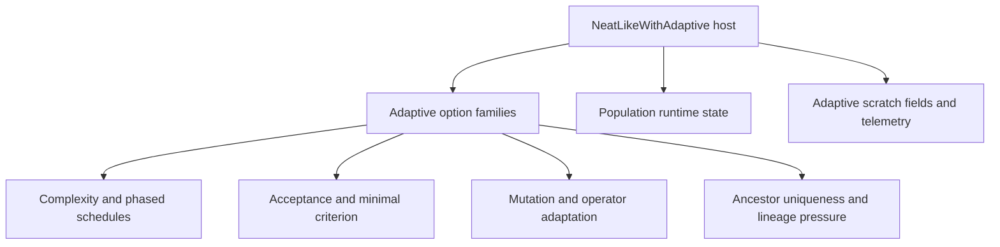

# neat/adaptive/core

Shared host and config contracts for the adaptive helper boundary.

The adaptive subtree works because each policy chapter can stay focused on a
single feedback loop while still speaking one consistent language about the
controller state it is allowed to read or rewrite. This file is that shared
language.

Read the contracts in three passes:

- start with `NeatLikeWithAdaptive` to see the runtime host surface,
- continue with the exported `*Config` aliases to see how each adaptive
  family slices the broader options object,
- finish with `MutationSettings`, `MutationPartitions`, and
  `MutationOutcome` when you want the normalized working shapes used inside
  adaptive mutation helpers.

## neat/adaptive/core/adaptive.core.types.ts

### AdaptiveMutationConfig

Shared config view for per-genome adaptive mutation helpers.

The mutation adaptation loop reads this slice to clamp rates, normalize
perturbation scales, and decide how often genome-local parameters are
refreshed.

### AncestorUniqAdaptiveConfig

Shared config view for ancestor-uniqueness feedback helpers.

This captures the thresholds, cooldowns, and mode switches used when the
controller nudges diversity pressure in response to lineage concentration.

### ComplexityBudgetConfig

Shared config view for complexity-budget helpers.

Use this alias when a helper only cares about node and connection caps,
schedule shape, and improvement-window tuning for the adaptive budget loop.

### Genome

Shared genome view used by the adaptive helpers.

### MinimalCriterionAdaptiveConfig

Shared config view for adaptive minimal-criterion helpers.

Helpers use this slice when they are only adjusting the acceptance
threshold, not inspecting the rest of the controller policy surface.

### MutationOutcome

Outcome flags used to detect whether mutation pressure stayed balanced.

### MutationPartitions

Score-ranked population halves used by two-tier and explore-low strategies.

### MutationSettings

Normalized adaptive-mutation settings after config fallback resolution.

This is the working form used after helpers merge user options with shared
defaults, so downstream logic does not need to repeatedly re-interpret
optional config fields.

### NeatLikeWithAdaptive

Shared host and config contracts for the adaptive helper boundary.

The adaptive subtree works because each policy chapter can stay focused on a
single feedback loop while still speaking one consistent language about the
controller state it is allowed to read or rewrite. This file is that shared
language.

Read the contracts in three passes:

- start with `NeatLikeWithAdaptive` to see the runtime host surface,
- continue with the exported `*Config` aliases to see how each adaptive
  family slices the broader options object,
- finish with `MutationSettings`, `MutationPartitions`, and
  `MutationOutcome` when you want the normalized working shapes used inside
  adaptive mutation helpers.

### OperatorAdaptationConfig

Shared config view for operator-stat adaptation helpers.

This is the policy surface for helpers that bias mutation-operator choice
using historical success and attempt statistics.

### PhasedComplexityConfig

Shared config view for phased-complexity helpers.

This isolates the alternating complexify/simplify schedule from the broader
adaptive options object so phase-oriented helpers can stay narrow.

## neat/adaptive/core/adaptive.core.ts

Shared vocabulary for the adaptive controllers.

Read this folder when you need the common constants, config shapes, and
runtime contracts that the other adaptive categories build on.

The adaptive subtree is easier to understand when each local chapter can stay
focused on one control loop. This root file exists so complexity, acceptance,
mutation, and lineage helpers can all share one stable language for host
fields, option slices, runtime scratch state, and common labels.

Read this chapter when you want to understand:

- which controller fields adaptive helpers are allowed to inspect or rewrite,
- how the major adaptive configuration families are grouped,
- why the subtree reuses one shared pool of constants and type aliases.

The reading order is easiest to retain in three layers:

1. start with `adaptive.core.types.ts` for the host contract and typed config
   slices,
2. read the exported aliases that package those slices for helper files,
3. scan `adaptive.core.constants.ts` for the shared defaults and mode labels.

### AdaptiveMutationConfig

Shared config view for per-genome adaptive mutation helpers.

The mutation adaptation loop reads this slice to clamp rates, normalize
perturbation scales, and decide how often genome-local parameters are
refreshed.

### AncestorUniqAdaptiveConfig

Shared config view for ancestor-uniqueness feedback helpers.

This captures the thresholds, cooldowns, and mode switches used when the
controller nudges diversity pressure in response to lineage concentration.

### ComplexityBudgetConfig

Shared config view for complexity-budget helpers.

Use this alias when a helper only cares about node and connection caps,
schedule shape, and improvement-window tuning for the adaptive budget loop.

### Genome

Shared genome view used by the adaptive helpers.

### MinimalCriterionAdaptiveConfig

Shared config view for adaptive minimal-criterion helpers.

Helpers use this slice when they are only adjusting the acceptance
threshold, not inspecting the rest of the controller policy surface.

### MutationOutcome

Outcome flags used to detect whether mutation pressure stayed balanced.

### MutationPartitions

Score-ranked population halves used by two-tier and explore-low strategies.

### MutationSettings

Normalized adaptive-mutation settings after config fallback resolution.

This is the working form used after helpers merge user options with shared
defaults, so downstream logic does not need to repeatedly re-interpret
optional config fields.

### NeatLikeWithAdaptive

Shared host and config contracts for the adaptive helper boundary.

The adaptive subtree works because each policy chapter can stay focused on a
single feedback loop while still speaking one consistent language about the
controller state it is allowed to read or rewrite. This file is that shared
language.

Read the contracts in three passes:

- start with `NeatLikeWithAdaptive` to see the runtime host surface,
- continue with the exported `*Config` aliases to see how each adaptive
  family slices the broader options object,
- finish with `MutationSettings`, `MutationPartitions`, and
  `MutationOutcome` when you want the normalized working shapes used inside
  adaptive mutation helpers.

### OperatorAdaptationConfig

Shared config view for operator-stat adaptation helpers.

This is the policy surface for helpers that bias mutation-operator choice
using historical success and attempt statistics.

### PhasedComplexityConfig

Shared config view for phased-complexity helpers.

This isolates the alternating complexify/simplify schedule from the broader
adaptive options object so phase-oriented helpers can stay narrow.

## neat/adaptive/core/adaptive.core.constants.ts

Shared defaults, labels, and numeric guard rails for the adaptive subtree.

The adaptive chapters reuse this file so they can talk about policy with one
stable vocabulary for thresholds, strategy names, phase labels, and fallback
numbers instead of redefining those values inline.

Read the exports as four families rather than one long constant shelf:

- tiny numeric helpers such as `ZERO`, `ONE`, and `NEGATIVE_ONE` keep the
  utility math explicit without scattering magic numbers,
- schedule defaults such as `DEFAULT_IMPROVEMENT_WINDOW`,
  `DEFAULT_CB_INCREASE_FACTOR`, and `PHASE_LENGTH_DEFAULT` shape how quickly
  adaptive controllers react,
- mode labels such as `COMPLEXITY_MODE_ADAPTIVE`, `PHASE_COMPLEXIFY`, and
  `MUTATION_STRATEGY_ANNEAL` give the helper files one shared vocabulary,
- clamp and multiplier values define the safe operating envelope for
  acceptance tuning, lineage pressure, and mutation adaptation.

### ACCEPTANCE_LOWER_MULTIPLIER

Lower multiplier used when the controller relaxes acceptance pressure.

### ACCEPTANCE_UPPER_MULTIPLIER

Upper multiplier used when the controller nudges acceptance pressure upward.

### ADJUST_RATE_DEFAULT

Default adjustment step for adaptive minimal-criterion threshold updates.

### ANCESTOR_UNIQ_MODE_EPSILON

Mode label for epsilon-style ancestor-uniqueness feedback.

### ANCESTOR_UNIQ_MODE_LINEAGE_PRESSURE

Mode label for ancestor-uniqueness control via lineage-pressure tuning.

### ANNEAL_BASELINE_GENERATIONS

Baseline generations for annealing progress.

### ANNEAL_PROGRESS_MAX

Maximum progress ratio used in annealing.

### BUDGET_GROWTH_MULTIPLIER

Default budget growth multiplier.

### COMPLEXITY_MODE_ADAPTIVE

Mode label for feedback-driven complexity-budget scheduling.

### COMPLEXITY_MODE_LINEAR

Mode label for pre-planned linear complexity-budget scheduling.

### DEFAULT_ADAPT_EVERY

Default cadence for refreshing per-genome adaptive mutation settings.

### DEFAULT_ANCESTOR_UNIQ_ADJUST

Default adjustment magnitude for uniqueness nudges.

### DEFAULT_ANCESTOR_UNIQ_COOLDOWN

Default cooldown (generations) for ancestor-uniqueness adjustments.

### DEFAULT_ANCESTOR_UNIQ_HIGH_THRESHOLD

Default upper bound for acceptable ancestor uniqueness.

### DEFAULT_ANCESTOR_UNIQ_LOW_THRESHOLD

Default lower bound for acceptable ancestor uniqueness.

### DEFAULT_CB_INCREASE_FACTOR

Default multiplier used when adaptive complexity budgeting detects improvement.

### DEFAULT_CB_STAGNATION_FACTOR

Default multiplier used when adaptive complexity budgeting responds to stagnation.

### DEFAULT_IMPROVEMENT_WINDOW

Default score-history window for trend-aware complexity budgeting.

### DEFAULT_INITIAL_MUTATION_RATE

Default initial mutation rate used before adaptive balancing specializes genomes.

### DEFAULT_LINEAGE_PRESSURE_STRENGTH

Default lineage pressure strength when initializing the option.

### DEFAULT_MAX_MUTATION_AMOUNT

Default maximum mutation amount.

### DEFAULT_MAX_MUTATION_RATE

Default upper clamp for per-genome adaptive mutation rates.

### DEFAULT_MIN_MUTATION_AMOUNT

Default minimum mutation amount.

### DEFAULT_MIN_MUTATION_RATE

Default lower clamp for per-genome adaptive mutation rates.

### DEFAULT_MUTATION_AMOUNT

Default mutation amount when genome value is missing.

### DEFAULT_MUTATION_AMOUNT_SIGMA

Default perturbation spread for adaptive mutation-amount updates.

### DEFAULT_MUTATION_SIGMA

Default perturbation spread for adaptive mutation-rate updates.

### DENOMINATOR_FALLBACK

Fallback denominator to avoid divide-by-zero.

### EXPLORE_LOW_DECREASE_MULTIPLIER

Multiplicative decay for explore-low strategy (top half).

### EXPLORE_LOW_INCREASE_MULTIPLIER

Multiplicative boost for explore-low strategy (bottom half).

### FIVE

Small count baseline reused by archive-size and cooldown defaults.

### FOUR

Small multiplier reused by adaptive-budget growth defaults.

### HALF_INDEX_DIVISOR

Divisor used to split populations in half.

### HISTORY_MIN_IMPROVEMENT_COUNT

Minimum history length to compute improvement.

### HISTORY_MIN_SLOPE_COUNT

Minimum history length to compute slope.

### LINEAGE_PRESSURE_DECREASE_MULTIPLIER

Multiplier when decreasing lineage pressure strength.

### LINEAGE_PRESSURE_INCREASE_MULTIPLIER

Multiplier when increasing lineage pressure strength.

### LINEAGE_PRESSURE_MODE_SPREAD

Lineage pressure spread mode.

### LINEAR_HORIZON_DEFAULT

Default horizon for linear schedule.

### MINIMAL_TOPOLOGY_OFFSET

Offset added to input/output for minimal topology.

### MUTATION_SIGMA_SCALE

Scale applied to mutation sigma for perturbations.

### MUTATION_STRATEGY_ANNEAL

Strategy label for annealed mutation pressure across run progress.

### MUTATION_STRATEGY_EXPLORE_LOW

Strategy label for boosting structural risk on the lower-ranked half.

### MUTATION_STRATEGY_TWO_TIER

Strategy label for ranking-sensitive two-tier adaptive mutation.

### NEGATIVE_ONE

Last-index sentinel reused when helpers need the final recorded item.

### NOVELTY_ARCHIVE_MIN_SIZE

Novelty archive minimum size.

### NOVELTY_FACTOR_DEFAULT

Novelty factor when archive is sufficient.

### NOVELTY_FACTOR_SMALL

Novelty factor when archive is small.

### ONE

Unit baseline reused by clamp, ratio, and fallback calculations.

### ONE_HUNDRED

Large round-number default for long-horizon scheduling.

### OPERATOR_DECAY_DEFAULT

Default operator decay factor.

### PHASE_COMPLEXIFY

Phase label for the structure-growth side of phased complexity.

### PHASE_LENGTH_DEFAULT

Default phase length in generations for phased complexify/simplify schedules.

### PHASE_SIMPLIFY

Phase label for the structure-pruning side of phased complexity.

### PROGRESS_RATIO_MAX

Maximum progress ratio for scheduling.

### RNG_CENTER_OFFSET

Random offset for signed deltas.

### RNG_SPREAD_MULTIPLIER

Random range multiplier for signed deltas.

### SLOPE_BOOST_MULTIPLIER

Slope boost multiplier for adaptive increase factor.

### SLOPE_NORMALIZE_CLAMP

Clamp magnitude for slope normalization.

### SLOPE_PENALTY_MULTIPLIER

Slope penalty multiplier for stagnation factor.

### TARGET_ACCEPTANCE_DEFAULT

Default acceptance target for adaptive minimal-criterion control.

### TEN

Round-number default reused by windows and phase lengths.

### THREE

Small threshold used by helpers that need a minimal multi-sample floor.

### TWO

Small divisor and offset used by split and normalization helpers.

### ZERO

Zero baseline reused by tiny adaptive arithmetic helpers.
