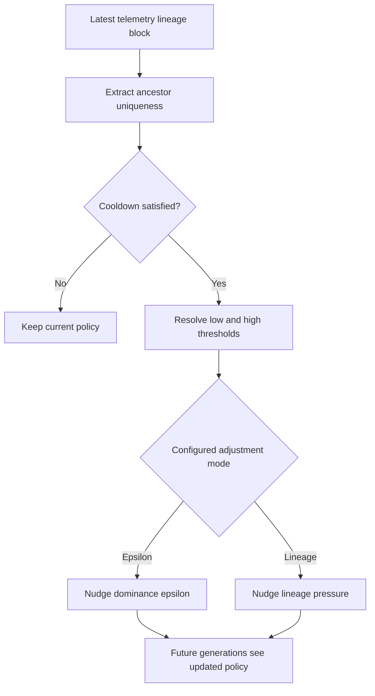

# neat/adaptive/lineage

Lineage-diversity adaptive controllers.

This category explains how ancestor uniqueness telemetry feeds back into the
search so the population can recover when family trees become too uniform.

The lineage branch of the adaptive subtree is the feedback bridge between
recorded telemetry and future search policy. It does not mutate genomes in
place for the current generation. Instead it reads ancestry evidence from the
latest telemetry snapshot, decides whether lineage diversity has drifted too
low or too high, and nudges controller settings that later generations will
feel.

Read this chapter when you want to understand:

- why lineage adaptation depends on telemetry rather than direct population
  scans,
- how cooldown checks, uniqueness thresholds, and mode-specific nudges fit
  together,
- where the public controller-facing entrypoint stops and the smaller
  telemetry extraction plus adjustment helpers begin.

The reading order is easiest to retain as one feedback loop:

1. read the latest ancestor-uniqueness signal from telemetry,
2. check whether the controller is allowed to adjust again yet,
3. compare the signal with the configured low and high thresholds,
4. nudge either dominance epsilon or lineage-pressure strength.



## neat/adaptive/lineage/adaptive.lineage.ts

### applyAncestorUniqAdaptive

```ts
applyAncestorUniqAdaptive(): void
```

Adaptive adjustments based on ancestor uniqueness telemetry.

This helper inspects the most recent telemetry lineage block (if
available) for an `ancestorUniq` metric indicating how unique
ancestry is across the population. If ancestry uniqueness drifts
outside configured thresholds, the method will adjust either the
multi-objective dominance epsilon (if `mode === 'epsilon'`) or the
lineage pressure strength (if `mode === 'lineagePressure'`).

This makes the lineage controller the feedback bridge between telemetry and
future search policy. It does not rewrite the current population directly;
instead it nudges the options that govern how later multi-objective or
lineage-pressure decisions behave.

Typical usage: keep population lineage diversity within a healthy
band. Low ancestor uniqueness means too many genomes share ancestors
(risking premature convergence); high uniqueness might indicate
excessive divergence.

Returns: May update lineage-related controller options and record the most recent adjustment generation.

Example:

// Adjusts `options.multiObjective.dominanceEpsilon` when configured
engine.applyAncestorUniqAdaptive();

### applyUniquenessAdjustment

```ts
applyUniquenessAdjustment(
  engine: NeatLikeWithAdaptive,
  config: { enabled?: boolean | undefined; cooldown?: number | undefined; lowThreshold?: number | undefined; highThreshold?: number | undefined; adjust?: number | undefined; mode?: string | undefined; },
  ancestorUniq: number,
  thresholds: { lowThreshold: number; highThreshold: number; },
  adjustMagnitude: number,
): void
```

Apply an adjustment for the configured mode.

This dispatcher is the decision fork for lineage adaptation. The thresholds
and telemetry signal have already been resolved by the time this helper runs,
so its only job is to send the adjustment into the correct policy surface.

Parameters:
- `engine` - - NEAT engine instance.
- `config` - - Ancestor uniqueness adaptive configuration.
- `ancestorUniq` - - Current ancestor uniqueness metric.
- `thresholds` - - Threshold bounds for decisions.
- `adjustMagnitude` - - Adjustment magnitude.

Returns: Nothing.

### extractAncestorUniqueness

```ts
extractAncestorUniqueness(
  engine: NeatLikeWithAdaptive,
): number | undefined
```

Extract the latest ancestor-uniqueness metric from telemetry.

Lineage adaptation only trusts the most recent telemetry snapshot because it
represents the latest scored generation. Missing or non-numeric lineage
evidence simply disables the adjustment for that cycle.

Parameters:
- `engine` - - NEAT engine instance.

Returns: Ancestor uniqueness value or undefined when missing.

### isCooldownSatisfied

```ts
isCooldownSatisfied(
  engine: NeatLikeWithAdaptive,
  config: { enabled?: boolean | undefined; cooldown?: number | undefined; lowThreshold?: number | undefined; highThreshold?: number | undefined; adjust?: number | undefined; mode?: string | undefined; },
): boolean
```

Determine whether the cooldown window has elapsed.

Cooldowns prevent the controller from thrashing lineage policy on every
generation. Once an adjustment has been recorded, later generations must wait
for the configured gap before another nudge is allowed.

Parameters:
- `engine` - - NEAT engine instance.
- `config` - - Ancestor uniqueness adaptive configuration.

Returns: True when adjustment is allowed.

### resolveUniquenessThresholds

```ts
resolveUniquenessThresholds(
  config: { enabled?: boolean | undefined; cooldown?: number | undefined; lowThreshold?: number | undefined; highThreshold?: number | undefined; adjust?: number | undefined; mode?: string | undefined; },
): { lowThreshold: number; highThreshold: number; }
```

Resolve thresholds for ancestor-uniqueness decisions.

These bounds define the acceptable ancestry-diversity band. Values below the
lower threshold suggest the population is converging onto similar family
trees, while values above the upper threshold suggest diversity pressure may
already be stronger than needed.

Parameters:
- `config` - - Ancestor uniqueness adaptive configuration.

Returns: Threshold bounds.

## neat/adaptive/lineage/adaptive.ancestor-uniqueness.utils.ts

Ancestor-uniqueness helpers for adaptive lineage feedback.

This file owns the small telemetry-to-policy loop behind lineage adaptation.
It stays separate from the root controller entrypoint so the generated docs
can explain how evidence is extracted, gated, interpreted, and translated
into one of two policy nudges.

The helper flow is intentionally compact:

1. verify the cooldown window has elapsed,
2. extract the most recent ancestor-uniqueness metric,
3. resolve thresholds and adjustment magnitude,
4. route the adjustment into epsilon or lineage-pressure mode.

### isCooldownSatisfied

```ts
isCooldownSatisfied(
  engine: NeatLikeWithAdaptive,
  config: { enabled?: boolean | undefined; cooldown?: number | undefined; lowThreshold?: number | undefined; highThreshold?: number | undefined; adjust?: number | undefined; mode?: string | undefined; },
): boolean
```

Determine whether the cooldown window has elapsed.

Cooldowns prevent the controller from thrashing lineage policy on every
generation. Once an adjustment has been recorded, later generations must wait
for the configured gap before another nudge is allowed.

Parameters:
- `engine` - - NEAT engine instance.
- `config` - - Ancestor uniqueness adaptive configuration.

Returns: True when adjustment is allowed.

### extractAncestorUniqueness

```ts
extractAncestorUniqueness(
  engine: NeatLikeWithAdaptive,
): number | undefined
```

Extract the latest ancestor-uniqueness metric from telemetry.

Lineage adaptation only trusts the most recent telemetry snapshot because it
represents the latest scored generation. Missing or non-numeric lineage
evidence simply disables the adjustment for that cycle.

Parameters:
- `engine` - - NEAT engine instance.

Returns: Ancestor uniqueness value or undefined when missing.

### resolveUniquenessThresholds

```ts
resolveUniquenessThresholds(
  config: { enabled?: boolean | undefined; cooldown?: number | undefined; lowThreshold?: number | undefined; highThreshold?: number | undefined; adjust?: number | undefined; mode?: string | undefined; },
): { lowThreshold: number; highThreshold: number; }
```

Resolve thresholds for ancestor-uniqueness decisions.

These bounds define the acceptable ancestry-diversity band. Values below the
lower threshold suggest the population is converging onto similar family
trees, while values above the upper threshold suggest diversity pressure may
already be stronger than needed.

Parameters:
- `config` - - Ancestor uniqueness adaptive configuration.

Returns: Threshold bounds.

### resolveAdjustmentMagnitude

```ts
resolveAdjustmentMagnitude(
  config: { enabled?: boolean | undefined; cooldown?: number | undefined; lowThreshold?: number | undefined; highThreshold?: number | undefined; adjust?: number | undefined; mode?: string | undefined; },
): number
```

Resolve adjustment magnitude for nudging controlled parameters.

Magnitude resolution keeps defaulting logic away from the mode-specific
adjusters so those helpers can focus on policy semantics.

Parameters:
- `config` - - Ancestor uniqueness adaptive configuration.

Returns: Adjustment magnitude.

### applyUniquenessAdjustment

```ts
applyUniquenessAdjustment(
  engine: NeatLikeWithAdaptive,
  config: { enabled?: boolean | undefined; cooldown?: number | undefined; lowThreshold?: number | undefined; highThreshold?: number | undefined; adjust?: number | undefined; mode?: string | undefined; },
  ancestorUniq: number,
  thresholds: { lowThreshold: number; highThreshold: number; },
  adjustMagnitude: number,
): void
```

Apply an adjustment for the configured mode.

This dispatcher is the decision fork for lineage adaptation. The thresholds
and telemetry signal have already been resolved by the time this helper runs,
so its only job is to send the adjustment into the correct policy surface.

Parameters:
- `engine` - - NEAT engine instance.
- `config` - - Ancestor uniqueness adaptive configuration.
- `ancestorUniq` - - Current ancestor uniqueness metric.
- `thresholds` - - Threshold bounds for decisions.
- `adjustMagnitude` - - Adjustment magnitude.

Returns: Nothing.

### applyEpsilonAdjustment

```ts
applyEpsilonAdjustment(
  engine: NeatLikeWithAdaptive,
  ancestorUniq: number,
  thresholds: { lowThreshold: number; highThreshold: number; },
  adjustMagnitude: number,
): void
```

Apply dominance-epsilon adjustments when configured.

Epsilon mode nudges the multi-objective dominance tolerance when ancestry is
too uniform or too diffuse. That lets later Pareto comparisons become slightly
more or less permissive without changing the current generation directly.

Parameters:
- `engine` - - NEAT engine instance.
- `ancestorUniq` - - Current ancestor uniqueness metric.
- `thresholds` - - Threshold bounds for decisions.
- `adjustMagnitude` - - Adjustment magnitude.

Returns: Nothing.

### applyLineagePressureAdjustment

```ts
applyLineagePressureAdjustment(
  engine: NeatLikeWithAdaptive,
  ancestorUniq: number,
  thresholds: { lowThreshold: number; highThreshold: number; },
): void
```

Apply lineage pressure strength adjustments.

Lineage-pressure mode keeps the feedback inside the ancestry-based selection
settings themselves. Low uniqueness increases spread pressure, while high
uniqueness relaxes it so the search does not over-penalize related genomes.

Parameters:
- `engine` - - NEAT engine instance.
- `ancestorUniq` - - Current ancestor uniqueness metric.
- `thresholds` - - Threshold bounds for decisions.

Returns: Nothing.

### ensureLineagePressureState

```ts
ensureLineagePressureState(
  engine: NeatLikeWithAdaptive,
): { enabled?: boolean | undefined; mode?: string | undefined; strength?: number | undefined; }
```

Ensure lineage pressure state is available.

Some runs do not seed lineage-pressure options up front. This helper creates a
minimal spread-oriented state only when lineage-feedback mode actually needs
one.

Parameters:
- `engine` - - NEAT engine instance.

Returns: Lineage pressure configuration object.

### recordAdjustment

```ts
recordAdjustment(
  engine: NeatLikeWithAdaptive,
): void
```

Record the generation when an adjustment is applied.

Recording the adjustment generation is what makes the cooldown guard work on
later cycles.

Parameters:
- `engine` - - NEAT engine instance.

Returns: Nothing.
