# neat/adaptive/mutation

Mutation-side adaptive controllers.

This category covers how NEAT changes per-genome mutation pressure and how
operator success statistics are decayed so exploration stays responsive over
long training runs.

The mutation branch of the adaptive subtree answers two related questions:
how strongly each genome should be perturbed right now, and how much the
controller should still trust older operator-success evidence when choosing
future mutations.

Read this chapter when you want to understand:

- why adaptive mutation rewrites per-genome mutation fields instead of
  mutating topology directly,
- how cadence checks, score partitions, strategy-specific deltas, and
  fallback balancing fit together,
- where per-genome mutation-rate tuning stops and operator-stat decay begins.

The reading order is easiest to retain as one pressure-maintenance loop:

1. decide whether this generation should adapt at all,
2. resolve settings and partition the scored population,
3. apply strategy-specific rate and amount deltas to genomes,
4. decay operator statistics so later mutation choices weight recent evidence.

```mermaid
flowchart TD
  Generation[Current generation] --> Cadence[Check adaptation cadence]
  Cadence --> Settings[Resolve mutation settings]
  Settings --> Partition[Partition scored genomes]
  Partition --> Deltas[Apply strategy-specific deltas]
  Deltas --> Fallback[Optionally rebalance with two-tier fallback]
  Fallback --> Ready[Later mutation stage reads updated per-genome pressure]
  Settings --> Decay[Decay operator statistics]
  Decay --> Ready
```



## neat/adaptive/mutation/adaptive.mutation.ts

### applyAdaptiveMutation

```ts
applyAdaptiveMutation(): void
```

Self-adaptive per-genome mutation tuning.

This function implements several strategies to adjust each genome's
internal mutation rate (`g._mutRate`) and optionally its mutation
amount (`g._mutAmount`) over time. Strategies include:
- `twoTier`: push top and bottom halves in opposite directions to
  create exploration/exploitation balance.
- `exploreLow`: preferentially increase mutation for lower-scoring
  genomes to promote exploration.
- `anneal`: gradually reduce mutation deltas over time.

The method reads `this.options.adaptiveMutation` for configuration
and mutates genomes in-place.

This is the adaptive controller that feeds most directly into the root
mutation chapter. Rather than choosing one operator itself, it adjusts each
genome's readiness for later mutation so the next structural-edit pass can be
more exploratory or more conservative depending on recent success.

Returns: Updates per-genome mutation-rate state in place when the current generation satisfies the adaptation cadence.

Example:

// configuration example:
// options.adaptiveMutation = { enabled: true, initialRate: 0.5, adaptEvery: 1, strategy: 'twoTier', minRate: 0.01, maxRate: 1 }
engine.applyAdaptiveMutation();

### applyMutationsToPopulation

```ts
applyMutationsToPopulation(
  population: { [key: string]: unknown; score?: number | undefined; _mutRate?: number | null | undefined; _mutAmount?: number | null | undefined; }[],
  partitions: MutationPartitions,
  settings: MutationSettings,
  randomSource: () => number,
): MutationOutcome
```

Apply mutation updates to the population.

This helper is the main write phase for adaptive mutation. It walks the full
population, computes a strategy-specific delta for each eligible genome, and
records whether the generation ended up with both upward and downward rate
pressure. That outcome is later used to decide whether fallback balancing is
needed to preserve the intended exploration-versus-exploitation contrast.

Parameters:
- `population` - - Full population to mutate.
- `partitions` - - Scored partitions.
- `settings` - - Resolved settings.
- `randomSource` - - Random number provider.

Returns: Mutation outcome flags.

### applyTwoTierFallback

```ts
applyTwoTierFallback(
  population: { [key: string]: unknown; score?: number | undefined; _mutRate?: number | null | undefined; _mutAmount?: number | null | undefined; }[],
  settings: MutationSettings,
): void
```

Apply two-tier fallback balancing.

Fallback balancing restores the intended contrast when the stochastic pass
fails to produce both exploratory and conservative outcomes. It is narrower
than the main update loop because it only nudges rates, leaving the richer
strategy-specific reasoning to the first pass.

Parameters:
- `population` - - Population of genomes.
- `settings` - - Resolved settings.

Returns: Nothing.

### resolveMutationSettings

```ts
resolveMutationSettings(
  engine: NeatLikeWithAdaptive,
  config: { enabled?: boolean | undefined; learningRate?: number | undefined; min?: number | undefined; max?: number | undefined; adaptEvery?: number | undefined; sigma?: number | undefined; minRate?: number | undefined; maxRate?: number | undefined; strategy?: string | undefined; adaptAmount?: boolean | undefined; minAmount?: number | undefined; maxAmount?: number | undefined; initialRate?: number | undefined; amountSigma?: number | undefined; },
): MutationSettings
```

Resolve mutation settings derived from configuration and engine state.

This is the normalization boundary for adaptive mutation. It gathers all
defaults, runtime counters, and mutation-amount settings into one typed
object so later helpers can stay focused on strategy logic instead of config
fallback bookkeeping.

Parameters:
- `engine` - - NEAT engine instance.
- `config` - - Adaptive mutation configuration.

Returns: Resolved mutation settings.

### shouldAdaptThisGeneration

```ts
shouldAdaptThisGeneration(
  generation: number,
  config: { enabled?: boolean | undefined; learningRate?: number | undefined; min?: number | undefined; max?: number | undefined; adaptEvery?: number | undefined; sigma?: number | undefined; minRate?: number | undefined; maxRate?: number | undefined; strategy?: string | undefined; adaptAmount?: boolean | undefined; minAmount?: number | undefined; maxAmount?: number | undefined; initialRate?: number | undefined; amountSigma?: number | undefined; },
): boolean
```

Check whether mutation adaptation should run this generation.

Cadence checks keep adaptive mutation from rewriting per-genome pressure on
every generation unless the configuration explicitly asks for that. This lets
runs choose between fast reaction and slower, more stable adjustment cycles.

Parameters:
- `generation` - - Current generation index.
- `config` - - Adaptive mutation configuration.

Returns: True if adaptation should run.

### shouldApplyTwoTierFallback

```ts
shouldApplyTwoTierFallback(
  strategy: string,
  outcome: MutationOutcome,
): boolean
```

Determine whether a two-tier fallback is needed.

Two-tier mode expects the generation to end with both increased and decreased
mutation pressure across the population. If randomness or missing state makes
the result one-sided, the caller can trigger a deterministic rebalance pass.

Parameters:
- `strategy` - - Mutation strategy identifier.
- `outcome` - - Mutation outcome flags.

Returns: True if fallback should run.

### applyOperatorDecay

```ts
applyOperatorDecay(
  stats: Map<string, { success: number; attempts: number; }>,
  entries: [string, { success: number; attempts: number; }][],
  decay: number,
): void
```

Apply exponential decay to each operator statistic entry.

Operator decay is the controller-level counterpart to per-genome mutation
tuning. Rather than rewriting genomes directly, it softens stale wins and
attempts so later operator selection can weight recent performance more
heavily.

Parameters:
- `stats` - - Operator statistics map.
- `entries` - - Operator stat entries to update.
- `decay` - - Decay factor.

Returns: Nothing.

### resolveOperatorDecay

```ts
resolveOperatorDecay(
  config: { enabled?: boolean | undefined; learningRate?: number | undefined; alpha?: number | undefined; decay?: number | undefined; },
): number
```

Resolve the decay factor for operator statistics.

Centralizing the default decay factor keeps the caller focused on the update
cycle instead of repeatedly restating configuration fallback rules.

Parameters:
- `config` - - Operator adaptation configuration.

Returns: Decay factor for exponential smoothing.

## neat/adaptive/mutation/adaptive.mutation.utils.ts

Per-genome adaptive mutation helpers.

This file owns the mutation-pressure loop that turns one generation's scores
into updated per-genome mutation-rate and mutation-amount fields. It stays
separate from operator-stat decay so the generated chapter can distinguish
"how hard should these genomes mutate?" from "how much should the controller
trust older operator results?"

The helper flow is intentionally compact:

1. decide whether the cadence allows adaptation,
2. collect and partition scored genomes,
3. resolve strategy-specific deltas,
4. clamp the updated mutation fields and apply fallback balancing if needed.

### shouldAdaptThisGeneration

```ts
shouldAdaptThisGeneration(
  generation: number,
  config: { enabled?: boolean | undefined; learningRate?: number | undefined; min?: number | undefined; max?: number | undefined; adaptEvery?: number | undefined; sigma?: number | undefined; minRate?: number | undefined; maxRate?: number | undefined; strategy?: string | undefined; adaptAmount?: boolean | undefined; minAmount?: number | undefined; maxAmount?: number | undefined; initialRate?: number | undefined; amountSigma?: number | undefined; },
): boolean
```

Check whether mutation adaptation should run this generation.

Cadence checks keep adaptive mutation from rewriting per-genome pressure on
every generation unless the configuration explicitly asks for that. This lets
runs choose between fast reaction and slower, more stable adjustment cycles.

Parameters:
- `generation` - - Current generation index.
- `config` - - Adaptive mutation configuration.

Returns: True if adaptation should run.

### collectScoredGenomes

```ts
collectScoredGenomes(
  population: { [key: string]: unknown; score?: number | undefined; _mutRate?: number | null | undefined; _mutAmount?: number | null | undefined; }[],
): { [key: string]: unknown; score?: number | undefined; _mutRate?: number | null | undefined; _mutAmount?: number | null | undefined; }[]
```

Collect genomes with numeric scores.

The adaptive mutation loop only partitions genomes that have meaningful score
evidence. Unevaluated genomes stay out of the ranking split so the strategy
logic only reacts to genomes the run has actually judged.

Parameters:
- `population` - - Population of genomes.

Returns: Scored genomes.

### sortScoredGenomes

```ts
sortScoredGenomes(
  scoredGenomes: { [key: string]: unknown; score?: number | undefined; _mutRate?: number | null | undefined; _mutAmount?: number | null | undefined; }[],
): { [key: string]: unknown; score?: number | undefined; _mutRate?: number | null | undefined; _mutAmount?: number | null | undefined; }[]
```

Sort scored genomes in ascending score order.

Sorting creates the stable ordering used by the two-tier and explore-low
strategies. Lower-scoring genomes end up at the front, which makes the later
top-half and bottom-half split read naturally.

Parameters:
- `scoredGenomes` - - Scored genomes.

Returns: Sorted genomes.

### splitScoredGenomes

```ts
splitScoredGenomes(
  scoredGenomes: { [key: string]: unknown; score?: number | undefined; _mutRate?: number | null | undefined; _mutAmount?: number | null | undefined; }[],
): MutationPartitions
```

Split scored genomes into top and bottom halves.

The partition step is where population performance becomes strategy-friendly
structure. Later helpers can ask whether a genome belongs to the exploratory
bottom half or the conservative top half without re-deriving the split.

Parameters:
- `scoredGenomes` - - Sorted scored genomes.

Returns: Partitions used by strategy rules.

### resolveMutationSettings

```ts
resolveMutationSettings(
  engine: NeatLikeWithAdaptive,
  config: { enabled?: boolean | undefined; learningRate?: number | undefined; min?: number | undefined; max?: number | undefined; adaptEvery?: number | undefined; sigma?: number | undefined; minRate?: number | undefined; maxRate?: number | undefined; strategy?: string | undefined; adaptAmount?: boolean | undefined; minAmount?: number | undefined; maxAmount?: number | undefined; initialRate?: number | undefined; amountSigma?: number | undefined; },
): MutationSettings
```

Resolve mutation settings derived from configuration and engine state.

This is the normalization boundary for adaptive mutation. It gathers all
defaults, runtime counters, and mutation-amount settings into one typed
object so later helpers can stay focused on strategy logic instead of config
fallback bookkeeping.

Parameters:
- `engine` - - NEAT engine instance.
- `config` - - Adaptive mutation configuration.

Returns: Resolved mutation settings.

### resolveRandomSource

```ts
resolveRandomSource(
  engine: NeatLikeWithAdaptive,
): () => number
```

Resolve a random source that matches the legacy RNG usage.

Adaptive mutation uses the same RNG access pattern as the older runtime so
the pressure updates remain comparable with existing runs and tests.

Parameters:
- `engine` - - NEAT engine instance.

Returns: Random number provider.

### applyMutationsToPopulation

```ts
applyMutationsToPopulation(
  population: { [key: string]: unknown; score?: number | undefined; _mutRate?: number | null | undefined; _mutAmount?: number | null | undefined; }[],
  partitions: MutationPartitions,
  settings: MutationSettings,
  randomSource: () => number,
): MutationOutcome
```

Apply mutation updates to the population.

This helper is the main write phase for adaptive mutation. It walks the full
population, computes a strategy-specific delta for each eligible genome, and
records whether the generation ended up with both upward and downward rate
pressure. That outcome is later used to decide whether fallback balancing is
needed to preserve the intended exploration-versus-exploitation contrast.

Parameters:
- `population` - - Full population to mutate.
- `partitions` - - Scored partitions.
- `settings` - - Resolved settings.
- `randomSource` - - Random number provider.

Returns: Mutation outcome flags.

### resolveRateDelta

```ts
resolveRateDelta(
  settings: MutationSettings,
  randomSource: () => number,
  genome: { [key: string]: unknown; score?: number | undefined; _mutRate?: number | null | undefined; _mutAmount?: number | null | undefined; },
  genomeIndex: number,
  topHalfSet: Set<{ [key: string]: unknown; score?: number | undefined; _mutRate?: number | null | undefined; _mutAmount?: number | null | undefined; }>,
  bottomHalfSet: Set<{ [key: string]: unknown; score?: number | undefined; _mutRate?: number | null | undefined; _mutAmount?: number | null | undefined; }>,
): number
```

Resolve mutation-rate delta based on strategy.

Strategy dispatch keeps the public mutation flow readable. Each strategy gets
the same base random delta, then reshapes it according to its own policy for
favoring exploration, rewarding stronger genomes with lower pressure, or
annealing toward smaller adjustments over time.

Parameters:
- `settings` - - Resolved settings.
- `randomSource` - - Random number provider.
- `genome` - - Current genome.
- `genomeIndex` - - Genome index.
- `topHalfSet` - - Lookup for top-half genomes.
- `bottomHalfSet` - - Lookup for bottom-half genomes.

Returns: Signed mutation rate delta.

### createRandomDelta

```ts
createRandomDelta(
  sigmaBase: number,
  randomSource: () => number,
): number
```

Create a signed random delta scaled by sigma.

This is the small stochastic core shared by rate and amount adaptation.
Later strategy helpers decide how to reinterpret the sign and magnitude.

Parameters:
- `sigmaBase` - - Sigma scaling factor.
- `randomSource` - - Random number provider.

Returns: Signed delta.

### applyTwoTierDelta

```ts
applyTwoTierDelta(
  baseDelta: number,
  genome: { [key: string]: unknown; score?: number | undefined; _mutRate?: number | null | undefined; _mutAmount?: number | null | undefined; },
  genomeIndex: number,
  topHalfSet: Set<{ [key: string]: unknown; score?: number | undefined; _mutRate?: number | null | undefined; _mutAmount?: number | null | undefined; }>,
  bottomHalfSet: Set<{ [key: string]: unknown; score?: number | undefined; _mutRate?: number | null | undefined; _mutAmount?: number | null | undefined; }>,
): number
```

Apply two-tier adjustments to a delta.

Two-tier mode deliberately pushes the two halves in opposite directions so
one side becomes more exploratory while the other becomes more conservative.
When the score split is not available, the helper falls back to index parity
just to preserve that contrasting pressure pattern.

Parameters:
- `baseDelta` - - Base random delta.
- `genome` - - Current genome.
- `genomeIndex` - - Genome index.
- `topHalfSet` - - Lookup for top-half genomes.
- `bottomHalfSet` - - Lookup for bottom-half genomes.

Returns: Adjusted delta.

### applyExploreLowDelta

```ts
applyExploreLowDelta(
  baseDelta: number,
  genome: { [key: string]: unknown; score?: number | undefined; _mutRate?: number | null | undefined; _mutAmount?: number | null | undefined; },
  bottomHalfSet: Set<{ [key: string]: unknown; score?: number | undefined; _mutRate?: number | null | undefined; _mutAmount?: number | null | undefined; }>,
): number
```

Apply explore-low adjustments to a delta.

Explore-low treats weaker genomes as exploration candidates. Bottom-half
genomes receive larger positive pressure, while the rest are gently pushed
downward so the search budget does not inflate everywhere at once.

Parameters:
- `baseDelta` - - Base random delta.
- `genome` - - Current genome.
- `bottomHalfSet` - - Lookup for bottom-half genomes.

Returns: Adjusted delta.

### applyAnnealDelta

```ts
applyAnnealDelta(
  baseDelta: number,
  settings: MutationSettings,
): number
```

Apply annealing adjustments to a delta.

Annealing gradually shrinks the effective delta as the run ages, making early
mutation-pressure updates more aggressive and later ones more conservative.

Parameters:
- `baseDelta` - - Base random delta.
- `settings` - - Resolved settings.

Returns: Adjusted delta.

### applyMutationAmount

```ts
applyMutationAmount(
  genome: { [key: string]: unknown; score?: number | undefined; _mutRate?: number | null | undefined; _mutAmount?: number | null | undefined; },
  settings: MutationSettings,
  randomSource: () => number,
  genomeIndex: number,
  topHalfSet: Set<{ [key: string]: unknown; score?: number | undefined; _mutRate?: number | null | undefined; _mutAmount?: number | null | undefined; }>,
  bottomHalfSet: Set<{ [key: string]: unknown; score?: number | undefined; _mutRate?: number | null | undefined; _mutAmount?: number | null | undefined; }>,
): void
```

Apply mutation-amount adjustments to a genome.

Rate and amount adaptation share the same high-level strategy vocabulary, but
amount updates remain optional because some runs only want to tune how often
mutation fires, not how large each mutation should be.

Parameters:
- `genome` - - Current genome.
- `settings` - - Resolved settings.
- `randomSource` - - Random number provider.
- `genomeIndex` - - Genome index.
- `topHalfSet` - - Lookup for top-half genomes.
- `bottomHalfSet` - - Lookup for bottom-half genomes.

Returns: Nothing.

### resolveAmountDelta

```ts
resolveAmountDelta(
  settings: MutationSettings,
  randomSource: () => number,
  genome: { [key: string]: unknown; score?: number | undefined; _mutRate?: number | null | undefined; _mutAmount?: number | null | undefined; },
  genomeIndex: number,
  topHalfSet: Set<{ [key: string]: unknown; score?: number | undefined; _mutRate?: number | null | undefined; _mutAmount?: number | null | undefined; }>,
  bottomHalfSet: Set<{ [key: string]: unknown; score?: number | undefined; _mutRate?: number | null | undefined; _mutAmount?: number | null | undefined; }>,
): number
```

Resolve mutation-amount delta based on strategy.

Amount adaptation currently reuses the two-tier split when configured and
otherwise keeps the raw stochastic delta. That keeps the amount policy easier
to reason about than the richer rate-tuning branch.

Parameters:
- `settings` - - Resolved settings.
- `randomSource` - - Random number provider.
- `genome` - - Current genome.
- `genomeIndex` - - Genome index.
- `topHalfSet` - - Lookup for top-half genomes.
- `bottomHalfSet` - - Lookup for bottom-half genomes.

Returns: Signed mutation amount delta.

### applyTwoTierAmountDelta

```ts
applyTwoTierAmountDelta(
  baseDelta: number,
  genome: { [key: string]: unknown; score?: number | undefined; _mutRate?: number | null | undefined; _mutAmount?: number | null | undefined; },
  genomeIndex: number,
  topHalfSet: Set<{ [key: string]: unknown; score?: number | undefined; _mutRate?: number | null | undefined; _mutAmount?: number | null | undefined; }>,
  bottomHalfSet: Set<{ [key: string]: unknown; score?: number | undefined; _mutRate?: number | null | undefined; _mutAmount?: number | null | undefined; }>,
): number
```

Apply two-tier adjustments to amount delta.

Amount deltas mirror the high-level two-tier idea from rate adaptation: give
weaker genomes more room to roam and keep stronger genomes from drifting too
far in one step.

Parameters:
- `baseDelta` - - Base random delta.
- `genome` - - Current genome.
- `genomeIndex` - - Genome index.
- `topHalfSet` - - Lookup for top-half genomes.
- `bottomHalfSet` - - Lookup for bottom-half genomes.

Returns: Adjusted delta.

### clampValue

```ts
clampValue(
  value: number,
  min: number,
  max: number,
): number
```

Clamp a value between min and max bounds.

Clamping is the final safety guard that keeps adaptive mutation inside the
configured rate and amount envelopes even when repeated random pressure would
otherwise drift beyond them.

Parameters:
- `value` - - Value to clamp.
- `min` - - Minimum bound.
- `max` - - Maximum bound.

Returns: Clamped value.

### shouldApplyTwoTierFallback

```ts
shouldApplyTwoTierFallback(
  strategy: string,
  outcome: MutationOutcome,
): boolean
```

Determine whether a two-tier fallback is needed.

Two-tier mode expects the generation to end with both increased and decreased
mutation pressure across the population. If randomness or missing state makes
the result one-sided, the caller can trigger a deterministic rebalance pass.

Parameters:
- `strategy` - - Mutation strategy identifier.
- `outcome` - - Mutation outcome flags.

Returns: True if fallback should run.

### applyTwoTierFallback

```ts
applyTwoTierFallback(
  population: { [key: string]: unknown; score?: number | undefined; _mutRate?: number | null | undefined; _mutAmount?: number | null | undefined; }[],
  settings: MutationSettings,
): void
```

Apply two-tier fallback balancing.

Fallback balancing restores the intended contrast when the stochastic pass
fails to produce both exploratory and conservative outcomes. It is narrower
than the main update loop because it only nudges rates, leaving the richer
strategy-specific reasoning to the first pass.

Parameters:
- `population` - - Population of genomes.
- `settings` - - Resolved settings.

Returns: Nothing.

## neat/adaptive/mutation/adaptive.operator.utils.ts

Operator-stat decay helpers for adaptive mutation.

These helpers maintain the slower-moving memory of which mutation operators
have succeeded recently. They stay separate from per-genome mutation tuning so
the generated chapter can distinguish genome-local pressure from controller-
level evidence decay.

### resolveOperatorDecay

```ts
resolveOperatorDecay(
  config: { enabled?: boolean | undefined; learningRate?: number | undefined; alpha?: number | undefined; decay?: number | undefined; },
): number
```

Resolve the decay factor for operator statistics.

Centralizing the default decay factor keeps the caller focused on the update
cycle instead of repeatedly restating configuration fallback rules.

Parameters:
- `config` - - Operator adaptation configuration.

Returns: Decay factor for exponential smoothing.

### collectOperatorStatsEntries

```ts
collectOperatorStatsEntries(
  stats: Map<string, { success: number; attempts: number; }>,
): [string, { success: number; attempts: number; }][]
```

Collect operator statistic entries for processing.

Snapshotting the entries before update keeps the decay pass simple and makes
the generated docs show that the helper operates over a stable view of the
current operator table.

Parameters:
- `stats` - - Operator statistics map.

Returns: Array of operator stat entries.

### applyOperatorDecay

```ts
applyOperatorDecay(
  stats: Map<string, { success: number; attempts: number; }>,
  entries: [string, { success: number; attempts: number; }][],
  decay: number,
): void
```

Apply exponential decay to each operator statistic entry.

Operator decay is the controller-level counterpart to per-genome mutation
tuning. Rather than rewriting genomes directly, it softens stale wins and
attempts so later operator selection can weight recent performance more
heavily.

Parameters:
- `stats` - - Operator statistics map.
- `entries` - - Operator stat entries to update.
- `decay` - - Decay factor.

Returns: Nothing.

### decayOperatorStat

```ts
decayOperatorStat(
  operatorStat: { success: number; attempts: number; },
  decay: number,
): { success: number; attempts: number; }
```

Apply decay to a single operator statistic record.

This helper keeps the decay rule explicit and uniform for both success and
attempt counts so the operator table preserves ratios while shrinking older
evidence.

Parameters:
- `operatorStat` - - Operator statistic record.
- `decay` - - Decay factor.

Returns: Decayed operator statistic record.
