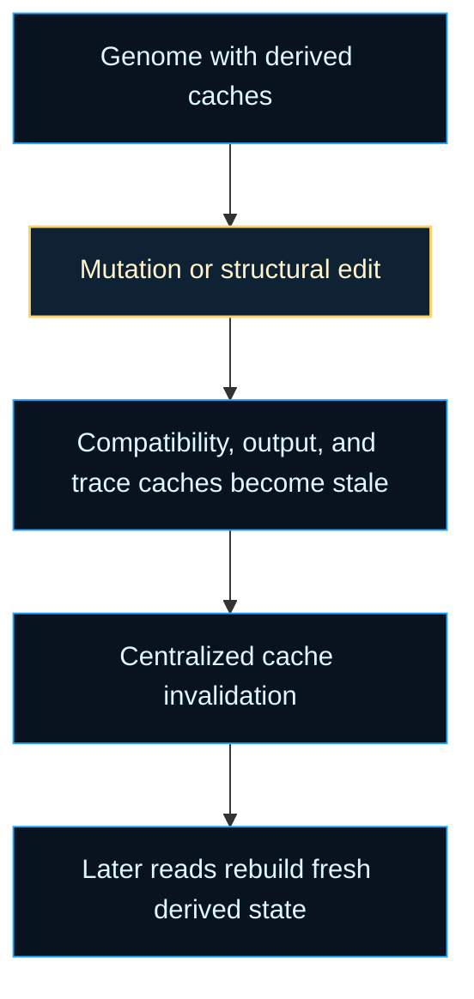
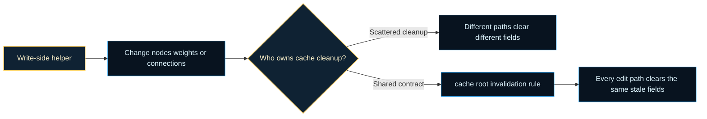

# neat/cache

Cache maintenance helpers for NEAT genomes.

This chapter explains one of the less glamorous but more important runtime
boundaries in NEAT: derived genome caches are useful only while the genome
they describe is still unchanged. Activation outputs, compatibility views,
and tracing data can all be memoized for speed, but once mutation,
crossover, repair, or another structural edit touches the genome, those
memoized values stop being evidence and start being stale state.

The root cache surface exists to answer three controller-facing questions:

1. which genome-owned fields count as derived caches,
2. when those fields must be invalidated,
3. why one centralized invalidation helper is safer than letting each
   mutation path remember its own cleanup list.



The deeper teaching point is ownership. Mutation, crossover, repair, and
manual graph-edit helpers own structural change, but they should not each own
a private opinion about which genome-attached caches are now stale. That is
how subtle documentation drift and behavioral drift start: one write path
remembers to clear compatibility state, another clears output caches, and a
third silently forgets trace artifacts.

This root chapter exists to keep that responsibility legible. The write path
owns the edit. The cache root owns the invalidation contract that follows the
edit. Separating those responsibilities keeps the controller easier to audit,
easier to extend, and easier to teach.



The root cache chapter stays intentionally compact because the actual cleanup
mechanics are simple. What matters educationally is understanding why the
invalidation boundary exists and why every structural edit path should reuse
the same cleanup contract. In older evolutionary codebases this boundary is often
implicit, because caches accumulate as performance patches rather than as a
planned subsystem. Making the boundary explicit here helps readers see that
cache invalidation is not incidental housekeeping. It is part of keeping the
evolutionary record truthful after a write.

- `core/` explains which per-genome caches exist and how to clear them
  safely after structural or weight changes.

Practical reading order:

1. Start with `GENOME_CACHE_FIELD_KEYS` to see the exact invalidation surface.
2. Read `invalidateGenomeCaches()` to understand the centralized cleanup rule.
3. Continue into `core/` when you want the lower-level stale-field contract
   and the concrete deletion mechanics.

Example:

```ts
mutateAddConnReuse(neat, genome);
invalidateGenomeCaches(genome);
```

## neat/cache/cache.ts

### GENOME_CACHE_FIELD_KEYS

Genome-owned cache fields that should be cleared when a mutation changes
structure or outputs.

Treat this list as the mechanical invalidation contract for genome objects.
Each key names a field that may be cheap to rebuild but dangerous to trust
after a write. The list is intentionally short because its job is not to
describe every useful runtime view of a genome; its job is to name the cached
fields whose ownership ends the moment the genome itself changes:

- `_compatCache` stores derived compatibility-comparison views,
- `_outputCache` stores memoized activation outputs,
- `_traceCache` stores debugging or tracing artifacts.

Keeping the list explicit makes review easier. When a new genome-owned cache
is introduced, adding it here makes the invalidation surface visible instead
of relying on scattered ad hoc cleanup. That gives contributors a simple
review question: "if this new field is derived and stored on the genome,
should it join the shared invalidation list?"

### invalidateGenomeCaches

```ts
invalidateGenomeCaches(
  genomeCandidate: unknown,
): void
```

Invalidate the derived caches attached to a genome candidate.

Mutation, crossover, repair, and other genome-editing helpers attach or rely
on memoized compatibility, activation, and trace data directly on genome
objects for speed. That optimization only works when every write path also
respects the invalidation boundary. Once the genome changes, those memoized
values are stale and must be removed before a later read assumes they still
describe the current structure.

Centralizing the cleanup here avoids a fragile situation where each edit path
remembers a slightly different subset of cache keys. One helper and one key
list keeps invalidation deterministic across the controller. Read it as the
"final broom" after a write: the structural edit owns the real behavior
change, while this helper only removes the stale evidence that no longer
matches the updated genome.

The cleanup path stays intentionally simple:

1. ignore non-object inputs,
2. treat the remaining value as a genome-shaped record,
3. delete every field named by `GENOME_CACHE_FIELD_KEYS`.

That simplicity is part of the design. The helper should be safe to call from
many write paths, even when some genomes do not currently carry every cached
field. In practice, that means mutation flows, crossover assembly, repair
passes, and manual graph-edit utilities can all reuse the same final cleanup
contract instead of maintaining subtly different invalidation rules.

Parameters:
- `genomeCandidate` - - Genome-shaped value whose attached caches should be cleared.

Returns: Nothing. The helper mutates the candidate in place when it is an object.

Example:

```ts
const genome = {
  _compatCache: { neighbor: 0.42 },
  _outputCache: [1, 0],
  connections: [{ from: 0, to: 1, weight: 0.9 }],
};

genome.connections[0].weight = 1.1;
invalidateGenomeCaches(genome);
console.log('_compatCache' in genome, '_outputCache' in genome);
```
