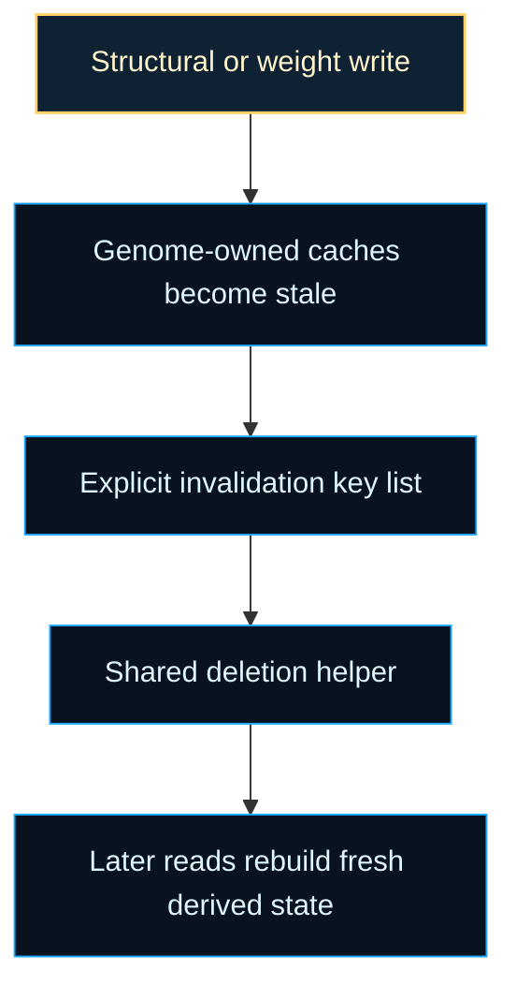

# neat/cache/core

Cache invalidation mechanics for genome-local derived state.

Read this file as the execution half of the cache-core chapter. The constant
beside it names the genome-owned fields that count as disposable derived
state; this helper is the single write-side cleanup step that enforces that
contract after mutation, crossover, repair, or direct genome edits.

The boundary is intentionally conservative. Cached compatibility summaries,
activation outputs, and trace artifacts belong to read-side acceleration, not
to the genome's canonical structure. Once a write changes nodes, connections,
or weights, those cached values stop being trustworthy evidence about the
genome's current state.

That is why the helper stays narrow instead of trying to be clever: it does
not inspect cache contents, selectively preserve "probably still valid"
entries, or make each editing path remember its own cleanup list. It simply
erases the known stale fields so the next read must rebuild them from the
updated genome.

Practical reading order:

1. Start with `GENOME_CACHE_FIELD_KEYS` to see which genome-owned fields are
   treated as disposable caches.
2. Read `invalidateGenomeCaches()` as the shared broom every write path can
   call after changing the genome.
3. Move back to the parent `cache/` chapter when you want the broader
   controller-facing explanation for why centralized invalidation is safer
   than bespoke cleanup scattered across mutation helpers.

## neat/cache/core/cache.core.ts

### invalidateGenomeCaches

```ts
invalidateGenomeCaches(
  genomeCandidate: unknown,
): void
```

Invalidate the derived caches attached to a genome candidate.

Mutation, crossover, repair, and other genome-editing helpers attach or rely
on memoized compatibility, activation, and trace data directly on genome
objects for speed. That optimization only works when every write path also
respects the invalidation boundary. Once the genome changes, those memoized
values are stale and must be removed before a later read assumes they still
describe the current structure.

Centralizing the cleanup here avoids a fragile situation where each edit path
remembers a slightly different subset of cache keys. One helper and one key
list keeps invalidation deterministic across the controller. Read it as the
"final broom" after a write: the structural edit owns the real behavior
change, while this helper only removes the stale evidence that no longer
matches the updated genome.

The cleanup path stays intentionally simple:

1. ignore non-object inputs,
2. treat the remaining value as a genome-shaped record,
3. delete every field named by `GENOME_CACHE_FIELD_KEYS`.

That simplicity is part of the design. The helper should be safe to call from
many write paths, even when some genomes do not currently carry every cached
field. In practice, that means mutation flows, crossover assembly, repair
passes, and manual graph-edit utilities can all reuse the same final cleanup
contract instead of maintaining subtly different invalidation rules.

Parameters:

- `genomeCandidate` - Genome-shaped value whose attached caches should be cleared.

Returns: Nothing. The helper mutates the candidate in place when it is an object.

Example:

```ts
const genome = {
  _compatCache: { neighbor: 0.42 },
  _outputCache: [1, 0],
  connections: [{ from: 0, to: 1, weight: 0.9 }],
};

genome.connections[0].weight = 1.1;
invalidateGenomeCaches(genome);
console.log('_compatCache' in genome, '_outputCache' in genome);
```

## neat/cache/core/cache.constants.ts

Lower-level invalidation mechanics for genome-owned NEAT caches.

The root cache chapter explains why centralized invalidation matters. This
core chapter explains the narrower mechanics contract beneath that story:
which derived genome fields are treated as disposable caches, why that list
stays explicit, and how one shared cleanup helper keeps every structural edit
path aligned.

Read this layer when you want the operational answer to "what exactly becomes
stale after a write?" Compatibility views, activation outputs, and trace
artifacts may all be cached directly on genomes for speed, but none of those
fields are authoritative after mutation, crossover, repair, or manual graph
edits. The core surface keeps that rule small and reviewable.

The key teaching point is ownership: the genome owns structure and weights,
while these cache fields only mirror facts derived from that structure. The
moment a write path edits the genome, cache ownership ends and invalidation
begins. By making the stale-field list explicit here, the controller can keep
every write-side caller honest without asking each caller to rediscover which
read-side artifacts are no longer safe.



Practical reading order:

1. Start with `GENOME_CACHE_FIELD_KEYS` to see the exact stale-field surface.
2. Continue into `cache.core.ts` to see how the cleanup helper applies that
   contract safely.
3. Move back to the root `cache/` chapter when you want the broader
   controller-facing explanation for why every edit path should reuse this
   same invalidation rule.

### GENOME_CACHE_FIELD_KEYS

Genome-owned cache fields that should be cleared when a mutation changes
structure or outputs.

Treat this list as the mechanical invalidation contract for genome objects.
Each key names a field that may be cheap to rebuild but dangerous to trust
after a write. The list is intentionally short because its job is not to
describe every useful runtime view of a genome; its job is to name the cached
fields whose ownership ends the moment the genome itself changes:

- `_compatCache` stores derived compatibility-comparison views,
- `_outputCache` stores memoized activation outputs,
- `_traceCache` stores debugging or tracing artifacts.

Keeping the list explicit makes review easier. When a new genome-owned cache
is introduced, adding it here makes the invalidation surface visible instead
of relying on scattered ad hoc cleanup. That gives contributors a simple
review question: "if this new field is derived and stored on the genome,
should it join the shared invalidation list?"
