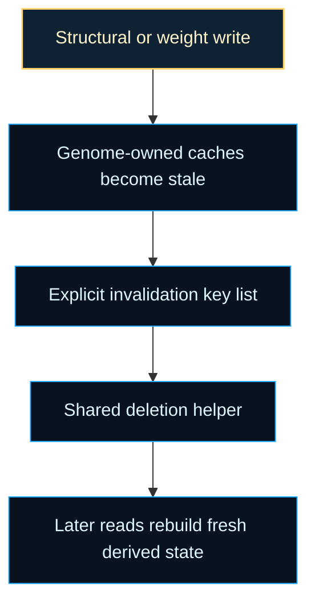

# neat/cache/core

Cache invalidation mechanics for genome-local derived state.

This file is the small execution layer beneath the cache-core chapter. The
surrounding constant defines which fields are disposable caches; this helper
applies that contract uniformly whenever a genome has just been edited.

The intent is deliberately modest: do not infer meaning from any cache field,
do not try to repair cached values in place, and do not make individual write
paths remember their own bespoke cleanup list. Once a genome changes, this
helper erases the derived fields so later reads must rebuild from the new
canonical structure.

## neat/cache/core/cache.core.ts

### invalidateGenomeCaches

```ts
invalidateGenomeCaches(
  genomeCandidate: unknown,
): void
```

Invalidate the derived caches attached to a genome candidate.

Mutation, crossover, repair, and other genome-editing helpers attach or rely
on memoized compatibility, activation, and trace data directly on genome
objects for speed. That optimization only works when every write path also
respects the invalidation boundary. Once the genome changes, those memoized
values are stale and must be removed before any later read assumes they still
describe the current structure.

Centralizing the cleanup here avoids a fragile situation where each edit path
remembers a slightly different subset of cache keys. One helper and one key
list keeps invalidation deterministic across the controller. Read it as the
"final broom" after a write: the structural edit owns the real behavior
change, while this helper only removes the stale evidence that no longer
matches the updated genome.

The cleanup path stays intentionally simple:

1. ignore non-object inputs,
2. treat the remaining value as a genome-shaped record,
3. delete every field named by `GENOME_CACHE_FIELD_KEYS`.

That simplicity is part of the design. The helper should be safe to call from
many write paths, even when some genomes do not currently carry every cached
field.

Parameters:
- `genomeCandidate` - - Genome-shaped value whose attached caches should be cleared.

Returns: Nothing. The helper mutates the candidate in place when it is an object.

Example:

```ts
const genome = { _compatCache: {}, _outputCache: [1, 0] };
invalidateGenomeCaches(genome);
console.log('_compatCache' in genome, '_outputCache' in genome);
```

## neat/cache/core/cache.constants.ts

Lower-level invalidation mechanics for genome-owned NEAT caches.

The root cache chapter explains why centralized invalidation matters. This
core chapter explains the narrower mechanics contract beneath that story:
which derived genome fields are treated as disposable caches, why that list
stays explicit, and how one shared cleanup helper keeps every structural edit
path aligned.

Read this layer when you want the operational answer to "what exactly becomes
stale after a write?" Compatibility views, activation outputs, and trace
artifacts may all be cached directly on genomes for speed, but none of those
fields are authoritative after mutation, crossover, repair, or manual graph
edits. The core surface keeps that rule small and reviewable.



Practical reading order:

1. Start with `GENOME_CACHE_FIELD_KEYS` to see the exact stale-field surface.
2. Continue into `cache.core.ts` to see how the cleanup helper applies that
   contract safely.
3. Move back to the root `cache/` chapter when you want the broader
   controller-facing explanation for why every edit path should reuse this
   same invalidation rule.

### GENOME_CACHE_FIELD_KEYS

Genome-owned cache fields that should be cleared when a mutation changes
structure or outputs.

Treat this list as the mechanical invalidation contract for genome objects.
Each key names a field that may be cheap to rebuild but dangerous to trust
after a write:

- `_compatCache` stores derived compatibility-comparison views,
- `_outputCache` stores memoized activation outputs,
- `_traceCache` stores debugging or tracing artifacts.

Keeping the list explicit makes review easier. When a new genome-owned cache
is introduced, adding it here makes the invalidation surface visible instead
of relying on scattered ad hoc cleanup.
