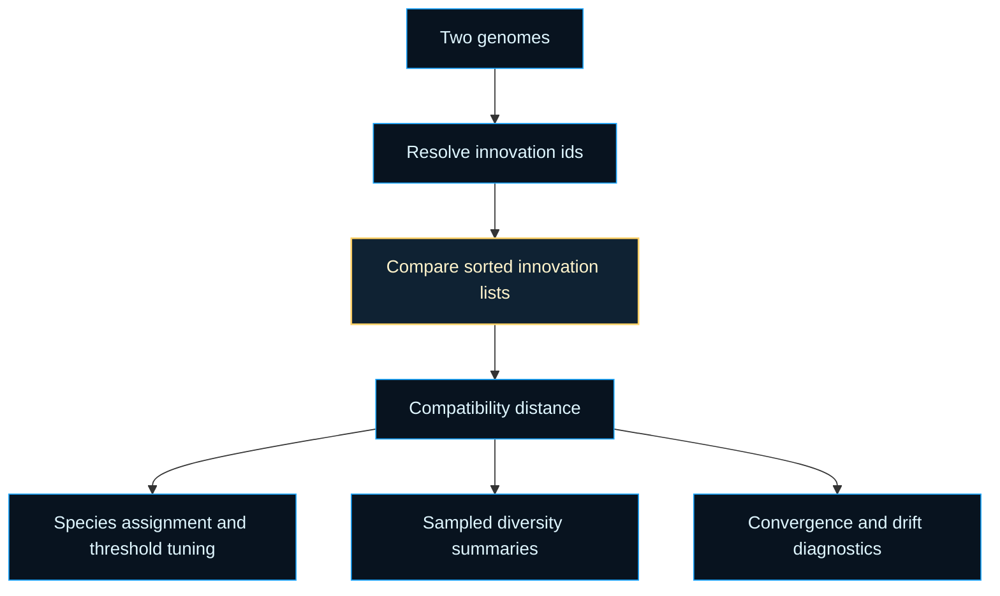

# neat/compat

Compatibility-distance orchestration for the NEAT controller.

This chapter answers a simple but central controller question: when two
genomes look different, are they different enough to separate into distinct
evolutionary neighborhoods? The same distance signal later feeds more than
one reader-facing story. Speciation uses it to decide whether genomes still
belong in the same species, diversity summaries sample it to estimate how far
the population has spread, and diagnostics use it to explain whether a run is
converging toward one family or preserving several incompatible branches.
Compatibility distance is therefore not a general "is this genome good?"
score. It is a neighborhood boundary read: a way to decide whether variation
is still local enough to compare within one species or broad enough to treat
as a separate search direction.

The root chapter stays intentionally compact because it is the controller
entrypoint, not the comparison laboratory. Read it as the public map for the
compatibility read flow, then step into `core/` for the list-walking and
cache-management details.



Practical reading order:

1. Start with `_compatibilityDistance()` to see the controller-facing
   orchestration.
2. Read `_fallbackInnov()` to understand how legacy or partially normalized
   connections still participate in comparison.
3. Continue into `core/` when you want the exact comparison metrics, cache
   lifecycle, or final coefficient folding rules.
4. Move next to `speciation/`, `diversity/`, and `lineage/` when you want to
   see how compatibility becomes species boundaries, population summaries,
   and ancestry-adjacent evidence. Compatibility explains structural
   closeness, while lineage explains family overlap; the two signals are
   complementary rather than interchangeable.

Example:

```ts
const distance = neat._compatibilityDistance(parentGenome, offspringGenome);

if (distance < neat.options.compatibilityThreshold) {
  // The genomes are still close enough to behave like one species candidate.
}
```

## neat/compat/compat.ts

### _compatibilityDistance

```ts
_compatibilityDistance(
  genomeA: GenomeLike,
  genomeB: GenomeLike,
): number
```

Compute the NEAT compatibility distance between two genomes.

Read this as the controller-facing answer to "how far apart are these two
genomes in structural and weight space?" Lower distances usually mean the
genomes are still close enough to share a species boundary or represent small
local variation. Higher distances mean the genomes have drifted far enough in
connection history and weight profile that the controller should treat them
as more independent search directions.
In practice that one number supports three recurring decisions: whether a
candidate still fits an existing species, whether the current compatibility
threshold is producing species that are too coarse or too fragmented, and
whether sampled population pairs suggest broad exploration or local
convergence.

The helper keeps the top-level flow deliberately linear:

1. refresh generation-scoped caches,
2. resolve deterministic pair and innovation-list views,
3. compare aligned innovations,
4. fold the resulting metrics into one distance.

The detailed comparison mechanics live in `core/` so this function can stay
focused on orchestration and interpretation. That split also makes the root
chapter easier to read alongside `speciation/`, where the same distance helps
decide species membership, and `diversity/`, where sampled distances help
summarize population spread. `lineage/` complements that story by asking a
different question: not whether structures are close, but whether recent
ancestry is still meaningfully shared.

Parameters:
- `this` - - NEAT context holding generation state, options, and caches.
- `genomeA` - - First genome to compare.
- `genomeB` - - Second genome to compare.

Returns: Compatibility distance where lower values mean more similar genomes
and higher values suggest stronger structural separation.

Example:

```ts
const speciesBoundaryDistance = neat._compatibilityDistance(genomeA, genomeB);
const sameSpecies =
  speciesBoundaryDistance <= neat.options.compatibilityThreshold;
```

### _fallbackInnov

```ts
_fallbackInnov(
  connection: ConnectionLike,
): number
```

Generate a deterministic fallback innovation id for a connection when the
connection does not provide an explicit innovation number.

Innovation numbers are the canonical alignment key because they let NEAT
distinguish matching genes from disjoint or excess ones across topology
changes. This fallback only exists for the boundary cases where a connection
arrives without that explicit identifier. In that case the helper derives a
stable directional id from the connection endpoints so the comparison can
still proceed instead of silently dropping structure from the distance read.

Interpret the fallback as a bridge, not as a replacement for properly tracked
innovations. It keeps compatibility useful for legacy, test, or partially
normalized genomes, but explicit innovation numbers remain the source of
truth whenever they are available. A fallback match should therefore be read
as "these connections occupy the same directed slot" rather than "these two
genes are proven to share the same historical innovation event."

Parameters:
- `this` - - NEAT context kept for symmetry with the other compatibility helpers.
- `connection` - - Connection object expected to contain `from.index` and `to.index`.

Returns: Numeric innovation id derived from the directional endpoint pair.

Example:

```ts
const fallbackInnovation = neat._fallbackInnov({
  from: { index: 4 },
  to: { index: 9 },
  weight: 0.75,
});

// The same endpoint pair always resolves to the same synthetic id.
```
