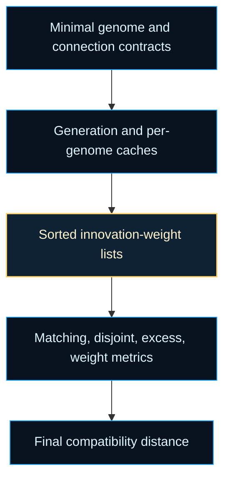

# neat/compat/core

Core contracts for compatibility-distance mechanics.

This chapter explains how the root compatibility helper turns two genomes
into one stable distance signal without dragging the full controller surface
into every comparison. The boundary stays deliberately small: these types
describe only the data needed to align genes, classify mismatches, and fold
the final score.

Read this core layer when you want the "how" behind the root chapter:
how generation-scoped caches stay valid, how sorted innovation lists are
derived, how a linear merge walk decides whether genes are matching,
disjoint, or excess, and how those counts become the distance used by
speciation and diversity summaries.



Practical reading order:

1. Start with `GenomeLike` and `NeatLikeForCompat` to see which state the
   core layer actually depends on.
2. Read `ComparisonMetrics` as the bridge between raw list comparison and the
   final NEAT distance formula.
3. Continue into `compat.core.ts` for cache setup, list comparison, and the
   distance fold itself.

## neat/compat/core/compat.types.ts

### ComparisonMetrics

Aggregated comparison metrics for compatibility calculations.

`compareInnovationLists()` produces this structure so the final distance fold
can stay separate from the merge walk that discovered the evidence. That
split keeps the algorithm easier to explain: one pass classifies the gene
relationship, a later pass applies the NEAT weighting policy.

### CompatibilityInnovationMode

Compatibility-innovation policy for one genome comparison surface.

Native controller genomes should stay on `require-explicit`, which means
compatibility reads expect every connection gene to carry a finite
innovation number. Legacy, imported, or deliberately partial genomes may opt
into `allow-fallback` so comparison can still proceed with endpoint-derived
synthetic ids.

### ConnectionLike

Shape of a connection entry used during compatibility checks.

The mechanics layer only needs endpoint indices, an optional innovation id,
and the connection weight. Keeping this shape small makes the comparison code
easier to reuse in tests and controller helpers without importing the full
network or genome implementation.

### GenomeLike

Minimal genome shape used for compatibility distance calculations.

The `_compatCache` stores sorted `[innovation, weight]` pairs so repeated
comparisons within a generation can reuse the same derived list instead of
repeatedly normalizing the raw connection array.

### NeatLikeForCompat

Minimal NEAT context required by compatibility helpers.

This keeps the boundary tightly focused on generation-scoped caches,
compatibility coefficients, and the fallback innovation resolver instead of
coupling the mechanics layer to the full `Neat` surface.

## neat/compat/core/compat.core.ts

Compatibility-distance mechanics used by NEAT speciation.

This file holds the reusable inner loop beneath the controller-facing
compatibility chapter: generation cache setup, innovation-list caching,
linear list comparison, and the final distance calculation.

The root compatibility chapter answers what the distance means. This core
chapter answers how that distance is assembled efficiently and deterministically.
The helpers are deliberately small and ordered to match the real execution
path: stabilize caches, normalize genomes, compare aligned innovations, then
fold the discovered evidence into the NEAT distance formula.

### buildPairKey

```ts
buildPairKey(
  firstGenome: GenomeLike,
  secondGenome: GenomeLike,
): string
```

Build a stable cache key for a genome pair.

Compatibility distance is symmetric, so the cache key must be symmetric too.
Ordering the genome ids ensures the pair `(A, B)` lands in the same cache
slot as `(B, A)` instead of duplicating work or storing conflicting entries.

Parameters:

- `firstGenome` - First genome in the pair.
- `secondGenome` - Second genome in the pair.

Returns: Stable cache key in the form `minId|maxId`.

### compareInnovationLists

```ts
compareInnovationLists(
  firstList: [number, number][],
  secondList: [number, number][],
): ComparisonMetrics
```

Compare two sorted innovation lists and derive compatibility metrics.

This is the heart of the compatibility read. Because both lists are sorted,
the helper can walk them once like a merge step: matching innovations count
toward aligned genes, gaps inside the shared innovation range become disjoint
genes, and the remaining tail genes become excess. Weight differences are
only measured for matching genes because that is the only case where the two
genomes clearly refer to the same structural gene.

Parameters:

- `firstList` - Sorted innovation list for the first genome.
- `secondList` - Sorted innovation list for the second genome.

Returns: Aggregated comparison metrics for distance computation.

### computeCompatibilityDistance

```ts
computeCompatibilityDistance(
  neatContext: NeatLikeForCompat,
  metrics: ComparisonMetrics,
): number
```

Compute the compatibility distance from precomputed metrics.

This fold turns the raw comparison evidence into the familiar NEAT distance:
excess structure penalty, disjoint structure penalty, and average matching
weight drift. Structural counts are normalized by the larger genome size so
larger topologies do not inflate distance merely because they contain more
possible genes.

Parameters:

- `neatContext` - NEAT context providing compatibility coefficients.
- `metrics` - Aggregated comparison metrics.

Returns: Final compatibility distance for the genome pair.

Example:

```ts
const distance = computeCompatibilityDistance(neat, {
  firstGenomeSize: 12,
  secondGenomeSize: 10,
  matchingCount: 8,
  disjointCount: 1,
  excessCount: 2,
  weightDifferenceSum: 0.9,
});
```

### createMissingInnovationError

```ts
createMissingInnovationError(
  genome: GenomeLike,
  connection: ConnectionLike,
  connectionIndex: number,
): Error
```

Build the fail-fast error for native genomes missing explicit innovations.

Parameters:

- `genome` - Genome that failed compatibility normalization.
- `connection` - Connection missing its explicit innovation id.
- `connectionIndex` - Stable connection position used for diagnostics.

Returns: Error describing why native compatibility refused fallback ids.

### ensureGenerationCache

```ts
ensureGenerationCache(
  neatContext: NeatLikeForCompat,
): void
```

Ensure generation-scoped compatibility caches exist.

The compatibility layer keeps pairwise distance results only for the current
generation because the population can mutate between generations. Once that
happens, earlier distances are no longer trustworthy. This helper provides
the safety boundary that drops stale cache state before later helpers assume
a cache map exists.

Parameters:

- `neatContext` - Current NEAT context holding generation and caches.

Returns: Nothing. The helper resets caches when the generation changes.

### getDistanceCacheMap

```ts
getDistanceCacheMap(
  neatContext: NeatLikeForCompat,
): Map<string, number>
```

Retrieve the generation-scoped cache map for pairwise distances.

This helper exists mainly to make the orchestration path read cleanly after
`ensureGenerationCache()` has established the invariant that the map exists.
It keeps the later flow focused on comparison logic rather than repeated null
checks or map initialization details.

Parameters:

- `neatContext` - Current NEAT context with the cache map.

Returns: Map storing cached distances for genome pairs this generation.

### getSortedInnovationCache

```ts
getSortedInnovationCache(
  neatContext: NeatLikeForCompat,
  genome: GenomeLike,
): [number, number][]
```

Retrieve or build a sorted innovation list for a genome.

Raw connection arrays are not ideal for repeated pairwise comparison because
they may arrive unsorted and may mix explicit innovations with fallback-only
connections. This helper normalizes that surface into sorted
`[innovationNumber, weight]` pairs once, caches the result on the genome, and
returns the stable view that the merge comparison depends on.

Parameters:

- `neatContext` - NEAT context used for fallback innovation numbers.
- `genome` - Genome to derive a sorted innovation list for.

Returns: Array of `[innovationNumber, weight]` sorted by innovation number.

Example:

```ts
const innovationPairs = getSortedInnovationCache(neat, genome);
// [[3, 0.12], [8, -0.7], [11, 0.44]]
```

### resolveCompatibilityInnovationMode

```ts
resolveCompatibilityInnovationMode(
  genome: GenomeLike,
): CompatibilityInnovationMode
```

Resolve the compatibility-innovation mode for one genome.

Native controller genomes default to `require-explicit`. Legacy or partial
genomes must opt into `allow-fallback` deliberately before compatibility can
synthesize alignment ids from endpoints.

Parameters:

- `genome` - Genome whose compatibility mode should be read.

Returns: Effective compatibility-innovation mode.

### resolveConnectionInnovation

```ts
resolveConnectionInnovation(
  neatContext: NeatLikeForCompat,
  genome: GenomeLike,
  connection: ConnectionLike,
  connectionIndex: number,
  innovationMode: CompatibilityInnovationMode,
): number
```

Resolve the comparison innovation id for one connection.

Native compatibility reads require explicit innovations. The fallback path is
reserved for genomes that deliberately opt into legacy or partial comparison.

Parameters:

- `neatContext` - NEAT context providing the fallback innovation resolver.
- `genome` - Genome currently being normalized for comparison.
- `connection` - Connection whose innovation id must be resolved.
- `connectionIndex` - Stable connection position used for diagnostics.
- `innovationMode` - Effective compatibility mode for the genome.

Returns: Finite innovation id used for compatibility alignment.

### resolveMaxInnovation

```ts
resolveMaxInnovation(
  list: [number, number][],
): number
```

Resolve the highest innovation id from a sorted list.

The merge comparison uses this as the boundary between disjoint and excess
genes. Once one genome's innovations extend past the other's maximum seen id,
the remaining unmatched genes are no longer in-range mismatches; they are the
structural tail that NEAT treats as excess.

Parameters:

- `list` - Sorted innovation list for a genome.

Returns: Highest innovation id or `0` when the list is empty.
