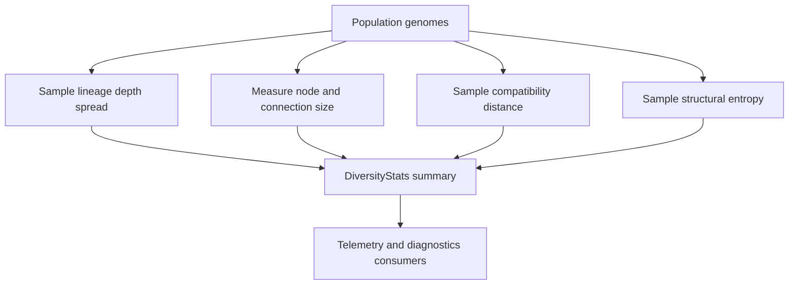

# neat/diversity

Diversity-reporting helpers for NEAT populations.

The diversity boundary answers one controller-facing question: "How varied is
the current population, and varied in what sense?" Rather than expose a long
list of low-level folds, the root chapter keeps two public read models in
view: one for a single network's structural shape and one for a whole
population summary that telemetry, diagnostics, and debugging tools can
compare across generations.

The summary is intentionally sampled rather than exhaustive. Diversity reads
are meant to stay cheap enough to run during telemetry capture, so the root
API favors stable trend signals over perfect all-pairs precision.

Read the chapter in this order:

- `structuralEntropy()` for the single-network topology fingerprint.
- `computeDiversityStats()` for the controller-facing population summary.
- `core/` when you need the heavier aggregation mechanics, sampling details,
  or the narrow contracts behind the root helpers.



The root chapter stays compact on purpose. `core/` owns the reusable sampling
and aggregation mechanics, while this file stays focused on the controller's
public read flow and the meaning of the resulting summary.

## neat/diversity/diversity.ts

### computeDiversityStats

```ts
computeDiversityStats(
  population: GenomeWithMetrics[],
  compatibilityComputer: CompatComputer,
): DiversityStats | undefined
```

Compute sampled diversity statistics for a NEAT population.

This is the controller-facing population read: it blends four evidence
families into one compact summary that is cheap enough to reuse during
telemetry capture and post-run diagnostics.

- lineage metrics estimate how far ancestry depth has spread or collapsed,
- structural size metrics summarize topology growth and unevenness,
- compatibility sampling estimates genetic separation across the population,
- entropy adds a topology-shape signal that raw size counts cannot express.

The helper intentionally samples pairwise lineage and compatibility work so
large populations can still produce diversity telemetry without quadratic
blowups. Interpret the returned object as a bounded trend report: it is best
for comparing generations, spotting collapse, or validating that speciation
and mutation pressure are still producing variety.

Parameters:
- `population` - - Population genomes exposing nodes, connections, and optional lineage depth.
- `compatibilityComputer` - - Compatibility-distance provider used for pair sampling.

Returns: Aggregate diversity statistics or `undefined` when the population is empty.

Example:

```ts
const diversity = computeDiversityStats(neat.population, neat);

if (diversity) {
  console.log(diversity.meanCompat, diversity.graphletEntropy);
}
```

### DiversityStats

Diversity statistics returned by sampled population analysis.

Treat this as a compact population-health snapshot rather than as a single
scalar "diversity score." Each field captures one aggregate lens on the
current population: lineage spread, structural size, compatibility
separation, or entropy.

Telemetry consumers usually compare these values across generations to answer
practical questions such as whether speciation is preserving spread, whether
topology growth is accelerating, or whether the run is collapsing toward a
narrow family of similar structures.

### MAX_COMPATIBILITY_SAMPLE

Maximum population sample size for compatibility comparisons.

Compatibility distance is the most obviously quadratic part of the diversity
report. Sampling lets the controller estimate genetic separation cheaply
enough to keep diversity reporting on the hot path for telemetry.

### MAX_LINEAGE_PAIR_SAMPLE

Maximum lineage sample size for pairwise depth comparisons.

Lineage spread is useful for telemetry, but full all-pairs ancestry distance
becomes expensive quickly. This cap keeps the lineage side of the report
bounded while still surfacing whether ancestry depth is bunching up or
staying distributed.

### structuralEntropy

```ts
structuralEntropy(
  graph: default,
): number
```

Compute the Shannon-style entropy of a network's out-degree distribution.

Structural entropy here is a lightweight topology fingerprint: it measures
how evenly outgoing connections are distributed across nodes. It does not
inspect weights or recurrent dynamics, so it works well as a cheap structural
diversity signal.

Use this when you want to compare the shape of individual networks or add one
more structural signal beside raw node and connection counts. Higher values
generally mean connectivity is spread across more nodes instead of being
concentrated into a few hubs.

Parameters:
- `graph` - - Network to summarize structurally.

Returns: Shannon-style entropy of the out-degree distribution.
