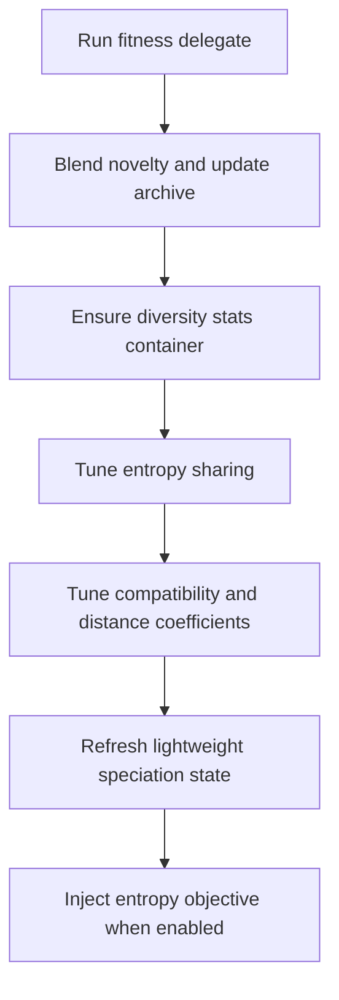

# neat/evaluate

Root orchestration for NEAT population evaluation.

Evaluation is the chapter that turns a raw population into something the rest of the NEAT
pipeline can actually reason about. Before `evolve()` can sort genomes, speciate them, or apply
adaptive policies, this layer has to answer a more basic question: what evidence do we currently
have about each candidate, and is that evidence rich enough to support the next controller step?

This boundary stays orchestration-first on purpose. The neighboring folders own the narrow work:
running the fitness delegate, computing behavioral novelty, maintaining diversity statistics, and
nudging evaluation-related parameters. This file exists so a reader can understand the whole
scoring-and-adaptation pass without reading those helper chapters in implementation order first.

Read this chapter when you want to answer questions such as:
- Does the controller score genomes one at a time or hand the whole population to one delegate?
- When does novelty get blended into ordinary fitness?
- Which adaptive tuning steps depend on post-evaluation statistics?
- Why does evaluation sometimes trigger lightweight speciation and objective registration work?

The evaluation loop is easiest to remember as six stages:
1. run the configured fitness pathway,
2. blend novelty and maintain the novelty archive when enabled,
3. ensure diversity-stat storage exists for downstream tuning,
4. tune sharing and compatibility parameters from fresh evidence,
5. refresh lightweight speciation state,
6. register the entropy objective when multi-objective evaluation asks for it.



Reading order:
- start with {@link evaluate} for the controller-facing flow,
- jump into `fitness/` when you need the per-genome versus whole-population scoring split,
- jump into `novelty/` when you need descriptor and archive semantics,
- jump into `entropy-sharing/`, `entropy-compat/`, and `auto-distance/` when you need tuning math,
- jump into `objectives/` when you need to understand the automatic entropy-objective path.

The exported constants below fall into four tuning families:
- novelty defaults for descriptor-based exploration,
- entropy-sharing defaults for diversity-distribution control,
- compatibility defaults for speciation pressure,
- distance-coefficient defaults for automatic structural-distance balancing.

## neat/evaluate/evaluate.ts

### evaluate

```ts
evaluate(): Promise<void>
```

Evaluate the population or population-wide fitness delegate.

This is the controller-facing scoring pass that prepares one generation for every downstream
decision the NEAT runtime will make next. Unlike `evolve()`, this method does not replace the
population or build offspring. Its job is narrower and just as important: establish current
scores, enrich them with optional novelty evidence, and refresh the adaptive statistics that the
next orchestration step will rely on.

The flow has two major halves:

1. produce evidence about the current population,
2. update lightweight controller state that depends on that evidence.

In practice that means:
1. resolve whether fitness runs once per genome or once for the entire population,
2. optionally clear per-genome runtime state before scoring,
3. optionally blend novelty search into the resulting scores,
4. make sure diversity-stat storage exists before tuning begins,
5. run the small adaptive tuning passes that respond to the freshly observed population,
6. optionally register the entropy objective for later multi-objective ranking.

A useful mental model is that `evaluate()` prepares the evidence layer, while `evolve()` later
consumes that evidence to rank, speciate, and rebuild the population. If evaluation is stale or
skipped, the rest of the lifecycle has less trustworthy data to work from.

Important side effects:
- updates genome scores in place,
- may update novelty values and append to the novelty archive,
- ensures `_diversityStats` exists before tuning helpers write into it,
- may adjust sharing sigma, compatibility thresholds, and distance coefficients,
- may refresh lightweight speciation state and register the entropy objective.

Read the neighboring chapters like this:
- `fitness/` explains how the scoring delegate is actually invoked,
- `novelty/` explains the descriptor-distance path and archive writes,
- `speciation/` explains the lightweight maintenance that can happen after scores land,
- `objectives/` explains why entropy objective registration lives in evaluation instead of evolve.

Returns: Promise that resolves after evaluation and adaptive follow-up steps.

Example:

```ts
await evaluate.call(controller);

// the population is now freshly scored and ready for selection or evolve()
const bestScore = Math.max(...controller.population.map((genome) => genome.score ?? 0));
console.log('best score after evaluation:', bestScore);
```

### AUTO_COEFF_ADJUST_DEFAULT

Default rate used when auto distance-coefficient tuning rebalances structural distance weights.

### AUTO_COEFF_MAX_DEFAULT

Maximum structural-distance coefficient allowed during automatic tuning.

### AUTO_COEFF_MIN_DEFAULT

Minimum structural-distance coefficient allowed during automatic tuning.

### COMPAT_MAX_THRESHOLD_DEFAULT

Maximum compatibility threshold allowed during automatic compatibility tuning.

### COMPAT_MIN_THRESHOLD_DEFAULT

Minimum compatibility threshold allowed during automatic compatibility tuning.

### COMPAT_THRESHOLD_DEFAULT

Baseline compatibility threshold used when no explicit value is configured.

### DISTANCE_COEFF_DEFAULT

Baseline structural-distance coefficient used before any automatic tuning occurs.

### ENTROPY_ADJUST_DEFAULT

Default rate used when compatibility tuning nudges the threshold upward or downward.

### ENTROPY_DEADBAND_DEFAULT

Deadband around the entropy target where compatibility tuning intentionally does nothing.

### ENTROPY_TARGET_DEFAULT

Target mean entropy used when tuning the compatibility threshold.

The goal is to keep speciation pressure near a stable diversity level instead of drifting toward
either species collapse or fragmentation.

### ENTROPY_VAR_ADJUST_DEFAULT

Default step size used when entropy-sharing tuning increases or decreases sharing sigma.

### ENTROPY_VAR_HIGH_BAND

Upper tolerance band for deciding that observed entropy variance is meaningfully high.

### ENTROPY_VAR_LOW_BAND

Lower tolerance band for deciding that observed entropy variance is meaningfully low.

### ENTROPY_VAR_MAX_SIGMA_DEFAULT

Upper bound for the sharing sigma used by entropy-sharing adaptation.

### ENTROPY_VAR_MIN_SIGMA_DEFAULT

Lower bound for the sharing sigma used by entropy-sharing adaptation.

### ENTROPY_VAR_TARGET_DEFAULT

Target variance used by entropy-sharing tuning.

The controller nudges sharing sigma toward a population whose entropy spread is neither too flat
nor too unstable.

### NeatControllerForEval

NEAT controller interface for evaluation.

This interface models the subset of a NEAT controller used by the evaluation
helpers. It includes options, population data, and optional adaptive tuning
hooks.

### NOVELTY_ARCHIVE_CAP

Maximum number of descriptors retained in the novelty archive.

The cap keeps novelty history useful for exploration while preventing unbounded memory growth.

### NOVELTY_DEFAULT_BLEND

Default blend factor used when mixing novelty into an existing fitness score.

A mid-range value keeps novelty influential without letting exploratory behavior completely drown
out task performance.

### NOVELTY_DEFAULT_NEIGHBORS

Default number of nearest neighbors used when computing novelty.

Small values keep novelty sensitive to local behavioral differences without requiring a large
archive or population.

### VARIANCE_DECREASE_THRESHOLD

Multiplier below which observed variance is treated as a meaningful decrease.

### VARIANCE_INCREASE_THRESHOLD

Multiplier above which observed variance is treated as a meaningful increase.
