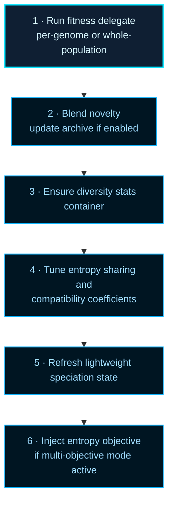

# neat/evaluate

Root orchestration for NEAT population evaluation.

## What Evaluation Means in NEAT

Evaluation is the grounding step that connects the evolutionary search to the
real task. Without it, NEAT has genomes and topologies but no evidence about
which ones are worth keeping. With it, the controller can sort, speciate,
apply adaptive pressure, and breed the next generation from a well-evidenced
view of the current population.

In NEAT, the fitness function is deliberately kept external to the library.
The caller supplies a scoring delegate — anything from a physics simulation
to an analytic reward function — and the evaluation layer calls it once per
genome (or hands the whole population to a parallel worker batch). That
separation keeps the library domain-agnostic while letting each caller define
what "good behavior" means for their specific task.

## Beyond Raw Fitness

Pure fitness maximization can be a poor proxy for the goal of finding
behaviorally diverse solutions. This evaluation boundary supports two
additional evidence sources that can supplement or replace raw fitness:

- **Novelty search** — scores genomes by how different their behavioral
descriptor* is from previously encountered behaviors, rather than by task
  performance. Useful when the fitness landscape is deceptive or has many
  dead-end attractors. See Lehman and Stanley,
  [Abandoning Objectives: Evolution Through the Search for Novelty Alone](http://eplex.cs.ucf.edu/papers/lehman_ecj11.pdf),
  for the original motivation.
- **Multi-objective ranking** — instead of one scalar fitness, multiple
  objectives are tracked simultaneously and genomes are ranked by Pareto
  dominance. The evaluation layer injects an entropy-diversity objective when
  multi-objective mode is active.

## The Six-Stage Evaluation Pass

The full evaluation pass runs these stages in order:

1. Run the configured fitness pathway (per-genome or whole-population).
2. Blend novelty evidence and maintain the novelty archive when enabled.
3. Ensure diversity-stat storage exists for downstream tuning.
4. Tune entropy-sharing and compatibility parameters from fresh evidence.
5. Refresh lightweight speciation state.
6. Register the entropy objective when multi-objective evaluation is active.



Reading order:
- start with {@link evaluate} for the controller-facing flow,
- jump into `fitness/` for the per-genome vs whole-population scoring split,
- jump into `novelty/` for descriptor and archive semantics,
- jump into `entropy-sharing/`, `entropy-compat/`, and `auto-distance/` for tuning math,
- jump into `objectives/` for the automatic entropy-objective path.

The exported constants fall into four tuning families:
- novelty defaults for descriptor-based exploration,
- entropy-sharing defaults for diversity-distribution control,
- compatibility defaults for speciation pressure,
- distance-coefficient defaults for automatic structural-distance balancing.

## neat/evaluate/evaluate.ts

### evaluate

```ts
evaluate(): Promise<void>
```

Evaluate the population or population-wide fitness delegate.

This is the controller-facing scoring pass that prepares one generation for every downstream
decision the NEAT runtime will make next. Unlike `evolve()`, this method does not replace the
population or build offspring. Its job is narrower and just as important: establish current
scores, enrich them with optional novelty evidence, and refresh the adaptive statistics that the
next orchestration step will rely on.

The flow has two major halves:

1. produce evidence about the current population,
2. update lightweight controller state that depends on that evidence.

In practice that means:
1. resolve whether fitness runs once per genome or once for the entire population,
2. optionally clear per-genome runtime state before scoring,
3. optionally blend novelty search into the resulting scores,
4. make sure diversity-stat storage exists before tuning begins,
5. run the small adaptive tuning passes that respond to the freshly observed population,
6. optionally register the entropy objective for later multi-objective ranking.

A useful mental model is that `evaluate()` prepares the evidence layer, while `evolve()` later
consumes that evidence to rank, speciate, and rebuild the population. If evaluation is stale or
skipped, the rest of the lifecycle has less trustworthy data to work from.

Important side effects:
- updates genome scores in place,
- may update novelty values and append to the novelty archive,
- ensures `_diversityStats` exists before tuning helpers write into it,
- may adjust sharing sigma, compatibility thresholds, and distance coefficients,
- may refresh lightweight speciation state and register the entropy objective.

Read the neighboring chapters like this:
- `fitness/` explains how the scoring delegate is actually invoked,
- `novelty/` explains the descriptor-distance path and archive writes,
- `speciation/` explains the lightweight maintenance that can happen after scores land,
- `objectives/` explains why entropy objective registration lives in evaluation instead of evolve.

Returns: Promise that resolves after evaluation and adaptive follow-up steps.

Example:

```ts
await evaluate.call(controller);

// the population is now freshly scored and ready for selection or evolve()
const bestScore = Math.max(...controller.population.map((genome) => genome.score ?? 0));
console.log('best score after evaluation:', bestScore);
```

### AUTO_COEFF_ADJUST_DEFAULT

Default rate used when auto distance-coefficient tuning rebalances structural distance weights.

This shared step size controls how quickly excess and disjoint coefficients react when topology
variance drifts away from the recent baseline.

### AUTO_COEFF_MAX_DEFAULT

Maximum structural-distance coefficient allowed during automatic tuning.

The upper bound prevents excess and disjoint penalties from dominating every later compatibility
comparison.

### AUTO_COEFF_MIN_DEFAULT

Minimum structural-distance coefficient allowed during automatic tuning.

The lower bound keeps structural differences meaningful even when the auto-distance policy is
softening species pressure.

### COMPAT_MAX_THRESHOLD_DEFAULT

Maximum compatibility threshold allowed during automatic compatibility tuning.

The upper clamp prevents compatibility from becoming so permissive that species boundaries lose
practical meaning.

### COMPAT_MIN_THRESHOLD_DEFAULT

Minimum compatibility threshold allowed during automatic compatibility tuning.

The lower clamp prevents the threshold from collapsing until even small structural differences
force unnecessary species fragmentation.

### COMPAT_THRESHOLD_DEFAULT

Baseline compatibility threshold used when no explicit value is configured.

This serves as the neutral starting point before entropy-based tuning or explicit user policy
begins to reshape species pressure.

### DISTANCE_COEFF_DEFAULT

Baseline structural-distance coefficient used before automatic tuning occurs.

This is the neutral starting point for the structural-distance fold before variance-driven
updates begin to reshape it.

### ENTROPY_ADJUST_DEFAULT

Default rate used when compatibility tuning nudges the threshold upward or downward.

A conservative step size keeps the compatibility-threshold loop gradual enough that later
speciation reads remain interpretable from one generation to the next.

### ENTROPY_DEADBAND_DEFAULT

Deadband around the entropy target where compatibility tuning intentionally does nothing.

The deadband reduces threshold jitter by treating small entropy deviations as normal noise
rather than signals that demand a policy change.

### ENTROPY_TARGET_DEFAULT

Target mean entropy used when tuning the compatibility threshold.

The goal is to keep speciation pressure near a stable diversity level instead of drifting toward
either species collapse or fragmentation.

### ENTROPY_VAR_ADJUST_DEFAULT

Default step size used when entropy-sharing tuning increases or decreases sharing sigma.

A modest default keeps the sigma controller responsive without letting one noisy variance read
swing the sharing radius too aggressively.

### ENTROPY_VAR_HIGH_BAND

Upper tolerance band for deciding that observed entropy variance is meaningfully high.

Values above this multiplier mark a population whose entropy spread is noisier than the tuning
target expects.

### ENTROPY_VAR_LOW_BAND

Lower tolerance band for deciding that observed entropy variance is meaningfully low.

Values below this multiplier mark a population whose entropy spread is flatter than the tuning
target expects.

### ENTROPY_VAR_MAX_SIGMA_DEFAULT

Upper bound for the sharing sigma used by entropy-sharing adaptation.

The upper clamp prevents the radius from widening until entropy sharing loses practical
contrast across the population.

### ENTROPY_VAR_MIN_SIGMA_DEFAULT

Lower bound for the sharing sigma used by entropy-sharing adaptation.

The lower clamp prevents the sharing radius from shrinking so far that later sharing pressure
becomes hypersensitive to tiny entropy fluctuations.

### ENTROPY_VAR_TARGET_DEFAULT

Target variance used by entropy-sharing tuning.

The controller nudges sharing sigma toward a population whose entropy spread is neither too flat
nor too unstable.

### NeatControllerForEval

NEAT controller interface for evaluation.

This interface models the subset of a NEAT controller used by the evaluation
helpers. It includes the runtime options, population data, lightweight
evidence caches, and optional hooks that the evaluate subtree needs in order
to enrich one generation without taking ownership of the whole controller.

The contract is intentionally broader than an individual helper needs but
still much smaller than the full `Neat` surface. That tradeoff keeps the
evaluate chapters interoperable while preserving a clear boundary between
evaluation and the rest of the runtime.

### NOVELTY_ARCHIVE_CAP

Maximum number of descriptors retained in the novelty archive.

The cap keeps novelty history useful for exploration while preventing unbounded memory growth.

### NOVELTY_DEFAULT_BLEND

Default blend factor used when mixing novelty into an existing fitness score.

A mid-range value keeps novelty influential without letting exploratory behavior completely drown
out task performance.

### NOVELTY_DEFAULT_NEIGHBORS

Default number of nearest neighbors used when computing novelty.

Small values keep novelty sensitive to local behavioral differences without requiring a large
archive or population.

### VARIANCE_DECREASE_THRESHOLD

Multiplier below which observed variance is treated as a meaningful decrease.

Drops below this band tell the auto-distance loop that topology sizes are converging relative to
the recent baseline.

### VARIANCE_INCREASE_THRESHOLD

Multiplier above which observed variance is treated as a meaningful increase.

Values above this band tell the auto-distance loop that topology sizes are spreading relative to
the recent baseline.
