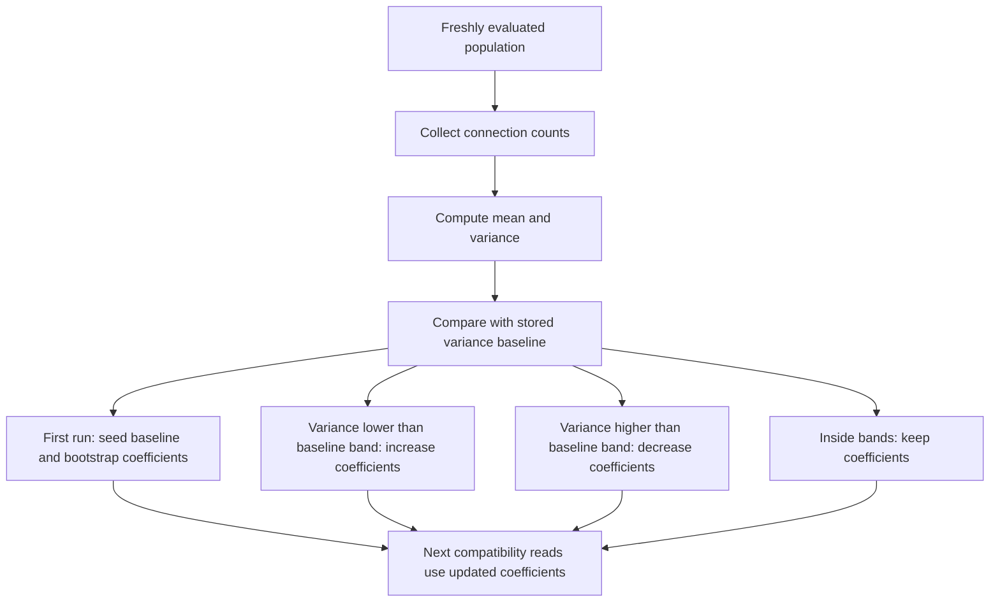

# neat/evaluate/auto-distance

Auto-distance tuning helpers for the NEAT evaluate chapter.

This chapter owns the variance-driven adjustment of compatibility-distance
coefficients. It watches connection-count variance across the evaluated
population and nudges the controller's excess and disjoint coefficients up or
down to keep structural diversity from collapsing.

The boundary is deliberately narrower than the surrounding speciation story.
By the time these helpers run, evaluation has already produced fresh scores
and diversity evidence. Auto-distance tuning does not change current species
membership or recompute pairwise compatibility distances in place. Instead it
adjusts the coefficients that later compatibility reads will use, so the next
cycle can respond to whether topology size is converging too quickly or
spreading too wildly.

Read this chapter when you want to answer questions such as:
- Why does evaluation tune excess and disjoint coefficients from connection
  variance instead of hard-coding them forever?
- Why does this policy compare against a moving baseline instead of a single
  target number?
- What does the first-run bootstrap do?
- Which controller assumptions stay stable for later selection and
  speciation reads?

The mental model is a four-step loop:
1. collect connection counts from the freshly evaluated population,
2. reduce them into a mean and variance,
3. compare the new variance with the last stored baseline,
4. raise or lower excess and disjoint coefficients inside safe bounds.

This boundary preserves the currently evaluated population as-is. Scores,
population order, and live species membership stay untouched; only the
distance coefficients are prepared for later compatibility and speciation
work.



## neat/evaluate/auto-distance/evaluate.auto-distance.ts

### applyAutoDistanceCoefficientTuning

```ts
applyAutoDistanceCoefficientTuning(
  controller: NeatControllerForEval,
  autoDistanceCoeffOptions: { enabled?: boolean | undefined; adjustRate?: number | undefined; minCoeff?: number | undefined; maxCoeff?: number | undefined; },
  connectionVariance: number,
): void
```

Apply the coefficient-tuning policy using the observed connection variance.

This helper compares the freshly observed variance with the controller's
stored baseline. Lower-than-expected variance means topology sizes are
converging, so excess and disjoint coefficients are increased to make future
structural differences matter more. Higher-than-expected variance means the
population is already spreading structurally, so the coefficients are eased
downward.

The comparison is deliberately relative instead of target-based. The policy
tracks the population's recent structural spread and responds to drift,
rather than forcing every problem domain toward one global variance number.

Parameters:
- `controller` - - NEAT controller instance for evaluation.
- `autoDistanceCoeffOptions` - - Tuning options that define adjustment rate
and coefficient bounds.
- `connectionVariance` - - Freshly observed variance of population
connection counts.

### applyDistanceCoefficientDecrease

```ts
applyDistanceCoefficientDecrease(
  controller: NeatControllerForEval,
  bounds: { minCoeff: number; maxCoeff: number; },
  adjustRate: number,
): void
```

Decrease distance coefficients within the configured bounds.

Decreasing these coefficients softens the structural-distance penalty when
topology sizes are already spreading, which helps keep the controller from
over-fragmenting species on the next pass.

Parameters:
- `controller` - - NEAT controller instance for evaluation.
- `bounds` - - Min and max coefficient bounds.
- `adjustRate` - - Adjustment rate.

### applyDistanceCoefficientIncrease

```ts
applyDistanceCoefficientIncrease(
  controller: NeatControllerForEval,
  bounds: { minCoeff: number; maxCoeff: number; },
  adjustRate: number,
): void
```

Increase distance coefficients within the configured bounds.

Increasing these coefficients makes later compatibility reads treat excess
and disjoint structural differences as more important, which helps push back
when topology sizes are collapsing toward one narrow profile.

Parameters:
- `controller` - - NEAT controller instance for evaluation.
- `bounds` - - Min and max coefficient bounds.
- `adjustRate` - - Adjustment rate.

### computeMean

```ts
computeMean(
  values: number[],
): number
```

Compute the arithmetic mean of a number list.

This small reducer keeps the higher-level tuning flow declarative: collect
connection counts first, then summarize them before making any policy
decision.

Parameters:
- `values` - - Input values.

Returns: Mean of the values.

### computeVariance

```ts
computeVariance(
  values: number[],
  meanValue: number,
): number
```

Compute the variance of a number list from a precomputed mean.

The tuning policy watches variance rather than just the raw mean so it can
notice when topology sizes are collapsing toward one narrow shape or
spreading apart more aggressively than before.

Parameters:
- `values` - - Input values.
- `meanValue` - - Precomputed mean.

Returns: Variance of the values.

### getDistanceCoefficientBounds

```ts
getDistanceCoefficientBounds(
  autoDistanceCoeffOptions: { enabled?: boolean | undefined; adjustRate?: number | undefined; minCoeff?: number | undefined; maxCoeff?: number | undefined; },
): { minCoeff: number; maxCoeff: number; }
```

Resolve the minimum and maximum coefficient bounds for tuning.

These bounds keep automatic tuning from shrinking structural-distance
pressure until compatibility becomes toothless, or increasing it until small
topology edits dominate every comparison.

Parameters:
- `autoDistanceCoeffOptions` - - Tuning options.

Returns: Min and max coefficient bounds.

### initializeConnectionVarianceBootstrap

```ts
initializeConnectionVarianceBootstrap(
  controller: NeatControllerForEval,
  connectionVariance: number,
  bounds: { minCoeff: number; maxCoeff: number; },
  adjustRate: number,
): void
```

Bootstrap connection-variance tuning the first time the policy runs.

The first run has no historical baseline yet, so this helper seeds the last
observed variance and applies one deterministic coefficient nudge. That makes
the policy immediately visible instead of waiting one extra generation before
any coefficient change is possible.

Parameters:
- `controller` - - NEAT controller instance for evaluation.
- `connectionVariance` - - Current connection variance.
- `bounds` - - Min and max coefficient bounds.
- `adjustRate` - - Adjustment rate.

### runAutoDistanceCoefficientTuning

```ts
runAutoDistanceCoefficientTuning(
  controller: NeatControllerForEval,
  evaluationOptions: { [key: string]: unknown; fitnessPopulation?: boolean | undefined; clear?: boolean | undefined; novelty?: { enabled?: boolean | undefined; descriptor?: ((genome: GenomeForEvaluation) => number[]) | undefined; k?: number | undefined; blendFactor?: number | undefined; archiveAddThreshold?: number | undefined; } | undefined; entropySharingTuning?: { enabled?: boolean | undefined; targetEntropyVar?: number | undefined; adjustRate?: number | undefined; minSigma?: number | undefined; maxSigma?: number | undefined; } | undefined; entropyCompatTuning?: { enabled?: boolean | undefined; targetEntropy?: number | undefined; deadband?: number | undefined; adjustRate?: number | undefined; minThreshold?: number | undefined; maxThreshold?: number | undefined; } | undefined; autoDistanceCoeffTuning?: { enabled?: boolean | undefined; adjustRate?: number | undefined; minCoeff?: number | undefined; maxCoeff?: number | undefined; } | undefined; multiObjective?: { enabled?: boolean | undefined; autoEntropy?: boolean | undefined; dynamic?: { enabled?: boolean | undefined; } | undefined; } | undefined; speciation?: boolean | undefined; targetSpecies?: number | undefined; compatAdjust?: boolean | undefined; speciesAllocation?: { extendedHistory?: boolean | undefined; } | undefined; sharingSigma?: number | undefined; compatibilityThreshold?: number | undefined; excessCoeff?: number | undefined; disjointCoeff?: number | undefined; },
): void
```

Apply variance-driven tuning to the controller's distance coefficients.

This is the controller-facing entrypoint for auto-distance tuning. It only
runs when both speciation and auto coefficient tuning are enabled because the
resulting coefficients are only meaningful when later compatibility reads are
still part of the runtime policy.

The helper preserves several important controller assumptions:
- genome scores are already complete and are not recomputed here,
- live species assignments are left intact,
- population order is left intact,
- only the structural-distance coefficients and their variance baseline are
  updated for future passes.

Parameters:
- `controller` - - NEAT controller instance for evaluation.
- `evaluationOptions` - - Options object for the current evaluation pass.

Example:

```ts
runAutoDistanceCoefficientTuning(controller, controller.options);
console.log(controller.options.excessCoeff, controller.options.disjointCoeff);
```
