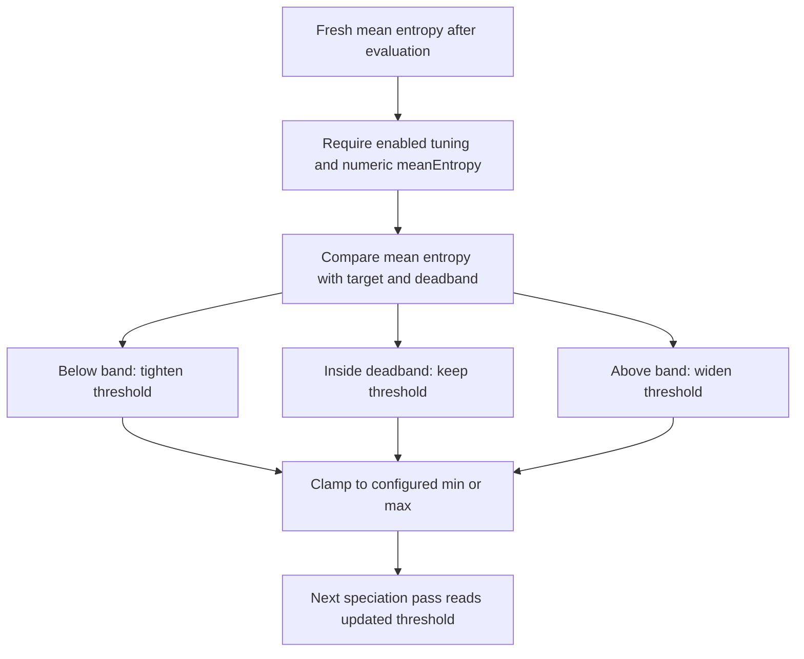

# neat/evaluate/entropy-compat

Entropy-compatibility tuning helpers for the NEAT evaluate chapter.

This chapter owns the adaptive compatibility-threshold adjustment that keeps
the controller's speciation threshold moving with the observed mean entropy
of the evaluated population.

The boundary stays intentionally small. Evaluation has already produced
fresh scores, novelty signals, and diversity measurements by the time these
helpers run. This chapter does not reassign species, rescore genomes, or
reinterpret the whole speciation policy. Its job is narrower: read the fresh
mean entropy signal and decide whether the next pass should loosen, tighten,
or preserve the compatibility threshold.

Read this chapter when you want to answer questions such as:
- Why does evaluation tune compatibility threshold from mean entropy instead
  of folding that logic into speciation itself?
- What does the deadband do, and why is it safer than reacting to every
  small entropy fluctuation?
- How do adjustment rate and threshold bounds interact?
- Which controller assumptions stay stable for later selection and
  speciation reads?

The mental model is a short three-step control loop:
1. read the fresh mean entropy after evaluation,
2. compare it with the configured target and deadband,
3. nudge the compatibility threshold up or down inside its safe bounds.

The preserved assumptions matter as much as the update. This boundary leaves
current genome scores, current species membership, and population order
untouched so downstream chapters can still reason about one stable evaluated
state while the next cycle inherits a better threshold.



## neat/evaluate/entropy-compat/evaluate.entropy-compat.ts

### computeNextCompatibilityThreshold

```ts
computeNextCompatibilityThreshold(
  entropyCompatOptions: { enabled?: boolean | undefined; targetEntropy?: number | undefined; deadband?: number | undefined; adjustRate?: number | undefined; minThreshold?: number | undefined; maxThreshold?: number | undefined; },
  meanEntropy: number,
  currentThreshold: number,
): number
```

Compute the next compatibility threshold from the observed mean entropy.

The rule uses a target-plus-deadband shape instead of reacting to every
small change in mean entropy. When entropy falls below the lower edge of the
band, the threshold is reduced so the next speciation pass becomes stricter.
When entropy rises above the upper edge, the threshold is increased so the
next pass tolerates a wider neighborhood. Readings inside the deadband keep
the threshold unchanged to avoid jitter.

The result is always clamped to the configured minimum and maximum so the
controller cannot drift into an unusably tiny or overly permissive threshold.

Parameters:
- `entropyCompatOptions` - - Tuning options that define the target entropy,
deadband width, adjustment rate, and clamp bounds.
- `meanEntropy` - - Freshly observed mean structural entropy for the current
population.
- `currentThreshold` - - Current compatibility threshold before adjustment.

Returns: Next compatibility threshold to carry into later controller passes.

Example:

```ts
const nextThreshold = computeNextCompatibilityThreshold(
  { enabled: true, targetEntropy: 0.4, deadband: 0.02, adjustRate: 0.1, minThreshold: 1, maxThreshold: 6 },
  0.46,
  3,
);

console.log(nextThreshold);
```

### runEntropyCompatibilityTuning

```ts
runEntropyCompatibilityTuning(
  controller: NeatControllerForEval,
  evaluationOptions: { [key: string]: unknown; fitnessPopulation?: boolean | undefined; clear?: boolean | undefined; novelty?: { enabled?: boolean | undefined; descriptor?: ((genome: GenomeForEvaluation) => number[]) | undefined; k?: number | undefined; blendFactor?: number | undefined; archiveAddThreshold?: number | undefined; } | undefined; entropySharingTuning?: { enabled?: boolean | undefined; targetEntropyVar?: number | undefined; adjustRate?: number | undefined; minSigma?: number | undefined; maxSigma?: number | undefined; } | undefined; entropyCompatTuning?: { enabled?: boolean | undefined; targetEntropy?: number | undefined; deadband?: number | undefined; adjustRate?: number | undefined; minThreshold?: number | undefined; maxThreshold?: number | undefined; } | undefined; autoDistanceCoeffTuning?: { enabled?: boolean | undefined; adjustRate?: number | undefined; minCoeff?: number | undefined; maxCoeff?: number | undefined; } | undefined; multiObjective?: { enabled?: boolean | undefined; autoEntropy?: boolean | undefined; dynamic?: { enabled?: boolean | undefined; } | undefined; } | undefined; speciation?: boolean | undefined; targetSpecies?: number | undefined; compatAdjust?: boolean | undefined; speciesAllocation?: { extendedHistory?: boolean | undefined; } | undefined; sharingSigma?: number | undefined; compatibilityThreshold?: number | undefined; excessCoeff?: number | undefined; disjointCoeff?: number | undefined; },
): void
```

Adjust the compatibility threshold when entropy-compatibility tuning is enabled.

This is the controller-facing entrypoint for the entropy-compatibility
chapter. It behaves like best-effort maintenance after fresh diversity
evidence has been written, not like a required scoring or speciation phase.

The helper preserves several important controller assumptions:
- genome scores are already complete and are not recomputed here,
- current species assignments are left intact,
- population order is left intact,
- only `compatibilityThreshold` is prepared for later passes.

That narrow scope lets the evaluation chapter adjust future speciation
pressure without widening into a full species-rebuild workflow.

Parameters:
- `controller` - - NEAT controller instance for evaluation.
- `evaluationOptions` - - Options object for the current evaluation pass.

Example:

```ts
controller._diversityStats = { meanEntropy: 0.42 };

runEntropyCompatibilityTuning(controller, controller.options);
console.log(controller.options.compatibilityThreshold);
```
