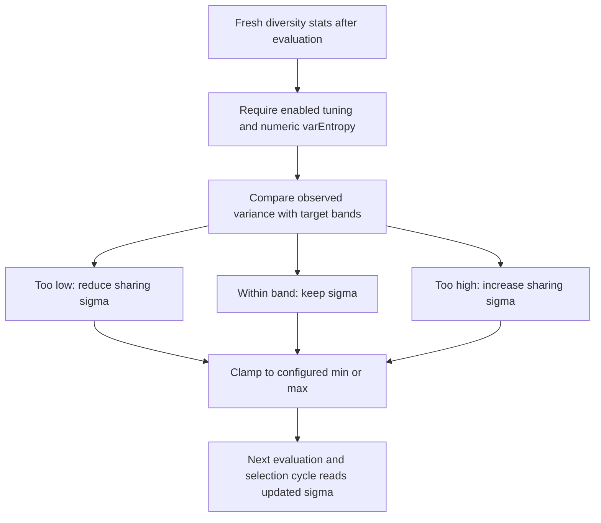

# neat/evaluate/entropy-sharing

Entropy-sharing tuning helpers for the NEAT evaluate chapter.

This chapter owns the small post-evaluation adjustment that nudges
`sharingSigma` based on the observed variance of structural entropy across
the current population.

The boundary stays intentionally narrow. By the time these helpers run, the
evaluation stage has already produced fresh scores and diversity evidence.
Entropy-sharing tuning does not rescore genomes, rebuild species, or widen
into another compatibility-control loop. Its only job is to read the newly
observed entropy spread and decide whether the next generation should apply
stronger or weaker sharing pressure.

Read this chapter when you want to answer questions such as:

- Why does evaluation keep `sharingSigma` adaptation separate from the rest
  of the scoring pipeline?
- What evidence is considered trustworthy enough to tune sigma?
- How do the variance bands, adjustment rate, and min or max bounds interact?
- Which controller assumptions stay stable for later selection and
  speciation reads?

The mental model is a short three-step loop:

1. make sure diversity-stat storage exists,
2. read the fresh entropy-variance measurement,
3. nudge `sharingSigma` up or down inside its configured bounds.

The important preserved assumptions are just as valuable as the update
itself. This boundary leaves genome scores, population ordering, species
membership, and compatibility-threshold policy untouched so later selection
and speciation chapters can still reason from stable post-evaluation state.



## neat/evaluate/entropy-sharing/evaluate.entropy-sharing.ts

### computeNextSharingSigma

```ts
computeNextSharingSigma(
  entropySharingOptions: { enabled?: boolean | undefined; targetEntropyVar?: number | undefined; adjustRate?: number | undefined; minSigma?: number | undefined; maxSigma?: number | undefined; },
  currentVarEntropy: number,
  currentSigma: number,
): number
```

Compute the next sharing sigma value from the observed entropy variance.

The tuning rule is intentionally small and band-driven instead of trying to
build a full controller inside evaluation. When observed variance drops below
the low band, sigma is reduced so the next pass applies a tighter sharing
radius. When variance rises above the high band, sigma is increased so the
next pass smooths pressure across a wider neighborhood. Values inside the
band keep the current sigma unchanged.

The returned value is always clamped to the configured minimum and maximum,
which keeps tuning predictable even when entropy measurements swing sharply.

Parameters:

- `entropySharingOptions` - Tuning options that define the target
  entropy variance, adjustment rate, and clamp bounds.
- `currentVarEntropy` - Freshly observed variance of structural entropy
  for the current population.
- `currentSigma` - Current sharing sigma before this adjustment.

Returns: Next sharing sigma value to carry into later controller passes.

Example:

```ts
const nextSigma = computeNextSharingSigma(
  {
    enabled: true,
    targetEntropyVar: 0.2,
    adjustRate: 0.1,
    minSigma: 0.5,
    maxSigma: 3,
  },
  0.28,
  1,
);

console.log(nextSigma);
```

### ensureDiversityStatsContainer

```ts
ensureDiversityStatsContainer(
  controller: NeatControllerForEval,
): void
```

Ensure diversity statistics storage exists before tuning writes into it.

Evaluation uses this as a small guardrail before an adaptive helper writes
post-score measurements. The container is created lazily so callers do not
need to pre-seed optional diversity state during controller construction.

Parameters:

- `controller` - NEAT controller instance for evaluation.

### runEntropySharingTuning

```ts
runEntropySharingTuning(
  controller: NeatControllerForEval,
  evaluationOptions: { [key: string]: unknown; fitnessPopulation?: boolean | undefined; clear?: boolean | undefined; novelty?: { enabled?: boolean | undefined; descriptor?: ((genome: GenomeForEvaluation) => number[]) | undefined; k?: number | undefined; blendFactor?: number | undefined; archiveAddThreshold?: number | undefined; } | undefined; entropySharingTuning?: { enabled?: boolean | undefined; targetEntropyVar?: number | undefined; adjustRate?: number | undefined; minSigma?: number | undefined; maxSigma?: number | undefined; } | undefined; entropyCompatTuning?: { enabled?: boolean | undefined; targetEntropy?: number | undefined; deadband?: number | undefined; adjustRate?: number | undefined; minThreshold?: number | undefined; maxThreshold?: number | undefined; } | undefined; autoDistanceCoeffTuning?: { enabled?: boolean | undefined; adjustRate?: number | undefined; minCoeff?: number | undefined; maxCoeff?: number | undefined; } | undefined; multiObjective?: { enabled?: boolean | undefined; autoEntropy?: boolean | undefined; dynamic?: { enabled?: boolean | undefined; } | undefined; } | undefined; speciation?: boolean | undefined; targetSpecies?: number | undefined; compatAdjust?: boolean | undefined; speciesAllocation?: { extendedHistory?: boolean | undefined; } | undefined; sharingSigma?: number | undefined; compatibilityThreshold?: number | undefined; excessCoeff?: number | undefined; disjointCoeff?: number | undefined; },
): void
```

Adjust the entropy-sharing sigma when entropy sharing tuning is enabled.

This is the controller-facing entrypoint for the entropy-sharing chapter.
It runs only after evaluation has produced fresh diversity evidence, and it
intentionally behaves like best-effort maintenance rather than a required
scoring step.

The helper preserves several important controller assumptions:

- genome scores are treated as complete and are not recomputed here,
- population order is not changed here,
- species assignment is not refreshed here,
- only `sharingSigma` is updated for future passes.

That narrow scope lets later selection and speciation reads consume the same
evaluated population while still benefiting from a tuned sharing radius on
the next cycle.

Parameters:

- `controller` - NEAT controller instance for evaluation.
- `evaluationOptions` - Options object for the current evaluation pass.

Example:

```ts
ensureDiversityStatsContainer(controller);
controller._diversityStats!.varEntropy = 0.18;

runEntropySharingTuning(controller, controller.options);
console.log(controller.options.sharingSigma);
```
