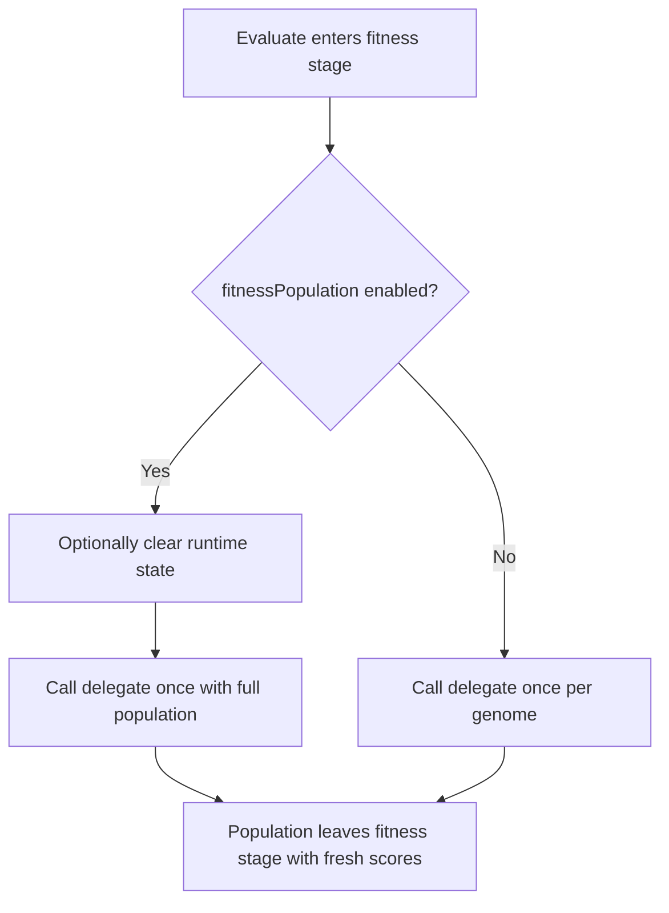

# neat/evaluate/fitness

Fitness-evaluation helpers for the NEAT evaluate chapter.

This chapter is the front door of evaluation. The root evaluate chapter
explains the six-stage evidence-building pipeline; this file owns the very
first decision inside that pipeline: how the controller actually invokes the
user-provided fitness delegate.

Two questions matter here:

1. does the caller want one delegate call for the whole population or one
   delegate call per genome,
2. should per-genome runtime state be cleared before scoring begins.

Those choices are intentionally isolated from novelty blending and adaptive
tuning. This boundary should stay focused on score production itself so later
evaluation helpers can assume the population has already been scored through
one consistent pathway.



## neat/evaluate/fitness/evaluate.fitness.ts

### runFitnessEvaluation

```ts
runFitnessEvaluation(
  controller: NeatControllerForEval,
  evaluationOptions: { [key: string]: unknown; fitnessPopulation?: boolean | undefined; clear?: boolean | undefined; novelty?: { enabled?: boolean | undefined; descriptor?: ((genome: GenomeForEvaluation) => number[]) | undefined; k?: number | undefined; blendFactor?: number | undefined; archiveAddThreshold?: number | undefined; } | undefined; entropySharingTuning?: { enabled?: boolean | undefined; targetEntropyVar?: number | undefined; adjustRate?: number | undefined; minSigma?: number | undefined; maxSigma?: number | undefined; } | undefined; entropyCompatTuning?: { enabled?: boolean | undefined; targetEntropy?: number | undefined; deadband?: number | undefined; adjustRate?: number | undefined; minThreshold?: number | undefined; maxThreshold?: number | undefined; } | undefined; autoDistanceCoeffTuning?: { enabled?: boolean | undefined; adjustRate?: number | undefined; minCoeff?: number | undefined; maxCoeff?: number | undefined; } | undefined; multiObjective?: { enabled?: boolean | undefined; autoEntropy?: boolean | undefined; dynamic?: { enabled?: boolean | undefined; } | undefined; } | undefined; speciation?: boolean | undefined; targetSpecies?: number | undefined; compatAdjust?: boolean | undefined; speciesAllocation?: { extendedHistory?: boolean | undefined; } | undefined; sharingSigma?: number | undefined; compatibilityThreshold?: number | undefined; excessCoeff?: number | undefined; disjointCoeff?: number | undefined; },
): Promise<void>
```

Run the configured fitness delegate.

This helper preserves the two supported scoring modes without letting that
branch leak across the rest of the evaluate chapter.

- Population mode clears genome state first when requested, then hands the
  whole population to one delegate call. Use this when the evaluator needs to
  compare genomes together or update scores through shared batch logic.
- Per-genome mode optionally clears each genome just before scoring and then
  records the returned numeric score on that genome in place.

Read this as the contract that converts "an evaluation delegate exists" into
"the controller now has fresh scores to build on."

Parameters:
- `controller` - - NEAT controller instance for evaluation.
- `evaluationOptions` - - Options object for the current evaluation pass.

Returns: Promise that resolves after fitness evaluation completes.

### clearGenomeStateIfRequested

```ts
clearGenomeStateIfRequested(
  controller: NeatControllerForEval,
  evaluationOptions: { [key: string]: unknown; fitnessPopulation?: boolean | undefined; clear?: boolean | undefined; novelty?: { enabled?: boolean | undefined; descriptor?: ((genome: GenomeForEvaluation) => number[]) | undefined; k?: number | undefined; blendFactor?: number | undefined; archiveAddThreshold?: number | undefined; } | undefined; entropySharingTuning?: { enabled?: boolean | undefined; targetEntropyVar?: number | undefined; adjustRate?: number | undefined; minSigma?: number | undefined; maxSigma?: number | undefined; } | undefined; entropyCompatTuning?: { enabled?: boolean | undefined; targetEntropy?: number | undefined; deadband?: number | undefined; adjustRate?: number | undefined; minThreshold?: number | undefined; maxThreshold?: number | undefined; } | undefined; autoDistanceCoeffTuning?: { enabled?: boolean | undefined; adjustRate?: number | undefined; minCoeff?: number | undefined; maxCoeff?: number | undefined; } | undefined; multiObjective?: { enabled?: boolean | undefined; autoEntropy?: boolean | undefined; dynamic?: { enabled?: boolean | undefined; } | undefined; } | undefined; speciation?: boolean | undefined; targetSpecies?: number | undefined; compatAdjust?: boolean | undefined; speciesAllocation?: { extendedHistory?: boolean | undefined; } | undefined; sharingSigma?: number | undefined; compatibilityThreshold?: number | undefined; excessCoeff?: number | undefined; disjointCoeff?: number | undefined; },
  clearAction: (genome: GenomeForEvaluation) => void,
): void
```

Clear cached genome state before evaluation when configured.

Some evaluators expect each genome to start from a clean runtime state before
scoring. This helper centralizes that policy so the two scoring modes do not
each invent their own clearing rule. If clearing is disabled, the helper does
nothing; if enabled, it applies the caller-provided clear action across the
current population.

Parameters:
- `controller` - - NEAT controller instance for evaluation.
- `evaluationOptions` - - Options object for the current evaluation pass.
- `clearAction` - - Action that clears a genome's internal state.
