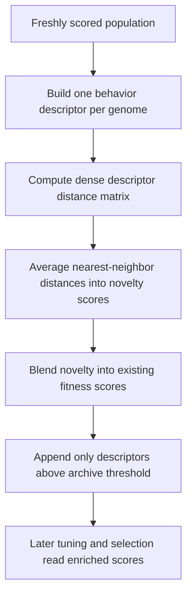

# neat/evaluate/novelty

Novelty-search helpers for the NEAT evaluate chapter.

This chapter keeps the behavior-descriptor path together: collect
descriptors, compute pairwise distances, score novelty against nearby
neighbors, blend novelty into the current fitness score, and append archive
entries when they beat the configured threshold.

The boundary is intentionally evidence-focused. By the time these helpers
run, the fitness stage has already produced fresh scores or at least
prepared the population for scoring. Novelty does not replace evaluation with
an entirely separate optimization loop. Instead it adds one more kind of
evidence: how behaviorally unusual each genome looks relative to its nearby
peers.

Read this chapter when you want to answer questions such as:
- Why does novelty stay a separate evaluation stage instead of widening into
  objective management or multi-objective ranking?
- How do descriptor building, distance-matrix construction, and neighbor
  scoring fit together?
- What does blend factor actually mean when a genome already has a fitness
  score?
- Why is archive admission threshold-based instead of recording every
  descriptor forever?

The mental model is a five-step evidence loop:
1. build one behavior descriptor per genome,
2. compute pairwise distances across that descriptor set,
3. average the nearest-neighbor distances into a novelty score,
4. blend novelty into the current score when a numeric fitness score exists,
5. append only sufficiently novel descriptors to the bounded archive.

The preserved assumptions matter as much as the additional evidence. This
boundary does not reorder the population, rebuild species, or register new
objectives. It annotates each genome with novelty evidence and optionally
blends that evidence into the current score so later tuning, selection, and
speciation reads can still reason from one stable evaluated population.

Step 7.5 boundary note: novelty is a controller-policy overlay. It may
annotate `_novelty` and optionally rewrite the current generation's `score`
field when blending against existing fitness, but it does not redefine genome
identity, compatibility distance, or objective registration.



## neat/evaluate/novelty/evaluate.novelty.ts

### addGenomeToNoveltyArchive

```ts
addGenomeToNoveltyArchive(
  controller: NeatControllerForEval,
  descriptor: number[],
  novelty: number,
  noveltyOptions: { enabled?: boolean | undefined; descriptor?: ((genome: GenomeForEvaluation) => number[]) | undefined; k?: number | undefined; blendFactor?: number | undefined; archiveAddThreshold?: number | undefined; },
): void
```

Add a descriptor to the novelty archive when it exceeds the threshold.

The archive is intentionally bounded and selective. Threshold-based admission
keeps it focused on descriptors that are genuinely unusual enough to be worth
remembering, while the cap prevents novelty exploration from turning into an
unbounded memory sink.

Parameters:
- `controller` - NEAT controller instance for evaluation.
- `descriptor` - Behavior descriptor for the current genome.
- `novelty` - Computed novelty score.
- `noveltyOptions` - Novelty configuration.

### applyNoveltyToPopulation

```ts
applyNoveltyToPopulation(
  controller: NeatControllerForEval,
  descriptors: number[][],
  distanceMatrix: number[][],
  kNeighbors: number,
  blendFactor: number,
  noveltyOptions: { enabled?: boolean | undefined; descriptor?: ((genome: GenomeForEvaluation) => number[]) | undefined; k?: number | undefined; blendFactor?: number | undefined; archiveAddThreshold?: number | undefined; },
): void
```

Apply novelty scores and archive writes across the population.

This helper is the fold stage of the novelty pipeline. It translates the
descriptor-distance evidence into per-genome novelty annotations, then
optionally blends that evidence into numeric scores and records sufficiently
novel descriptors for future exploration pressure.

Parameters:
- `controller` - NEAT controller instance for evaluation.
- `descriptors` - Descriptor vectors for each genome.
- `distanceMatrix` - Dense distance matrix.
- `kNeighbors` - Number of nearest neighbors to average.
- `blendFactor` - Novelty-vs-fitness blend factor.
- `noveltyOptions` - Novelty configuration.

### blendNoveltyIntoScore

```ts
blendNoveltyIntoScore(
  genome: GenomeForEvaluation,
  novelty: number,
  blendFactor: number,
): void
```

Blend novelty into the genome score when the score already exists.

This stage intentionally does not invent a base score when one is missing.
Novelty acts as a companion signal to the existing evaluation path, not as a
universal replacement for every scoring mode.

When this helper writes `genome.score`, it is rewriting the current
controller-visible score overlay for later phases of the same generation.
Callers that need the unblended raw task score should preserve it separately
before novelty blending.

Parameters:
- `genome` - Genome to update.
- `novelty` - Computed novelty value.
- `blendFactor` - Blend factor for novelty versus fitness.

### buildDistanceMatrix

```ts
buildDistanceMatrix(
  descriptors: number[][],
): number[][]
```

Build the full pairwise distance matrix for the descriptor set.

The matrix is dense and population-order aligned so later helpers can keep
the scoring flow simple: each genome reads one row, drops its self-distance,
and averages the nearest neighbors.

Parameters:
- `descriptors` - Descriptor vectors for the current population.

Returns: Dense distance matrix aligned with population order.

### buildNoveltyDescriptors

```ts
buildNoveltyDescriptors(
  controller: NeatControllerForEval,
  noveltyOptions: { enabled?: boolean | undefined; descriptor?: ((genome: GenomeForEvaluation) => number[]) | undefined; k?: number | undefined; blendFactor?: number | undefined; archiveAddThreshold?: number | undefined; },
): number[][]
```

Build behavior descriptors for the current population.

Descriptor building is isolated here so the rest of the chapter can treat
novelty as a pure data pipeline: descriptor first, distance second, scoring
third. Descriptor failures degrade to an empty vector instead of failing the
entire evaluation pass.

Parameters:
- `controller` - NEAT controller instance for evaluation.
- `noveltyOptions` - Novelty configuration.

Returns: Descriptor vectors aligned with population order.

### computeDescriptorDistance

```ts
computeDescriptorDistance(
  leftDescriptor: number[],
  rightDescriptor: number[],
  isSame: boolean,
): number
```

Compute the Euclidean distance between two descriptors.

Distance is computed across the shared descriptor prefix so callers can keep
using practical descriptor functions even when they occasionally emit vectors
of uneven length. Self-distance is fixed at zero to keep later neighbor
ranking deterministic.

Parameters:
- `leftDescriptor` - Left descriptor vector.
- `rightDescriptor` - Right descriptor vector.
- `isSame` - Whether both descriptors belong to the same genome index.

Returns: Euclidean distance across the shared prefix.

### computeNoveltyScore

```ts
computeNoveltyScore(
  distanceRow: number[],
  kNeighbors: number,
): number
```

Compute a novelty score from one row of the distance matrix.

Novelty is defined here as the average distance to the nearest neighbors
after excluding the genome's self-distance. Higher values mean the genome is
behaving in a less crowded region of descriptor space.

Parameters:
- `distanceRow` - Distance values for a single genome.
- `kNeighbors` - Number of nearest neighbors to average.

Returns: Novelty score for the genome.

### getNoveltyBlendFactor

```ts
getNoveltyBlendFactor(
  noveltyOptions: { enabled?: boolean | undefined; descriptor?: ((genome: GenomeForEvaluation) => number[]) | undefined; k?: number | undefined; blendFactor?: number | undefined; archiveAddThreshold?: number | undefined; },
): number
```

Resolve the novelty-vs-fitness blend factor.

A factor of `0` keeps the existing fitness score unchanged. A factor of `1`
makes novelty fully replace it when a numeric score exists. Values in between
turn novelty into a partial exploratory bonus instead of a hard override.

Parameters:
- `noveltyOptions` - Novelty configuration.

Returns: Blend factor used when a genome already has a numeric score.

### getNoveltyNeighborCount

```ts
getNoveltyNeighborCount(
  noveltyOptions: { enabled?: boolean | undefined; descriptor?: ((genome: GenomeForEvaluation) => number[]) | undefined; k?: number | undefined; blendFactor?: number | undefined; archiveAddThreshold?: number | undefined; },
): number
```

Resolve the number of nearest neighbors used for novelty scoring.

Smaller neighbor counts make novelty more sensitive to local behavioral
differences, while larger counts smooth that signal across a wider portion of
the current population.

Parameters:
- `noveltyOptions` - Novelty configuration.

Returns: Neighbor count clamped to at least one.

### runNoveltyBlendAndArchive

```ts
runNoveltyBlendAndArchive(
  controller: NeatControllerForEval,
  evaluationOptions: { [key: string]: unknown; fitnessPopulation?: boolean | undefined; clear?: boolean | undefined; novelty?: { enabled?: boolean | undefined; descriptor?: ((genome: GenomeForEvaluation) => number[]) | undefined; k?: number | undefined; blendFactor?: number | undefined; archiveAddThreshold?: number | undefined; } | undefined; entropySharingTuning?: { enabled?: boolean | undefined; targetEntropyVar?: number | undefined; adjustRate?: number | undefined; minSigma?: number | undefined; maxSigma?: number | undefined; } | undefined; entropyCompatTuning?: { enabled?: boolean | undefined; targetEntropy?: number | undefined; deadband?: number | undefined; adjustRate?: number | undefined; minThreshold?: number | undefined; maxThreshold?: number | undefined; } | undefined; autoDistanceCoeffTuning?: { enabled?: boolean | undefined; adjustRate?: number | undefined; minCoeff?: number | undefined; maxCoeff?: number | undefined; } | undefined; multiObjective?: { enabled?: boolean | undefined; autoEntropy?: boolean | undefined; dynamic?: { enabled?: boolean | undefined; } | undefined; } | undefined; speciation?: boolean | undefined; targetSpecies?: number | undefined; compatAdjust?: boolean | undefined; speciesAllocation?: { extendedHistory?: boolean | undefined; } | undefined; sharingSigma?: number | undefined; compatibilityThreshold?: number | undefined; excessCoeff?: number | undefined; disjointCoeff?: number | undefined; },
): void
```

Compute novelty, blend it into scores, and update the novelty archive.

This is the controller-facing entrypoint for the novelty stage. It behaves
like best-effort evidence enrichment after the core fitness path has run.
If novelty is disabled or misconfigured, evaluation can safely continue with
the base score evidence alone.

The helper preserves several important controller assumptions:
- the current population order is left intact,
- current species membership is left intact,
- no objective-registration policy is changed here,
- only novelty evidence, optional score blending, and archive state are
  updated.

Parameters:
- `controller` - NEAT controller instance for evaluation.
- `evaluationOptions` - Options object for the current evaluation pass.

Example:

```ts
runNoveltyBlendAndArchive(controller, controller.options);
console.log(controller.population[0]?._novelty);
```
