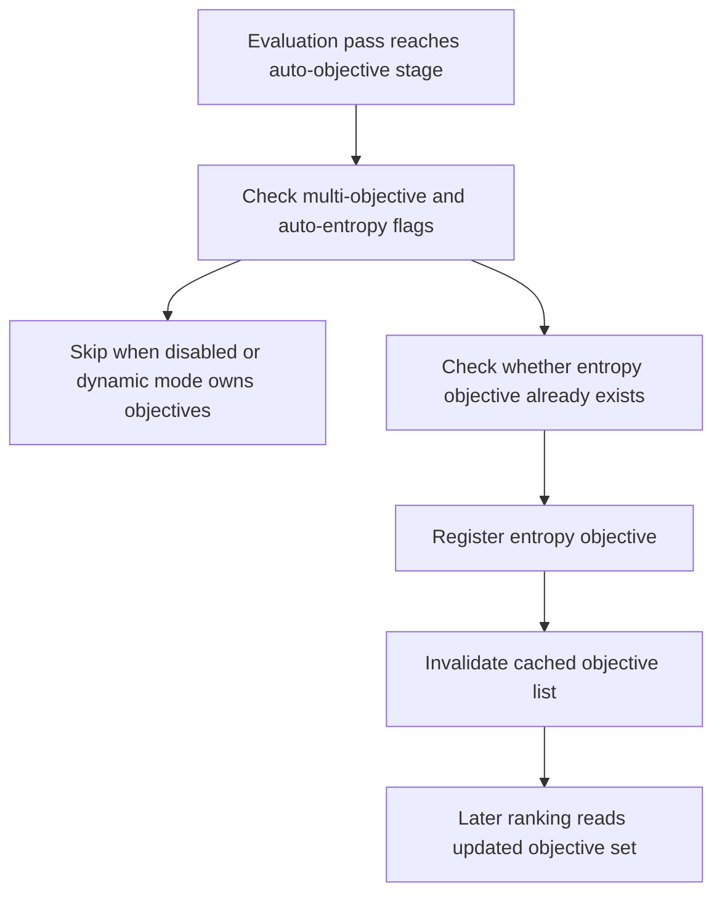

# neat/evaluate/objectives

Objective-registration helpers for the NEAT evaluate chapter.

This chapter owns the narrow policy that automatically registers an entropy
objective during evaluation when multi-objective mode is active and the
controller requests auto-entropy behavior.

The boundary is intentionally policy-sized rather than subsystem-sized.
Evaluation does not try to own all objective management here. Instead it
answers one narrow question: when the controller is already running in
multi-objective mode, should this pass ensure that structural entropy is one
of the active objectives?

Read this chapter when you want to answer questions such as:
- Why does auto-entropy registration happen during evaluation instead of in
  constructor setup or the broader objectives chapter?
- What conditions must be true before entropy is injected automatically?
- Why does this helper invalidate the cached objective list after
  registration?
- Which controller assumptions stay stable for later ranking and selection
  reads?

The mental model is a three-step policy gate:
1. check whether multi-objective mode and auto-entropy are both active,
2. skip if entropy is already present or dynamic-objective mode owns the
  policy,
3. register entropy and invalidate cached objective resolution.

This boundary preserves the current scores, novelty evidence, and species
state. It only updates the objective vocabulary that later ranking stages may
consume.



## neat/evaluate/objectives/evaluate.objectives.ts

### runAutoEntropyObjectiveInjection

```ts
runAutoEntropyObjectiveInjection(
  controller: NeatControllerForEval,
  evaluationOptions: { [key: string]: unknown; fitnessPopulation?: boolean | undefined; clear?: boolean | undefined; novelty?: { enabled?: boolean | undefined; descriptor?: ((genome: GenomeForEvaluation) => number[]) | undefined; k?: number | undefined; blendFactor?: number | undefined; archiveAddThreshold?: number | undefined; } | undefined; entropySharingTuning?: { enabled?: boolean | undefined; targetEntropyVar?: number | undefined; adjustRate?: number | undefined; minSigma?: number | undefined; maxSigma?: number | undefined; } | undefined; entropyCompatTuning?: { enabled?: boolean | undefined; targetEntropy?: number | undefined; deadband?: number | undefined; adjustRate?: number | undefined; minThreshold?: number | undefined; maxThreshold?: number | undefined; } | undefined; autoDistanceCoeffTuning?: { enabled?: boolean | undefined; adjustRate?: number | undefined; minCoeff?: number | undefined; maxCoeff?: number | undefined; } | undefined; multiObjective?: { enabled?: boolean | undefined; autoEntropy?: boolean | undefined; dynamic?: { enabled?: boolean | undefined; } | undefined; } | undefined; speciation?: boolean | undefined; targetSpecies?: number | undefined; compatAdjust?: boolean | undefined; speciesAllocation?: { extendedHistory?: boolean | undefined; } | undefined; sharingSigma?: number | undefined; compatibilityThreshold?: number | undefined; excessCoeff?: number | undefined; disjointCoeff?: number | undefined; },
): void
```

Inject the entropy objective when multi-objective evaluation requests it.

This is the controller-facing entrypoint for the evaluate-objectives stage.
It behaves like best-effort policy maintenance after the rest of the
evaluation evidence has been gathered.

The helper preserves several important controller assumptions:
- current scores are left intact,
- novelty and diversity evidence are left intact,
- current species state is left intact,
- only the objective-registration layer and its cache are updated.

Parameters:
- `controller` - - NEAT controller instance for evaluation.
- `evaluationOptions` - - Options object for the current evaluation pass.

Example:

```ts
runAutoEntropyObjectiveInjection(controller, controller.options);
console.log(controller._getObjectives?.().map((objective) => objective.key));
```

### shouldAutoInjectEntropy

```ts
shouldAutoInjectEntropy(
  evaluationOptions: { [key: string]: unknown; fitnessPopulation?: boolean | undefined; clear?: boolean | undefined; novelty?: { enabled?: boolean | undefined; descriptor?: ((genome: GenomeForEvaluation) => number[]) | undefined; k?: number | undefined; blendFactor?: number | undefined; archiveAddThreshold?: number | undefined; } | undefined; entropySharingTuning?: { enabled?: boolean | undefined; targetEntropyVar?: number | undefined; adjustRate?: number | undefined; minSigma?: number | undefined; maxSigma?: number | undefined; } | undefined; entropyCompatTuning?: { enabled?: boolean | undefined; targetEntropy?: number | undefined; deadband?: number | undefined; adjustRate?: number | undefined; minThreshold?: number | undefined; maxThreshold?: number | undefined; } | undefined; autoDistanceCoeffTuning?: { enabled?: boolean | undefined; adjustRate?: number | undefined; minCoeff?: number | undefined; maxCoeff?: number | undefined; } | undefined; multiObjective?: { enabled?: boolean | undefined; autoEntropy?: boolean | undefined; dynamic?: { enabled?: boolean | undefined; } | undefined; } | undefined; speciation?: boolean | undefined; targetSpecies?: number | undefined; compatAdjust?: boolean | undefined; speciesAllocation?: { extendedHistory?: boolean | undefined; } | undefined; sharingSigma?: number | undefined; compatibilityThreshold?: number | undefined; excessCoeff?: number | undefined; disjointCoeff?: number | undefined; },
): boolean
```

Check whether the evaluation pass should auto-register the entropy objective.

Automatic injection is intentionally conservative. Dynamic-objective mode is
treated as the stronger owner when it is enabled, which prevents this helper
from silently competing with a more explicit objective-management policy.

Parameters:
- `evaluationOptions` - - Options object for the current evaluation pass.

Returns: True when entropy should be injected.

### registerEntropyObjective

```ts
registerEntropyObjective(
  controller: NeatControllerForEval,
): void
```

Register the entropy objective and invalidate the cached objective list.

Registering the objective is only half of the job. The cached objective list
must also be invalidated so later ranking stages resolve the updated
objective set instead of continuing to use stale ordering information.

Parameters:
- `controller` - - NEAT controller instance for evaluation.
