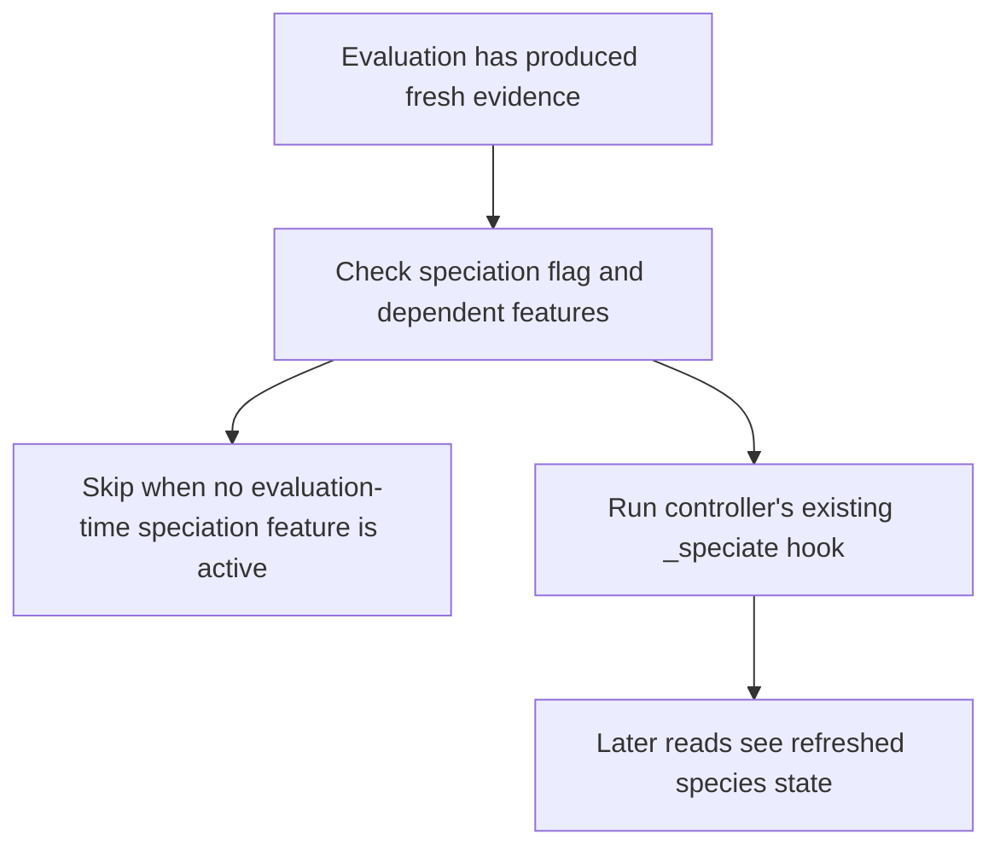

# neat/evaluate/speciation

Lightweight speciation helpers for the NEAT evaluate chapter.

This chapter keeps the post-evaluation speciation trigger small: only run the
controller's speciation maintenance hook when evaluation-time features such
as target-species tuning or extended species history actually need it.

The boundary is intentionally thin. Evaluation does not take over the full
species-assignment lifecycle here; the main speciation chapter still owns
the heavy lifting. This helper exists because some evaluation-time policies
depend on refreshed species state immediately after new evidence lands.

Read this chapter when you want to answer questions such as:
- Why can evaluation trigger speciation at all if speciation already has its
  own chapter?
- Which option flags are strong enough to justify a lightweight post-score
  speciation refresh?
- Why does this boundary only trigger the hook instead of duplicating the
  broader species-maintenance logic?
- Which controller assumptions stay stable for later selection and objective
  reads?

The mental model is a two-step gate:
1. check whether evaluation-time features currently depend on refreshed
   species state,
2. run the controller's existing speciation hook when they do.

This chapter preserves score evidence, novelty annotations, and objective
policy. It only decides whether the existing speciation subsystem should be
asked to refresh after evaluation.



## neat/evaluate/speciation/evaluate.speciation.ts

### runLightweightSpeciation

```ts
runLightweightSpeciation(
  controller: NeatControllerForEval,
  evaluationOptions: { [key: string]: unknown; fitnessPopulation?: boolean | undefined; clear?: boolean | undefined; novelty?: { enabled?: boolean | undefined; descriptor?: ((genome: GenomeForEvaluation) => number[]) | undefined; k?: number | undefined; blendFactor?: number | undefined; archiveAddThreshold?: number | undefined; } | undefined; entropySharingTuning?: { enabled?: boolean | undefined; targetEntropyVar?: number | undefined; adjustRate?: number | undefined; minSigma?: number | undefined; maxSigma?: number | undefined; } | undefined; entropyCompatTuning?: { enabled?: boolean | undefined; targetEntropy?: number | undefined; deadband?: number | undefined; adjustRate?: number | undefined; minThreshold?: number | undefined; maxThreshold?: number | undefined; } | undefined; autoDistanceCoeffTuning?: { enabled?: boolean | undefined; adjustRate?: number | undefined; minCoeff?: number | undefined; maxCoeff?: number | undefined; } | undefined; multiObjective?: { enabled?: boolean | undefined; autoEntropy?: boolean | undefined; dynamic?: { enabled?: boolean | undefined; } | undefined; } | undefined; speciation?: boolean | undefined; targetSpecies?: number | undefined; compatAdjust?: boolean | undefined; speciesAllocation?: { extendedHistory?: boolean | undefined; } | undefined; sharingSigma?: number | undefined; compatibilityThreshold?: number | undefined; excessCoeff?: number | undefined; disjointCoeff?: number | undefined; },
): void
```

Run lightweight post-evaluation speciation when related controller features are enabled.

This is the controller-facing entrypoint for the evaluate-speciation stage.
It behaves like best-effort maintenance: evaluation may request a refresh of
species state when nearby tuning or history features rely on it, but failure
here should not invalidate the newly gathered score evidence.

The helper preserves several important controller assumptions:
- current score and novelty evidence are left intact,
- objective policy is left intact,
- only the existing speciation hook is triggered when needed.

Parameters:
- `controller` - - NEAT controller instance for evaluation.
- `evaluationOptions` - - Options object for the current evaluation pass.

Example:

```ts
runLightweightSpeciation(controller, controller.options);
```

### shouldRunSpeciation

```ts
shouldRunSpeciation(
  evaluationOptions: { [key: string]: unknown; fitnessPopulation?: boolean | undefined; clear?: boolean | undefined; novelty?: { enabled?: boolean | undefined; descriptor?: ((genome: GenomeForEvaluation) => number[]) | undefined; k?: number | undefined; blendFactor?: number | undefined; archiveAddThreshold?: number | undefined; } | undefined; entropySharingTuning?: { enabled?: boolean | undefined; targetEntropyVar?: number | undefined; adjustRate?: number | undefined; minSigma?: number | undefined; maxSigma?: number | undefined; } | undefined; entropyCompatTuning?: { enabled?: boolean | undefined; targetEntropy?: number | undefined; deadband?: number | undefined; adjustRate?: number | undefined; minThreshold?: number | undefined; maxThreshold?: number | undefined; } | undefined; autoDistanceCoeffTuning?: { enabled?: boolean | undefined; adjustRate?: number | undefined; minCoeff?: number | undefined; maxCoeff?: number | undefined; } | undefined; multiObjective?: { enabled?: boolean | undefined; autoEntropy?: boolean | undefined; dynamic?: { enabled?: boolean | undefined; } | undefined; } | undefined; speciation?: boolean | undefined; targetSpecies?: number | undefined; compatAdjust?: boolean | undefined; speciesAllocation?: { extendedHistory?: boolean | undefined; } | undefined; sharingSigma?: number | undefined; compatibilityThreshold?: number | undefined; excessCoeff?: number | undefined; disjointCoeff?: number | undefined; },
): boolean
```

Check whether the evaluation pass should trigger the speciation hook.

The trigger is deliberately narrow. Evaluation asks for a speciation refresh
only when a feature such as target-species tuning, compatibility adjustment,
or extended species history would otherwise be reasoning from stale species
state.

Parameters:
- `evaluationOptions` - - Options object for the current evaluation pass.

Returns: True when speciation should run.
