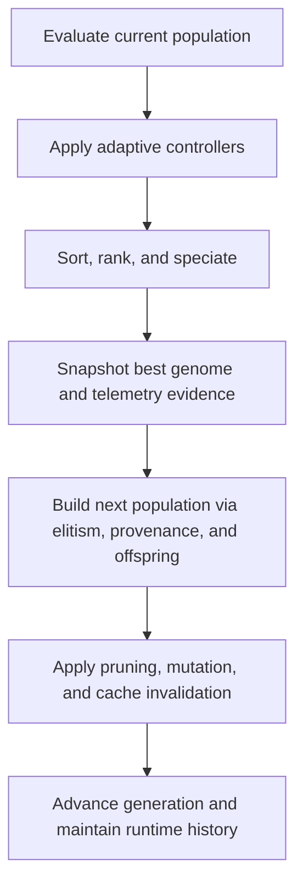
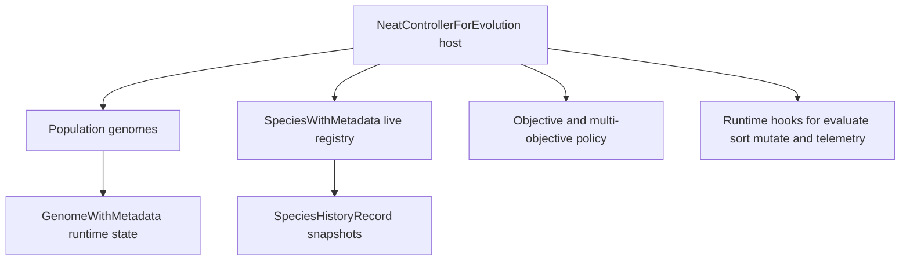

# neat/evolve

The evolution chapter is where one NEAT generation actually turns into the next.

If the root `Neat` controller explains the public lifecycle, this module explains the
orchestration core that makes that lifecycle real. The exported `evolve()` function is
intentionally long in responsibility but short in local decision-making: it reads like a
stage manager for one generation and delegates the detailed work to focused helpers under
`adaptive/`, `objectives/`, `population/`, `runtime/`, `speciation/`, and `telemetry/`.
That split matters because the controller has to coordinate many policies at once without
collapsing them into one opaque algorithm blob.

Read this chapter when you want to answer questions such as:

- When does the controller force evaluation before selection starts?
- Which adaptive hooks run before and after ranking?
- Where do speciation, offspring construction, mutation, pruning, and telemetry fit?
- Why does the method return the best network from the previous generation instead of the
  newly mutated population?

The high-level flow is easier to retain if you treat it as five phases:

1. make the current population comparable,
2. update adaptive and objective policies,
3. rank and summarize the current generation,
4. construct the next population,
5. finalize runtime state for the next loop.



Reading order:

- start with {@link evolve} for the generation spine,
- jump into `runtime/` when you need evaluation and timekeeping semantics,
- jump into `speciation/` and `population/` when parent selection or offspring allocation is the question,
- jump into `adaptive/` when you need to understand dynamic policy changes,
- jump into `telemetry/` when you want to know which evidence gets recorded during the step.

## neat/evolve/evolve.types.ts

Shared runtime contracts for the NEAT evolution orchestration chapter.

The exported `evolve()` function in `evolve.ts` reads like a stage manager.
This file explains the cast it is allowed to move around: genomes carrying
runtime metadata, species snapshots used during allocation, objective
descriptors reused by multi-objective ranking, and the narrow controller host
surface that the evolve helpers coordinate.

The contracts naturally group into four layers:

1. evolving genome state: `GenomeWithMetadata`,
2. species- and telemetry-facing summaries: `SpeciesWithMetadata` and
   `SpeciesHistoryRecord`,
3. policy descriptors reused during the step: `MutationMethod`,
   `ObjectiveDescriptor`, and `MultiObjectiveOptions`,
4. orchestration host state: `NeatControllerForEvolution`.

Read this chapter when the evolve root chapter tells you _when_ something
happens but you still need to know _which state_ that step is allowed to
read or mutate.



### GenomeWithMetadata

Runtime interface for a genome carrying evolution metadata.

This mirrors the dynamic properties attached at runtime during evolution,
without pulling in the full Genome class to avoid circular dependencies.
These fields are intentionally permissive because evolution attaches
metadata such as ids, ancestry, crowding, and objective ranks dynamically
while one generation is being processed.

Treat this as the per-genome working set for one generation. The structure
fields (`nodes`, `connections`) describe the candidate itself. The underscored
fields capture temporary or cached evidence produced while the controller is
ranking, speciating, adapting, and tracking lineage.

The important boundary is that this interface is richer than the minimal
shared genome contracts used by read-side chapters, because evolve helpers are
the place where new runtime metadata is actually attached.

### MultiObjectiveOptions

Multi-objective configuration block.

This is the policy bundle evolve helpers consult when deciding how dynamic
objective scheduling, epsilon tuning, and inactive-objective pruning should
behave during a run. It is broader than one descriptor but narrower than the
full controller options object.

### MutationMethod

Mutation method descriptor used by runtime mutation hooks.

The evolve chapter only needs the stable operator identity, not the richer
mutation policy metadata defined in the mutation subtree. That is why this
local descriptor stays intentionally tiny: evolve orchestration mainly uses it
as a token when handing work off to mutation-oriented hooks.

### NeatControllerForEvolution

NEAT controller subset used by evolve orchestrations.

This is a minimal, runtime-focused surface used by evolve utilities
to avoid circular dependencies on the full controller class.

This host contract is the backbone of the evolve subtree. It bundles five
kinds of state that the orchestration step must coordinate:

1. population and generation state,
2. policy options that shape selection, mutation, pruning, and
   multi-objective ranking,
3. live caches and archives such as species history or Pareto snapshots,
4. controller hooks that perform focused work like evaluation, mutation, or
   telemetry recording,
5. adaptation and test seams that let utility chapters nudge policy without
   depending on the full `Neat` class implementation.

The interface is intentionally large because evolve orchestration really is
the point where many chapter boundaries meet. Even so, it is still narrower
than the full public controller API: only the state and callbacks needed for
one generation step are surfaced here.

### ObjectiveDescriptor

Objective descriptor for multi-objective evaluation.

This is the shared scoring token used when evolve orchestration hands the
current population to objective-aware ranking logic. Each descriptor couples a
stable key with the accessor that extracts that objective's numeric evidence
from one genome.

### SpeciesHistoryRecord

Species history snapshot record used for telemetry/exports.

Unlike `SpeciesWithMetadata`, which describes the current live registry, this
contract is archival. It captures the summarized species view that can be
retained across generations for telemetry, historical diagnostics, and later
export.

### SpeciesWithMetadata

Runtime interface for species metadata used in allocation and stats.

This is the live species record shape used during one evolve step. Helpers in
`speciation/`, `population/`, and telemetry-oriented paths rely on it to ask
practical generation-level questions: which genomes belong together now, how
much shared fitness does the species have, and how many offspring should it
receive next?

## neat/evolve/evolve.ts

### evolve

```ts
evolve(): Promise<default>
```

Run a single evolution step for this NEAT population.

This is the orchestration spine for one full generation update. The method does not try to
implement every evolutionary policy inline; instead, it coordinates the major phases in a fixed
order so the rest of the NEAT controller can remain modular and inspectable.

The lifecycle is easiest to read in seven stages:

1. ensure the current population has fresh evaluation scores,
2. run adaptive controllers that may change complexity or objective policy,
3. rank the current generation through sorting, multi-objective processing, and speciation,
4. capture the best-network snapshot plus telemetry evidence while the generation is still intact,
5. build the next population through elitism, provenance, and offspring allocation,
6. mutate and prune the newly built population,
7. finalize runtime bookkeeping for the next call.

A subtle but important design choice is that the returned {@link Network} represents the best
genome from the generation that was just analyzed, not from the population after mutation. That
makes the return value a stable evaluation artifact: callers can inspect or replay the winning
candidate without worrying that post-selection mutation has already changed it.

The method mutates controller-owned state such as `this.population`, `this.generation`,
compatibility caches, telemetry buffers, objective snapshots, and species-history state.
In other words, call this when you intend to advance the controller, not when you merely want a
read-only score refresh.

Important side-effects:

- Replaces `this.population` with the newly constructed generation.
- Increments `this.generation`.
- May register or remove dynamic objectives via adaptive controllers.
- Refreshes telemetry, diversity, species-history, and timing snapshots.

Use the surrounding helper folders as the next reading map:

- `runtime/` explains evaluation readiness and loop timing.
- `adaptive/` explains policy changes that respond to stagnation or controller statistics.
- `speciation/` explains fitness sharing, compatibility tuning, and species history.
- `population/` explains how elitism, provenance, and offspring fill the next generation.
- `telemetry/` explains which traces are recorded while this method runs.

Example:

```ts
// assuming `neat` is an instance with configured population/options
const bestNetwork = await neat.evolve();
console.log('generation:', neat.generation);
console.log('output nodes:', bestNetwork.output);
```

Returns: a deep-cloned network snapshot representing the best genome from the
previous generation, ready for inspection or external evaluation

### EVOLVE_AUTO_COMPAT_ADJUST_RATE

Default rate used when nudging compatibility coefficients toward the desired species count.

### EVOLVE_AUTO_COMPAT_MAX_COEFF

Maximum compatibility coefficient allowed during automatic tuning; prevents the coefficient from fragmenting the population into too many tiny short-lived species.

### EVOLVE_AUTO_COMPAT_MIN_COEFF

Minimum compatibility coefficient allowed during automatic tuning; prevents the coefficient from collapsing all population diversity into one species.

### EVOLVE_AUTO_COMPAT_RANDOM_SCALE

Random perturbation scale used when compatibility tuning has no directional error to follow.

### EVOLVE_AUTO_COMPAT_TARGET_MIN

Minimum target species count used by automatic compatibility tuning.

The controller never tries to collapse diversity below this floor when adjusting coefficients.

### EVOLVE_AUTO_ENTROPY_ADD_AT

Default generation index at which automatic entropy objective scheduling becomes eligible for addition to the active objective set.

### EVOLVE_CROSS_SPECIES_GUARD_LIMIT

Retry limit for cross-species parent sampling before the controller falls back to a safer path.

### EVOLVE_DEFAULT_EPSILON_ADJUST

Default adjustment step for dominance epsilon.

The value is intentionally small because epsilon changes should steer ranking gradually rather than jerk it.

### EVOLVE_DEFAULT_EPSILON_COOLDOWN

Default cooldown in generations between epsilon adjustments.

This prevents the controller from reacting to every short-lived fluctuation in front width.

### EVOLVE_DEFAULT_EPSILON_MAX

Maximum dominance epsilon ceiling; the adaptive Pareto tuning controller never allows the epsilon value to rise above this boundary.

### EVOLVE_DEFAULT_EPSILON_MIN

Minimum dominance epsilon floor; the adaptive Pareto tuning controller never allows the epsilon value to fall below this boundary.

### EVOLVE_GLOBAL_STAGNATION_REPLACE_FRACTION

Fraction of the population replaced with fresh genomes when global stagnation rescue triggers.

### EVOLVE_MIN_OFFSPRING_DEFAULT

Minimum offspring allocation reserved for each surviving species during speciated reproduction so no viable lineage is starved out entirely.

### EVOLVE_OLD_MULTIPLIER_DEFAULT

Fitness-sharing multiplier applied to older species so stale lineages lose selection privilege.

### EVOLVE_OLD_THRESHOLD_DEFAULT

Generation threshold after which a species is treated as old for age-based fitness shaping.

### EVOLVE_PARETO_ARCHIVE_MAX

Maximum number of Pareto archive snapshots to retain.

This keeps multi-objective history useful for inspection without letting archive state
grow unbounded during long runs.

### EVOLVE_PRUNE_RANGE_EPS_DEFAULT

Default numerical range epsilon for deciding whether an objective has effectively gone flat.

### EVOLVE_PRUNE_WINDOW_DEFAULT

Default inactivity window in generations that must elapse before adaptive objective pruning considers removing a stagnant objective.

### EVOLVE_REENABLE_DELTA_SCALE

Scale factor that converts the re-enable success-rate error signal into a probability update step during adaptive mutation control.

### EVOLVE_REENABLE_MAX

Upper bound for the adaptive connection re-enable probability; the controller clamps upward adjustments at this ceiling to avoid over-enabling.

### EVOLVE_REENABLE_MIN

Lower bound for the adaptive connection re-enable probability; the controller clamps downward adjustments at this floor to preserve some re-enable activity.

### EVOLVE_REENABLE_MIN_SAMPLES

Minimum number of re-enable observations required before the adaptive controller trusts its success-rate signal and adjusts probability.

### EVOLVE_REENABLE_TARGET

Desired success ratio for connection re-enable attempts; the adaptive controller steers probability toward this target fraction each generation.

### EVOLVE_SPECIES_HISTORY_MAX

Maximum number of species-history snapshots to retain for telemetry and later export.

### EVOLVE_SURVIVAL_THRESHOLD_DEFAULT

Survivor fraction used when choosing the parent pool inside each species during speciated offspring production.

### EVOLVE_TARGET_FRONT_LOWER_RATIO

Lower ratio threshold for Pareto front size vs target.

When the first front shrinks below this band, the controller can relax epsilon to avoid over-pruning.

### EVOLVE_TARGET_FRONT_MIN

Minimum target front size used for adaptive epsilon tuning.

Small Pareto fronts are easy to overfit, so the epsilon controller never aims below this floor.

### EVOLVE_TARGET_FRONT_UPPER_RATIO

Upper ratio threshold for Pareto front size vs target.

When the first front grows beyond this band, the controller can tighten epsilon to recover pressure.

### EVOLVE_YOUNG_MULTIPLIER_DEFAULT

Fitness-sharing multiplier applied to species that are still in their early growth window.

### EVOLVE_YOUNG_THRESHOLD_DEFAULT

Generation age threshold below which a species is still classified as young and receives a fitness-sharing bonus to encourage early exploration.
