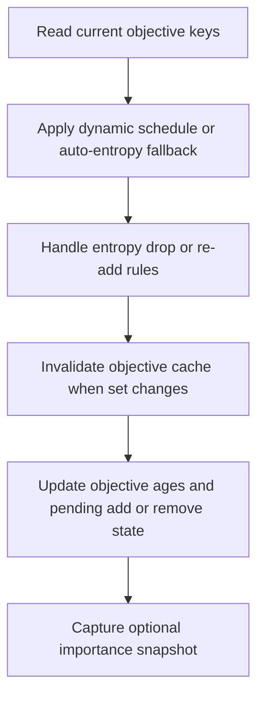

# neat/evolve/objectives

Objective-scheduling and maintenance helpers for NEAT evolution.

The public `objectives/` chapter explains how the controller defines the
active objective set. This `evolve/objectives/` chapter answers the next
question: while generations advance, when should that objective set change,
and which controller-owned traces must stay synchronized when it does?

This boundary owns the evolve-time policy layer around objectives:
- clear the cached resolved objective list when policy changes,
- schedule new objectives such as complexity or entropy,
- drop and later re-add entropy when stagnation rules say it should leave,
- track objective ages and compact importance snapshots for later telemetry,
- preserve a small test-only escape hatch for targeted harness scenarios.

It stays separate from `objectives/` and `evaluate/objectives/` on purpose.
Those chapters define or register objectives. This file reacts to generation
progress, stagnation, and runtime policy so the evolve loop can maintain a
changing objective set without collapsing that policy into the main
orchestration spine.



## neat/evolve/objectives/evolve.objectives.utils.ts

### applyDynamicObjectiveSchedule

```ts
applyDynamicObjectiveSchedule(
  internal: NeatControllerForEvolution,
  currentObjectiveKeys: string[],
  config: { autoEntropyAddAt: number; },
): void
```

Apply dynamic objective scheduling and entropy rules.

This helper is the main generation-time policy switchboard for objectives.
When dynamic scheduling is enabled, it decides when to add scheduled
objectives such as complexity or entropy and then hands off to the entropy
drop or re-add rules. When dynamic scheduling is disabled but auto-entropy is
enabled, it applies the simpler fallback rule that adds entropy after a
configured generation threshold.

The helper mutates controller policy state in place by registering
objectives, updating pending-add queues, and delegating entropy maintenance.
Callers should therefore treat it as a policy update step rather than a pure
read.

Parameters:
- `internal` - - NEAT controller instance.
- `currentObjectiveKeys` - - Keys of active objectives.
- `config` - - Scheduling constants.

Returns: void.

### applyFitnessSuppressionForTests

```ts
applyFitnessSuppressionForTests(
  internal: NeatControllerForEvolution,
): void
```

Suppress fitness objective for specific test scenarios.

This helper is intentionally narrow and harness-oriented. It exists for test
scenarios that need to force a non-fitness objective mix without turning the
rest of the dynamic-objective machinery into test-specific code. Production
runs should normally ignore this path entirely.

Parameters:
- `internal` - - NEAT controller instance.

Returns: void.

### captureObjectiveImportanceSnapshot

```ts
captureObjectiveImportanceSnapshot(
  internal: NeatControllerForEvolution,
): void
```

Capture objective importance stats for telemetry.

The snapshot is a compact read-side hint about which objectives are still
separating the population meaningfully. By recording per-objective range and
variance after objective maintenance runs, later telemetry or diagnostics can
explain why an objective may be a good candidate for pruning or why a newly
added objective is not yet influencing search strongly.

Parameters:
- `internal` - - NEAT controller instance.

Returns: void.

### handleEntropyDropAndReadd

```ts
handleEntropyDropAndReadd(
  internal: NeatControllerForEvolution,
  currentObjectiveKeys: string[],
  dynamicConfig: { enabled?: boolean | undefined; addComplexityAt?: number | undefined; addEntropyAt?: number | undefined; dropEntropyOnStagnation?: number | undefined; readdEntropyAfter?: number | undefined; } | undefined,
): void
```

Handle entropy removal and re-addition rules.

Entropy is special because some runs benefit from introducing it, dropping
it during stagnation, then restoring it after a cooldown. This helper keeps
that lifecycle in one place so the evolve loop can reason about entropy as a
deliberate scheduled objective rather than a one-way configuration toggle.

The important state transitions are:
- remove `entropy` from the configured objective set when stagnation crosses
  the configured drop generation,
- mark the removal generation in `_entropyDropped`,
- queue the removal for downstream bookkeeping,
- re-register entropy after the configured cooldown, then clear the dropped
  marker.

Parameters:
- `internal` - - NEAT controller instance.
- `currentObjectiveKeys` - - Active objective keys.
- `dynamicConfig` - - Dynamic objective config.

Returns: void.

### resetObjectivesCache

```ts
resetObjectivesCache(
  internal: NeatControllerForEvolution,
): void
```

Clear cached objectives so dynamic schedules can rebuild them.

Objective reads are intentionally cached elsewhere because the resolved list
is reused across several helpers. Whenever evolve-time policy adds, removes,
or suppresses an objective, this cache must be cleared so the next
`_getObjectives()` read reflects the updated configuration rather than the
earlier generation's list.

Parameters:
- `internal` - - NEAT controller instance.

Returns: void.

### updateObjectiveScheduleAndAges

```ts
updateObjectiveScheduleAndAges(
  internal: NeatControllerForEvolution,
  helpers: { applyDynamicObjectiveSchedule: (currentObjectiveKeys: string[]) => void; },
): Promise<void>
```

Update objective schedule, pending adds/removes, and objective ages.

This is the small orchestration entrypoint for evolve-time objective
maintenance. It reads the currently resolved objective keys, applies the
caller-provided scheduling policy, then updates the age bookkeeping that
later telemetry or policy helpers may inspect.

The whole pass is wrapped in a best-effort guard because dynamic objective
tracking is useful metadata, not a requirement for the rest of evolution to
continue.

Parameters:
- `internal` - - NEAT controller instance.
- `helpers` - - Helper callbacks used by scheduling logic.
- `helpers` - - Dynamic objective scheduler.

Returns: void.
