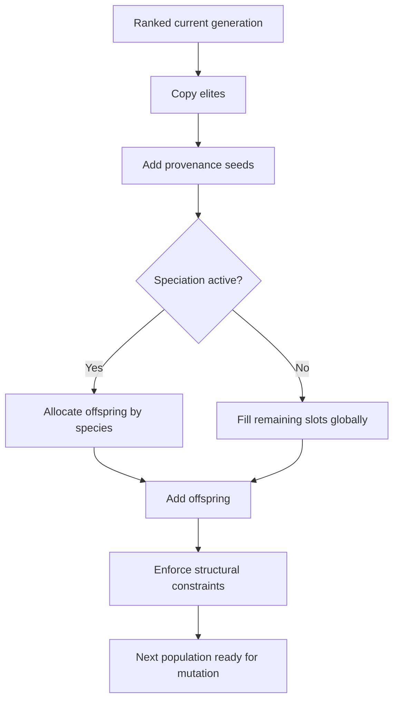

# neat/evolve/population

The evolve-time population boundary assembles the next generation after the
current one has already been ranked, summarized, and snapshotted.

The root `evolve/` chapter explains the full generation lifecycle, and the
`offspring/` chapter explains how one child is crossed and normalized. This
file owns the layer between them: once evolve has decided it is time to
rebuild, how does the controller preserve elites, inject provenance seeds,
allocate the remaining budget across species when needed, and finish with a
population that still respects the controller's structural expectations?

Read this chapter when you want to understand:

- why next-generation assembly stays separate from the broader evolve spine,
- how elitism, provenance, and offspring fill the population in a fixed order,
- where speciated allocation decides how many children each lineage receives,
- why structural cleanup happens after assembly rather than inside every
  earlier helper.

The helper flow is easiest to retain as four responsibilities:

1. reserve deterministic slots for elites,
2. add fresh provenance genomes when configured,
3. fill the remaining budget through speciated or unspeciated offspring,
4. reapply minimum hidden-node and dead-end constraints to the final result.



## neat/evolve/population/evolve.population.utils.ts

### addOffspring

```ts
addOffspring(
  internal: NeatControllerForEvolution,
  nextPopulation: default[],
  helpers: { addSpeciatedOffspring: (nextPopulation: default[], remainingSlots: number) => Promise<void>; addUnspeciatedOffspring: (nextPopulation: default[], remainingSlots: number) => Promise<void>; },
): Promise<void>
```

Add offspring to fill remaining population slots.

This helper spends whatever population budget remains after elitism and
provenance have claimed their slots. Its main job is not to create children
itself, but to choose the correct filling strategy: species-aware allocation
when the controller currently maintains a species registry, or global parent
selection when it does not.

Parameters:
- `internal` - - NEAT controller instance.
- `nextPopulation` - - Target population array.
- `helpers` - - Helper callbacks for offspring selection.
- `helpers` - - Speciated offspring helper.
- `helpers` - - Unspeciated offspring helper.

Returns: A promise that resolves after the remaining population budget is filled.

### addSpeciatedOffspring

```ts
addSpeciatedOffspring(
  internal: NeatControllerForEvolution,
  nextPopulation: default[],
  remainingSlots: number,
  config: { minOffspringDefault: number; survivalThresholdDefault: number; youngThresholdDefault: number; youngMultiplierDefault: number; oldThresholdDefault: number; oldMultiplierDefault: number; crossSpeciesGuardLimit: number; },
): Promise<void>
```

Add offspring when speciation is enabled.

This is the species-aware branch of population filling. It converts the
remaining population budget into per-species child counts, records those
counts for later telemetry or diagnostics reads, then breeds within each
species using the narrower offspring mechanics described in `offspring/`.

The helper stays intentionally focused on allocation and local survivor
pools. It does not re-run speciation or mutate the produced children.

Parameters:
- `internal` - - NEAT controller instance.
- `nextPopulation` - - Target population array.
- `remainingSlots` - - Slots remaining to fill.
- `config` - - Offspring allocation constants.

Returns: A promise that resolves after species-aware offspring have been added.

### addUnspeciatedOffspring

```ts
addUnspeciatedOffspring(
  internal: NeatControllerForEvolution,
  nextPopulation: default[],
  remainingSlots: number,
): Promise<void>
```

Add offspring when speciation is disabled.

When no species registry is active, the population builder falls back to the
controller's global offspring-selection path. This keeps the no-speciation
branch small and makes the contrast with the species-aware allocator easy to
read in the generated chapter.

Parameters:
- `internal` - - NEAT controller instance.
- `nextPopulation` - - Target population array.
- `remainingSlots` - - Slots remaining to fill.

Returns: A promise that resolves after all remaining slots have been filled.

### applyElitism

```ts
applyElitism(
  internal: NeatControllerForEvolution,
  nextPopulation: default[],
): void
```

Apply elitism for the next generation.

Elitism reserves the deterministic carry-over portion of the population.
These genomes bypass parent selection entirely so the best ranked candidates
from the current generation survive into the next one unchanged.

Parameters:
- `internal` - - NEAT controller instance.
- `nextPopulation` - - Target population array.

Returns: Nothing.

### applyProvenance

```ts
applyProvenance(
  internal: NeatControllerForEvolution,
  nextPopulation: default[],
): void
```

Add provenance genomes into the next population.

Provenance is the population builder's controlled source of fresh starting
material. Unlike offspring, these genomes do not depend on current parent
selection pressure. They either clone the configured seed network or create a
new minimal network, then optionally preserve feed-forward intent so the
resulting generation stays aligned with the runtime topology contract.

Parameters:
- `internal` - - NEAT controller instance.
- `nextPopulation` - - Target population array.

Returns: Nothing.

### buildNextPopulation

```ts
buildNextPopulation(
  internal: NeatControllerForEvolution,
  helpers: { applyElitism: (nextPopulation: default[]) => void; applyProvenance: (nextPopulation: default[]) => void; addOffspring: (nextPopulation: default[]) => Promise<void>; },
): Promise<default[]>
```

Build the next population (elitism, provenance, offspring).

This helper is the orchestration entrypoint for next-generation assembly.
It deliberately reads like a short collect-and-fill pipeline: start with an
empty container, reserve the slots that should bypass parent selection, then
spend the remaining capacity on offspring generation. The mutation and prune
phases happen later; this boundary only answers how the raw next population is
assembled before those later transforms run.

Example:

```ts
const nextPopulation = await buildNextPopulation(internal, {
  applyElitism: (population) => applyElitism(internal, population),
  applyProvenance: (population) => applyProvenance(internal, population),
  addOffspring: (population) => addOffspring(internal, population, helpers),
});
```

Parameters:
- `internal` - - NEAT controller instance.
- `helpers` - - Helper callbacks for population construction.
- `helpers` - - Elitism helper.
- `helpers` - - Provenance helper.
- `helpers` - - Offspring helper.

Returns: Next population array before later mutation and pruning phases.

### buildSpeciesOffspring

```ts
buildSpeciesOffspring(
  internal: NeatControllerForEvolution,
  survivors: GenomeWithMetadata[],
  speciesIndex: number,
  crossSpeciesProbability: number,
  crossSpeciesGuardLimit: number,
  survivalThresholdDefault: number,
): GenomeWithMetadata
```

Build a single offspring within a species.

This helper is the point where species-local survivor selection turns into
one actual child. It chooses both parents, performs crossover, and annotates
runtime lineage metadata so the resulting genome is ready for later telemetry,
lineage, and inbreeding reads.

Parameters:
- `internal` - - NEAT controller instance.
- `survivors` - - Survivors pool for selection.
- `speciesIndex` - - Species index.
- `crossSpeciesProbability` - - Cross-species mating probability.
- `crossSpeciesGuardLimit` - - Retry guard for cross-species selection.

Returns: Offspring genome carrying runtime metadata.

### computeOffspringAllocation

```ts
computeOffspringAllocation(
  internal: NeatControllerForEvolution,
  remainingSlots: number,
  config: { minOffspringDefault: number; youngThresholdDefault: number; youngMultiplierDefault: number; oldThresholdDefault: number; oldMultiplierDefault: number; },
): number[]
```

Compute offspring allocation per species.

Allocation is where the ranked generation turns into concrete reproduction
budget. The helper converts species-level adjusted fitness into integer child
counts, then layers in minimum-offspring protection plus remainder handling so
the final distribution stays both policy-aware and population-size safe.

Parameters:
- `internal` - - NEAT controller instance.
- `remainingSlots` - - Slots remaining to fill.
- `config` - - Allocation constants.

Returns: Offspring allocation per species index.

### distributeRemainingSlots

```ts
distributeRemainingSlots(
  allocation: number[],
  rawShares: number[],
  remainingSlots: number,
): void
```

Distribute leftover slots by fractional remainders.

Flooring raw shares rarely sums exactly to the remaining slot budget. This
helper spends the leftover capacity by largest remainder so the final integer
allocation stays as close as possible to the original fractional intent.

Parameters:
- `allocation` - - Allocation array to adjust.
- `rawShares` - - Raw fractional shares.
- `remainingSlots` - - Total slots available.

Returns: Nothing.

### enforceMinimumOffspring

```ts
enforceMinimumOffspring(
  internal: NeatControllerForEvolution,
  allocation: number[],
  remainingSlots: number,
  minOffspringDefault: number,
): void
```

Enforce minimum offspring per species when possible.

This rule prevents species allocation from collapsing entirely onto a few
dominant lineages when the remaining slot budget is large enough to preserve
a broader search frontier.

Parameters:
- `internal` - - NEAT controller instance.
- `allocation` - - Allocation array to adjust.
- `remainingSlots` - - Total slots available.
- `minOffspringDefault` - - Default minimum offspring.

Returns: Nothing.

### enforcePopulationConstraints

```ts
enforcePopulationConstraints(
  internal: NeatControllerForEvolution,
  nextPopulation: default[],
): Promise<void>
```

Ensure new population meets structural constraints.

Population assembly intentionally separates slot-filling from structural
cleanup. Elites may already be valid, provenance genomes may come from a
seed network or a fresh constructor path, and offspring may arrive from
crossover with small topology issues that the controller routinely repairs.
Running those repairs here keeps later evolve code free to assume the new
population already satisfies the controller's minimum hidden-node and
dead-end expectations.

Parameters:
- `internal` - - NEAT controller instance.
- `nextPopulation` - - Population to validate.

Returns: A promise that resolves after best-effort structural cleanup.

### selectSecondParent

```ts
selectSecondParent(
  internal: NeatControllerForEvolution,
  survivors: GenomeWithMetadata[],
  speciesIndex: number,
  crossSpeciesProbability: number,
  crossSpeciesGuardLimit: number,
  survivalThresholdDefault: number,
): GenomeWithMetadata
```

Select a second parent, optionally from another species.

Cross-species mating stays bounded and opportunistic. The helper first asks
whether the controller should attempt a cross-species parent at all, then
applies a retry guard so the search for another species cannot spiral in edge
cases where the registry is sparse or unstable.

Parameters:
- `internal` - - NEAT controller instance.
- `survivors` - - Survivors pool from the current species.
- `speciesIndex` - - Current species index.
- `crossSpeciesProbability` - - Probability to cross species.
- `crossSpeciesGuardLimit` - - Retry guard for cross-species selection.

Returns: Chosen parent genome from the current or another species.

### trimOversubscription

```ts
trimOversubscription(
  internal: NeatControllerForEvolution,
  allocation: number[],
  remainingSlots: number,
  minOffspringDefault: number,
): void
```

Trim allocations when oversubscribed.

Minimum-offspring guarantees can occasionally oversubscribe the remaining
budget. This helper trims from the largest allocations first while still
respecting the minimum line preserved for each surviving species.

Parameters:
- `internal` - - NEAT controller instance.
- `allocation` - - Allocation array to adjust.
- `remainingSlots` - - Total slots available.
- `minOffspringDefault` - - Default minimum offspring.

Returns: Nothing.
