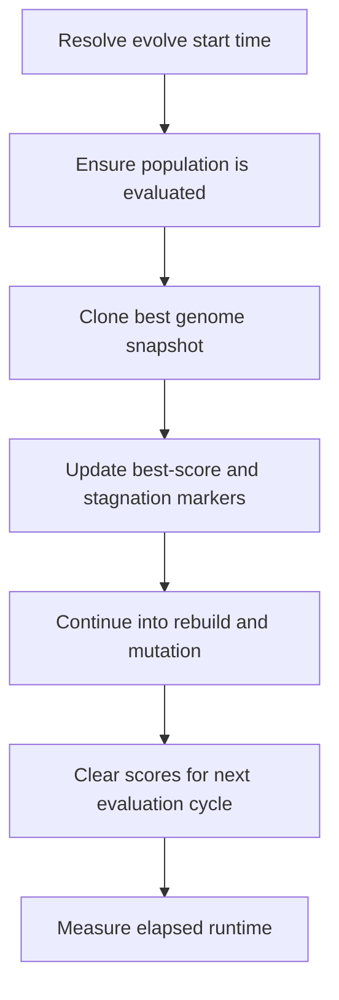

# neat/evolve/runtime

The evolve-time runtime bridge preserves the meaning of one generation while
the controller moves from evaluated population state into next-generation
construction.

The main `evolve()` chapter explains the full orchestration spine. This file
owns the narrower runtime questions that make that spine dependable:
when should evaluation be forced, when is a best snapshot safe to clone,
how is elapsed time measured, and which score or stagnation markers must be
updated or cleared so the next loop starts from coherent state?

Read this chapter when you want to understand:

- how evolve makes sure it is comparing scored genomes before ranking starts,
- why the returned best network is cloned before the population is rebuilt,
- how global-improvement tracking supports stagnation rescue logic,
- which helpers belong to runtime bookkeeping rather than telemetry or population building.

The runtime handoff is easiest to retain as four small duties:

1. capture timing and evaluation readiness for the current generation,
2. preserve a stable best snapshot before mutation changes the population,
3. update global-improvement markers used by stagnation policies,
4. clear stale scores so the next generation must be evaluated fresh.



## neat/evolve/runtime/evolve.runtime.utils.ts

### buildFittestSnapshot

```ts
buildFittestSnapshot(
  internal: NeatControllerForEvolution,
): default
```

Build a cloned Network from the current best genome.

The returned value from `evolve()` is meant to describe the generation that
was just analyzed, not the mutable genome object that will continue through
later controller operations. This helper therefore clones the current leader
into a standalone {@link Network} snapshot and preserves its score so callers
can inspect, serialize, or replay the champion without depending on mutable
controller-owned references.

Parameters:

- `internal` - NEAT controller instance.

Returns: A detached best-network snapshot for the current generation.

### clearPopulationScores

```ts
clearPopulationScores(
  internal: NeatControllerForEvolution,
): void
```

Clear genome scores to force re-evaluation.

Once evolve has finished rebuilding and mutating the next population, the old
scores are no longer trustworthy. This helper makes that contract explicit by
clearing per-genome scores so the next call into the evolve or evaluate path
cannot accidentally treat structurally changed genomes as already evaluated.

Parameters:

- `internal` - NEAT controller instance.

Returns: Nothing.

### computeElapsedTime

```ts
computeElapsedTime(
  startTimestamp: number,
): number
```

Compute elapsed time since the start of evolve().

Runtime reporting belongs here because evolve uses the result as generation
bookkeeping rather than as a telemetry export concern. The helper mirrors the
start-time environment fallback so timing stays comparable across runtimes.

Parameters:

- `startTimestamp` - Start time resolved earlier.

Returns: The elapsed runtime for the generation step.

### ensurePopulationEvaluated

```ts
ensurePopulationEvaluated(
  internal: NeatControllerForEvolution,
): Promise<void>
```

Ensure the population is evaluated before evolution operations.

Sorting, species refresh, telemetry capture, and best-snapshot selection all
assume the current population already has comparable scores. This helper keeps
that precondition explicit by forcing evaluation only when the current tail
genome still lacks a score, which preserves the common fast path for already
scored generations.

Parameters:

- `internal` - NEAT controller instance.

Returns: A promise that resolves once evaluation is guaranteed.

### resolveHighResolutionNow

```ts
resolveHighResolutionNow(): (() => number) | undefined
```

Resolve a high-resolution timer callback when the runtime exposes one.

Returns: Timer callback or `undefined` when only wall-clock time is available.

### resolveStartTime

```ts
resolveStartTime(): number
```

Resolve the start time for an evolution step.

Evolve needs one timing origin that works in both browser-like and Node-like
environments. This helper centralizes that choice so later elapsed-time reads
can stay simple and the main evolve loop does not have to repeat environment
detection inline.

Returns: A timestamp in milliseconds or high-resolution timer units.

### trackGlobalImprovement

```ts
trackGlobalImprovement(
  internal: NeatControllerForEvolution,
  snapshot: default,
): void
```

Track global best improvement for stagnation logic.

Global-stagnation rescue depends on a simple question: has the controller seen
a genuinely better champion since the last recorded improvement generation?
This helper answers that question using the cloned best snapshot, which keeps
the stagnation clock tied to the stable artifact returned by evolve rather than
to genomes that may be mutated or replaced later in the loop.

Parameters:

- `internal` - NEAT controller instance.
- `snapshot` - Best network snapshot.

Returns: Nothing.

### updateGlobalBestTracking

```ts
updateGlobalBestTracking(
  internal: NeatControllerForEvolution,
): void
```

Update generation-level best score tracking.

This helper maintains the controller's lightweight "best score seen in the
current generation window" markers. Those markers are intentionally separate
from the cloned best-network snapshot so the evolve loop can cheaply decide
whether a fresh improvement occurred without conflating score bookkeeping with
network serialization.

Parameters:

- `internal` - NEAT controller instance.

Returns: Nothing.
