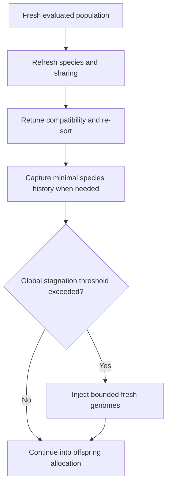

# neat/evolve/speciation

The evolve-time speciation bridge keeps the ranked generation coherent before
parent allocation and next-population construction begin.

The root {@link ../../../README.md | evolve chapter} explains the full generation
lifecycle, but this file owns one narrower question inside that lifecycle:
once evaluation and adaptive policy updates are finished, how does evolve
refresh species structure, record minimal history, and recover from prolonged
global stagnation without widening into a full population-rebuild layer?

Read this chapter when you want to understand:

- why speciation and sharing are triggered here instead of inside population construction,
- which helpers preserve current-generation evidence before offspring allocation starts,
- how minimal species-history snapshots stay available even when extended history is disabled,
- how global-stagnation rescue injects constrained fresh genomes without replacing the whole
  rebuild pipeline.

The helper flow is easiest to retain as three small responsibilities:

1. refresh species assignments, sharing, tuning, and ordering for the evaluated population,
2. preserve species-history evidence needed for later export and diagnostics reads,
3. inject a bounded fraction of fresh genomes when long-run stagnation says the current search
   basin has gone flat.



## neat/evolve/speciation/evolve.speciation.utils.ts

### applySpeciationAndSharingIfEnabled

```ts
applySpeciationAndSharingIfEnabled(
  internal: NeatControllerForEvolution,
  helpers: { applyAutoCompatibilityTuning: () => void; recordSpeciesHistorySnapshot: () => void; },
): Promise<void>
```

Apply speciation, fitness sharing, and related side effects.

This is the evolve-stage bridge back into the stronger `speciation/` chapter.
It assumes the current population already carries fresh evaluation evidence,
then refreshes species membership, applies post-assignment sharing pressure,
lets the caller retune compatibility settings, restores deterministic best-first
ordering, and finally records the lightest history snapshot needed for later
telemetry or export reads.

The helper intentionally stays narrow. It does not build offspring, decide
species quotas, or mutate the next population. Its job is to make the current
ranked generation internally coherent before the evolve loop moves on.

Parameters:
- `internal` - - NEAT controller instance.
- `helpers` - - Helper callbacks used for tuning and history.
- `helpers` - - Auto-compatibility adjustment helper.
- `helpers` - - Species history snapshot helper.

Returns: A promise that resolves after the current generation has been refreshed
and post-speciation side effects have been applied.

### buildFreshGenomeForStagnation

```ts
buildFreshGenomeForStagnation(
  internal: NeatControllerForEvolution,
): Promise<GenomeWithMetadata>
```

Build a fresh genome for stagnation injection.

Global-stagnation rescue needs genomes that are genuinely new search seeds
but still obey the controller's minimum structural expectations. This helper
creates that bounded replacement candidate: a fresh network with controller
metadata, replay-related fields, and best-effort structural cleanup so the
injected genome can enter the population without widening into a bespoke
rebuild path.

Parameters:
- `internal` - - NEAT controller instance.

Returns: A new genome prepared for bounded stagnation rescue.

### recordSpeciesHistorySnapshot

```ts
recordSpeciesHistorySnapshot(
  internal: NeatControllerForEvolution,
  maxHistory: number,
): void
```

Record a species history snapshot when needed.

This helper preserves a minimal per-generation history row for downstream
readers that expect species-history evidence even when the heavier extended
history path is disabled. It deliberately records only lightweight summary
fields, keeps one row per generation, and trims to a bounded rolling window
so evolve can maintain export-friendly evidence without turning this bridge
into the full history-enrichment layer.

Parameters:
- `internal` - - NEAT controller instance.
- `maxHistory` - - Maximum history length.

Returns: Nothing.

### updateSpeciesStagnationIfEnabled

```ts
updateSpeciesStagnationIfEnabled(
  internal: NeatControllerForEvolution,
): void
```

Update species stagnation status when speciation enabled.

The stagnation update remains optional because some evolve configurations use
the broader selection and replacement machinery without long-lived species
maintenance. When speciation is active, this helper advances the species-side
stagnation counters so later allocation and pruning decisions can distinguish
between active lineages and species that have stopped improving.

Parameters:
- `internal` - - NEAT controller instance.

Returns: Nothing.

### applyGlobalStagnationInjectionIfNeeded

```ts
applyGlobalStagnationInjectionIfNeeded(
  internal: NeatControllerForEvolution,
  helpers: { buildFreshGenomeForStagnation: () => Promise<GenomeWithMetadata>; replaceFraction: number; },
): Promise<void>
```

Apply global stagnation injection if configured.

This is the evolve loop's constrained recovery valve for long periods without
global improvement. Instead of discarding the whole population or rebuilding
the generation logic from scratch, the helper replaces only the worst-ranked
fraction beyond elitism with fresh genomes, then resets the stagnation window
so the controller can test whether the new search seeds reopen progress.

The design is intentionally conservative:

- elites are preserved,
- the replacement fraction is bounded by the caller,
- injected genomes still pass through the normal later evolution pipeline.

Parameters:
- `internal` - - NEAT controller instance.
- `helpers` - - Helper callbacks for stagnation injection.
- `helpers` - - Genome builder for injection.

Returns: A promise that resolves after bounded replacements are complete.

### ensureSpeciesHistorySnapshot

```ts
ensureSpeciesHistorySnapshot(
  internal: NeatControllerForEvolution,
  maxHistory: number,
): void
```

Ensure a minimal species history snapshot exists for exports.

Export code may ask for species history after a generation that never took
the heavier history-recording path. This helper backfills the same minimal
summary shape used by {@link recordSpeciesHistorySnapshot} so export and
inspection code can still rely on one bounded row per generation without
forcing extended history to stay on permanently.

Parameters:
- `internal` - - NEAT controller instance.
- `maxHistory` - - Maximum history length.

Returns: Nothing.

### ensureHiddenNodeVariance

```ts
ensureHiddenNodeVariance(
  internal: NeatControllerForEvolution,
  genome: GenomeWithMetadata,
): Promise<void>
```

Ensure a minimal hidden-node variance in injected genomes.

Fresh stagnation-recovery genomes can otherwise collapse into the smallest
legal topology and fail to contribute structural novelty. This helper adds
one conservative hidden-node bridge when the injected genome has no hidden
layer at all, preserving the idea that rescue should re-open search space
rather than only reshuffle minimal direct input-output paths.

Parameters:
- `internal` - - NEAT controller instance.
- `genome` - - Genome to adjust.

Returns: A promise that resolves after best-effort variance injection.

### buildSpeciesHistoryStats

```ts
buildSpeciesHistoryStats(
  speciesList: SpeciesWithMetadata[],
): { id: number; size: number; avgSharedFitness?: number | undefined; bestScore?: number | undefined; lastImproved?: number | undefined; }[]
```

Build the minimal species-history row shape used by evolve-side snapshots.

Parameters:
- `speciesList` - - Live species registry for the current generation.

Returns: Summary rows aligned with the shared species history contract.
