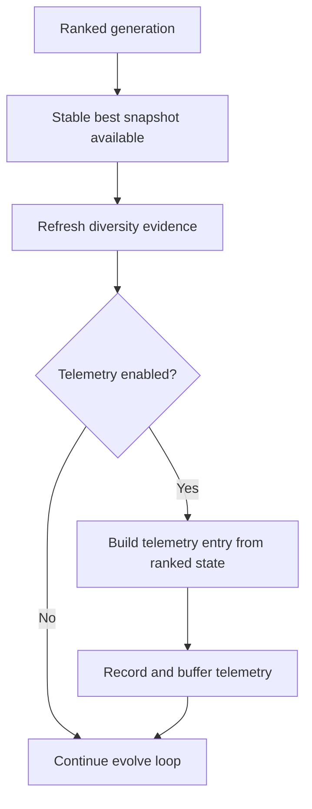

# neat/evolve/telemetry

The evolve-time telemetry bridge captures generation evidence at the exact
point where the current population has been ranked but the next population
has not yet been rebuilt.

The larger `telemetry/` subtree explains how entries are assembled, buffered,
streamed, and inspected over time. This file owns the narrower evolve-side
question: once the generation has a stable best snapshot, which telemetry
hooks should run now so the controller preserves comparable evidence before
mutation and offspring construction change the population?

That boundary matters because evolve is the only place that sees all three
facts at once:

1. the population has already been evaluated and ranked,
2. the best genome can still be snapshotted without next-generation mutation noise,
3. the controller is about to replace the population with offspring.

The bridge therefore keeps two promises for the rest of the system:

- diversity evidence is refreshed from the same ranked generation that later
  telemetry readers will inspect,
- telemetry recording remains optional and late-bound so narrower harnesses
  can skip it without forcing the whole evolve loop to fork.

Read this chapter when you want to understand:

- why evolve computes diversity before recording telemetry,
- why telemetry capture happens after ranking but before next-generation rebuild,
- how this bridge stays smaller than the recorder and facade chapters,
- which telemetry work is best-effort versus gated by configuration.

The handoff is intentionally compact and one-directional:

1. refresh diversity evidence if the controller exposes that hook,
2. gate telemetry on configuration,
3. build and record one snapshot for the just-ranked generation.

In other words, this file does not explain how telemetry entries are shaped,
exported, or queried later. It only makes sure the evolve loop hands the
telemetry subsystem one stable moment in time.



## neat/evolve/telemetry/evolve.telemetry.utils.ts

### computeDiversityStatsSafely

```ts
computeDiversityStatsSafely(
  internal: NeatControllerForEvolution,
): void
```

Compute diversity stats safely if the hook exists.

Diversity metrics are one of the most useful pieces of generation evidence,
but they are still auxiliary to the main evolution loop. This helper lets the
evolve stage refresh that evidence when the host exposes a diversity hook,
while keeping the surrounding generation step resilient if diversity metrics
are disabled or unavailable in a narrower harness configuration.

The failure handling is intentional. Diversity should improve later telemetry,
diagnostics, and docs surfaces when available, but it should never prevent the
controller from finishing a generation step. Treat this helper as a best-effort
evidence refresh rather than a hard evolve prerequisite.

Example:

```ts
// refresh diversity from the ranked population before recording telemetry
computeDiversityStatsSafely(internal);
```

Parameters:

- `internal` - NEAT controller instance.

Returns: Nothing.

### recordTelemetryIfEnabled

```ts
recordTelemetryIfEnabled(
  internal: NeatControllerForEvolution,
  snapshot: default,
): Promise<void>
```

Record telemetry if enabled.

This helper is the evolve loop's final handoff into the write-side telemetry
chapter. It assumes the caller already captured a stable best-network snapshot
from the just-ranked generation, then conditionally builds and records one
telemetry entry before the population is replaced for the next cycle.

Keeping this bridge here instead of inside the telemetry subtree makes the
timing contract obvious: telemetry should describe the generation that was
just analyzed, not the freshly rebuilt population that has not been scored yet.

That timing rule is the real reason this helper exists. The recorder knows how
to assemble and persist telemetry entries, but only evolve knows when the
current generation is still coherent enough to produce a comparable snapshot.
By routing through this bridge, the controller avoids two common mistakes:

- recording telemetry too early, before ranking has stabilized the generation,
- recording telemetry too late, after offspring construction has already
  replaced the evidence being described.

The helper also keeps telemetry opt-in. When telemetry is disabled, evolve
continues with no recorder imports, buffering work, or stream callbacks.

Example:

```ts
const bestSnapshot = internal.population[0].toJSON();
await recordTelemetryIfEnabled(internal, bestSnapshot);
```

Parameters:

- `internal` - NEAT controller instance.
- `snapshot` - Best network snapshot for the generation.

Returns: A promise that resolves after telemetry has been recorded when enabled.
