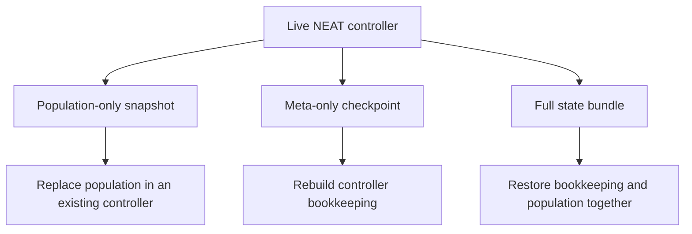

# neat/export

Persistence helpers for the NEAT controller's evolutionary state.

This export chapter exists so snapshotting and rehydration stay discoverable
as their own boundary instead of living in the shared root controller folder.
The helpers here intentionally avoid importing the concrete `Neat` class
directly, which keeps the serialization flow reusable across the public
facade, tests, and static restore entrypoints.

Typical usage follows two tracks:
- export or import just the population when you only need genome payloads;
- export or import the full state when you need innovation history,
  generation counters, and population data to resume a run faithfully.

A useful way to read this chapter is as a pause-and-resume ladder:
- `exportPopulation()` and `importPopulation()` move only candidate genomes
- `toJSONImpl()` and `fromJSONImpl()` move only controller meta state
- `exportState()` and `importStateImpl()` combine both layers into one full resume bundle

That split matters because not every persistence use case is a full replay.
Sometimes you want to archive candidate solutions for later inspection,
benchmark the same population under a new fitness function, or ship genomes
between environments without also freezing the controller's innovation
history. Other times you need a true checkpoint that can continue evolving as
if the process had never stopped.

Read the chapter in this order:
- start with `exportPopulation()` and `importPopulation()` when you only need
  candidate genomes,
- continue to `toJSONImpl()` and `fromJSONImpl()` when you need controller
  metadata without the live population,
- finish with `exportState()` and `importStateImpl()` when you need a full
  pause-and-resume checkpoint.



## neat/export/neat.export.ts

### exportPopulation

```ts
exportPopulation(): GenomeJSON[]
```

Export the current population (array of genomes) into plain JSON objects.
Each genome is converted via its `toJSON()` method. You can persist this
result (e.g. to disk, a database, or localStorage) and later rehydrate it
with {@link importPopulation}.

Why export population only? Sometimes you want to snapshot just the set of
candidate solutions (e.g. for ensemble evaluation) without freezing the
innovation counters or hyper-parameters.

Example:

```ts
// Assuming `neat` is an instance exposing this helper
const popSnapshot = neat.exportPopulation();
fs.writeFileSync('population.json', JSON.stringify(popSnapshot, null, 2));
```

Returns: Array of genome JSON objects.

### importPopulation

```ts
importPopulation(
  populationJSON: GenomeJSON[],
): Promise<void>
```

Import (replace) the current population from an array of serialized genomes.
This does not touch NEAT meta state (generation, innovations, etc.) - only the
population array and implied `popsize` are updated.
That makes it the right tool when you want to swap candidate solutions into an
existing controller context instead of restoring a full historical checkpoint.

Example:

```ts
const populationData: GenomeJSON[] = JSON.parse(fs.readFileSync('population.json', 'utf8'));
neat.importPopulation(populationData); // population replaced
neat.evolve(); // continue evolving with new starting genomes
```

Edge cases handled:
- Empty array => becomes an empty population (popsize=0).
- Malformed entries will throw if `Network.fromJSON` rejects them.

Parameters:
- `populationJSON` - Array of serialized genome objects.

Returns: Promise that resolves once all genomes have been rehydrated and the
controller population has been replaced.

### exportState

```ts
exportState(): NeatStateJSON
```

Convenience helper that returns a full evolutionary snapshot: both NEAT meta
information and the serialized population array. Use this when you want a
truly pause-and-resume capability including innovation bookkeeping.

In practice this is the "checkpoint" export. It is the safest default when
you care about reproducible continuation rather than only preserving candidate
genomes for later inspection.

Example:

```ts
const state = neat.exportState();
fs.writeFileSync('state.json', JSON.stringify(state));
// ...later / elsewhere...
const raw = JSON.parse(fs.readFileSync('state.json', 'utf8')) as NeatStateJSON;
const neat2 = Neat.importState(raw, fitnessFn); // identical evolutionary context
```

Returns: A  {@link NeatStateJSON} bundle containing meta + population.

### importStateImpl

```ts
importStateImpl(
  stateBundle: NeatStateJSON,
  fitnessFunction: (network: GenomeWithSerialization) => number | Promise<number>,
): Promise<NeatControllerForExport>
```

Static-style helper that rehydrates a full evolutionary state previously
produced by {@link exportState}. Invoke this with the NEAT class (not an
instance) bound as `this`, e.g. `Neat.importStateImpl(bundle, fitnessFn)`.
It constructs a new NEAT instance using the meta data, then imports the
population (if present).

This is the most complete restore path in the chapter. If a saved bundle is
valid, the caller gets back a fresh controller that knows both where the run
was in evolutionary time and which genomes were alive at that moment.

Safety and validation:
- Throws if the bundle is not an object.
- Silently skips population import if `population` is missing or not an array.

Example:

```ts
const bundle: NeatStateJSON = JSON.parse(fs.readFileSync('state.json', 'utf8'));
const neat = Neat.importStateImpl(bundle, fitnessFn);
neat.evolve();
```

Parameters:
- `stateBundle` - Full state bundle from  {@link exportState} .
- `fitnessFunction` - Fitness evaluation callback used for new instance.

Returns: Rehydrated NEAT instance ready to continue evolving.

### toJSONImpl

```ts
toJSONImpl(): NeatMetaJSON
```

Serialize NEAT meta (excluding the mutable population) for persistence of
innovation history and experiment configuration. This is sufficient to
recreate a blank NEAT run at the same evolutionary generation with the same
innovation counters, enabling deterministic continuation when combined later
with a saved population.

Use this path when the controller context matters but the population payload
should be stored, transferred, or versioned separately.

Example:

```ts
const meta = neat.toJSONImpl();
fs.writeFileSync('neat-meta.json', JSON.stringify(meta));
// ... later ...
const metaLoaded = JSON.parse(fs.readFileSync('neat-meta.json', 'utf8')) as NeatMetaJSON;
const neat2 = Neat.fromJSONImpl(metaLoaded, fitnessFn); // empty population
```

### fromJSONImpl

```ts
fromJSONImpl(
  neatJSON: NeatMetaJSON,
  fitnessFunction: (network: GenomeWithSerialization) => number | Promise<number>,
): NeatControllerForExport
```

Static-style implementation that rehydrates a NEAT instance from previously
exported meta JSON produced by {@link toJSONImpl}. This does not restore a
population; callers typically follow up with `importPopulation` or use
{@link importStateImpl} for a complete restore.

This helper is the mirror image of `toJSONImpl()`: rebuild the controller's
evolution bookkeeping first, then decide separately whether the population
should be restored from another source.

Example:

```ts
const meta: NeatMetaJSON = JSON.parse(fs.readFileSync('neat-meta.json', 'utf8'));
const neat = Neat.fromJSONImpl(meta, fitnessFn); // empty population, same innovations
neat.importPopulation(popSnapshot); // optional
```

Parameters:
- `neatJSON` - Serialized meta (no population).
- `fitnessFunction` - Fitness callback used to construct the new instance.

Returns: Fresh NEAT instance with restored innovation history.

### GenomeJSON

JSON representation of an individual genome (network). The concrete shape is
produced by `Network#toJSON()` and re-hydrated via `Network.fromJSON()`. We use
an open record signature here because the network architecture may evolve with
plugins / future features (e.g. CPPNs, substrate metadata, ONNX export tags).

Treat this as a persistence boundary rather than a strict schema promise. The
export helpers preserve whatever `Network#toJSON()` emits, which lets the
broader architecture evolve without forcing this chapter to hard-code every
possible serialized field.

### NeatMetaJSON

Serialized meta information describing a NEAT run, excluding the concrete
population genomes. This allows you to persist and resume experiment context
without committing to a particular population snapshot.

### NeatStateJSON

Top-level bundle containing both NEAT meta information and the full array of
serialized genomes (population). This is what you get from `exportState()` and
feed into `importStateImpl()` to resume exactly where you left off.

If `NeatMetaJSON` is the controller checkpoint and `GenomeJSON[]` is the pool
of candidate solutions, `NeatStateJSON` is the combined pause-and-resume
artifact that preserves both layers together.

### InnovationMapEntry

Connection innovation map entry.

Innovation maps are serialized as `[key, value]` tuples so they can round-trip
cleanly through JSON and later be restored into `Map` instances.

### GenomeWithSerialization

Genome with toJSON serialization method.

This is the smallest runtime contract needed by the export helpers when they
only care about turning one genome into a JSON payload.

### NeatControllerForExport

NEAT controller interface for export operations.

The persistence helpers intentionally depend on this narrow host shape instead
of the concrete `Neat` class. That keeps export and restore logic reusable in
tests and static-style helper flows without coupling the file to the full
controller implementation.

### NetworkClass

Network class with static fromJSON method.

Import helpers use this contract when rebuilding genomes from serialized JSON
without needing to know the concrete network implementation details.

### NeatConstructor

NEAT class constructor interface.

Static-style restore helpers depend on this constructor shape so they can
rebuild a controller instance from persisted meta data and then optionally
rehydrate the population.
