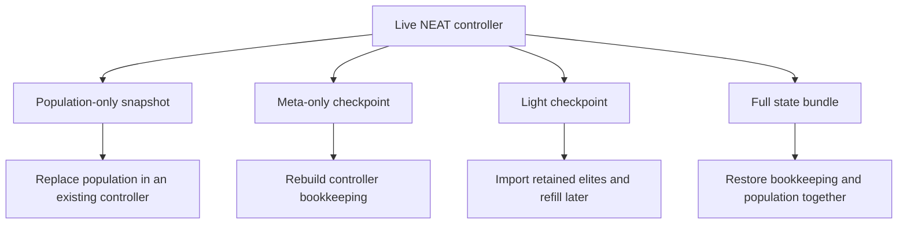
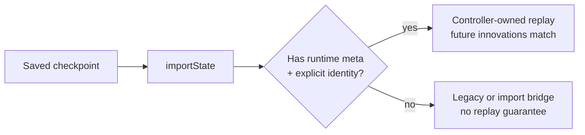
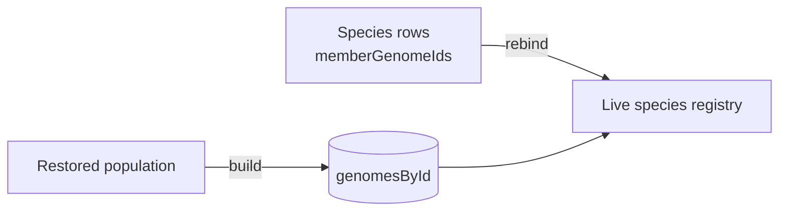

# neat/export

Persistence helpers for the NEAT controller's evolutionary state.

This export chapter exists so snapshotting and rehydration stay discoverable
as their own boundary instead of living in the shared root controller folder.
The helpers here intentionally avoid importing the concrete `Neat` class
directly, which keeps the serialization flow reusable across the public
facade, tests, and static restore entrypoints.

Typical usage follows three tracks:
- export or import just the population when you only need genome payloads;
- export or import a light checkpoint when you want to restart from retained
  elites without claiming exact future replay;
- export or import the full state when you need innovation history,
  generation counters, and population data to resume a run faithfully.

A useful way to read this chapter is as a pause-and-resume ladder:
- `exportPopulation()` and `importPopulation()` move only candidate genomes
- `toJSONImpl()` and `fromJSONImpl()` move only controller meta state
- `exportLightState()` and `importLightStateImpl()` move retained elites plus
  bootstrap controller metadata for best-effort restart
- `exportState()` and `importStateImpl()` combine both layers into one full
  resume bundle

Deterministic replay contract (why this boundary exists):

- **Population-only snapshots** are intentionally *not* a full replay.
  They preserve the candidate networks plus controller-owned per-genome
  metadata (stable genome ids, lineage hints, optional per-genome RNG state),
  but they do not promise that a resumed run will make the same future
  structural innovation assignments.
- **Meta-only checkpoints** preserve controller bookkeeping without forcing a
  particular population to travel with it. This is useful for carrying
  options, generation counters, and innovation tracking across environments.
- **Full checkpoints** are the pause-and-resume surface. When you restore a
  full checkpoint into the same codebase, the controller is expected to
  continue evolving as if it had never stopped.
- **Light checkpoints** are the restart surface. They keep a curated elite
  subset plus enough bootstrap metadata to repopulate through the ordinary
  evolution path, but they intentionally omit replay-critical runtime state.

“Same seed + same checkpoint + same code” is the target replay promise.
That promise only holds when controller-owned randomness and architecture
counters are treated as explicit state (see `neat.export.runtime.utils.ts`),
and when structural identity is treated as explicit history (node gene ids
plus connection innovation numbers).

Legacy/import bridge: `Network.fromJSON()` supports permissive restore flows
for older payloads, but the strict checkpoint path in this chapter validates
identity fields before allowing a resume. Treat fallback compatibility as a
deliberate opt-in bridge, not as native proper-NEAT semantics.

That split matters because not every persistence use case is a full replay.
Sometimes you want to archive candidate solutions for later inspection,
benchmark the same population under a new fitness function, or ship genomes
between environments without also freezing the controller's innovation
history. Other times you need a true checkpoint that can continue evolving as
if the process had never stopped.

Both full and light checkpoint bundles also reserve a top-level
`extensions` bag for downstream metadata. That pocket exists so consumers
such as NEATchat can attach namespaced descriptors without redefining the
checkpoint semantics that this chapter owns.

Read the chapter in this order:
- start with `exportPopulation()` and `importPopulation()` when you only need
  candidate genomes,
- then read `exportLightState()` and `importLightStateImpl()` when you need a
  smaller restart artifact built around retained elites,
- continue to `toJSONImpl()` and `fromJSONImpl()` when you need controller
  metadata without the live population,
- finish with `exportState()` and `importStateImpl()` when you need a full
  pause-and-resume checkpoint.





Background reading: Wikipedia contributors,
[Serialization](https://en.wikipedia.org/wiki/Serialization).

## neat/export/neat.export.ts

### exportLightState

```ts
exportLightState(
  exportOptions: NeatLightCheckpointExportOptions,
): NeatLightStateJSON
```

Export a light checkpoint containing only retained elite genomes plus
bootstrap controller metadata.

This is the best-effort restart sibling of {@link exportState}. It keeps a
curated high-quality subset of the current population and the original
restart-scale population target, but it intentionally omits replay-critical
innovation, speciation, and runtime metadata.

Callers may attach a top-level `extensions` bag after export for downstream
metadata that should travel with the bundle. That reserved surface is for
namespaced add-ons, not for overriding the light checkpoint's bootstrap
contract.

Parameters:
- `exportOptions` - Export policy describing how many elite genomes to keep.

Returns: Light checkpoint bundle for approximate restart.

Example:

```ts
const checkpoint = neat.exportLightState({ eliteCount: 4 });
checkpoint.extensions = {
  neatchat: {
    branchId: 'draft-1',
  },
};
```

### exportPopulation

```ts
exportPopulation(): GenomeJSON[]
```

Export the current population (array of genomes) into plain JSON objects.
Each genome is converted via its `toJSON()` method. You can persist this
result (e.g. to disk, a database, or localStorage) and later rehydrate it
with {@link importPopulation}.

Why export population only? Sometimes you want to snapshot just the set of
candidate solutions (e.g. for ensemble evaluation) without freezing the
innovation counters or hyper-parameters. Even in that lighter mode, the
export keeps controller-owned genome metadata next to each network payload so
imported populations do not silently lose genome ids or lineage evidence.

Example:

```ts
// Assuming `neat` is an instance exposing this helper
const popSnapshot = neat.exportPopulation();
fs.writeFileSync('population.json', JSON.stringify(popSnapshot, null, 2));
```

Returns: Array of genome JSON objects.

### exportState

```ts
exportState(): NeatStateJSON
```

Convenience helper that returns a full evolutionary snapshot: both NEAT meta
information and the serialized population array. Use this when you want a
truly pause-and-resume capability including innovation bookkeeping, stable
genome ids, species history, and live speciation bookkeeping.

In practice this is the "checkpoint" export. It is the safest default when
you care about reproducible continuation rather than only preserving candidate
genomes for later inspection.

Callers may attach a top-level `extensions` bag after export for downstream,
non-core metadata. That bag is intentionally outside the strict resume
contract: import validation still decides exact versus best-effort behavior
from the checkpoint-owned fields in `neat`, `population`, and `speciation`.

Example:

```ts
const state = neat.exportState();
state.extensions = {
  neatchat: {
    memoryBankId: 'memory-bank-1',
  },
};
fs.writeFileSync('state.json', JSON.stringify(state));
// ...later / elsewhere...
const raw = JSON.parse(fs.readFileSync('state.json', 'utf8')) as NeatStateJSON;
const neat2 = Neat.importState(raw, fitnessFn); // identical evolutionary context
```

Returns: A  {@link NeatStateJSON} bundle containing meta + population.

### fromJSONImpl

```ts
fromJSONImpl(
  neatJSON: NeatMetaJSON,
  fitnessFunction: (network: GenomeWithSerialization) => number | Promise<number>,
): NeatControllerForExport
```

Static-style implementation that rehydrates a NEAT instance from previously
exported meta JSON produced by {@link toJSONImpl}. This does not restore a
population; callers typically follow up with `importPopulation` or use
{@link importStateImpl} for a complete restore. Population-dependent state
such as the live species registry remains reserved for the full checkpoint
bundle.

This helper is the mirror image of `toJSONImpl()`: rebuild the controller's
evolution bookkeeping first, then decide separately whether the population
should be restored from another source.

Example:

```ts
const meta: NeatMetaJSON = JSON.parse(fs.readFileSync('neat-meta.json', 'utf8'));
const neat = Neat.fromJSONImpl(meta, fitnessFn); // empty population, same innovations
neat.importPopulation(popSnapshot); // optional
```

Parameters:
- `neatJSON` - Serialized meta (no population).
- `fitnessFunction` - Fitness callback used to construct the new instance.

Returns: Fresh NEAT instance with restored innovation history.

### GenomeControllerMetaJSON

Controller-owned genome metadata preserved in exported population snapshots.

The runtime `Network` JSON only describes the structural graph. A resumed
NEAT run also needs controller annotations such as stable genome ids,
lineage, rank-side metrics, and any cached score evidence that should still
exist immediately after restore.

### GenomeJSON

JSON representation of an individual genome (network). The concrete shape is
produced by `Network#toJSON()` and re-hydrated via `Network.fromJSON()`. The
export chapter may also attach one `controllerMeta` object alongside that
network payload so full checkpoints can preserve stable genome ids, lineage,
and evaluation-side annotations without widening the network serializer.

Treat this as a persistence boundary rather than a strict schema promise. The
export helpers preserve whatever `Network#toJSON()` emits, which lets the
broader architecture evolve without forcing this chapter to hard-code every
possible serialized field, while the reserved `controllerMeta` pocket keeps
controller-owned resume data explicit and versionable.

### importLightStateImpl

```ts
importLightStateImpl(
  stateBundle: NeatLightStateJSON,
  fitnessFunction: (network: GenomeWithSerialization) => number | Promise<number>,
): Promise<NeatControllerForExport>
```

Static-style helper that rehydrates a controller from a light checkpoint.

Light checkpoints preserve only bootstrap controller metadata plus a retained
elite subset, so this restore path rebuilds a compatible controller, imports
the retained genomes, and then reapplies the original restart-scale
population target without claiming exact replay.

Any top-level `extensions` bag is preserved as user-owned metadata rather
than part of the restart contract. Import therefore ignores that bag while it
validates the light checkpoint-owned bootstrap fields.

Parameters:
- `stateBundle` - Light checkpoint bundle produced by  {@link exportLightState} .
- `fitnessFunction` - Fitness evaluation callback used for the new instance.

Returns: Rehydrated NEAT instance ready for approximate restart.

### importPopulation

```ts
importPopulation(
  populationJSON: GenomeJSON[],
): Promise<void>
```

Import (replace) the current population from an array of serialized genomes.
This does not touch NEAT meta state (generation, innovations, etc.) - only the
population array and implied `popsize` are updated.
That makes it the right tool when you want to swap candidate solutions into an
existing controller context instead of restoring a full historical checkpoint.

Example:

```ts
const populationData: GenomeJSON[] = JSON.parse(fs.readFileSync('population.json', 'utf8'));
neat.importPopulation(populationData); // population replaced
neat.evolve(); // continue evolving with new starting genomes
```

Edge cases handled:
- Empty array => becomes an empty population (popsize=0).
- Legacy snapshots without controller genome ids are upgraded by assigning
  fresh ids inside the destination controller.
- Malformed entries or native genomes that fail proper-NEAT validation throw
  explicit population-validation errors.

Parameters:
- `populationJSON` - Array of serialized genome objects.

Returns: Promise that resolves once all genomes have been rehydrated and the
controller population has been replaced.

### importStateImpl

```ts
importStateImpl(
  stateBundle: NeatStateJSON,
  fitnessFunction: (network: GenomeWithSerialization) => number | Promise<number>,
  restoreOptions: NeatCheckpointRestoreOptions | undefined,
): Promise<NeatControllerForExport>
```

Static-style helper that rehydrates a full evolutionary state previously
produced by {@link exportState}. Invoke this with the NEAT class (not an
instance) bound as `this`, e.g. `Neat.importStateImpl(bundle, fitnessFn)`.
It constructs a new NEAT instance using the meta data, then imports the
population (if present).

This is the most complete restore path in the chapter. If a saved bundle is
valid, the caller gets back a fresh controller that knows both where the run
was in evolutionary time and which genomes were alive at that moment.

Any top-level `extensions` bag is treated as downstream metadata only. It is
allowed to travel with the bundle, but it does not weaken the strict checks
around replay-critical speciation and runtime state.

Safety and validation:
- Throws if the bundle is not an object.
- Throws if the bundle omits the full population array.
- Throws if the population or species payload cannot satisfy the proper-NEAT
  resume contract.

Example:

```ts
const bundle: NeatStateJSON = JSON.parse(fs.readFileSync('state.json', 'utf8'));
const neat = Neat.importStateImpl(bundle, fitnessFn);
neat.evolve();
```

Parameters:
- `stateBundle` - Full state bundle from  {@link exportState} .
- `fitnessFunction` - Fitness evaluation callback used for new instance.
- `restoreOptions` - Explicit restore-mode override. Defaults to strict exact resume.

Returns: Rehydrated NEAT instance ready to continue evolving.

### NeatCheckpointRestoreOptions

Public restore options for full checkpoint imports.

Strict mode preserves the exact-resume contract by rejecting versioned full
checkpoints when replay-critical runtime state is missing. Best-effort mode
allows an explicit downgrade path for partial bundles that should still
restore as a usable controller without claiming exact future replay.

### NeatLightCheckpointExportOptions

Export options for light checkpoints.

Light checkpoints intentionally keep only a curated elite subset of the
current population, so callers must choose how many top-scoring genomes to
retain in the bundle.

### NeatLightMetaJSON

Bootstrap metadata carried by light checkpoints.

This payload is deliberately smaller than `NeatMetaJSON`: it carries only the
controller fields needed to rebuild a compatible run before importing the
retained elite genomes.

### NeatLightStateJSON

Top-level bundle used by the light checkpoint path.

A light checkpoint keeps a curated elite subset plus enough bootstrap state
to rebuild a compatible controller, but it intentionally omits replay-only
innovation, speciation, and runtime metadata.

### NeatMetaJSON

Serialized meta information describing a NEAT run, excluding the concrete
population genomes. This allows you to persist and resume experiment context
without committing to a particular population snapshot, while still carrying
controller counters and history that do not depend on live genome instances.

### NeatRuntimeMetaJSON

Controller runtime state that does not depend on the live population object
graph and can therefore travel through the meta-only checkpoint path.

### NeatStateJSON

Top-level bundle containing both NEAT meta information and the full array of
serialized genomes (population). This is what you get from `exportState()` and
feed into `importStateImpl()` to resume exactly where you left off.

If `NeatMetaJSON` is the controller checkpoint and `GenomeJSON[]` is the pool
of candidate solutions, `NeatStateJSON` is the combined pause-and-resume
artifact that preserves both layers together plus the species-side runtime
state needed by the strict full-checkpoint restore path.

### SpeciationCheckpointJSON

Speciation-specific checkpoint state required by the full resume path.

### SpeciesCheckpointJSON

Species registry row captured inside a full checkpoint.

Species state points back to population genomes by stable genome id so the
import path can rebind the live species registry onto the freshly restored
`Network` instances.

### toJSONImpl

```ts
toJSONImpl(): NeatMetaJSON
```

Serialize NEAT meta (excluding the mutable population) for persistence of
innovation history and experiment configuration. This is sufficient to
recreate a blank NEAT run at the same evolutionary generation with the same
innovation counters, genome-id cursor, and archived species history,
enabling deterministic continuation when combined later with a saved
population.

Use this path when the controller context matters but the population payload
should be stored, transferred, or versioned separately.

Example:

```ts
const meta = neat.toJSONImpl();
fs.writeFileSync('neat-meta.json', JSON.stringify(meta));
// ... later ...
const metaLoaded = JSON.parse(fs.readFileSync('neat-meta.json', 'utf8')) as NeatMetaJSON;
const neat2 = Neat.fromJSONImpl(metaLoaded, fitnessFn); // empty population
```

## neat/export/neat.export.types.ts

### CURRENT_META_FORMAT_VERSION

Format version for controller-only meta checkpoints.

### CURRENT_STATE_FORMAT_VERSION

Format version for strict full-state checkpoint bundles.

### FULL_CHECKPOINT_MODE

Checkpoint mode marker for strict full-resume bundles.

### GenomeControllerCarrier

Internal genome view combining network serialization with controller-owned
metadata used by export and restore helpers.

### GenomeControllerMetaJSON

Controller-owned genome metadata preserved in exported population snapshots.

The runtime `Network` JSON only describes the structural graph. A resumed
NEAT run also needs controller annotations such as stable genome ids,
lineage, rank-side metrics, and any cached score evidence that should still
exist immediately after restore.

### GenomeJSON

JSON representation of an individual genome (network). The concrete shape is
produced by `Network#toJSON()` and re-hydrated via `Network.fromJSON()`. The
export chapter may also attach one `controllerMeta` object alongside that
network payload so full checkpoints can preserve stable genome ids, lineage,
and evaluation-side annotations without widening the network serializer.

Treat this as a persistence boundary rather than a strict schema promise. The
export helpers preserve whatever `Network#toJSON()` emits, which lets the
broader architecture evolve without forcing this chapter to hard-code every
possible serialized field, while the reserved `controllerMeta` pocket keeps
controller-owned resume data explicit and versionable.

### GenomeWithSerialization

Genome with `toJSON()` serialization method.

This is the smallest runtime contract needed by the export helpers when they
only care about turning one genome into a JSON payload.

### LEGACY_CHECKPOINT_FORMAT_VERSION

Format version used when a checkpoint predates explicit version tags.

### LIGHT_CHECKPOINT_MODE

Checkpoint mode marker for best-effort light-resume bundles.

### NeatCheckpointRestoreOptions

Public restore options for full checkpoint imports.

Strict mode preserves the exact-resume contract by rejecting versioned full
checkpoints when replay-critical runtime state is missing. Best-effort mode
allows an explicit downgrade path for partial bundles that should still
restore as a usable controller without claiming exact future replay.

### NeatConstructor

NEAT class constructor interface.

Static-style restore helpers depend on this constructor shape so they can
rebuild a controller instance from persisted meta data and then optionally
rehydrate the population.

### NeatControllerForExport

NEAT controller interface for export operations.

The persistence helpers intentionally depend on this narrow host shape instead
of the concrete `Neat` class. That keeps export and restore logic reusable in
tests and static-style helper flows without coupling the file to the full
controller implementation.

### NeatLightCheckpointExportOptions

Export options for light checkpoints.

Light checkpoints intentionally keep only a curated elite subset of the
current population, so callers must choose how many top-scoring genomes to
retain in the bundle.

### NeatLightMetaJSON

Bootstrap metadata carried by light checkpoints.

This payload is deliberately smaller than `NeatMetaJSON`: it carries only the
controller fields needed to rebuild a compatible run before importing the
retained elite genomes.

### NeatLightStateJSON

Top-level bundle used by the light checkpoint path.

A light checkpoint keeps a curated elite subset plus enough bootstrap state
to rebuild a compatible controller, but it intentionally omits replay-only
innovation, speciation, and runtime metadata.

### NeatMetaJSON

Serialized meta information describing a NEAT run, excluding the concrete
population genomes. This allows you to persist and resume experiment context
without committing to a particular population snapshot, while still carrying
controller counters and history that do not depend on live genome instances.

### NeatRuntimeMetaJSON

Controller runtime state that does not depend on the live population object
graph and can therefore travel through the meta-only checkpoint path.

### NeatStateJSON

Top-level bundle containing both NEAT meta information and the full array of
serialized genomes (population). This is what you get from `exportState()` and
feed into `importStateImpl()` to resume exactly where you left off.

If `NeatMetaJSON` is the controller checkpoint and `GenomeJSON[]` is the pool
of candidate solutions, `NeatStateJSON` is the combined pause-and-resume
artifact that preserves both layers together plus the species-side runtime
state needed by the strict full-checkpoint restore path.

### NetworkClass

Network class with static `fromJSON()` method.

Import helpers use this contract when rebuilding genomes from serialized JSON
without needing to know the concrete network implementation details.

### SpeciationCheckpointJSON

Speciation-specific checkpoint state required by the full resume path.

### SpeciesCheckpointJSON

Species registry row captured inside a full checkpoint.

Species state points back to population genomes by stable genome id so the
import path can rebind the live species registry onto the freshly restored
`Network` instances.

### SpeciesControllerCarrier

Internal species row shape used while serializing and restoring checkpoints.

## neat/export/neat.export.utils.ts

Export checkpoint guard utilities.

These helpers exist because the broader `Network.toJSON()` / `Network.fromJSON()`
surface is intentionally permissive: it can serialize and restore a network
even when some controller-owned identity or metadata is missing.

A proper-NEAT checkpoint boundary is stricter.

- Population snapshots must be validator-clean native genomes.
- Serialized nodes must carry explicit `geneId` fields.
- Serialized connections must carry explicit `innovation`, `fromGeneId`, and
  `toGeneId` fields (plus `gaterGeneId` when gated).

If any of those are missing, import should fail fast rather than silently
normalizing into a "valid looking" but replay-divergent controller state.

Example:

```ts
// During import, validate the payload before calling `Network.fromJSON()`.
assertSerializedGenomeCarriesCheckpointIdentity(payload, 0);
const genome = Network.fromJSON(payload);
```

### assertCheckpointGenomeIsNative

```ts
assertCheckpointGenomeIsNative(
  genome: GenomeControllerCarrier,
  genomeIndex: number,
  operation: "export" | "import",
): void
```

Assert that one live genome satisfies the native proper-NEAT contract.

Export and import both depend on validator-clean native genomes so checkpoint
payloads do not normalize malformed controller state into a seemingly valid
snapshot.

Parameters:
- `genome` - Live genome being exported or rehydrated.
- `genomeIndex` - Stable population index used in error messages.
- `operation` - Current checkpoint operation for diagnostics.

Returns: Nothing.

### assertSerializedGenomeCarriesCheckpointIdentity

```ts
assertSerializedGenomeCarriesCheckpointIdentity(
  networkPayload: Record<string, unknown>,
  genomeIndex: number,
): void
```

Assert that a serialized checkpoint payload carries explicit historical identity.

`Network.fromJSON()` intentionally supports more permissive restore flows, so
the strict proper-NEAT checkpoint boundary must validate the serialized node
and connection identity fields before runtime rehydration can synthesize any
replacement structure.

Parameters:
- `networkPayload` - Raw network JSON payload from persistence.
- `genomeIndex` - Stable population index used in diagnostics.

Returns: Nothing.

### findNextGenomeIdFloor

```ts
findNextGenomeIdFloor(
  population: GenomeControllerCarrier[],
): number
```

Compute the next genome-id floor implied by one population.

Import paths use this after population restore so future offspring ids remain
above every stable genome id already present in memory.

Parameters:
- `population` - Restored controller population.

Returns: Next safe genome id after the maximum observed id.

### resolveMetaFormatVersion

```ts
resolveMetaFormatVersion(
  neatJSON: NeatMetaJSON,
): number
```

Resolve the effective meta-checkpoint format version.

Missing version tags are treated as the legacy pre-versioned format so the
export boundary can decide whether to restore or reject older payloads.

Parameters:
- `neatJSON` - Serialized controller meta payload.

Returns: Effective meta format version.

### resolveStateFormatVersion

```ts
resolveStateFormatVersion(
  stateBundle: NeatStateJSON,
): number
```

Resolve the effective full-checkpoint format version.

Missing version tags are treated as the legacy pre-versioned format so the
full restore path can branch cleanly between older payloads and the current
strict checkpoint contract.

Parameters:
- `stateBundle` - Serialized full-checkpoint payload.

Returns: Effective full-checkpoint format version.

## neat/export/neat.export.population.utils.ts

Population genome checkpoint helpers.

A "population snapshot" is primarily the network structure (nodes +
connections). However, the NEAT controller also owns per-genome annotations
such as scores, lineage metadata, multi-objective ranks, novelty, and stable
genome ids.

This file implements a small contract:

- `controllerMeta` is the only reserved controller-owned key in a serialized
  genome payload.
- Everything else is treated as raw network JSON and is passed through to
  `Network.fromJSON()`.
- Stable genome ids must be unique within a restored population.

That last point matters for deterministic replay: a full checkpoint restores
speciation state by stable genome id, not by array position.

### buildGenomeControllerMeta

```ts
buildGenomeControllerMeta(
  genome: GenomeControllerCarrier,
): GenomeControllerMetaJSON
```

Build the controller-owned metadata pocket for one genome.

Only fields that are currently present on the live genome are copied into the
checkpoint metadata so exported payloads stay compact and omission remains
meaningful.

Parameters:
- `genome` - Live genome carrying controller-owned annotations.

Returns: Controller metadata object for checkpoint export.

### hydrateGenomeControllerMeta

```ts
hydrateGenomeControllerMeta(
  genome: GenomeControllerCarrier,
  controllerMeta: GenomeControllerMetaJSON | undefined,
  seenGenomeIds: Set<number>,
  nextAssignedGenomeId: number,
): number
```

Rehydrate controller-owned genome metadata after network restore.

This helper restores score- and lineage-side annotations, enforces unique
stable genome ids within the imported population, and returns the next id
floor that later imports or offspring generation must stay above.

Parameters:
- `genome` - Rehydrated live genome instance.
- `controllerMeta` - Optional controller metadata from the checkpoint.
- `seenGenomeIds` - Set tracking stable genome ids already assigned.
- `nextAssignedGenomeId` - Next fallback genome id when the payload lacks one.

Returns: Updated next genome id floor after this genome is restored.

### serializeGenomeCheckpoint

```ts
serializeGenomeCheckpoint(
  genome: GenomeControllerCarrier,
  networkPayload: GenomeJSON,
): GenomeJSON
```

Serialize one live genome into a checkpoint payload.

The network serializer owns structural graph fields, while this helper adds
the reserved `controllerMeta` pocket only when the controller has metadata
worth preserving beside the network JSON.

Parameters:
- `genome` - Live genome from the controller population.

Returns: Serialized genome payload with optional controller metadata.

### splitSerializedGenomeCheckpoint

```ts
splitSerializedGenomeCheckpoint(
  serializedGenome: GenomeJSON,
): { controllerMeta?: GenomeControllerMetaJSON | undefined; networkPayload: Record<string, unknown>; }
```

Split one serialized genome into controller metadata and network payload.

Import paths treat `controllerMeta` as the only reserved export-owned field;
everything else is passed through to `Network.fromJSON()` as the raw network
payload.

Parameters:
- `serializedGenome` - Checkpoint genome object read from persistence.

Returns: Reserved controller metadata plus the raw network payload.

## neat/export/neat.export.runtime.utils.ts

### restoreRuntimeMeta

```ts
restoreRuntimeMeta(
  neatInstance: NeatControllerForExport,
  runtimeMeta: NeatRuntimeMetaJSON | undefined,
): void
```

Restore controller runtime state from meta-only checkpoint data.

This helper only applies fields that remain meaningful without the live
population object graph; species registries themselves stay reserved for the
full checkpoint path.

Parameters:
- `neatInstance` - Fresh controller instance being restored.
- `runtimeMeta` - Optional runtime metadata payload from persistence.

Returns: Nothing.

### serializeRuntimeMeta

```ts
serializeRuntimeMeta(
  internal: NeatControllerForExport,
): NeatRuntimeMetaJSON
```

Serialize controller runtime state that is independent of the live population.

These fields can travel with the meta-only checkpoint surface because they do
not hold direct references to live genome instances.

Deterministic replay note:

The controller's replay-safe resume path requires more than the innovation
tracker payload. The architecture layer also owns monotonic counters for
allocating connection innovations, node gene ids, and runtime node indexes.
If those counters are not restored, a resumed run can produce valid networks
that still diverge immediately because the next structural allocation chooses
different identities.

Parameters:
- `internal` - Live controller host.

Returns: Serializable runtime metadata payload.

## neat/export/neat.export.speciation.utils.ts

Full-checkpoint speciation helpers.

Speciation is replay-sensitive because it binds historical context to the
current generation: species membership, representative anchors, and
compatibility threshold state all influence future reproduction.

For deterministic restore, we serialize species membership by stable genome
id rather than by array index.



### createCheckpointMemberPlaceholder

```ts
createCheckpointMemberPlaceholder(
  genomeId: number,
): GenomeControllerCarrier
```

Create a lightweight placeholder for a previous-generation species member.

Full replay only needs these historical members for their stable ids because
`_speciate()` snapshots member ids before immediately clearing the live member
arrays. Detached placeholders therefore preserve continuity without forcing
the checkpoint to duplicate every historical genome payload.

Parameters:
- `genomeId` - Stable genome id referenced by the historical species row.

Returns: Minimal carrier exposing the required stable id.

### readRequiredGenomeId

```ts
readRequiredGenomeId(
  genome: GenomeControllerCarrier,
  contextLabel: string,
): number
```

Read the stable genome id required by checkpointed species state.

Full checkpoints refer back to live genomes by id, so species export must
fail immediately when a referenced genome does not carry one.

Parameters:
- `genome` - Live genome referenced by checkpoint state.
- `contextLabel` - Human-readable export context for diagnostics.

Returns: Stable genome id.

### restoreRepresentativeAnchor

```ts
restoreRepresentativeAnchor(
  representativeGenome: Record<string, unknown> | undefined,
  liveGenomesById: Map<number, GenomeControllerCarrier>,
  networkClass: NetworkClass,
): GenomeControllerCarrier | undefined
```

Restore a detached representative anchor from checkpoint JSON.

The representative snapshot is only needed when the controller checkpoint was
taken between generations and the live species registry still points at a
prior-generation anchor. That anchor must keep its structural graph so the
next speciation pass can compare new genomes against the same reference.

Parameters:
- `representativeGenome` - Optional serialized representative checkpoint.
- `liveGenomesById` - Restored current-population genomes keyed by id.
- `networkClass` - Network class used to rebuild serialized genomes.

Returns: Restored representative anchor when one was exported.

### restoreSpeciationCheckpoint

```ts
restoreSpeciationCheckpoint(
  neatInstance: NeatControllerForExport,
  speciationCheckpoint: SpeciationCheckpointJSON,
  networkClass: NetworkClass,
): void
```

Restore the live species registry from a full-checkpoint payload.

The restore path first rebuilds a lookup of imported genomes by stable id,
then rebinds each checkpoint species row onto those live instances while
restoring the related speciation bookkeeping maps and threshold state.

Parameters:
- `neatInstance` - Controller instance whose population is already restored.
- `speciationCheckpoint` - Serialized speciation payload from persistence.

Returns: Nothing.

### serializeSpeciationCheckpoint

```ts
serializeSpeciationCheckpoint(
  internal: NeatControllerForExport,
): SpeciationCheckpointJSON
```

Serialize the live speciation registry into a full-checkpoint payload.

Species membership is written by stable genome id so restore can rebind the
registry onto freshly rehydrated network instances without relying on array
position or permissive structural matching.

Parameters:
- `internal` - Live controller host.

Returns: Serializable speciation checkpoint payload.

### shouldSerializeRepresentativeAnchor

```ts
shouldSerializeRepresentativeAnchor(
  representative: GenomeControllerCarrier,
  livePopulationIds: Set<number>,
): boolean
```

Decide whether the checkpoint must carry a detached representative anchor.

Generation-boundary checkpoints can legally keep a previous-generation
representative even after the live population has already been replaced.
When that happens, replay needs the representative's full structure because
the next speciation pass compares the new population against that anchor.

Parameters:
- `representative` - Live representative genome.
- `livePopulationIds` - Stable genome ids present in the current population.

Returns: Whether the representative must be serialized explicitly.

## neat/export/neat.export.errors.ts

Raised when a persisted NEAT state bundle is missing or malformed.

This error is generally thrown while validating the raw checkpoint payload
(JSON shape + required keys) before attempting to restore any runtime state.

### NeatExportPopulationValidationError

Raised when a serialized population snapshot cannot be restored safely.

Callers should treat this as a hard stop: continuing with a partially
validated population snapshot can silently corrupt deterministic replay.

### NeatExportStateBundleValidationError

Raised when a persisted NEAT state bundle is missing or malformed.

This error is generally thrown while validating the raw checkpoint payload
(JSON shape + required keys) before attempting to restore any runtime state.

### NeatExportStateControllerRestoreError

Raised when a NEAT controller cannot be rehydrated from serialized state.

This error indicates the payload may be well-formed JSON, but it cannot be
safely mapped onto the current controller instance (for example: missing
referenced genomes, duplicated stable ids, or incompatible replay contract
expectations).
