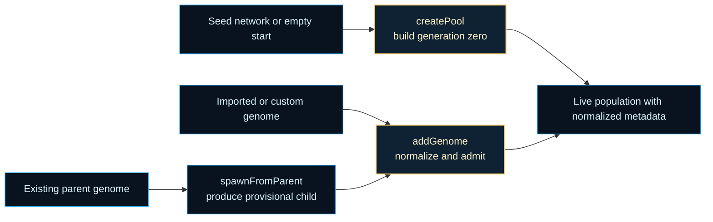
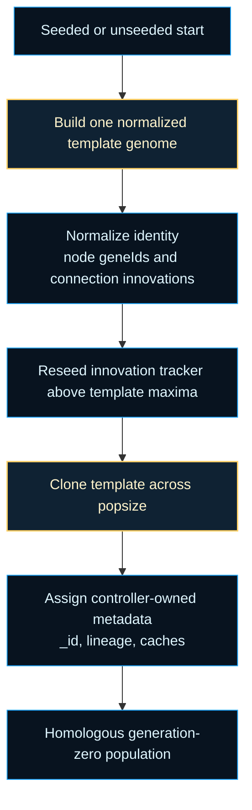

# neat/helpers

Helper utilities for the shared NEAT controller lifecycle.

This chapter owns the population-entry boundary for the shared NEAT
controller. The surrounding chapters decide how genomes should be evaluated,
ranked, mutated, or speciated once they are already alive inside the
population; this boundary answers the earlier provenance question: how does a
genome first become part of that live population, and what metadata must be
attached before later controller phases can trust it?

The three public helpers cover the full entry story:

1. `createPool()` bootstraps the first generation from either fresh minimal
   networks or a supplied seed topology.
2. `spawnFromParent()` creates a provisional child that still needs an
   explicit keep-or-discard decision.
3. `addGenome()` registers an externally sourced or newly accepted genome so
   lineage, cache, and structural invariants match the rest of the run.

Those three paths are related, but they are not interchangeable. That is the
main pedagogical point of this root chapter:

- `createPool()` creates generation-zero membership,
- `spawnFromParent()` creates a candidate with meaningful lineage but without
  guaranteed admission,
- `addGenome()` is the commit step that makes a genome part of the live run.

Keeping those paths together prevents subtle drift in `_id`, `_parents`,
`_depth`, `_reenableProb`, feed-forward intent, and cache invalidation rules.
The public `Neat` facade still exposes the same methods, but this file now
reads as one small chapter about safe population entry instead of a grab bag
of leftover helpers.



Required teaching output: generation-zero alignment.



Read this chapter when you want to answer one practical controller question:
before selection, evaluation, and speciation can trust a genome, how does it
cross the boundary into the live population in a normalized state?

## neat/helpers/neat.helpers.ts

### addGenome

```ts
addGenome(
  genome: GenomeWithMetadata,
  parents: number[] | undefined,
): void
```

Register an externally constructed genome (for example, deserialized,
custom-built, or imported from another run) into the active population.
This is the provenance-normalization path for genomes that did not originate
from `createPool()` or from the controller's normal crossover flow. The
helper makes those outside genomes look like first-class population members by
assigning the same controller-owned metadata and applying the same structural
cleanup that internally created genomes receive.

Use this after a deliberate keep decision. `spawnFromParent()` returns a
provisional child; deserialization and custom construction create provisional
genomes too. `addGenome()` is the moment where those candidates become part
of the active run.

Defensive design: if invariant enforcement fails, the genome is still added
on a best-effort basis so experiments remain reproducible and do not abort
mid-run.

Parameters:
- `this` - Bound NEAT instance.
- `genome` - Genome / network object to insert. Mutated in place to add
internal metadata fields (`_id`, `_parents`, `_depth`, `_reenableProb`).
- `parents` - Optional explicit list of parent genome IDs (for example, two
parents for crossover). If omitted, the genome is treated as an
exogenous insertion with empty lineage ancestry.

Example:

```ts
const imported = Network.fromJSON(saved);
neat.addGenome(imported, [parentA._id, parentB._id]);
```

### applyMutationPasses

```ts
applyMutationPasses(
  internal: NeatControllerForHelpers,
  clone: GenomeWithMetadata,
  mutateCount: number,
): Promise<void>
```

Apply the requested number of mutation passes to a cloned offspring,
silently ignoring individual mutation failures to keep evolution moving.

Parameters:
- `internal` - NEAT controller internals providing mutation selection and RNG.
- `clone` - The genome to mutate.
- `mutateCount` - Number of sequential mutation passes to attempt.

### applyStructuralInvariants

```ts
applyStructuralInvariants(
  internal: NeatControllerForHelpers,
  clone: GenomeWithMetadata,
): void
```

Enforce structural invariants (minimum hidden nodes, no dead ends) on a
cloned offspring before mutation passes begin.

Parameters:
- `internal` - NEAT controller internals exposing repair hooks.
- `clone` - The cloned genome to repair.

### assignChildMetadata

```ts
assignChildMetadata(
  clone: GenomeWithMetadata,
  internal: NeatControllerForHelpers,
  parentGenome: GenomeWithMetadata,
): void
```

Reset evaluation state and assign controller-owned identity metadata to a
freshly cloned offspring.

Parameters:
- `clone` - The cloned genome to normalize.
- `internal` - NEAT controller internals providing identity and options.
- `parentGenome` - The parent genome for lineage depth tracking.

### cloneParentGenome

```ts
cloneParentGenome(
  parentGenome: GenomeWithMetadata,
): Promise<GenomeWithMetadata>
```

Deep-clone a parent genome, preferring a direct `clone()` call and falling
back to a JSON round-trip when no `clone()` method is available.

Parameters:
- `parentGenome` - Parent genome to clone.

Returns: A deep copy of the parent genome.

### createPool

```ts
createPool(
  seedNetwork: GenomeWithMetadata | null,
): void
```

Create or reset the initial population pool for a NEAT run.

If a `seedNetwork` is supplied, every genome is a structural and weight clone
of one normalized template derived from that seed. This is useful for
transfer learning or continuing evolution from a known good architecture.
When omitted, one fresh minimal template is synthesized using the configured
input/output sizes and optional minimum hidden layer size, then cloned across
the whole starting population so node gene ids and connection innovations are
aligned from the first generation.

This is the controller's bootstrap path, not its general-purpose import path.
`createPool()` assumes the caller is defining generation zero and therefore
assigns clean identity and lineage state from scratch. Later provenance work,
such as importing one external genome or admitting a hand-picked offspring,
belongs to {@link addGenome} instead.

Design notes:
- Population size is derived from `options.popsize` (default 50).
- The controller innovation tracker is reseeded from the normalized
  generation-zero template so later structural mutations start above the
  starter graph's historical markings.
- Each genome gets a unique sequential `_id` for reproducible lineage.
- When lineage tracking is enabled (`_lineageEnabled`), parent and depth
  fields are initialized for later analytics.
- Feed-forward topology intent is promoted only when the configured mutation
  policy requests it and the genome already satisfies the stricter structural
  contract.
- Structural invariant checks are best effort. A single failure should not
  prevent other genomes from being created, hence the broad try/catch.

Parameters:
- `this` - Bound NEAT instance.
- `seedNetwork` - Optional prototype network to clone for every initial genome.

Example:

```ts
// Basic: create 50 fresh minimal networks
neat.createPool(null);

// Seeded: start with a known topology
const seed = new Network(neat.input, neat.output, { minHidden: 4 });
neat.createPool(seed);
```

### executeMutation

```ts
executeMutation(
  clone: GenomeWithMetadata,
  selectedMutationMethod: MutationMethod | undefined,
): void
```

Execute a single mutation operator on a clone when the operator carries a
valid name (convention).

Parameters:
- `clone` - The genome to mutate.
- `selectedMutationMethod` - The mutation operator to apply (if valid).

### GenomeWithMetadata

Minimal genome contract required by the population-entry helpers.

This interface deliberately stops short of the full `Network` surface. The
helpers only need enough capability to clone or serialize a genome, apply a
mutation, and attach the small amount of controller-owned metadata that later
chapters rely on for lineage, pruning, telemetry, and deterministic replay.

Read this as the runtime envelope around a genome while it is crossing the
boundary into the live population. Once the genome is registered, richer
controller chapters can treat `_id`, `_parents`, `_depth`, and
`_reenableProb` as already normalized.

### MutationMethod

Minimal mutation descriptor consumed during parent-derived spawning.

The helpers only care about one stable public fact from the mutation system:
which operator name should be applied to the cloned child. Keeping this
contract narrow avoids importing the full mutation policy layer into the
population-entry boundary while still letting `spawnFromParent()` reuse the
controller's configured mutation selection flow.

### NeatControllerForHelpers

Narrow host seam required by the population-entry helpers.

This contract exists so `createPool()`, `spawnFromParent()`, and
`addGenome()` can share the same runtime assumptions without depending on the
entire public `Neat` facade. The helper chapter needs population storage,
identity allocation, structural-repair hooks, RNG-backed mutation selection,
and a few option values, but it should not widen into a second controller
facade of its own.

In practice this seam protects two invariants:

- every entering genome receives the same controller-owned metadata shape,
- every entry path applies the same best-effort cleanup before later chapters
  read the genome.

### selectSingleMutationMethod

```ts
selectSingleMutationMethod(
  internal: NeatControllerForHelpers,
  clone: GenomeWithMetadata,
): Promise<MutationMethod | undefined>
```

Select a single mutation method for a cloned offspring, resolving array
candidates to one via the controller's RNG.

Parameters:
- `internal` - NEAT controller internals providing mutation selection and RNG.
- `clone` - The genome being mutated.

Returns: A single mutation method, or `undefined` when none is available.

### spawnFromParent

```ts
spawnFromParent(
  parentGenome: GenomeWithMetadata,
  mutateCount: number,
): Promise<GenomeWithMetadata>
```

Spawn a child genome from a parent by deep-cloning the parent, assigning
fresh metadata and lineage, applying structural invariants, and running
the configured number of mutation passes. Individual mutation failures
are silently ignored to keep the evolutionary process moving.

Parameters:
- `this` - Neat-like controller with internal mutation and innovation state.
- `parentGenome` - The parent genome to clone and mutate.
- `mutateCount` - Number of mutation passes to apply (default 1).

Returns: A promise resolving to the spawned child genome.
