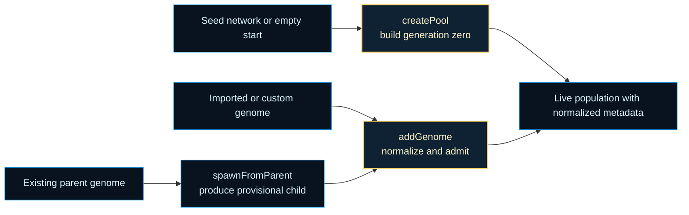

# neat/helpers

Helper utilities for the shared NEAT controller lifecycle.

This chapter owns the population-entry boundary for the shared NEAT
controller. The surrounding chapters decide how genomes should be evaluated,
ranked, mutated, or speciated once they are already alive inside the
population; this boundary answers the earlier provenance question: how does a
genome first become part of that live population, and what metadata must be
attached before later controller phases can trust it?

The three public helpers cover the full entry story:

1. `createPool()` bootstraps the first generation from either fresh minimal
   networks or a supplied seed topology.
2. `spawnFromParent()` creates a provisional child that still needs an
   explicit keep-or-discard decision.
3. `addGenome()` registers an externally sourced or newly accepted genome so
   lineage, cache, and structural invariants match the rest of the run.

Those three paths are related, but they are not interchangeable. That is the
main pedagogical point of this root chapter:

- `createPool()` creates generation-zero membership,
- `spawnFromParent()` creates a candidate with meaningful lineage but without
  guaranteed admission,
- `addGenome()` is the commit step that makes a genome part of the live run.

Keeping those paths together prevents subtle drift in `_id`, `_parents`,
`_depth`, `_reenableProb`, feed-forward intent, and cache invalidation rules.
The public `Neat` facade still exposes the same methods, but this file now
reads as one small chapter about safe population entry instead of a grab bag
of leftover helpers.



Read this chapter when you want to answer one practical controller question:
before selection, evaluation, and speciation can trust a genome, how does it
cross the boundary into the live population in a normalized state?

## neat/helpers/neat.helpers.ts

### spawnFromParent

```ts
spawnFromParent(
  parentGenome: GenomeWithMetadata,
  mutateCount: number,
): Promise<GenomeWithMetadata>
```

Spawn (clone & mutate) a child genome from an existing parent genome.

Read this helper as the provisional provenance path. It produces a candidate
offspring whose lineage is already meaningful, but whose membership in the
active population is still undecided. That split is important when a caller
wants to preview, filter, score, or compare several children before allowing
one of them to join the population through {@link addGenome}.

Evolutionary rationale:
- Cloning preserves the full topology and weights of the parent.
- A configurable number of mutation passes are applied sequentially; each
  pass may alter structure (add/remove nodes or connections) or weights.
- Lineage annotations (`_parents`, `_depth`) enable later analytics such as
  diversity statistics, genealogy visualization, and pruning heuristics.
- Cache invalidation happens before the child is returned so later admission
  or evaluation logic never observes stale derived state from the clone.

Robustness philosophy: individual mutation failures are silently ignored so a
single stochastic edge case does not derail evolutionary progress.

Parameters:
- `this` - Bound NEAT instance (inferred when used as a method).
- `parentGenome` - Parent genome/network to clone. Must implement either
`clone()` OR a pair of `toJSON()` / static `fromJSON()` for deep copying.
- `mutateCount` - Number of sequential mutation operations to attempt; each
iteration chooses a mutation method using the instance's selection
logic. Defaults to 1 for conservative structural drift.

Returns: A new genome whose score and derived caches are reset, whose lineage
metadata references the parent, and whose final admission into the
live population is left to the caller.

Example:

```ts
// Assume `neat` is an instance implementing NeatLike and `parent` is a genome in neat.population
const child = neat.spawnFromParent(parent, 3); // apply 3 mutation passes
// Optionally inspect / filter the child before adding
neat.addGenome(child, [parent._id]);
```

### addGenome

```ts
addGenome(
  genome: GenomeWithMetadata,
  parents: number[] | undefined,
): void
```

Register an externally constructed genome (for example, deserialized,
custom-built, or imported from another run) into the active population.
This is the provenance-normalization path for genomes that did not originate
from `createPool()` or from the controller's normal crossover flow. The
helper makes those outside genomes look like first-class population members by
assigning the same controller-owned metadata and applying the same structural
cleanup that internally created genomes receive.

Use this after a deliberate keep decision. `spawnFromParent()` returns a
provisional child; deserialization and custom construction create provisional
genomes too. `addGenome()` is the moment where those candidates become part
of the active run.

Defensive design: if invariant enforcement fails, the genome is still added
on a best-effort basis so experiments remain reproducible and do not abort
mid-run.

Parameters:
- `this` - Bound NEAT instance.
- `genome` - Genome / network object to insert. Mutated in place to add
internal metadata fields (`_id`, `_parents`, `_depth`, `_reenableProb`).
- `parents` - Optional explicit list of parent genome IDs (for example, two
parents for crossover). If omitted, the genome is treated as an
exogenous insertion with empty lineage ancestry.

Example:

```ts
const imported = Network.fromJSON(saved);
neat.addGenome(imported, [parentA._id, parentB._id]);
```

### createPool

```ts
createPool(
  seedNetwork: GenomeWithMetadata | null,
): void
```

Create or reset the initial population pool for a NEAT run.

If a `seedNetwork` is supplied, every genome is a structural and weight clone
of that seed. This is useful for transfer learning or continuing evolution
from a known good architecture. When omitted, brand-new minimal networks are
synthesized using the configured input/output sizes and optional minimum
hidden layer size.

This is the controller's bootstrap path, not its general-purpose import path.
`createPool()` assumes the caller is defining generation zero and therefore
assigns clean identity and lineage state from scratch. Later provenance work,
such as importing one external genome or admitting a hand-picked offspring,
belongs to {@link addGenome} instead.

Design notes:
- Population size is derived from `options.popsize` (default 50).
- Each genome gets a unique sequential `_id` for reproducible lineage.
- When lineage tracking is enabled (`_lineageEnabled`), parent and depth
  fields are initialized for later analytics.
- Feed-forward topology intent is promoted only when the configured mutation
  policy requests it and the genome already satisfies the stricter structural
  contract.
- Structural invariant checks are best effort. A single failure should not
  prevent other genomes from being created, hence the broad try/catch.

Parameters:
- `this` - Bound NEAT instance.
- `seedNetwork` - Optional prototype network to clone for every initial genome.

Example:

```ts
// Basic: create 50 fresh minimal networks
neat.createPool(null);

// Seeded: start with a known topology
const seed = new Network(neat.input, neat.output, { minHidden: 4 });
neat.createPool(seed);
```

### GenomeWithMetadata

Minimal genome contract required by the population-entry helpers.

This interface deliberately stops short of the full `Network` surface. The
helpers only need enough capability to clone or serialize a genome, apply a
mutation, and attach the small amount of controller-owned metadata that later
chapters rely on for lineage, pruning, telemetry, and deterministic replay.

Read this as the runtime envelope around a genome while it is crossing the
boundary into the live population. Once the genome is registered, richer
controller chapters can treat `_id`, `_parents`, `_depth`, and
`_reenableProb` as already normalized.

### MutationMethod

Minimal mutation descriptor consumed during parent-derived spawning.

The helpers only care about one stable public fact from the mutation system:
which operator name should be applied to the cloned child. Keeping this
contract narrow avoids importing the full mutation policy layer into the
population-entry boundary while still letting `spawnFromParent()` reuse the
controller's configured mutation selection flow.

### NeatControllerForHelpers

Narrow host seam required by the population-entry helpers.

This contract exists so `createPool()`, `spawnFromParent()`, and
`addGenome()` can share the same runtime assumptions without depending on the
entire public `Neat` facade. The helper chapter needs population storage,
identity allocation, structural-repair hooks, RNG-backed mutation selection,
and a few option values, but it should not widen into a second controller
facade of its own.

In practice this seam protects two invariants:

- every entering genome receives the same controller-owned metadata shape,
- every entry path applies the same best-effort cleanup before later chapters
  read the genome.
