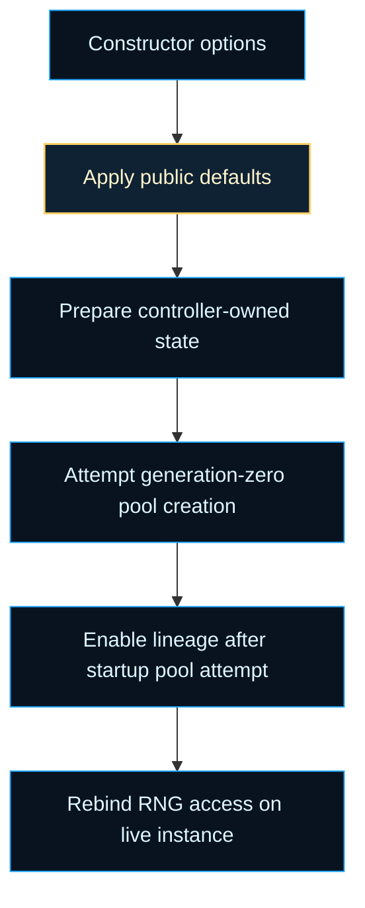
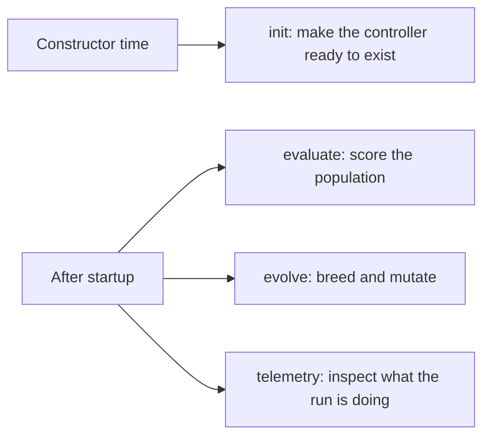

# neat/init

Constructor bootstrap helpers for the shared NEAT controller facade.

This chapter owns the one-time startup policy that would otherwise crowd the
public `Neat` class with constructor-only bookkeeping. The main facade stays
responsible for the long-lived API surface, while this file keeps the
generation-zero setup readable in one place: apply option defaults, prepare
controller-owned state, attempt the first population build, then enable the
features that depend on that initial shape.

That ordering is deliberate rather than cosmetic. Existing tests, migration
seams, and several adjacent helper chapters assume the constructor behaves as
a stable bootstrap pipeline instead of a grab-bag of independent writes. In
particular, lineage tracking and RNG rebinding happen after the pool attempt
so they observe the same host state that older constructor paths expected.

The controller-facing distinction to keep in mind is ownership over time.
`init/` owns generation-zero setup. It does not own evaluation, evolution,
telemetry, or persistence once the controller is already alive. That sounds
obvious, but startup logic is one of the easiest places for a mature library
to accumulate unrelated writes. When that happens, constructor behavior
becomes hard to explain and even harder to preserve during refactors.

This root chapter keeps the bootstrap contract readable by asking a narrower
question: before the first generation can exist, what must become true about
the controller state, and in what order?



Bootstrap also sits beside later runtime chapters that answer different
questions:



Read this file when you want to answer three startup questions:

- which public defaults become concrete controller policy during
  construction,
- which internal state containers must exist before generation-zero work can
  proceed safely,
- why the constructor delegates here without turning this file into a second
  public facade.

Historically, startup helpers like this appear once a controller grows large
enough that preserving constructor order becomes a compatibility problem, not
just a style preference. This chapter is the explicit record of that order.

## neat/init/neat.init.ts

### initializeNeatConstructor

```ts
initializeNeatConstructor(
  host: NeatInitializationHost,
  request: InitializeNeatConstructorRequest,
): void
```

Apply the legacy constructor bootstrap sequence behind the public `Neat`
facade.

This helper exists to keep [src/neat.ts](src/neat.ts) focused on the public
class surface while preserving the exact startup order that current tests,
migrated helper chapters, and persistence-adjacent bootstrap paths already
rely on.

The helper coordinates five constructor responsibilities without becoming a
second orchestration facade:

1. materialize public defaults onto the caller-owned options bag,
2. prepare controller bookkeeping state and arrays,
3. attempt generation-zero pool creation when a seed network or population
   size is available,
4. enable lineage only after the initial pool attempt has settled,
5. rebind RNG access so later helpers see the live controller instance.

The key design constraint is order preservation. Several later reads assume
the host already owns concrete defaults and initialized internal state before
pool creation runs, while lineage and RNG access should only activate once
the bootstrap attempt has finished. Treat this helper as the constructor's
setup pipeline, not as a general-purpose runtime entrypoint.

Parameters:

- `host` - `Neat` instance receiving constructor-time side effects.
- `request` - Mutable options bag, raw constructor intent, and public
  default values exported by the facade.

Returns: Nothing. The helper mutates `host` and `request.optionBag` in place.

Example:

```ts
initializeNeatConstructor(this, {
  optionBag: this.options,
  rawOptions: options,
  defaults: publicDefaults,
});
```

After the call returns, the instance has concrete startup policy, prepared
controller state, and either an attempted generation-zero pool or a safely
preserved empty population ready for later work.

### InitializeNeatConstructorRequest

Mutable constructor request packet consumed during bootstrap.

`optionBag` is the live options object that the public facade keeps after the
constructor returns, `rawOptions` preserves the caller's original intent for
checks that should not be default-inflated, and `defaults` supplies the
public baseline constants exported by the surrounding NEAT surface.

### NeatConstructorDefaults

Default values applied during NEAT controller construction.

Every field here becomes the concrete initial value for the corresponding
`NeatOptions` field when the caller does not supply it. Together these
defaults define the out-of-the-box search pressure, structural budget, and
compatibility measurement the controller uses until explicitly overridden.

Example:

```ts
// Inspect the population size applied when none is specified:
import { NeatConstructorDefaults } from './neat.init';
console.log(NeatConstructorDefaults.populationSize); // 50
```

### NeatInitializationHost

Minimal constructor-time host contract required by the bootstrap helper.

The boundary intentionally stays smaller than the full `Neat` class. This
helper needs write access to a few controller-owned fields and one pool
creation hook, but it does not own evaluation, evolution, or persistence.
Keeping the contract narrow prevents the init chapter from quietly becoming a
second facade.

### seedInnovationTrackerAboveConnectionCounter

```ts
seedInnovationTrackerAboveConnectionCounter(
  tracker: InnovationTracker,
): void
```

Align the innovation tracker cursor above all connection innovation IDs that
the Connection constructor already assigned during pool bootstrap.

Without this step, the tracker starts at 0 and mutation-assigned innovations
eventually collide with the Connection-counter-assigned IDs in the initial
population, causing `assertValidGenomeContract` to reject a parent during
crossover with a duplicate-innovation error.

Parameters:

- `tracker` - Live innovation tracker to seed.

Returns: Nothing.
