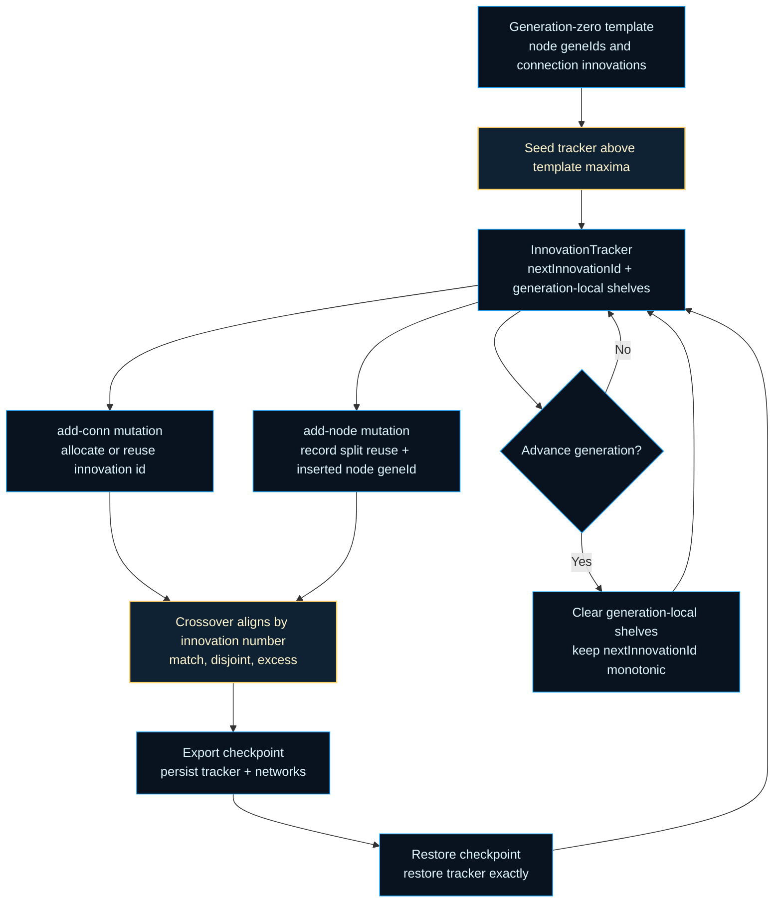

# neat/innovation-tracker

Contracts for the NEAT innovation-tracker boundary.

NEAT needs two kinds of innovation memory at the same time:

1. a monotonic global cursor that guarantees every truly new structural gene
   gets a fresh historical marking,
2. a generation-scoped de-duplication shelf that lets equivalent mutations
   created during the same generation reuse those markings.

This module is the smallest explicit owner of that split. Mutation helpers
write through this tracker, crossover reads the resulting innovation numbers
for alignment, and export/import persists the tracker so deterministic replay
does not silently reassign identities mid-run.

Required teaching output: historical-markings lifecycle.



## neat/innovation-tracker/innovation-tracker.ts

### createInnovationTracker

```ts
createInnovationTracker(): InnovationTracker
```

Create an empty innovation tracker for a fresh controller.

New controllers start with no generation-local structural reuse records, but
they still need a concrete tracker object so mutation, export, and restore
code can depend on one explicit owner instead of scattered maps.

Conceptually, the tracker holds two different kinds of memory:

- `nextInnovationId`: a monotonic global cursor (durable across generations)
- `nodeSplitRecords` / `connectionInnovations`: generation-local de-duplication
  shelves (cleared when mutation advances to a later generation)

Returns: Empty innovation tracker ready for generation-zero use.

Example:

```ts
const tracker = createInnovationTracker();
tracker.nextInnovationId; // 0
```

### getConnectionInnovation

```ts
getConnectionInnovation(
  tracker: InnovationTracker,
  connectionKey: string,
): number | undefined
```

Look up a reusable connection innovation for the active generation using the caller-defined connection identity key.
Reuse allows homologous edge additions to remain historically aligned across genomes in the same pass.

Parameters:

- `tracker` - Live tracker.
- `connectionKey` - Caller-defined exact connection identity.

Returns: Reusable innovation id, if present.

### getNodeSplitRecord

```ts
getNodeSplitRecord(
  tracker: InnovationTracker,
  splitKey: string,
): NodeSplitRecord | undefined
```

Look up a reusable split record for the active generation so repeated node-split mutations can share deterministic ids.
Stable split-key reuse keeps homologous mutations aligned within one generation boundary.

Parameters:

- `tracker` - Live tracker.
- `splitKey` - Stable split-event identity, usually the split connection innovation.

Returns: Previously recorded split data, if present.

### INITIAL_NEXT_INNOVATION_ID

Initial next-innovation id cursor for a newly created innovation tracker.

### INITIAL_TRACKER_GENERATION

Initial active generation number for a newly created innovation tracker.

### prepareInnovationTrackerForGeneration

```ts
prepareInnovationTrackerForGeneration(
  tracker: InnovationTracker,
  targetGeneration: number,
): void
```

Prepare a tracker for mutations targeting a specific generation.

Moving into a later generation keeps the monotonic global cursor but clears
the generation-local registries. Re-preparing the same generation is a no-op,
which is what makes mid-generation checkpoint restore deterministic.

Parameters:

- `tracker` - Live tracker.
- `targetGeneration` - Generation whose mutation window is about to run.

Returns: Nothing.

Example:

```ts
// On generation boundaries, prepare clears generation-local registries.
prepareInnovationTrackerForGeneration(tracker, 10);

// Re-preparing the same generation is a no-op.
prepareInnovationTrackerForGeneration(tracker, 10);
```

### prepareInnovationTrackerForMutation

```ts
prepareInnovationTrackerForMutation(
  tracker: InnovationTracker,
  controllerGeneration: number,
): void
```

Prepare a tracker for the controller's current public mutation pass.

Public mutation runs usually target the controller's current generation, but
a restored or pre-prepared tracker may already be tracking a later mutation
window. Using the larger generation value preserves that in-flight state
instead of accidentally clearing it.

Parameters:

- `tracker` - Live tracker.
- `controllerGeneration` - Generation currently recorded on the controller.

Returns: Nothing.

### recordConnectionInnovation

```ts
recordConnectionInnovation(
  tracker: InnovationTracker,
  connectionKey: string,
  innovationId: number,
): void
```

Record a reusable connection innovation for the active generation so matching structural mutations share one canonical id.
This write path is paired with lookup helpers to preserve deterministic innovation genealogy.

Parameters:

- `tracker` - Live tracker.
- `connectionKey` - Caller-defined exact connection identity.
- `innovationId` - Innovation id to reuse for matching mutations.

Returns: Nothing.

### recordNodeSplitRecord

```ts
recordNodeSplitRecord(
  tracker: InnovationTracker,
  splitKey: string,
  splitRecord: NodeSplitRecord,
): void
```

Record a reusable split result for the active generation so equivalent split events keep the same innovation structure.
This prevents duplicate node-lineage ids from drifting across identical mutations in one generation.

Parameters:

- `tracker` - Live tracker.
- `splitKey` - Stable split-event identity, usually the split connection innovation.
- `splitRecord` - Reusable node-split payload.

Returns: Nothing.

### restoreInnovationTracker

```ts
restoreInnovationTracker(
  serializedTracker: InnovationTrackerJSON,
): InnovationTracker
```

Restore a live innovation tracker from serialized checkpoint data.

Restore is intentionally strict about using the explicit tracker payload
instead of reconstructing state from older controller fields. The restored
tracker becomes the canonical owner for both the global cursor and the
current generation's structural reuse registries.

Parameters:

- `serializedTracker` - Tracker payload from controller export.

Returns: Live innovation tracker ready for continued mutation.

### serializeInnovationTracker

```ts
serializeInnovationTracker(
  tracker: InnovationTracker,
): InnovationTrackerJSON
```

Serialize a live innovation tracker into a checkpoint payload.

Checkpoints need more than the next innovation cursor. They also need the
current generation's de-duplication registries so a restored run can keep
assigning the same identities if it resumes mid-generation.

Parameters:

- `tracker` - Live tracker to serialize.

Returns: JSON-safe tracker payload.

### takeNextInnovationId

```ts
takeNextInnovationId(
  tracker: InnovationTracker,
): number
```

Consume the next global innovation id from the tracker and advance the monotonic innovation counter by one.
The returned id should be recorded immediately on the matching mutation event to preserve deterministic history.

Parameters:

- `tracker` - Live tracker.

Returns: Newly reserved innovation id.

Example:

```ts
const innovationId = takeNextInnovationId(tracker);
recordConnectionInnovation(tracker, 'from=12->to=27', innovationId);
```

## neat/innovation-tracker/innovation-tracker.types.ts

Contracts for the NEAT innovation-tracker boundary.

NEAT needs two kinds of innovation memory at the same time:

1. a monotonic global cursor that guarantees every truly new structural gene
   gets a fresh historical marking,
2. a generation-scoped de-duplication shelf that lets equivalent mutations
   created during the same generation share those markings.

The tracker types in this file make that split explicit. The cursor survives
across the whole run. The de-duplication registries are only meaningful for
the currently active generation window and are expected to be cleared when a
later generation starts mutating.

This boundary also owns the checkpoint shape needed for deterministic resume.
If a run is paused in the middle of mutating a generation, the serialized
tracker preserves both the next innovation id and the generation-scoped
registries so restore can continue without silently reassigning identities.

### ConnectionInnovationEntry

JSON tuple entry format used when serializing connection innovation numbers.

### ConnectionInnovationRegistry

Generation-local registry of reusable connection innovations keyed by exact connection identity.

### InnovationTracker

Live innovation-tracker state owned by the NEAT controller.

`activeGeneration` names the generation whose structural mutation window is
currently being tracked. The two registries only apply within that window.
`nextInnovationId` is the durable global cursor and must never move
backward, even when the generation-scoped registries are cleared.

### InnovationTrackerJSON

Serialized innovation-tracker payload used by controller checkpoints.

This is the minimum durable state needed to resume a run faithfully after a
pause, including mid-generation checkpoints where the current mutation window
still has outstanding structural reuse information.

### NodeSplitInnovationEntry

JSON tuple entry format used when serializing node-split innovation records.

### NodeSplitInnovationRegistry

Generation-local registry of reusable node-split records keyed by canonical split-event identity.

### NodeSplitRecord

Runtime record for a historically aligned node split.

When multiple genomes split the same historically marked connection during
one mutation window, they should reuse the same inserted-node id and the
same pair of replacement connection innovations. This record is the compact
payload that preserves that shared identity.
