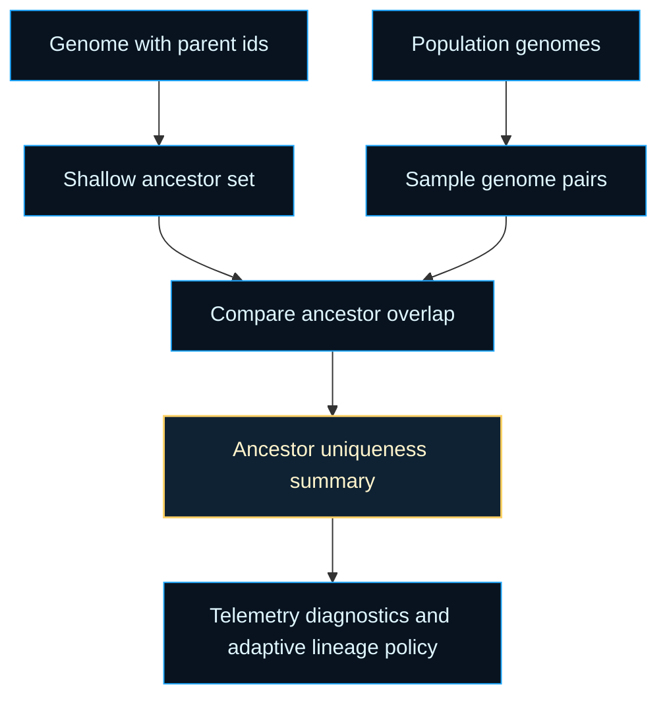
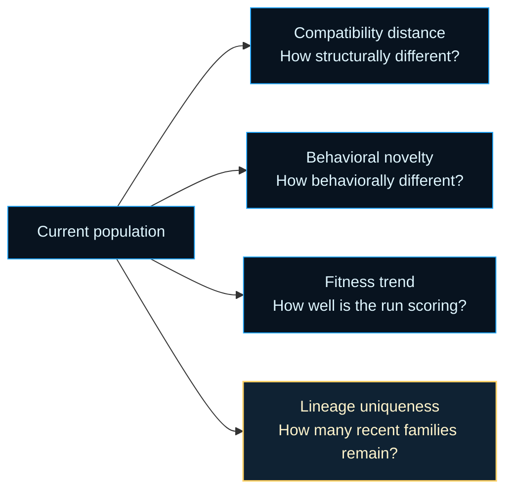
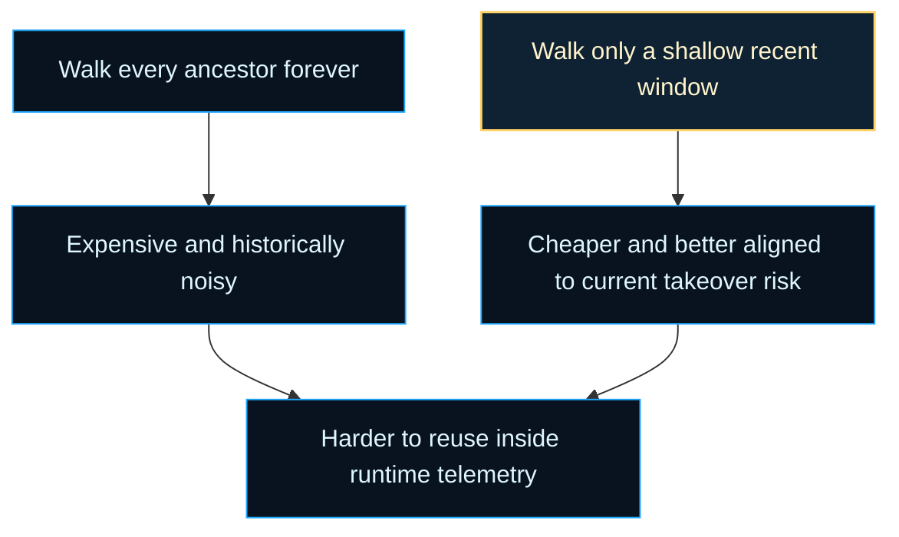

# neat/lineage

Lineage and ancestry analysis helpers for NEAT populations.

The lineage boundary answers a different question from the broader diversity
chapter: not just whether genomes look different now, but whether they come
from meaningfully different recent families. That ancestry view matters when
telemetry, diagnostics, or adaptive policy need to detect whether a run is
still exploring multiple lineages or quietly collapsing onto descendants of a
small ancestor set.

In evolutionary systems, structural variety can be misleading on its own.
Two genomes can look different because they drifted locally through weight
updates or a few recent mutations while still descending from the same narrow
branch. Lineage reads add the missing genealogical context. They let the
controller ask whether today's population still contains multiple recent
family stories or whether most of the search budget is now being spent on one
ancestor neighborhood wearing several slightly different topologies.

That distinction is useful because NEAT already has several other lenses on
search health. Compatibility distance explains structural disagreement.
Novelty explains behavioral difference. Score trends explain whether the
current search path is paying off. Lineage contributes a separate clue: how
much of the population's recent history is shared. If compatibility says
genomes are spread out but lineage says they still share recent parents, the
run may be exploring one branch in detail rather than keeping multiple
evolutionary bets alive.

The core algorithmic idea is intentionally simple. `buildAnc()` performs a
bounded breadth-first walk over parent ids so it can recover a shallow family
neighborhood for one genome. `computeAncestorUniqueness()` then samples genome
pairs and compares those shallow ancestor sets with a Jaccard-style distance.
The result is not a full phylogenetic tree or a museum-grade genealogy. It is
a lightweight controller signal designed to stay cheap enough for runtime
telemetry while still capturing whether the population's recent ancestry is
broad or collapsing.

Read this chapter with two silent reader questions in mind. First: what kind
of historical evidence is lineage actually measuring? Second: why stop at a
shallow ancestry window instead of walking every parent back to the origin?
The answer to the first is recent overlap in parentage, not lifetime
similarity. The answer to the second is that controller telemetry needs the
ancestry evidence that is most actionable now. Shallow ancestry is usually a
better indicator of current branch collapse, takeover, or recent divergence
than an unbounded tree that keeps every distant common ancestor equally loud.

One useful mental model is to treat lineage as the population's memory of
"who recently came from whom." It does not replace structural or behavioral
metrics. It complements them. A run with strong scores and low lineage
uniqueness may be exploiting aggressively around one family. A run with high
lineage uniqueness and weak scores may still be exploring many recent
branches without yet consolidating progress. Seeing those regimes explicitly
helps the rest of the telemetry and adaptation stack read less like a pile of
unrelated numbers.



A second view places lineage beside the other common NEAT health signals so
a first-time reader can see what question each metric family is really
answering.



A third view explains why the implementation stops after a bounded ancestry
window instead of treating lineage as a full archive query.



The root chapter therefore stays small in API surface but rich in meaning.
`core/` owns the queue mechanics, sampled pair generation, and distance
aggregation so this file can stay focused on what the ancestry reads mean at
the controller surface. That separation is deliberate: the public question is
not "how does the queue advance?" but "what kind of evidence does lineage add
that the rest of the controller does not already have?"

For background reading, the most relevant mathematical and traversal ideas
are the breadth-first search used for the shallow family walk and the Jaccard
index used to compare ancestor-set overlap. See Wikipedia contributors,
[Breadth-first search](https://en.wikipedia.org/wiki/Breadth-first_search),
and Wikipedia contributors,
[Jaccard index](https://en.wikipedia.org/wiki/Jaccard_index), for compact
background on the two ideas this chapter adapts into a runtime NEAT signal.

Example: inspect the recent family neighborhood behind one genome.

```ts
const ancestorIds = neat.buildAnc(neat.population[0]);

console.log([...ancestorIds].toSorted((leftId, rightId) => leftId - rightId));
```

Example: watch whether the run is collapsing onto a narrow recent lineage.

```ts
const ancestorUniqueness = neat.computeAncestorUniqueness();

if (ancestorUniqueness < 0.2) {
  console.log('Recent ancestry is collapsing into a narrow family band.');
}
```

Practical reading order:

1. Start with `buildAnc()` if you want direct evidence for one genome.
2. Continue to `computeAncestorUniqueness()` if you want the controller-level
   summary that can feed telemetry or adaptive policy.
3. Finish in `core/` if you want the exact traversal, pair sampling, and set
   distance mechanics.

## neat/lineage/lineage.ts

### buildAnc

```ts
buildAnc(
  genome: GenomeLike,
): Set<number>
```

Build the shallow ancestor ID set for a genome using breadth-first traversal.

"Shallow" means this helper intentionally stops after a small ancestry
window instead of walking the entire historical tree. That keeps the result
useful for runtime telemetry: it captures the recent family neighborhood that
most directly explains current convergence or branching without turning every
read into an unbounded genealogy crawl.

Use this when you need the raw ancestry evidence behind later population
summaries. The returned set is most helpful for pairwise overlap checks,
debugging parent tracking, or validating that speciation and reproduction are
still producing multiple recent family branches.

Parameters:
- `this` - NEAT lineage context providing the current population.
- `genome` - Genome whose shallow ancestor set should be computed.

Returns: Set of ancestor IDs within the configured depth window.

Example:

```ts
const ancestorIds = neat.buildAnc(neat.population[0]);

console.log(ancestorIds.has(42));
```

### computeAncestorUniqueness

```ts
computeAncestorUniqueness(): number
```

Compute the ancestor uniqueness metric for the current population.

This is the controller-facing lineage summary. It samples genome pairs,
builds a shallow ancestor set for each genome in the pair, then measures how
different those ancestor sets are using Jaccard distance.

Interpret the returned value as a bounded trend signal:

- lower values mean many genomes still share recent ancestors,
- higher values mean recent ancestry is spread across more distinct family
  branches.

The helper is intentionally sampled rather than exhaustive so telemetry and
adaptive controllers can reuse it during a run without paying the full cost
of comparing every genome pair. It complements the diversity chapter by
focusing on ancestry overlap rather than structural size or compatibility
distance.

Parameters:
- `this` - NEAT lineage context exposing the population and RNG provider.

Returns: Mean sampled Jaccard distance across shallow ancestor sets.

Example:

```ts
const ancestorUniqueness = neat.computeAncestorUniqueness();

if (ancestorUniqueness < 0.2) {
  console.log('Recent ancestry is collapsing into a narrow family band.');
}
```

### GenomeLike

Minimal genome shape used by lineage helpers.

Lineage analysis only needs two structural facts from each genome: a stable
identifier and the identifiers of its recorded parents. Everything else is
intentionally left open-ended so ancestry helpers can run against richer
runtime objects without importing or depending on all of their fields.

In practice this interface is the bridge between reproduction-time lineage
bookkeeping and read-side lineage metrics. If those ids are present and
stable, the rest of the ancestry pipeline can stay decoupled from mutation,
evaluation, telemetry, and speciation internals.

### NeatLineageContext

Minimal NEAT context required by lineage helpers.

The lineage boundary only needs the current population and the RNG provider
used for sampled ancestor uniqueness. That small host contract makes the
ownership model explicit: lineage reporting is a read-side controller
concern, not a stateful subsystem with its own storage or mutation rules.

The population supplies the ancestry graph to inspect. The RNG provider keeps
sampled uniqueness deterministic so the same run can replay the same sampled
comparisons during tests or exported-state debugging.
